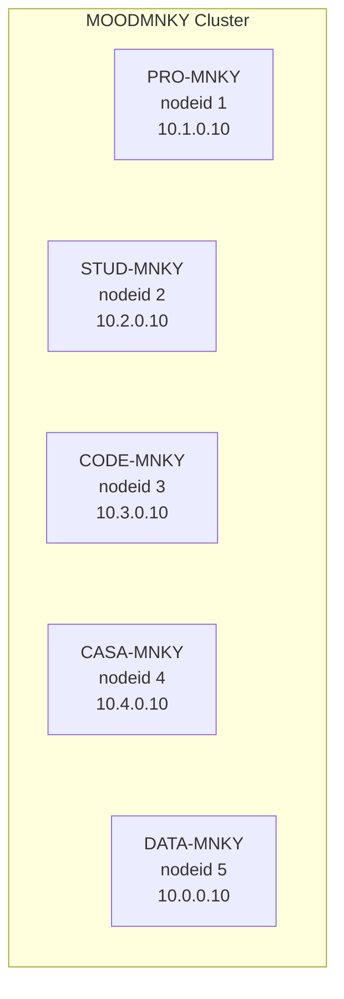
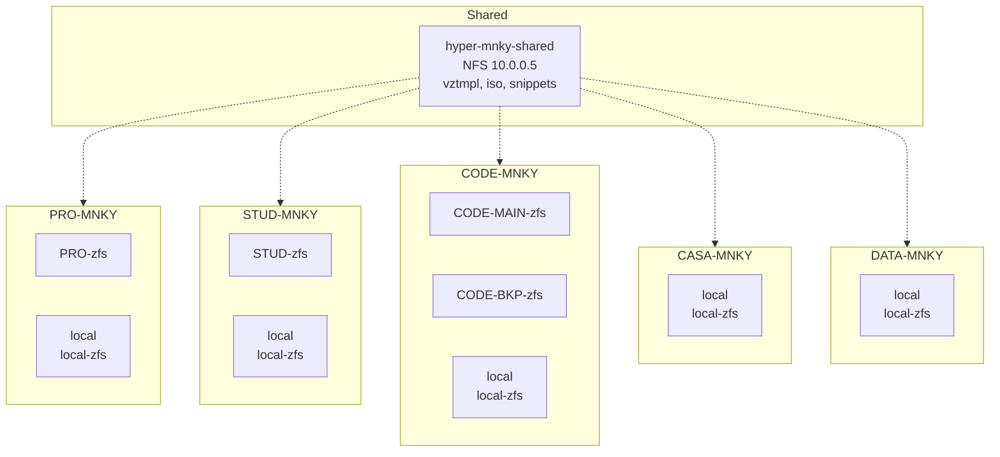

# MOOD-MNKY Proxmox Cluster — System Design

This document is the single source of truth for the MOODMNKY 5-node Proxmox VE cluster. It maps topology, nodes, storage, networking, and all guests.

---

## 1. Executive Summary

| Attribute | Value |
|-----------|--------|
| **Cluster name** | MOODMNKY |
| **Node count** | 5 |
| **Guest count** | 17 (14 QEMU VMs, 3 LXC) |
| **Quorum** | Yes (corosync_votequorum) |

**Nodes and primary roles:**

- **PRO-MNKY** (nodeid 1): Production — CLOUD-MNKY, SRVR-MNKY; PRO-zfs.
- **STUD-MNKY** (nodeid 2): Studio / lab — SAGE-MNKY-AI, TrueNAS-SAGE, SAGE-MNKY-SERVER, GIRTH; STUD-zfs.
- **CODE-MNKY** (nodeid 3): Development / AI / game — CODE-MNKY-AI, POKE-MNKY, Palworld-CODE, LXC (redis, app-gods-work, Slades-Server); CODE-MAIN-zfs, CODE-BKP-zfs.
- **CASA-MNKY** (nodeid 4): Home / lab — CASA-MNKY-AI, TrueNAS-CASA; local-zfs; ACME (CASA-MNKY.moodmnky.com).
- **DATA-MNKY** (nodeid 5): Infra / gateway / storage — pfSense, TrueNAS-DATA, MNKY-MIND; local-zfs; ACME (DATA-MNKY.moodmnky.com).

---

## 2. Cluster Topology

### 2.1 Node topology (Corosync ring0)



### 2.2 Storage-to-node mapping



---

## 3. Cluster Configuration

### 3.1 Corosync

| Setting | Value |
|--------|--------|
| cluster_name | MOODMNKY |
| config_version | 14 |
| ip_version | ipv4-6 |
| link_mode | passive |
| secauth | on |
| version | 2 |
| quorum provider | corosync_votequorum |

Logging: `debug: off`, `to_syslog: yes`.

### 3.2 Node list

| Hostname | Node ID | Quorum votes | Ring0 address | Role summary |
|----------|----------|--------------|---------------|--------------|
| PRO-MNKY | 1 | 1 | 10.1.0.10 | Production VMs (CLOUD-MNKY, SRVR-MNKY) |
| STUD-MNKY | 2 | 1 | 10.2.0.10 | Studio / lab VMs (SAGE, TrueNAS-SAGE, GIRTH) |
| CODE-MNKY | 3 | 1 | 10.3.0.10 | Dev / AI / game VMs and LXC |
| CASA-MNKY | 4 | 1 | 10.4.0.10 | Home lab (CASA-MNKY-AI, TrueNAS-CASA) |
| DATA-MNKY | 5 | 1 | 10.0.0.10 | Gateway / storage (pfSense, TrueNAS-DATA, MNKY-MIND) |

*Note: Node membership and online status are in `/etc/pve/.members`; PRO-MNKY was offline at last documentation snapshot.*

---

## 4. Per-Node Detail

### 4.1 PRO-MNKY

| Attribute | Value |
|-----------|--------|
| Hostname | PRO-MNKY |
| Node ID | 1 |
| Corosync ring0 | 10.1.0.10 |
| Role | Production: primary workstations/servers (CLOUD-MNKY, SRVR-MNKY) |

**Storage on node:** `local`, `local-zfs` (rpool/data), `PRO-zfs`, `hyper-mnky-shared` (NFS).

**Guests:**

| VMID | Name | Type | Cores | Memory (MB) | Primary disk / storage | Notes |
|------|------|------|-------|-------------|------------------------|-------|
| 100 | CLOUD-MNKY | qemu | 16 | 32768 | PRO-zfs 500G | UEFI, hostpci (Intel Arc + extra), USB passthrough, TPM |
| 101 | SRVR-MNKY | qemu | 8 | 16384 | PRO-zfs 500G | UEFI, hostpci (x-vga), firewall |

**Network:** Node-local; not in replicated config. Run `cat /etc/network/interfaces` on PRO-MNKY to document bridges and VLANs.

**Node-level config:** No ACME in config; standard PVE.

**Hardware:** TBD — run Appendix A commands on this node and fill table.

---

### 4.2 STUD-MNKY

| Attribute | Value |
|-----------|--------|
| Hostname | STUD-MNKY |
| Node ID | 2 |
| Corosync ring0 | 10.2.0.10 |
| Role | Studio / lab: SAGE-MNKY-AI, TrueNAS-SAGE, SAGE-MNKY-SERVER, GIRTH |

**Storage on node:** `local`, `local-zfs`, `STUD-zfs`, `hyper-mnky-shared` (NFS).

**Guests:**

| VMID | Name | Type | Cores | Memory (MB) | Primary disk / storage | Notes |
|------|------|------|-------|-------------|------------------------|-------|
| 200 | SAGE-MNKY-AI | qemu | 8 | 16384 | STUD-zfs 2050G | Large root disk |
| 205 | TrueNAS-SAGE | qemu | 4 | 8192 | STUD-zfs 155G | onboot |
| 2001 | SAGE-MNKY-SERVER | qemu | 6 | 16384 | STUD-zfs 1T | replicate=0 |
| 2014 | GIRTH | qemu | 6 | 16384 | STUD-zfs 256G | replicate=0 |

**Network:** Node-local; document via `cat /etc/network/interfaces` on STUD-MNKY.

**Node-level config:** Standard PVE.

**Hardware:** TBD — run Appendix A commands on this node.

---

### 4.3 CODE-MNKY

| Attribute | Value |
|-----------|--------|
| Hostname | CODE-MNKY |
| Node ID | 3 |
| Corosync ring0 | 10.3.0.10 |
| Role | Development, AI, and game servers; LXC (redis, app-gods-work, Slades-Server) |

**Storage on node:** `local`, `local-zfs`, `CODE-MAIN-zfs`, `CODE-BKP-zfs`, `hyper-mnky-shared` (NFS).

**Guests:**

| VMID | Name | Type | Cores | Memory (MB) | Primary disk / storage | Notes |
|------|------|------|-------|-------------|------------------------|-------|
| 305 | redis | lxc | 8 | 16384 | CODE-MAIN-zfs 128G | hostname redis; nesting, fuse |
| 313 | CODE-MNKY-AI | qemu | 12 | 65536 | CODE-MAIN-zfs 512G | hostpci GPU; balloon=0 |
| 3019 | POKE-MNKY | qemu | 6 | 24576 | CODE-MAIN-zfs 256G | replicate=0 |
| 3053 | app-gods-work | lxc | 4 | 8192 | CODE-MAIN-zfs 128G | hostname app-gods-work; nesting |
| 3054 | Slades-Server | lxc | 6 | 8192 | CODE-MAIN-zfs 256G | hostname Slades-Server; keyctl, fuse |
| 3112 | Palworld-CODE | qemu | 6 | 24576 | CODE-MAIN-zfs 128G | replicate=0 |

**Network:** Node-local; document via `cat /etc/network/interfaces` on CODE-MNKY.

**Node-level config:** Standard PVE.

**Hardware:** TBD — run Appendix A commands on this node.

---

### 4.4 CASA-MNKY

| Attribute | Value |
|-----------|--------|
| Hostname | CASA-MNKY |
| Node ID | 4 |
| Corosync ring0 | 10.4.0.10 |
| Role | Home lab: CASA-MNKY-AI, TrueNAS-CASA |

**Storage on node:** `local`, `local-zfs`, `hyper-mnky-shared` (NFS). No node-specific ZFS pool in storage.cfg.

**Guests:**

| VMID | Name | Type | Cores | Memory (MB) | Primary disk / storage | Notes |
|------|------|------|-------|-------------|------------------------|-------|
| 400 | CASA-MNKY-AI | qemu | 8 | 16384 | local-zfs 500G | replicate=0 |
| 405 | TrueNAS-CASA | qemu | 4 | 8092 | local-zfs 50G + 512G | onboot; two disks |

**Network:** Node-local; document via `cat /etc/network/interfaces` on CASA-MNKY.

**Node-level config:** ACME with Cloudflare DNS; domain `CASA-MNKY.moodmnky.com`.

**Hardware:** TBD — run Appendix A commands on this node.

---

### 4.5 DATA-MNKY

| Attribute | Value |
|-----------|--------|
| Hostname | DATA-MNKY |
| Node ID | 5 |
| Corosync ring0 | 10.0.0.10 |
| Role | Infra / gateway / storage: pfSense, TrueNAS-DATA, MNKY-MIND |

**Storage on node:** `local`, `local-zfs` (rpool/data), `hyper-mnky-shared` (NFS). No node-specific ZFS pool name; uses `local-zfs` (rpool/data).

**Guests:**

| VMID | Name | Type | Cores | Memory (MB) | Primary disk / storage | Notes |
|------|------|------|-------|-------------|------------------------|-------|
| 500 | pfSense | qemu | 4 | 8192 | local-zfs 32G | onboot; 4 NICs (vmbr0–vmbr3) |
| 505 | TrueNAS-DATA | qemu | 8 | 32768 | local-zfs 32G | replicate=0 |
| 5111 | MNKY-MIND | qemu | 8 | 8192 | local-zfs 512G | replicate=0; cache=unsafe |

**Network (from this node’s config):**

| Bridge | Address | Port(s) | Notes |
|--------|---------|---------|--------|
| vmbr0 | 10.0.0.10/24, gateway 10.0.0.1 | enp39s0 | WAN; VLAN-aware, bridge-vids 2-4094 |
| vmbr1 | manual | enp40s0 | Workstation; VLAN-aware |
| vmbr2 | manual | enp41s0 | — |
| vmbr3 | manual | enp42s0 | — |
| — | — | enx32de008d3fd5 | IPMI (manual) |

**Node-level config:** ACME with Cloudflare DNS; domain `DATA-MNKY.moodmnky.com`.

**Hardware:** TBD — run Appendix A commands on this node.

---

## 5. Storage Design

| Storage name | Type | Path / pool | Content | Nodes | Options |
|--------------|------|-------------|---------|--------|---------|
| local | dir | /var/lib/vz | iso, backup, vztmpl | all | — |
| local-zfs | zfspool | rpool/data | rootdir, images | per-node (rpool) | sparse 1 |
| STUD-zfs | zfspool | STUD-zfs | rootdir, images | STUD-MNKY | sparse 1 |
| CODE-BKP-zfs | zfspool | CODE-BKP-zfs | images, rootdir | CODE-MNKY | sparse 1 |
| CODE-MAIN-zfs | zfspool | CODE-MAIN-zfs | images, rootdir | CODE-MNKY | sparse 1 |
| PRO-zfs | zfspool | PRO-zfs | rootdir, images | PRO-MNKY | sparse 1 |
| hyper-mnky-shared | nfs | /mnt/pve/hyper-mnky-shared | vztmpl, iso, snippets | all | server 10.0.0.5, export /mnt/HYPER-MNKY/proxmox/shared, vers=4 |

**Strategy:** Node-local ZFS pools per host for VM/CT images and rootdirs; shared NFS (10.0.0.5) for templates, ISOs, and snippets. No Ceph or cluster-wide shared block storage.

---

## 6. Network Design

### 6.1 DATA-MNKY (documented from config)

- **vmbr0:** 10.0.0.10/24, gateway 10.0.0.1; bridge-ports enp39s0 (WAN); VLAN-aware (2–4094).
- **vmbr1:** No IP; enp40s0 (Workstation); VLAN-aware.
- **vmbr2:** No IP; enp41s0.
- **vmbr3:** No IP; enp42s0.
- **IPMI:** enx32de008d3fd5 (manual).

### 6.2 Other nodes

Each node has its own `/etc/network/interfaces`; it is not replicated. Corosync addressing: PRO 10.1.0.10, STUD 10.2.0.10, CODE 10.3.0.10, CASA 10.4.0.10, DATA 10.0.0.10. To document each node’s bridges and VLANs, run `cat /etc/network/interfaces` (and optionally `ip -br a`) on that node and add a similar subsection to this document.

---

## 7. Guest Inventory (Cluster-Wide)

### 7.1 Full guest table

| VMID | Name | Node | Type | Cores | Memory (MB) | Primary storage | Role / notes |
|------|------|------|------|-------|-------------|-----------------|---------------|
| 100 | CLOUD-MNKY | PRO-MNKY | qemu | 16 | 32768 | PRO-zfs | Workstation; PCIe passthrough, USB, TPM |
| 101 | SRVR-MNKY | PRO-MNKY | qemu | 8 | 16384 | PRO-zfs | Server; GPU passthrough |
| 200 | SAGE-MNKY-AI | STUD-MNKY | qemu | 8 | 16384 | STUD-zfs | AI workload |
| 205 | TrueNAS-SAGE | STUD-MNKY | qemu | 4 | 8192 | STUD-zfs | NAS |
| 2001 | SAGE-MNKY-SERVER | STUD-MNKY | qemu | 6 | 16384 | STUD-zfs | Server |
| 2014 | GIRTH | STUD-MNKY | qemu | 6 | 16384 | STUD-zfs | — |
| 305 | redis | CODE-MNKY | lxc | 8 | 16384 | CODE-MAIN-zfs | Redis LXC |
| 313 | CODE-MNKY-AI | CODE-MNKY | qemu | 12 | 65536 | CODE-MAIN-zfs | AI workload; GPU |
| 3019 | POKE-MNKY | CODE-MNKY | qemu | 6 | 24576 | CODE-MAIN-zfs | — |
| 3053 | app-gods-work | CODE-MNKY | lxc | 4 | 8192 | CODE-MAIN-zfs | Docker LXC |
| 3054 | Slades-Server | CODE-MNKY | lxc | 6 | 8192 | CODE-MAIN-zfs | LXC server |
| 3112 | Palworld-CODE | CODE-MNKY | qemu | 6 | 24576 | CODE-MAIN-zfs | Game server |
| 400 | CASA-MNKY-AI | CASA-MNKY | qemu | 8 | 16384 | local-zfs | AI workload |
| 405 | TrueNAS-CASA | CASA-MNKY | qemu | 4 | 8092 | local-zfs | NAS |
| 500 | pfSense | DATA-MNKY | qemu | 4 | 8192 | local-zfs | Gateway; 4 NICs |
| 505 | TrueNAS-DATA | DATA-MNKY | qemu | 8 | 32768 | local-zfs | NAS |
| 5111 | MNKY-MIND | DATA-MNKY | qemu | 8 | 8192 | local-zfs | — |

### 7.2 LXC hostnames

| VMID | PVE name | Container hostname |
|------|----------|--------------------|
| 305 | redis | redis |
| 3053 | app-gods-work | app-gods-work |
| 3054 | Slades-Server | Slades-Server |

---

## 8. Authentication and Access

| User | Realm | Description |
|------|--------|-------------|
| root | pam | Administrator; email simeon.bowman@moodmnky.com |
| moodmnky | pam | Simeon Bowman; simeon.bowman@moodmnky.com |
| code-mnky | pam | Simeon Bowman; moodmnky@gmail.com |

**API token:** `code-mnky@pam!mnky-api` (for API access).

*Source: `/etc/pve/user.cfg`.*

---

## 9. Backup and Resilience

- **Cluster-wide vzdump:** `/etc/pve/vzdump.cron` exists but contains no backup schedule (empty job list).
- **HA:** No ha-manager or HA resource configuration found under `/etc/pve`.
- **Replication:** Several VM disks have `replicate=0` (no PVE replication). Replication is not in use for failover.
- **Recommendations:** Define backup jobs (e.g. vzdump to NFS or backup storage) and document retention. If HA is required, add nodes/resources to the HA manager and use replicated storage or migration paths as needed.

---

## 10. Appendices

### Appendix A — Commands to run on each node (hardware and network)

Run on **each** node (as root or with appropriate privileges) and paste results into this doc or a separate hardware inventory file.

**Hardware:**
```bash
# CPU
lscpu | grep -E "Model name|Socket|Core|Thread|CPU\(s\)"

# Memory
free -h

# Disks and pools
lsblk -o NAME,SIZE,TYPE,MOUNTPOINT
zpool list
df -h
```

**Network:**
```bash
cat /etc/network/interfaces
ip -br a
```

**PVE version (optional):**
```bash
pveversion -v
```

### Appendix B — VMID ranges per node

| Node | VMID range | Observed VMIDs |
|------|------------|----------------|
| PRO-MNKY | 100–199 | 100, 101 |
| STUD-MNKY | 200–299 | 200, 205, 2001, 2014 |
| CODE-MNKY | 300–399 | 305, 313, 3019, 3053, 3054, 3112 |
| CASA-MNKY | 400–499 | 400, 405 |
| DATA-MNKY | 500–599 (and 5111) | 500, 505, 5111 |

*Convention: first digit of VMID aligns with node ID (1=PRO, 2=STUD, 3=CODE, 4=CASA, 5=DATA). 5111 is an exception on DATA-MNKY.*

---

*Document generated from cluster config on DATA-MNKY. Update after topology or guest changes and re-run Appendix A on each node to refresh hardware/network details.*
