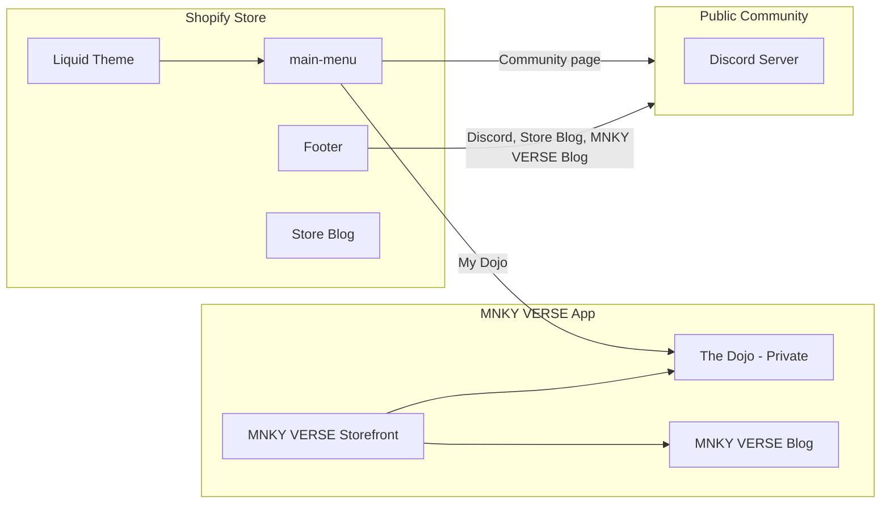

# MOOD MNKY Command (mood-mnky-command)

Bespoke fragrance in the MNKY VERSE: storefront, Blending Lab, and MNKY LABZ in one codebase.


---

## What This Repo Is

This repository is a **monorepo** containing:

- **Next.js app** — MNKY VERSE storefront (catalog, cart, blog, Dojo, community), MNKY LABZ dashboard, and Blending Lab; deployed on Vercel.
- **Shopify theme** — Liquid theme in `Shopify/theme/` (Dawn-derived) for the store; links to the app for MNKY VERSE, Dojo, and Community.
- **Theme app extension** — `extensions/mood-mnky-theme/` for app blocks (Blending CTA, Fragrance Finder, Subscription CTA) and app embed.
- **Supabase** — Backend for MNKY VERSE blog, auth, and other data; optional Edge Functions in `supabase/functions/`.

The store (Shopify theme) and the app (Next.js) share the same Shopify catalog via the Storefront API. The Dojo is the user’s **private** portal (preferences, default agent) inside the app; **Community** is the public touchpoints (Discord, store blog, MNKY VERSE blog).

The **MNKY VERSE storefront** is built with **Next.js + Hydrogen React** and the Shopify Storefront API (Shopify’s “bring your own stack” path). It is not a Remix Hydrogen app and does not use Oxygen; no `create-hydrogen` or migration to the full Hydrogen framework is required.

---

## Ecosystem (High Level)



---

## Getting Started

### Prerequisites

- **Node.js** (LTS) and **pnpm**
- **Shopify CLI** (for theme development and app extension)
- **Supabase** (account and project for MNKY VERSE blog and backend)

### Setup

1. Clone the repo and install dependencies:

   ```bash
   pnpm install
   ```

2. Copy environment variables and set values (see `.env.example` or project docs). Key vars include:
   - Next.js: `NEXT_PUBLIC_SUPABASE_URL`, `NEXT_PUBLIC_SUPABASE_ANON_KEY`, Shopify Storefront API keys.
   - Supabase: `SUPABASE_SERVICE_ROLE_KEY` for server-side operations.
   - Optional: Notion, OpenAI, Vercel, etc., per feature.

3. Run the Next.js app (from repo root; Turborepo runs the `web` app):

   ```bash
   pnpm dev
   ```

   App runs at `http://localhost:3000`. MNKY VERSE routes: `/verse`, `/verse/blog`, `/verse/community`; Dojo (members' private hub): `/dojo`.

4. **Theme (Shopify):** Use Shopify CLI from the **repo root**. Push/pull the theme from `Shopify/theme/` and preview. See [Shopify/docs/NAVIGATION-MENU-SETUP.md](Shopify/docs/NAVIGATION-MENU-SETUP.md) for nav and footer setup.

5. **App extension:** Develop and deploy via Shopify CLI from the **repo root**; extension lives in `extensions/mood-mnky-theme/`.

Further setup (Supabase migrations, MNKY VERSE blog sync, MNKY LABZ): see [docs/](docs/) and [docs/SUPABASE-VERSE-BLOG-PRODUCTION.md](docs/SUPABASE-VERSE-BLOG-PRODUCTION.md) where applicable.

---

## Key Directories

| Path | Purpose |
|------|---------|
| `apps/web/` | Next.js app (App Router, MNKY VERSE, MNKY LABZ, Blending, API routes). Run from root with `pnpm dev` or `pnpm build`. |
| `apps/web/app/`, `apps/web/components/`, `apps/web/lib/` | App pages, shared UI, Shopify/Supabase utilities |
| `packages/` | Shared packages (optional; add when extracting shared code) |
| `Shopify/theme/` | Liquid theme (sections, templates, assets). Use from repo root: `shopify theme push --path Shopify/theme` |
| `extensions/mood-mnky-theme/` | Theme app extension (blocks, embed). Use Shopify CLI from repo root. |
| `supabase/` | Migrations, Edge Functions, config. Use Supabase CLI from repo root. |
| `docs/` | Design system, integration report, runbooks |

### Monorepo deployment (Vercel)

- **Root Directory:** Set to `apps/web` in the Vercel project settings.
- **Build Command:** From repo root, e.g. `cd ../.. && pnpm install && pnpm turbo build --filter=web` (or let Vercel detect Turborepo when `turbo.json` exists at root; if Root Directory is `apps/web`, run install and build from repo root in the build command).
- **Environment variables:** Configure in Vercel as before; list any build-affecting vars in root `turbo.json` `globalEnv` so Turbo cache keys are correct.

---

## Roadmap

- **Phase 1 — Store–Verse alignment:** Theme copy, nav, and CTAs aligned with MNKY VERSE; app base URL and featured blog link to MNKY VERSE blog. (Done.)
- **Phase 2 — Dojo and Community clarity:** Dojo framed as private portal (in-app); Community as Discord + store blog + MNKY VERSE blog; theme slideshow and multicolumn updated; footer Community block and nav/docs updated. (Done.)
- **Phase 3 — MNKY VERSE blog and theme:** Optional public read-only API for MNKY VERSE blog so theme or app blocks can show “Latest from MNKY VERSE”; cross-linking and optional cross-posting between store blog and MNKY VERSE blog.
- **Phase 4 — MNKY LABZ enhancements:** Dashboard and backstage tools; Notion/sync and operational workflows as needed.
- **Phase 5 — Ongoing:** Performance, accessibility, and conversion flows per [Shopify/theme-ui-ux-baseline-links.md](Shopify/theme-ui-ux-baseline-links.md) and design system.

### Companion & Manga Engine

The **MNKY VERSE Companion** and **Collection Manga** engine extend the Dojo, gamification, and storefront with narrative issues, Flowise tools, and Shopify metaobjects. Phases:

- **Phase 1:** Env and docs — Flowise vars in `.env.example`, [docs/COMPANION-MANGA-ROADMAP.md](docs/COMPANION-MANGA-ROADMAP.md).
- **Phase 2:** Shopify metaobject schema for manga (`mnky_collection`, `mnky_issue`) and publish pipeline: `POST /api/shopify/sync/metaobject-manga`. See [docs/SHOPIFY-MANGA-METAOBJECTS.md](docs/SHOPIFY-MANGA-METAOBJECTS.md).
- **Phase 3:** Flowise tools (hotspot mapper, quiz generator) at `app/api/flowise/tools/manga/`; Riftbound narrative and copy guidance in [docs/RIFTBOUND-NARRATIVE-GUIDANCE.md](docs/RIFTBOUND-NARRATIVE-GUIDANCE.md).
- **Phase 4:** Dojo and Verse UX — manga/quests/XP, reader/hotspots; optional theme block for “Current issue” (see [docs/DOJO-SECTION.md](docs/DOJO-SECTION.md)).
- **Phase 5:** Flowise execute usage, rate limiting, Realtime; optional AI SDK/agents; future Discord/rewards.

**References:** [temp/MNKY-COMPANION-MANGA-ENGINE-STARTER.md](temp/MNKY-COMPANION-MANGA-ENGINE-STARTER.md), [docs/PRD-Collection-Manga-Magazine.md](docs/PRD-Collection-Manga-Magazine.md), [docs/PRD-Gamification-MNKY-VERSE.md](docs/PRD-Gamification-MNKY-VERSE.md), [docs/MAG-XP-RULES.md](docs/MAG-XP-RULES.md), [docs/FLOWISE-FRAGRANCE-CRAFTING.md](docs/FLOWISE-FRAGRANCE-CRAFTING.md), [docs/SHOPIFY-INTEGRATION-ROADMAP.md](docs/SHOPIFY-INTEGRATION-ROADMAP.md), [docs/VERSE-STOREFRONT-STACK.md](docs/VERSE-STOREFRONT-STACK.md). For Companion/Manga work use **Cursor subagents** (shopify, verse-storefront, labz, verifier, debugger) and the **design** skill for UI; optional Context7 and Shopify Dev MCP for docs/API.

---

## Contributing and Docs

- **Design system:** [docs/DESIGN-SYSTEM.md](docs/DESIGN-SYSTEM.md)
- **Shopify nav and footer:** [Shopify/docs/NAVIGATION-MENU-SETUP.md](Shopify/docs/NAVIGATION-MENU-SETUP.md)
- **MNKY VERSE storefront stack:** [docs/VERSE-STOREFRONT-STACK.md](docs/VERSE-STOREFRONT-STACK.md) — Next.js + Hydrogen React (Storefront API); not a Remix Hydrogen app.
- **Store–Verse integration:** [docs/SHOPIFY-MNKY-VERSE-INTEGRATION-REPORT.md](docs/SHOPIFY-MNKY-VERSE-INTEGRATION-REPORT.md)
- **Cursor subagents:** [docs/CURSOR-AGENTS.md](docs/CURSOR-AGENTS.md) — project subagents (shopify, verse-storefront, labz, verifier, debugger) and how to invoke them.
- **Cursor rules and commands:** [docs/CURSOR-RULES-AND-COMMANDS.md](docs/CURSOR-RULES-AND-COMMANDS.md) — rules in `.cursor/rules`, commands in `.cursor/commands`, and how they work with skills and agents.
- **Companion & Manga:** [docs/COMPANION-MANGA-ROADMAP.md](docs/COMPANION-MANGA-ROADMAP.md) — full roadmap, PRDs, Flowise tools, metaobjects, Riftbound guidance.

See `docs/` for more runbooks and references.

---

## License and Brand

MOOD MNKY — bespoke fragrance and the MNKY VERSE. For more on the brand and ecosystem, see [docs.moodmnky.com](https://docs.moodmnky.com) (when available).
