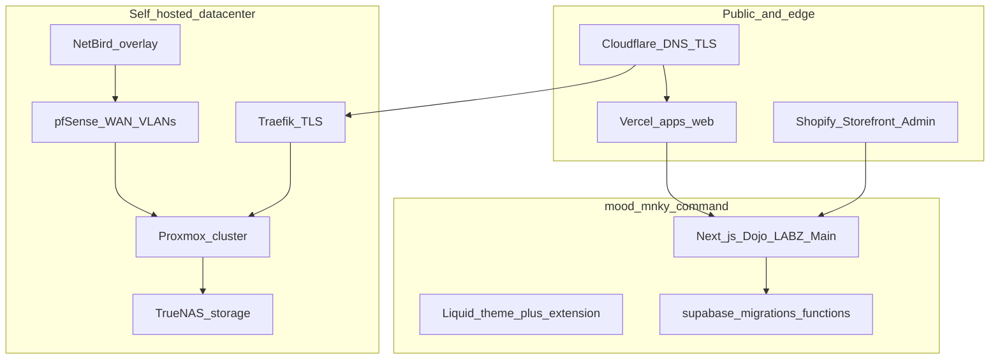

# MOOD MNKY — AI ecosystem source of truth

<!--
  Living document for AI agents and staff. Not customer-facing.
  Last reviewed: 2026-03-29
  Maintainer: platform / update when datacenter, deploy, or product boundaries change.
-->

## 1. Purpose and audience

This file is the **canonical orientation layer** for **AI coding agents** and **internal engineers** working in the **MOOD MNKY** estate. It answers: what this repo owns, **where authoritative truth lives**, how **cloud vs self-hosted** pieces connect, and **how to work safely** (secrets, verification, delegation).

It is **not** a replacement for Mintlify (`mnky-docs/`), long runbooks in `docs/`, or live infrastructure state. Prefer **links** to those sources; this document **indexes and prioritizes** them.

---

## 2. Scope

### In scope (this monorepo: `mood-mnky-command`)

| Area | Path / notes |
|------|----------------|
| **MNKY VERSE web app** | `apps/web/` — Next.js App Router: **Main** (brand), **Dojo** (storefront + community + member hub), **MNKY LABZ** (dashboard, lab tools). Single deployment surface; see root [README.md](../README.md). |
| **Shopify** | `Shopify/theme/` Liquid theme; `extensions/mood-mnky-theme/` app extension. |
| **Supabase (app migrations / functions)** | `supabase/` — migrations, Edge Functions tied to the Vercel app’s Supabase project. |
| **Multi-tenant portal & stacks** | `supabase-mt/` — portal, Docker Compose profiles, provisioning (Coolify / Proxmox patterns). |
| **Published product docs (Mintlify)** | `mnky-docs/` — internal engineering docs site; build with `pnpm docs:dev` from repo root. |
| **Infra playbooks (repo)** | `infra/` — e.g. media stack, PXE helpers; not the full datacenter. |
| **Cursor agents, rules, commands** | `.cursor/agents/`, `.cursor/rules/`, `.cursor/commands/` |

### Out of scope unless explicitly linked

- Other git repos (Hydaelyn, standalone services) except as referenced in [docs/VERCEL-MONOREPO.md](VERCEL-MONOREPO.md).
- **Production secrets** — never stored in this file or in public docs.
- **Live IP / credential truth** — operator file `datacenter.env` (private); not committed.

---

## 3. Truth hierarchy (when sources disagree)

Use this order **highest wins**:

1. **Observed production behavior** (Vercel deploy, Shopify live store, DNS, actual API responses).
2. **Live infrastructure inventory** — Proxmox / cluster state; internal [Data Center Map](https://docs.moodmnky.com/docs/infra/data-center/data-center-map) (Mintlify) and on-host reality.
3. **This document** (`docs/AI-ECOSYSTEM-SOURCE-OF-TRUTH.md`) — orientation; update when boundaries shift.
4. **Repo runbooks** — `docs/**/*.md` (deep topics: Shopify, Supabase, multitenant, Discord, etc.).
5. **Mintlify** — `mnky-docs/` ([docs.moodmnky.com](https://docs.moodmnky.com)) — product + infra narrative; keep in sync with internal ops reality.
6. **Starter / template sections** inside older docs that say “starter” or “future” — lowest priority until refreshed.

If something still conflicts, **file an issue or update the map/runbook** rather than guessing.

---

## 4. Ecosystem topology (first principles)

MOOD MNKY operates a **customer-facing cloud edge** (Shopify, Vercel, Cloudflare) and a **self-hosted datacenter** (Proxmox cluster, TrueNAS, pfSense, NetBird, Traefik, Coolify) connected by **explicit routing and DNS**, not implicit trust.

**Narrative:** Shoppers and members hit **Shopify + Vercel**. Internal services and databases may use **hosted Supabase** (app project) and/or **self-hosted** stacks on **CODE/MOOD/DATA segments** (Supabase VM, n8n, Ollama, Coolify, registry). **Remote operators** use **NetBird** to reach RFC1918 networks through the **pfSense** hub peer, not ad-hoc VPNs on hypervisors.

---

## 5. Product surfaces and routes (abbreviated)

| Surface | Role | Typical routes / notes |
|---------|------|-------------------------|
| **Main** | Brand, marketing | `/main` — see [README.md](../README.md) |
| **The Dojo** | Storefront (Hydrogen React + Storefront API), community, blog | `/dojo`, `/dojo/blog`, `/dojo/community`; member hub `/dojo/me` |
| **MNKY LABZ** | Dashboard, blending, backstage | `/platform`, `/labz` and LABZ feature paths |
| **Shopify theme** | Store experience, nav to Dojo | `Shopify/theme/` — CLI from repo root |

**Stack detail:** [docs/VERSE-STOREFRONT-STACK.md](VERSE-STOREFRONT-STACK.md) (Next.js + Hydrogen React, **not** full Remix Hydrogen/Oxygen).

---

## 6. Monorepo layout and commands

| Path | Purpose |
|------|---------|
| `apps/web/` | Next.js application — primary development target. |
| `packages/` | Shared packages (e.g. `@mnky/mt-supabase`); Vercel must transpile per [README](../README.md). |
| `Shopify/theme/` | Liquid theme. |
| `extensions/mood-mnky-theme/` | Theme app extension blocks. |
| `supabase/` | CLI migrations, functions for app Supabase project. |
| `supabase-mt/` | Multi-tenant portal, compose stacks, provisioning, `AGENT-TODO.md` env matrix. |
| `mnky-docs/` | Mintlify documentation site. |
| `docs/` | Repo runbooks, ADRs, integration reports (this file included). |

**Common commands** (from repo root): `pnpm install`, `pnpm dev`, `pnpm build`; `pnpm docs:dev` for Mintlify preview. **Vercel:** root directory `apps/web`; build via turbo — see [docs/VERCEL-MONOREPO.md](VERCEL-MONOREPO.md).

---

## 7. Data, auth, and Supabase

- **VERSE / storefront app:** Uses Supabase for blog, auth, and product data as configured in **Vercel env** (`NEXT_PUBLIC_SUPABASE_*`, service role server-side). Respect **RLS** and tenant contracts — see [docs/MULTITENANT-SUPABASE-SCHEMA-CONTRACT.md](MULTITENANT-SUPABASE-SCHEMA-CONTRACT.md), [docs/SUPABASE-VERSE-BLOG-PRODUCTION.md](SUPABASE-VERSE-BLOG-PRODUCTION.md), [docs/SUPABASE-REDIRECT-URLS.md](SUPABASE-REDIRECT-URLS.md).
- **Self-hosted Supabase** (production URLs under `mnky-supabase.moodmnky.com`): runs on the **CODE** segment as a **VM workload**; not interchangeable with the **hosted** Supabase project unless a feature explicitly targets it. Studio **organization / platform settings** that call **hosted-only Management APIs** may **fail** on self-hosted — configure via **docker `.env`** and [Supabase self-hosting docs](https://supabase.com/docs/guides/self-hosting).
- **Multi-tenant portal** (`supabase-mt/`): separate concerns — partner provisioning, compose stacks, back office; see [docs/CURSOR-PORTAL-INFRA-ASSIGNMENTS.md](CURSOR-PORTAL-INFRA-ASSIGNMENTS.md) and `supabase-mt/portal/docs/`.

---

## 8. Self-hosted datacenter and edge (links, not copies)

Authoritative **published** docs (Mintlify):

| Topic | Mintlify path (repo file) |
|-------|---------------------------|
| **VLAN segments & identity** | [mnky-docs/docs/infra/data-center/vlan-subnets-and-identity.mdx](../mnky-docs/docs/infra/data-center/vlan-subnets-and-identity.mdx) |
| **Edge: pfSense + NetBird** | [mnky-docs/docs/infra/edge-network/overview.mdx](../mnky-docs/docs/infra/edge-network/overview.mdx) |
| **NetBird detail** | [mnky-docs/docs/infra/edge-network/netbird.mdx](../mnky-docs/docs/infra/edge-network/netbird.mdx) |
| **Data Center Map** | [mnky-docs/docs/infra/data-center/data-center-map.mdx](../mnky-docs/docs/infra/data-center/data-center-map.mdx) |
| **Datacenter env inventory (variable names)** | [mnky-docs/docs/infra/data-center/datacenter-env.mdx](../mnky-docs/docs/infra/data-center/datacenter-env.mdx) |

**Segment names (mnemonic):** **DATA** `10.0.0.0/24` (core, TrueNAS, Traefik, NetBird control plane, Coolify HQ); **MOOD** `10.1.0.0/24` (public-facing app plane, media); **SAGE** `10.2.0.0/24` (staging / large disk / secondary AI); **CODE** `10.3.0.0/24` (P40, Supabase VM, n8n, Ollama, automation); **CASA** `10.4.0.0/24` (capacity / migration). **MNKY-HQ** hosts **pfSense**; not the same as DATA.

**Operator access:** use private `datacenter.env` / Infisical; never paste passwords into issues or Mintlify.

---

## 9. Automation, AI, and internal APIs

| Component | Typical role | Where to read |
|-----------|--------------|---------------|
| **n8n** | Workflow automation | CODE VM workload; public URL via edge; see Data Center Map |
| **Ollama** | LLM inference | CODE segment (e.g. LAN `:11434`); verify live before documenting ports in customer-facing docs |
| **Flowise** | Chatflows / tools | `supabase-mt` stack docs — [supabase-mt/portal/docs/](../supabase-mt/portal/docs/) |
| **Coolify** | PaaS on MOOD/DATA hosts | [docs/CURSOR-PORTAL-INFRA-ASSIGNMENTS.md](CURSOR-PORTAL-INFRA-ASSIGNMENTS.md), portal deployment runbooks |

**Multi-tenant / full-stack compose:** [supabase-mt/portal/docs/FULL-STACK-RUNBOOK.md](../supabase-mt/portal/docs/FULL-STACK-RUNBOOK.md), [DEPLOYMENT-PLAN-COOLIFY.md](../supabase-mt/portal/docs/DEPLOYMENT-PLAN-COOLIFY.md).

---

## 10. Credentials and secrets

- **Never** commit API keys, tokens, or `datacenter.env` to git.
- **Patterns:** Vercel project env for web app; Shopify Partner / Admin API keys for theme and extensions; Notion / Infisical as credential stores where documented (e.g. portal back office).
- **Env matrices:** [supabase-mt/AGENT-TODO.md](../supabase-mt/AGENT-TODO.md) (portal/stack variables — keep updated when adding vars).
- **Mintlify:** document **variable names** only; see [mnky-docs datacenter-env page](https://docs.moodmnky.com/docs/infra/data-center/datacenter-env).

---

## 11. How AI agents should work

### Subagents (delegate when task matches)

See full table: [docs/CURSOR-AGENTS.md](CURSOR-AGENTS.md).

| Agent | Use when |
|-------|----------|
| **shopify** | Theme, Liquid, extension, LABZ Shopify pages |
| **verse-storefront** | Verse routes, CSP, embeds |
| **labz** | MNKY LABZ dashboard, fragrance data, LABZ APIs |
| **verifier** | After substantive changes — tests, smoke checks |
| **debugger** | Errors, failing tests, root cause |
| **code-mnky** | DevOps, compose, Ansible, implementation |
| **docs** | Mintlify, long-form docs |
| **discord-agent** | Bots, server structure |
| **mood-mnky** / **sage-mnky** | Brand copy vs architecture reflection |

### Portal / infra routing

[docs/CURSOR-PORTAL-INFRA-ASSIGNMENTS.md](CURSOR-PORTAL-INFRA-ASSIGNMENTS.md) — which agent owns portal API, compose, provisioning.

### Rules and commands

[docs/CURSOR-RULES-AND-COMMANDS.md](CURSOR-RULES-AND-COMMANDS.md) — `.cursor/rules`, `.cursor/commands`, skills.

### Project standards (always apply)

Workspace rules: respect **stack compliance**, **do not change working UI** without instruction, **Supabase MCP dev-only**, **tests for new behavior** where applicable.

---

## 12. Deep-dive index (curated)

Use this as a **reading list**, not an exhaustive file tree.

### Core repo & deploy

- [README.md](../README.md) — monorepo overview, `pnpm` workflow, Vercel root directory.
- [docs/VERCEL-MONOREPO.md](VERCEL-MONOREPO.md) — monorepo build matrix, env pass-through.
- [docs/VERSE-STOREFRONT-STACK.md](VERSE-STOREFRONT-STACK.md) — Dojo storefront architecture.
- [docs/SERVICES-ENV.md](SERVICES-ENV.md) — service env patterns (if maintaining services).

### Supabase & multitenant

- [docs/SUPABASE-VERSE-BLOG-PRODUCTION.md](SUPABASE-VERSE-BLOG-PRODUCTION.md)
- [docs/SUPABASE-REDIRECT-URLS.md](SUPABASE-REDIRECT-URLS.md)
- [docs/MULTITENANT-SUPABASE-SCHEMA-CONTRACT.md](MULTITENANT-SUPABASE-SCHEMA-CONTRACT.md)
- [docs/ENV-MULTITENANT-SUPABASE.md](ENV-MULTITENANT-SUPABASE.md)

### Shopify & integration

- [docs/SHOPIFY-MNKY-VERSE-INTEGRATION-REPORT.md](SHOPIFY-MNKY-VERSE-INTEGRATION-REPORT.md)
- [docs/SHOPIFY-ENV-REFERENCE.md](SHOPIFY-ENV-REFERENCE.md)
- [Shopify/docs/NAVIGATION-MENU-SETUP.md](../Shopify/docs/NAVIGATION-MENU-SETUP.md)

### Discord & community

- [docs/DISCORD-SERVER-MAP.md](DISCORD-SERVER-MAP.md)
- [docs/DISCORD-BOTS-ENV.md](DISCORD-BOTS-ENV.md)

### Design & UX

- [docs/DESIGN-SYSTEM.md](DESIGN-SYSTEM.md)

### Portal / supabase-mt

- [docs/CURSOR-PORTAL-INFRA-ASSIGNMENTS.md](CURSOR-PORTAL-INFRA-ASSIGNMENTS.md)
- [supabase-mt/AGENT-TODO.md](../supabase-mt/AGENT-TODO.md)
- [supabase-mt/portal/docs/BACKOFFICE-FLOWISE-N8N.md](../supabase-mt/portal/docs/BACKOFFICE-FLOWISE-N8N.md)
- [supabase-mt/portal/docs/FULL-STACK-RUNBOOK.md](../supabase-mt/portal/docs/FULL-STACK-RUNBOOK.md)

### Mintlify (infra narrative)

- [VLAN subnets and identity](../mnky-docs/docs/infra/data-center/vlan-subnets-and-identity.mdx)
- [Edge network overview](../mnky-docs/docs/infra/edge-network/overview.mdx)
- [Data Center Map](../mnky-docs/docs/infra/data-center/data-center-map.mdx)
- [Media stack](../mnky-docs/docs/infra/data-center/media-stack.mdx)

### Gamification / Companion (when relevant)

- [docs/COMPANION-MANGA-ROADMAP.md](COMPANION-MANGA-ROADMAP.md)
- [docs/PRD-Gamification-MNKY-VERSE.md](PRD-Gamification-MNKY-VERSE.md)

---

## 13. Maintenance checklist

Update **this file** when:

- [ ] New **top-level app** or package is added to the monorepo.
- [ ] **Deploy target** changes (Vercel root, new domain, Shopify custom domain).
- [ ] **Supabase** project boundaries or self-hosted path changes.
- [ ] **Datacenter segment** roles or anchor services change (sync wording with Mintlify VLAN page).
- [ ] New **Cursor subagent** or major **rule** is added.
- [ ] **Truth hierarchy** needs reordering (e.g. new SoT tool).

Update **Mintlify** (`mnky-docs/`) for customer/engineering **published** narrative; update **repo `docs/`** for deep runbooks.

---

## 14. Changelog (human)

| Date | Change |
|------|--------|
| 2026-03-29 | Initial publication of AI ecosystem source-of-truth. |

---

## 15. Relation to “deep research” workflows

Ad-hoc **Brave / Tavily / multi-cycle** research (see `.cursor/rules/deep-thinking.mdc`) produces **situational reports**. This document is a **stable map**. If research contradicts this file, **reconcile** by updating the hierarchy or filing a correction PR—not by treating a one-off report as automatic truth.
