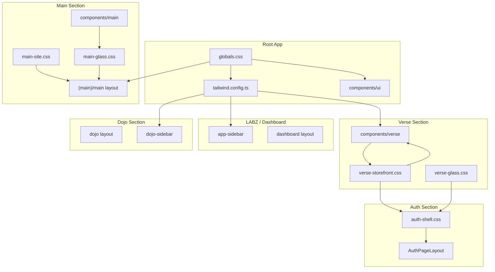

# Design System

This document describes the color palette, tokens, and design architecture for MOOD MNKY LABZ and the MNKY DOJO storefront.

## Architecture Overview



---

## Palette vs mode (don’t mix them)

We have **two independent choices** that together define the look:

| Concept | What it is | Values | Where it lives |
|--------|-------------|--------|----------------|
| **Palette** | Which look/brand (Main vs Dojo) | `main` \| `dojo` | `data-theme` on `<html>`, `ThemePaletteProvider`, localStorage `theme-palette`. Use **palette** in code and docs when you mean Main vs Dojo. |
| **Mode** | Light vs dark (and system) | `light` \| `dark` \| `system` | next-themes, `class="dark"` on `<html>`. Use **mode** (or “theme” only when referring to next-themes) when you mean light/dark. |

So: **palette** = Main or Dojo. **Mode** = light or dark. Four combinations: Main+light, Main+dark, Dojo+light, Dojo+dark. In code, prefer naming variables and props `palette` and `mode` (or `resolvedMode`) so the two are not confused.

---

## Palette themes and mode (data-theme + next-themes)

The app has **two palettes**, each with **light and dark mode**:

1. **Main** — Black/white/grayscale only, glassmorphic (main site, LABZ).
2. **Dojo** — The Dojo theme: slate light (#f1f5f9, #0f172a, #475569), Dojo dark (#181619, #c8c4c4, #94a3b8). Used for the MNKY DOJO storefront and member hub; one palette, one product name.

- **Palette** is controlled by `data-theme` on `<html>`: `main` or `dojo`. It is set by `ThemePaletteProvider` and persisted in localStorage under `theme-palette`. Use `ThemePaletteSwitcher` or `useThemePalette()` from `@/components/theme-palette-provider`.
- **Mode** (light / dark / system) is controlled by **next-themes** via the `class` attribute on `<html>` (e.g. `class="dark"`). Existing togglers (`ThemeToggle`, `AnimatedThemeToggler`, `AuthModeToggle`) continue to use `setTheme("light"|"dark"|"system")`.

All design tokens are defined in `app/globals.css` under `[data-theme="main"]`, `[data-theme="main"].dark`, `[data-theme="dojo"]`, and `[data-theme="dojo"].dark`. The same component system (shadcn, verse, main, dojo) consumes these variables; swapping palette or mode swaps the entire look app-wide.

---

## Root (globals.css)

The root design system defines one **token contract** and two **theme implementations** (Main and Dojo), each with light and dark variants. Tailwind and components reference `hsl(var(--background))`, `var(--verse-bg)`, etc.; values come from the active `data-theme` and `.dark` class on `<html>`.

### Theme: Main (grayscale)

**Light:** White backgrounds, dark text, cool gray primary (`215 19% 35%`). **Dark:** Near-black backgrounds, light text, lighter gray primary (`213 24% 65%`).

### Theme: Dojo

**Light:** Slate-100 background (#f1f5f9), slate-900 text (#0f172a), slate-600 primary/muted (#475569). **Dark:** #181619 background, #c8c4c4 text, #94a3b8 muted/primary. This is the Dojo theme applied to the MNKY DOJO storefront and auth.

### Chart Colors

- **chart-1**: Grayscale (matches primary) – primary data series
- **chart-2–5**: Non-grayscale for data viz differentiation:
  - chart-2: `165 50% 45%` (teal)
  - chart-3: `200 50% 50%` (blue)
  - chart-4: `36 80% 56%` (amber)
  - chart-5: `0 72% 51%` (red)

---

## MNKY DOJO storefront (Dojo theme)

The MNKY DOJO storefront uses the **Dojo theme**: root-supplied tokens (defined in `app/globals.css` under `[data-theme="dojo"]` and `.dark`) are consumed by the storefront and auth. The `.verse-storefront` class (in `verse-storefront.css`) scopes layout and typography; `--verse-page-width` and `--verse-spacing-sections` are defined there. Color tokens (`--verse-bg`, `--verse-text`, `--verse-text-muted`, `--verse-button`, `--verse-button-text`, `--verse-border`, and RGB variants) are the Dojo theme values when `data-theme="dojo"`. One palette, one product name (Dojo).

### Dropdown

`.verse-dropdown` sets `--background` and `--foreground` to `var(--verse-bg)` and `var(--verse-text)` so dropdowns match the current theme.

---

## LABZ

The LABZ dashboard uses the root layout, `next-themes`, and shared shadcn components. It does not have a separate component folder.

### Dashboard

The dashboard page uses the root design tokens and shadcn patterns: **Card**, **Badge**, **Button**, **Progress**, **Skeleton**, **Alert**, **Tooltip**, **Separator**. Section order and visibility (e.g. MNKY LABZ hub card, connect alert, MNKY LABZ pages count) are driven by `lib/dashboard-config.ts` (`dashboardConfig`). Status styling uses semantic tokens (e.g. `bg-success/10 text-success` for connected/success, muted or `--warning` for partial/connect prompts). See `docs/DASHBOARD-ENV.md` for environment and config.

### Light-Mode Focus

- Default theme: **light** (`app/layout.tsx` → `ThemeProvider defaultTheme="light"`)
- Viewport `themeColor`: `#f1f5f9` (matches slate-100)
- PWA manifest: `background_color` and `theme_color` → `#f1f5f9`

### Auth LABZ Tab

The auth page has two tabs: **Dojo** (storefront) and **LABZ** (admin). The LABZ tab uses explicit light overrides:

```tsx
<DualAuthTabs appearance={activeTab === "labz" ? "light" : "default"} />
```

This ensures the LABZ auth card always renders in light mode, regardless of system preference.

---

## Auth

Auth pages (`app/auth/`) use the **Dojo theme** for consistent aesthetic with the storefront. They consume Dojo theme tokens via verse-storefront.css and auth-shell.

### Auth Shell

- **Layout**: `app/auth/layout.tsx` imports `verse-storefront.css`, `verse-glass.css`, and `auth-shell.css`
- **AuthVerseShell**: Client component that syncs `next-themes` resolved theme to `data-verse-theme` so verse tokens (light/dark) apply correctly
- **AuthPageLayout**: Shared wrapper for all auth pages—provides verse-bg + DottedMap background, optional mascot slot, BlurFade content wrapper
- **Theme sync**: Auth uses `next-themes` (AuthModeToggle); `AuthVerseShell` maps `resolvedTheme` to `data-verse-theme` for verse CSS variables

### Auth Page Structure

- **Login** (`/auth/login`): Uses `AuthPageLayout` with mascot (Verse or LABZ per tab), DualAuthTabs with glass-style cards
- **Other pages** (sign-up, forgot-password, update-password, etc.): Use `AuthPageLayout` (no mascot), glass `.auth-card` for form containers

### Auth Design Tokens

Auth pages inherit verse tokens via `.verse-storefront.auth-shell`:

- Background: `var(--verse-bg)`
- Text: `var(--verse-text)`, muted: `var(--verse-text-muted)`
- Borders: `var(--verse-border)`
- Glass cards: `rgba(var(--verse-bg-rgb), 0.85)`, `backdrop-blur-xl`

### Files

- `app/auth/auth-shell.css` — auth-scoped styles, `.auth-card` glass panel
- `components/auth/auth-verse-shell.tsx` — theme sync wrapper
- `components/auth/auth-page-layout.tsx` — shared background + DottedMap + content slot

---

## Dojo

The Dojo (`app/dojo/`) is the members' private hub. It uses **root design tokens** (grayscale primary) and shared shadcn components, aligned with LABZ. No separate CSS file; the `.dojo-dashboard` wrapper class scopes layout styling. Components: `components/dojo/dojo-sidebar.tsx`, `lib/dojo-sidebar-config.tsx`. See `docs/DOJO-SECTION.md` for route structure and auth.

The Dojo home profile block uses the **Elements AI SDK Agent** component (`components/ai-elements/agent.tsx`) as a character card: `AgentHeader` accepts an optional `icon` (user Avatar), `AgentInstructions` an optional `label` (e.g. "Summary"). Prop mapping and rationale: `docs/dojo/DOJO-CHARACTER-CARD-DESIGN.md`.

---

## Main (main-site.css, main-glass.css)

The Main section (`app/(main)/main/`) is the public marketing site served at www.moodmnky.com. It uses **root design tokens** from `globals.css` (no Verse or LABZ overrides) plus Main-specific glassmorphism tokens. The wrapper class `.main-site` scopes layout utilities. The Main landing follows a **monochrome, high-contrast editorial** layout: split hero with Dotted Map + Globe + mascot (no card), feature cards, social proof, customization, FAQ, optional Explore block and chat. **No background pattern overload** on Main—hero and sections use `bg-background` or subtle gradients only; no AnimatedGridPattern or busy backgrounds.

### Theme (light/dark)

Main supports **light** and **dark** mode driven by the **Animated Theme Toggler** in the main nav (desktop and mobile sheet). The toggler uses **next-themes** (`setTheme`), so the rest of the app stays in sync. **Light** = white-dominant (`--background: 0 0% 100%`, dark text); **dark** = inverse grayscale (dark background `0 0% 6%`, light foreground). Glass tokens in `main-glass.css` and the hero gradient in `main-site.css` use theme-aware tokens so they invert correctly in dark mode.

### Section architecture (landing page order)

1. **Split hero** — Left: headline, subline, CTA pair (Shop the store → `/dojo`, Customize your scent → `/dojo/blending-guide`). Right: **layered visual** (aligned with Dojo hero): **Dotted Map** (layer 0, low opacity, theme-aware), **Globe** (layer 1, grayscale COBE config by theme; hidden on iOS/narrow), **mascot** (layer 2, bottom-left, no card, optional drop-shadow by theme). Responsive: stack copy then right block on small screens.
2. **Feature cards** — 3–6 cards with icon (Lucide), title, and short copy (Extreme Personalization, Sensory Journeys, Handcrafted, The Dojo, Blending Lab, AI Companions). Uses `MainGlassCard` and `--main-section-gap`.
3. **Social proof** — Single row of stats or “Trusted by” copy; grayscale, minimal.
4. **Customization** — One section for scent and container personalization (copy + optional list); Tailwind tokens only.
5. **FAQ** — shadcn Accordion with 4–6 MOOD MNKY / Dojo / product questions.
6. **Explore** (optional) — Condensed Dojo + Blending Lab CTAs in two cards.
7. **Meet MOOD MNKY** (optional) — Compact chatbot block.
8. **Footer** — `MainFooter` with glass treatment; no pattern overload.

### Layout (full-page and bento)

Main uses a **full-page layout** (ElevenLabs-style) with a wide content area: `--main-page-width: 1600px`. The landing page uses a **bento-style grid** (CSS Grid with 1–3 columns) so sections can span full width or sit side-by-side (e.g. Explore as 2 columns). Hero is full-width; content below uses `grid grid-cols-1 md:grid-cols-2 lg:grid-cols-3` with `col-span-full` for most sections. For full-bleed sections that ignore max-width, use `.main-container-full-bleed`.

### Tokens and layout

- **--main-page-width**: `1600px` (wide content area for full-page feel).
- **--main-spacing-sections**: `32px`.
- **--main-hero-title-size**: Responsive clamp for hero H1 (e.g. `clamp(2.25rem, 5vw, 3.5rem)`).
- **--main-hero-subtitle-size**: Hero subtitle (e.g. `1.125rem` / `1.25rem` on md+).
- **--main-hero-min-height**: Min height for hero section (e.g. `60vh`).
- **--main-section-gap**: Vertical spacing between major sections (e.g. `6rem`).
- **--main-section-gap-sm**: Smaller section gap (e.g. `4rem`).
- **.main-container**: Centered container with responsive padding (max-width from `--main-page-width`).
- **.main-container-full-bleed**: Full viewport width; use for hero or full-bleed sections.

Main uses root tokens plus a **full grayscale scale** in `main-site.css`: `--main-gray-50` through `--main-gray-950` (HSL 0 0% lightness) for consistent monochrome hierarchy. Use these for backgrounds, borders, and text when you want explicit gray steps within Main.

**Button variants (Main-only, use with shadcn Button):**
- `.main-btn-glass` — glass panel style with hover lift and shadow (use with `variant="outline"` for best effect).
- `.main-btn-float` — hover lift and shadow only (works with default, outline, or ghost).

### Glass tokens (main-glass.css)

Monochromatic grayscale glassmorphism, GQ-inspired tech-forward aesthetic:

| Token | Light | Dark |
|-------|-------|------|
| `--main-glass-bg` | `rgba(255,255,255,0.12)` | `rgba(0,0,0,0.08)` |
| `--main-glass-border` | `rgba(0,0,0,0.06)` | `rgba(255,255,255,0.12)` |
| `--main-glass-blur` | `20px` | — |
| `--main-glass-shadow` | `0 8px 32px rgba(0,0,0,0.08)` | — |
| `--main-glass-bg-nav` | `rgba(255,255,255,0.85)` | `rgba(0,0,0,0.75)` |
| `--main-glass-border-nav` | `rgba(0,0,0,0.08)` | `rgba(255,255,255,0.1)` |
| `--main-card-hover-lift` | `2px` | — |
| `--main-card-hover-shadow` | `0 12px 40px rgba(0,0,0,0.12)` | — |

**Classes:**
- `.main-glass-panel` — frosted glass panel (cards, hero overlay)
- `.main-glass-nav` — sticky nav bar with glass effect
- `.main-glass-footer` — footer bar with glass effect

`@supports` fallback when `backdrop-filter` is unsupported: solid background using `--main-glass-bg-solid`.

### Main components (components/main/)

| Component | Purpose |
|-----------|---------|
| `MainNav` | Glass header with Animated Theme Toggler, “Talk to MOOD MNKY” (opens voice dialog), and links to Main/About/Fragrances/Formulas/Collections/Community/Shop/Sign in |
| `MainGlassCard` | Reusable glass panel card |
| `MainHero` | Legacy hero with glass overlay, scroll-linked motion, agent imagery, CTAs |
| `MainHeroSplit` | Split hero: left copy + CTAs; right Dotted Map + Globe + mascot (no card), theme-aware; editorial landing |
| `MainFeatureCards` | Grid of 3–6 feature cards (icon + title + copy); uses MainGlassCard |
| `MainSocialProof` | Single-row social proof (stats / “Trusted by”); grayscale, minimal |
| `MainCustomization` | Scent and container personalization section; Tailwind tokens only |
| `MainFaq` | FAQ section using shadcn Accordion (4–6 items) |
| `MainAgentCard` | Agent showcase (MOOD, SAGE, CODE) using Elements Agent |
| `MainChatbot` | Public chat demo (OpenAI-only): Conversation, Message, PromptInput, Suggestion, Shimmer, Chain of Thought, Open In Chat |
| `MainFooter` | Shared footer with glass treatment and Open In Chat |
| `MainContactForm` | Contact form posting to `/api/main/contact` (server-only Supabase) |
| `MainWaitlistForm` | Waitlist signup posting to `/api/main/waitlist` (server-only Supabase) |
| `MainVoiceBlock` | Voice block: Orb, Mic Selector, Conversation Bar (when agent configured) |
| `MainListenBlock` | Listen section: Audio player for brand sample |

### ElevenLabs UI and main-* wrappers

Main uses [ElevenLabs UI](https://ui.elevenlabs.io/) via wrappers in `components/main/elevenlabs/`: MainOrb, MainShimmeringText, MainAudioPlayer, MainBarVisualizer, MainMatrix, MainMessage, MainResponse, MainConversationBar, MainLiveWaveform, MainMicSelector, MainScrubBar, MainSpeechInput, MainTranscriptViewer, MainVoiceButton, MainVoicePicker, MainWaveform. **ElevenLabs agents JavaScript libraries**: `@elevenlabs/client` (Conversational AI / Scribe in `hooks/use-scribe.ts`) and `@elevenlabs/react` (useConversation in Conversation Bar, Verse voice chat) are installed and configured to use agent ID from server/config only; API key stays server-side (see `.env.example`). Config: Supabase `main_elevenlabs_config`; server-only `GET /api/main/elevenlabs-config`; LABZ at `/chat/main-elevenlabs`. No API keys on client.

### Motion and AI Elements on Main

- **Motion**: BlurFade for section entry. Card hovers use `--main-card-hover-lift` and `--main-card-hover-shadow` where applicable. Respects reduced-motion where applicable.
- **AI Elements used on Main**: Conversation, Message, PromptInput, Agent (existing); Suggestion, Suggestions (chat empty state); Shimmer (streaming/loading); ChainOfThought (thinking steps while waiting for first token); OpenInChat (below chat and in footer). Optional: Queue, QueueContent, QueueTodoItem if roadmap/waitlist blocks are reintroduced.
- **Main chat**: OpenAI only (no Flowise). Supabase is used only via server-side API routes (waitlist, contact); credentials are not exposed to the client.

### Files

- `app/(main)/main/main-site.css` — scoped layout tokens and `.main-container`
- `app/(main)/main/main-glass.css` — glass tokens and `.main-glass-*` classes
- `app/(main)/main/layout.tsx` — metadata (title, description, Open Graph, canonical), `.main-site` wrapper
- `app/(main)/main/page.tsx` — Landing: bento-style grid; MainHeroSplit, MainFeatureCards, MainSocialProof, MainCustomization, MainFaq, Explore, MainChatbot, MainVoiceBlock, MainListenBlock, MainWaitlistForm, MainFooter
- `app/(main)/main/components/page.tsx` — Component library: ElevenLabs, shadcn, Magic UI (and other) categories with live demos
- `components/main/` — MainNav, MainDock, MainTalkToAgentDialog, MainTalkToAgentProvider, MainGlassCard, MainHero, MainHeroSplit, MainFeatureCards, MainSocialProof, MainCustomization, MainFaq, MainAgentCard, MainChatbot, MainFooter, MainContactForm, MainWaitlistForm

### Jellyfin theme (mnky.css)

The Jellyfin Custom CSS theme served from Supabase ([infra/service-themes/jellyfin/mnky.css](../infra/service-themes/jellyfin/mnky.css)) is aligned with the Main design system: grayscale palette (`--mnky-gray-*`), glass tokens (`--mnky-glass-*`), and the same blur, radius, and shadow values as Main. It applies to the Jellyfin web client via Dashboard → General → Custom CSS (`@import` theme URL). For selector list, token mapping, and verification steps, see [JELLYFIN-THEME-BASELINE.md](JELLYFIN-THEME-BASELINE.md) and [JELLYFIN-THEME-CONFIGURATIONS.md](JELLYFIN-THEME-CONFIGURATIONS.md).

---

## Shopify theme (storefront)

The Shopify storefront theme is aligned with the **Main** design system: grayscale-only color schemes and glassmorphism matching Main tokens.

### Token mapping

- **Color schemes:** Shopify uses `config/settings_data.json` → `current.color_schemes` (e.g. `background-1`, `inverse`). The layout outputs `--color-background`, `--color-foreground`, `--color-button`, `--color-button-text`, etc. (RGB triplets) per scheme. These correspond to Main’s background/foreground and primary: **background-1** (dark) ≈ Main dark (`#0f0f0f` background, `#fafafa` text, `#404040` button); **inverse** (light) ≈ Main light (`#ffffff` background, `#171717` text).
- **Glass:** Implemented in `Shopify/theme/assets/component-glass.css` and layout-injected vars in `layout/theme.liquid` when “Glass style” is enabled: `--glass-blur` (default 20px), `--glass-bg-alpha` (default 0.15), `--glass-border-alpha`, `--glass-shadow` (`0 8px 32px rgba(0,0,0,0.08)`), `--glass-radius` (1rem). Same values as `main-glass.css` so header, announcement bar, banners, cards, and drawers match Main.
- **Light/dark:** Body has `data-theme="dark"` or `"light"` (from localStorage). Sections use `color-{{ section.settings.color_scheme }}` so each block gets the correct `--color-*` set; there is no single body-level scheme class.

### Baseline and re-pull

Theme Editor changes (and re-pulling from live) can overwrite `settings_data.json`. Default Main-aligned scheme and glass values are documented in [Shopify/docs/SHOPIFY-THEME-BASELINE.md](Shopify/docs/SHOPIFY-THEME-BASELINE.md) (Design system alignment). Use that doc for structure, token flow, and file/component map.

---

## MNKY BOX (Verse)

The MNKY BOX is a **Framed Editorial Modular Commerce** view for seasonal drops, driven by the same manga data (one issue = one drop; chapters = product cards). It uses scoped tokens so it does not override root or Verse tokens.

### Scope and tokens

- **Wrapper:** `.mnky-box` (and `.mnky-box-section` in Shopify Liquid). Tokens are defined in `app/(storefront)/verse/mnky-box.css` and referenced in Tailwind under the `mnkyBox` theme key.
- **Tokens:** `--mnky-box-bg`, `--mnky-box-border-frame`, `--mnky-box-text`, `--mnky-box-text-muted`, `--mnky-box-accent-primary`, `--mnky-box-accent-secondary`, `--mnky-box-surface-card`, `--mnky-box-shadow-float`, `--mnky-box-container-max`, `--mnky-box-frame-width`, `--mnky-box-grid-gap`. Seasonal accent can be overridden per issue (e.g. via `mnky_issues.accent_primary`).
- **Tailwind:** Use `bg-mnkyBox-bg`, `text-mnkyBox-text`, `border-mnkyBox-border-frame`, `shadow-mnky-float`, `max-w-mnky-container`, etc. See `tailwind.config.ts` extend.

### Components and routes

- **Components:** `components/mnky-box/` — BoxFrame, BoxHero, BoxGrid, BoxCard, BoxCTA. Use shadcn Card for BoxCard structure.
- **Dojo route:** `/dojo/drops/[slug]` — loads issue + chapters from Supabase and renders the box layout. Link from issue detail: “View as MNKY BOX”.
- **API:** `GET /api/mag/issues/[slug]/box` returns issue, collection, and products (chapters with optional card_image_url from first panel).

### Files

- `app/(storefront)/verse/mnky-box.css` — scoped MNKY BOX CSS variables
- `app/(storefront)/verse/drops/[slug]/page.tsx` — drop page (server data)
- `components/mnky-box/*.tsx` — BoxFrame, BoxHero, BoxGrid, BoxCard, BoxCTA
- `Shopify/theme/sections/mnky-box.liquid` — theme section (settings + product blocks)

See `docs/MNKY-BOX-EDITORIAL-REFINED.md` for data model, XP, and Shopify usage.

---

## Flowise-MNKY Components

The `components/flowise-mnky/` library provides Flowise-specific UI: chatflow control panel, override config editor, document store upload, chat UI, FlowisePreview (live preview via Elements WebPreview when tools return URLs), and FlowisePlan (execution plans via Elements Plan when agents return structured steps). Uses root tokens, shadcn, and Elements AI SDK (Agent, Message, Conversation, PromptInput, Tool, Reasoning, WebPreview, Plan). See `docs/FLOWISE-MNKY-COMPONENTS.md`.

---

## Optional Future LABZ Overrides

If LABZ-specific overrides are needed later:

1. Introduce `app/(dashboard)/labz.css`
2. Add a `.labz-dashboard` wrapper, similar to `.verse-storefront`
3. Define scoped tokens in that file

---

## Fonts

| Font | Usage |
|------|-------|
| Inter | Root app, LABZ, Main |
| Source Code Pro | Monospace |
| Oswald | Verse headings |
| Roboto | Verse body |
| Montserrat | Verse logo |

---

## References

- Root tokens: `app/globals.css`
- Auth shell: `app/auth/auth-shell.css`, `components/auth/auth-verse-shell.tsx`, `components/auth/auth-page-layout.tsx`
- Dojo: `app/dojo/layout.tsx`, `docs/DOJO-SECTION.md`
- Main: `app/(main)/main/main-site.css`, `app/(main)/main/main-glass.css`, `app/(main)/main/layout.tsx`, `components/main/`, `docs/MAIN-SECTION-DOMAINS.md`
- Dojo storefront (tokens/layout): `app/(storefront)/verse/verse-storefront.css`
- Dojo storefront glass: `app/(storefront)/verse/verse-glass.css`
- MNKY BOX: `app/(storefront)/verse/mnky-box.css`, `components/mnky-box/`, `docs/MNKY-BOX-EDITORIAL-REFINED.md`
- Shopify theme: `Shopify/theme/layout/theme.liquid`, `Shopify/theme/assets/component-glass.css`, `Shopify/theme/config/settings_data.json`, [Shopify/docs/SHOPIFY-THEME-BASELINE.md](Shopify/docs/SHOPIFY-THEME-BASELINE.md)
- Tailwind config: `tailwind.config.ts`

