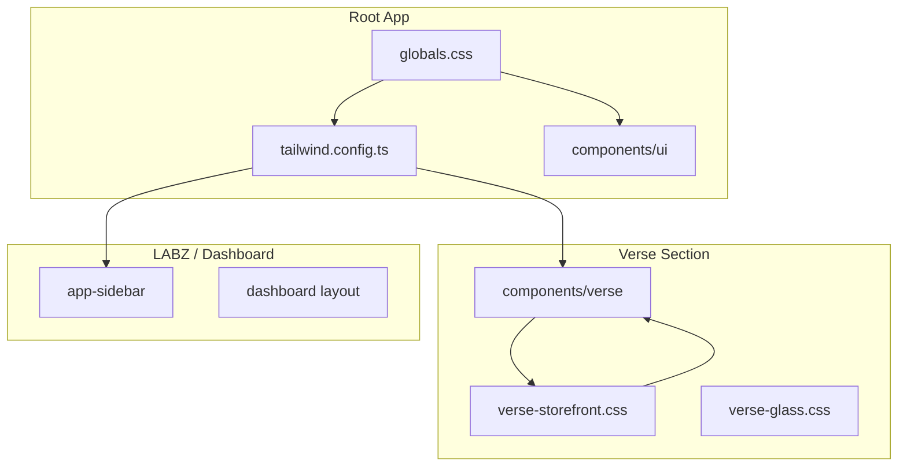

# Design System

This document describes the color palette, tokens, and design architecture for MOOD MNKY LABZ and the Verse storefront.

## Architecture Overview



---

## Root (globals.css)

The root design system uses **grayscale primary** tokens shared by LABZ and all UI components.

### Light Mode

| Token | Value | Usage |
|-------|-------|-------|
| `--primary` | `215 19% 35%` | Primary actions, links, accents |
| `--primary-foreground` | `210 20% 98%` | Text on primary |
| `--accent` | `215 19% 35%` | Accent highlights |
| `--ring` | `215 19% 35%` | Focus rings |
| `--chart-1` | `215 19% 35%` | Primary chart color (grayscale) |

### Dark Mode

| Token | Value | Usage |
|-------|-------|-------|
| `--primary` | `213 24% 65%` | Primary actions, links, accents |
| `--primary-foreground` | `222 47% 11%` | Text on primary |
| `--accent` | `213 24% 65%` | Accent highlights |
| `--ring` | `213 24% 65%` | Focus rings |
| `--chart-1` | `213 24% 65%` | Primary chart color (grayscale) |

### Chart Colors

- **chart-1**: Grayscale (matches primary) – primary data series
- **chart-2–5**: Non-grayscale for data viz differentiation:
  - chart-2: `165 50% 45%` (teal)
  - chart-3: `200 50% 50%` (blue)
  - chart-4: `36 80% 56%` (amber)
  - chart-5: `0 72% 51%` (red)

---

## Verse (verse-storefront.css)

The Verse storefront has its own scoped design language. Tokens are prefixed with `--verse-*` and apply inside `.verse-storefront`.

### Scoped Primary Override

When inside `.verse-storefront`, the root `--primary` and `--accent` are overridden to match the grayscale palette:

- **Light**: `215 19% 35%` | **Dark**: `213 24% 65%`

### Verse-Specific Tokens

| Token | Light | Dark |
|-------|-------|------|
| `--verse-bg` | `#f1f5f9` (slate-100) | `#181619` |
| `--verse-text` | `#0f172a` (slate-900) | `#c8c4c4` |
| `--verse-text-muted` | `#475569` (slate-600) | `#94a3b8` |
| `--verse-button` | `#475569` | `#94a3b8` |
| `--verse-button-text` | `#f8fafc` | `#0f172a` |
| `--verse-border` | `rgba(15, 23, 42, 0.08)` | `rgba(200, 196, 196, 0.12)` |
| `--verse-page-width` | `1600px` | — |
| `--verse-spacing-sections` | `24px` | — |

### Dropdown Override

`.verse-dropdown` overrides `--background` and `--foreground` to use Verse tokens for consistent dropdown styling.

---

## LABZ

The LABZ dashboard uses the root layout, `next-themes`, and shared shadcn components. It does not have a separate component folder.

### Dashboard

The dashboard page uses the root design tokens and shadcn patterns: **Card**, **Badge**, **Button**, **Progress**, **Skeleton**, **Alert**, **Tooltip**, **Separator**. Section order and visibility (e.g. LABZ hub card, connect alert, LABZ pages count) are driven by `lib/dashboard-config.ts` (`dashboardConfig`). Status styling uses semantic tokens (e.g. `bg-success/10 text-success` for connected/success, muted or `--warning` for partial/connect prompts). See `docs/DASHBOARD-ENV.md` for environment and config.

### Light-Mode Focus

- Default theme: **light** (`app/layout.tsx` → `ThemeProvider defaultTheme="light"`)
- Viewport `themeColor`: `#f1f5f9` (matches slate-100)
- PWA manifest: `background_color` and `theme_color` → `#f1f5f9`

### Auth LABZ Tab

The auth page has two tabs: **Verse** (storefront) and **LABZ** (admin). The LABZ tab uses explicit light overrides:

```tsx
<DualAuthTabs appearance={activeTab === "labz" ? "light" : "default"} />
```

This ensures the LABZ auth card always renders in light mode, regardless of system preference.

---

## Optional Future LABZ Overrides

If LABZ-specific overrides are needed later:

1. Introduce `app/(dashboard)/labz.css`
2. Add a `.labz-dashboard` wrapper, similar to `.verse-storefront`
3. Define scoped tokens in that file

---

## Fonts

| Font | Usage |
|------|-------|
| Inter | Root app, LABZ |
| Source Code Pro | Monospace |
| Oswald | Verse headings |
| Roboto | Verse body |
| Montserrat | Verse logo |

---

## References

- Root tokens: `app/globals.css`
- Verse tokens: `app/(storefront)/verse/verse-storefront.css`
- Glass effects: `app/(storefront)/verse/verse-glass.css`
- Tailwind config: `tailwind.config.ts`
