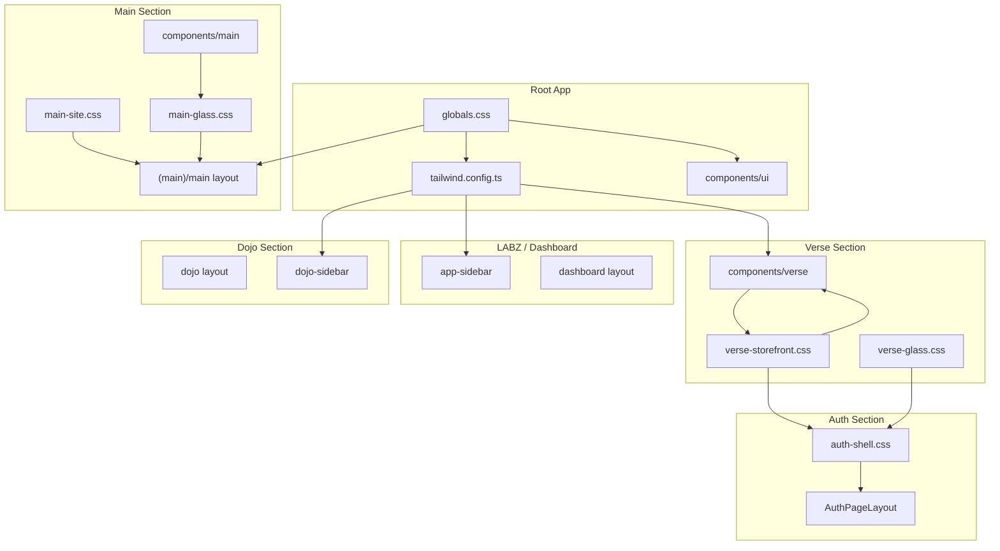

# Design System

This document describes the color palette, tokens, and design architecture for MOOD MNKY LABZ and the MNKY VERSE storefront.

## Architecture Overview



---

## Root (globals.css)

The root design system uses **grayscale primary** tokens shared by LABZ and all UI components.

### Light Mode

| Token | Value | Usage |
|-------|-------|-------|
| `--primary` | `215 19% 35%` | Primary actions, links, accents |
| `--primary-foreground` | `210 20% 98%` | Text on primary |
| `--accent` | `215 19% 35%` | Accent highlights |
| `--ring` | `215 19% 35%` | Focus rings |
| `--chart-1` | `215 19% 35%` | Primary chart color (grayscale) |

### Dark Mode

| Token | Value | Usage |
|-------|-------|-------|
| `--primary` | `213 24% 65%` | Primary actions, links, accents |
| `--primary-foreground` | `222 47% 11%` | Text on primary |
| `--accent` | `213 24% 65%` | Accent highlights |
| `--ring` | `213 24% 65%` | Focus rings |
| `--chart-1` | `213 24% 65%` | Primary chart color (grayscale) |

### Chart Colors

- **chart-1**: Grayscale (matches primary) – primary data series
- **chart-2–5**: Non-grayscale for data viz differentiation:
  - chart-2: `165 50% 45%` (teal)
  - chart-3: `200 50% 50%` (blue)
  - chart-4: `36 80% 56%` (amber)
  - chart-5: `0 72% 51%` (red)

---

## Verse (verse-storefront.css)

The MNKY VERSE storefront has its own scoped design language. Tokens are prefixed with `--verse-*` and apply inside `.verse-storefront`.

### Scoped Primary Override

When inside `.verse-storefront`, the root `--primary` and `--accent` are overridden to match the grayscale palette:

- **Light**: `215 19% 35%` | **Dark**: `213 24% 65%`

### Verse-Specific Tokens

| Token | Light | Dark |
|-------|-------|------|
| `--verse-bg` | `#f1f5f9` (slate-100) | `#181619` |
| `--verse-text` | `#0f172a` (slate-900) | `#c8c4c4` |
| `--verse-text-muted` | `#475569` (slate-600) | `#94a3b8` |
| `--verse-button` | `#475569` | `#94a3b8` |
| `--verse-button-text` | `#f8fafc` | `#0f172a` |
| `--verse-border` | `rgba(15, 23, 42, 0.08)` | `rgba(200, 196, 196, 0.12)` |
| `--verse-page-width` | `1600px` | — |
| `--verse-spacing-sections` | `24px` | — |

### Dropdown Override

`.verse-dropdown` overrides `--background` and `--foreground` to use Verse tokens for consistent dropdown styling.

---

## LABZ

The LABZ dashboard uses the root layout, `next-themes`, and shared shadcn components. It does not have a separate component folder.

### Dashboard

The dashboard page uses the root design tokens and shadcn patterns: **Card**, **Badge**, **Button**, **Progress**, **Skeleton**, **Alert**, **Tooltip**, **Separator**. Section order and visibility (e.g. MNKY LABZ hub card, connect alert, MNKY LABZ pages count) are driven by `lib/dashboard-config.ts` (`dashboardConfig`). Status styling uses semantic tokens (e.g. `bg-success/10 text-success` for connected/success, muted or `--warning` for partial/connect prompts). See `docs/DASHBOARD-ENV.md` for environment and config.

### Light-Mode Focus

- Default theme: **light** (`app/layout.tsx` → `ThemeProvider defaultTheme="light"`)
- Viewport `themeColor`: `#f1f5f9` (matches slate-100)
- PWA manifest: `background_color` and `theme_color` → `#f1f5f9`

### Auth LABZ Tab

The auth page has two tabs: **Verse** (storefront) and **LABZ** (admin). The LABZ tab uses explicit light overrides:

```tsx
<DualAuthTabs appearance={activeTab === "labz" ? "light" : "default"} />
```

This ensures the LABZ auth card always renders in light mode, regardless of system preference.

---

## Auth

Auth pages (`app/auth/`) use the **Verse design system** for consistent aesthetic with the storefront. They consume verse-storefront tokens via an auth shell.

### Auth Shell

- **Layout**: `app/auth/layout.tsx` imports `verse-storefront.css`, `verse-glass.css`, and `auth-shell.css`
- **AuthVerseShell**: Client component that syncs `next-themes` resolved theme to `data-verse-theme` so verse tokens (light/dark) apply correctly
- **AuthPageLayout**: Shared wrapper for all auth pages—provides verse-bg + DottedMap background, optional mascot slot, BlurFade content wrapper
- **Theme sync**: Auth uses `next-themes` (AuthModeToggle); `AuthVerseShell` maps `resolvedTheme` to `data-verse-theme` for verse CSS variables

### Auth Page Structure

- **Login** (`/auth/login`): Uses `AuthPageLayout` with mascot (Verse or LABZ per tab), DualAuthTabs with glass-style cards
- **Other pages** (sign-up, forgot-password, update-password, etc.): Use `AuthPageLayout` (no mascot), glass `.auth-card` for form containers

### Auth Design Tokens

Auth pages inherit verse tokens via `.verse-storefront.auth-shell`:

- Background: `var(--verse-bg)`
- Text: `var(--verse-text)`, muted: `var(--verse-text-muted)`
- Borders: `var(--verse-border)`
- Glass cards: `rgba(var(--verse-bg-rgb), 0.85)`, `backdrop-blur-xl`

### Files

- `app/auth/auth-shell.css` — auth-scoped styles, `.auth-card` glass panel
- `components/auth/auth-verse-shell.tsx` — theme sync wrapper
- `components/auth/auth-page-layout.tsx` — shared background + DottedMap + content slot

---

## Dojo

The Dojo (`app/dojo/`) is the members' private hub. It uses **root design tokens** (grayscale primary) and shared shadcn components, aligned with LABZ. No separate CSS file; the `.dojo-dashboard` wrapper class scopes layout styling. Components: `components/dojo/dojo-sidebar.tsx`, `lib/dojo-sidebar-config.tsx`. See `docs/DOJO-SECTION.md` for route structure and auth.

The Dojo home profile block uses the **Elements AI SDK Agent** component (`components/ai-elements/agent.tsx`) as a character card: `AgentHeader` accepts an optional `icon` (user Avatar), `AgentInstructions` an optional `label` (e.g. "Summary"). Prop mapping and rationale: `docs/dojo/DOJO-CHARACTER-CARD-DESIGN.md`.

---

## Main (main-site.css, main-glass.css)

The Main section (`app/(main)/main/`) is the public marketing site served at www.moodmnky.com. It uses **root design tokens** from `globals.css` (no Verse or LABZ overrides) plus Main-specific glassmorphism tokens. The wrapper class `.main-site` scopes layout utilities. The Main landing follows a **monochrome, high-contrast editorial** layout: split hero with 16:9 promo area, feature cards, social proof, customization, FAQ, optional Explore block and chat. **No background pattern overload** on Main—hero and sections use `bg-background` or subtle gradients only; no AnimatedGridPattern or busy backgrounds.

### Section architecture (landing page order)

1. **Split hero** — Left: headline, subline, CTA pair (Shop the VERSE → `/verse`, Customize your scent → `/verse/blending-guide`). Right: **16:9 aspect-ratio** container (`aspect-video`) for promo image (e.g. `/verse/mood-mnky-3d.png`). Responsive: stack copy then media on small screens.
2. **Feature cards** — 3–6 cards with icon (Lucide), title, and short copy (Extreme Personalization, Sensory Journeys, Handcrafted, The Dojo, Blending Lab, AI Companions). Uses `MainGlassCard` and `--main-section-gap`.
3. **Social proof** — Single row of stats or “Trusted by” copy; grayscale, minimal.
4. **Customization** — One section for scent and container personalization (copy + optional list); Tailwind tokens only.
5. **FAQ** — shadcn Accordion with 4–6 MOOD MNKY / VERSE / product questions.
6. **Explore** (optional) — Condensed VERSE + Blending Lab CTAs in two cards.
7. **Meet MOOD MNKY** (optional) — Compact chatbot block.
8. **Footer** — `MainFooter` with glass treatment; no pattern overload.

### Tokens and layout

- **--main-page-width**: `1200px` (content max-width).
- **--main-spacing-sections**: `32px`.
- **--main-hero-title-size**: Responsive clamp for hero H1 (e.g. `clamp(2.25rem, 5vw, 3.5rem)`).
- **--main-hero-subtitle-size**: Hero subtitle (e.g. `1.125rem` / `1.25rem` on md+).
- **--main-hero-min-height**: Min height for hero section (e.g. `60vh`).
- **--main-section-gap**: Vertical spacing between major sections (e.g. `6rem`).
- **--main-section-gap-sm**: Smaller section gap (e.g. `4rem`).
- **.main-container**: Centered container with responsive padding (max-width from `--main-page-width`).

Main does not define its own color tokens; it uses root `--background`, `--foreground`, `--primary`, `--muted-foreground`, `--border`, etc. So the marketing site has a clean, grayscale look consistent with LABZ and works with `next-themes` (light/dark) from the root layout.

### Glass tokens (main-glass.css)

Monochromatic grayscale glassmorphism, GQ-inspired tech-forward aesthetic:

| Token | Light | Dark |
|-------|-------|------|
| `--main-glass-bg` | `rgba(255,255,255,0.12)` | `rgba(0,0,0,0.08)` |
| `--main-glass-border` | `rgba(0,0,0,0.06)` | `rgba(255,255,255,0.12)` |
| `--main-glass-blur` | `20px` | — |
| `--main-glass-shadow` | `0 8px 32px rgba(0,0,0,0.08)` | — |
| `--main-glass-bg-nav` | `rgba(255,255,255,0.85)` | `rgba(0,0,0,0.75)` |
| `--main-glass-border-nav` | `rgba(0,0,0,0.08)` | `rgba(255,255,255,0.1)` |
| `--main-card-hover-lift` | `2px` | — |
| `--main-card-hover-shadow` | `0 12px 40px rgba(0,0,0,0.12)` | — |

**Classes:**
- `.main-glass-panel` — frosted glass panel (cards, hero overlay)
- `.main-glass-nav` — sticky nav bar with glass effect
- `.main-glass-footer` — footer bar with glass effect

`@supports` fallback when `backdrop-filter` is unsupported: solid background using `--main-glass-bg-solid`.

### Main components (components/main/)

| Component | Purpose |
|-----------|---------|
| `MainNav` | Glass header with links to Main/About/Pricing/VERSE/Sign in |
| `MainGlassCard` | Reusable glass panel card |
| `MainHero` | Legacy hero with glass overlay, scroll-linked motion, agent imagery, CTAs |
| `MainHeroSplit` | Split hero: left copy + CTA pair, right 16:9 promo media; editorial landing |
| `MainFeatureCards` | Grid of 3–6 feature cards (icon + title + copy); uses MainGlassCard |
| `MainSocialProof` | Single-row social proof (stats / “Trusted by”); grayscale, minimal |
| `MainCustomization` | Scent and container personalization section; Tailwind tokens only |
| `MainFaq` | FAQ section using shadcn Accordion (4–6 items) |
| `MainAgentCard` | Agent showcase (MOOD, SAGE, CODE) using Elements Agent |
| `MainChatbot` | Public chat demo (OpenAI-only): Conversation, Message, PromptInput, Suggestion, Shimmer, Chain of Thought, Open In Chat |
| `MainFooter` | Shared footer with glass treatment and Open In Chat |
| `MainContactForm` | Contact form posting to `/api/main/contact` (server-only Supabase) |
| `MainWaitlistForm` | Waitlist signup posting to `/api/main/waitlist` (server-only Supabase) |
| `MainVoiceBlock` | Voice block: Orb, Mic Selector, Conversation Bar (when agent configured) |
| `MainListenBlock` | Listen section: Audio player for brand sample |

### ElevenLabs UI and main-* wrappers

Main uses [ElevenLabs UI](https://ui.elevenlabs.io/) via wrappers in `components/main/elevenlabs/`: MainOrb, MainShimmeringText, MainAudioPlayer, MainBarVisualizer, MainMatrix, MainMessage, MainResponse, MainConversationBar, MainLiveWaveform, MainMicSelector, MainScrubBar, MainSpeechInput, MainTranscriptViewer, MainVoiceButton, MainVoicePicker, MainWaveform. Config: Supabase `main_elevenlabs_config`; server-only `GET /api/main/elevenlabs-config`; LABZ at `/chat/main-elevenlabs`. No API keys on client.

### Motion and AI Elements on Main

- **Motion**: BlurFade for section entry. Card hovers use `--main-card-hover-lift` and `--main-card-hover-shadow` where applicable. Respects reduced-motion where applicable.
- **AI Elements used on Main**: Conversation, Message, PromptInput, Agent (existing); Suggestion, Suggestions (chat empty state); Shimmer (streaming/loading); ChainOfThought (thinking steps while waiting for first token); OpenInChat (below chat and in footer). Optional: Queue, QueueContent, QueueTodoItem if roadmap/waitlist blocks are reintroduced.
- **Main chat**: OpenAI only (no Flowise). Supabase is used only via server-side API routes (waitlist, contact); credentials are not exposed to the client.

### Files

- `app/(main)/main/main-site.css` — scoped layout tokens and `.main-container`
- `app/(main)/main/main-glass.css` — glass tokens and `.main-glass-*` classes
- `app/(main)/main/layout.tsx` — metadata (title, description, Open Graph, canonical), `.main-site` wrapper
- `app/(main)/main/page.tsx` — Landing: MainHeroSplit, MainFeatureCards, MainSocialProof, MainCustomization, MainFaq, Explore block, MainChatbot, MainFooter
- `components/main/` — MainNav, MainGlassCard, MainHero, MainHeroSplit, MainFeatureCards, MainSocialProof, MainCustomization, MainFaq, MainAgentCard, MainChatbot, MainFooter, MainContactForm, MainWaitlistForm

---

## Flowise-MNKY Components

The `components/flowise-mnky/` library provides Flowise-specific UI: chatflow control panel, override config editor, document store upload, chat UI, FlowisePreview (live preview via Elements WebPreview when tools return URLs), and FlowisePlan (execution plans via Elements Plan when agents return structured steps). Uses root tokens, shadcn, and Elements AI SDK (Agent, Message, Conversation, PromptInput, Tool, Reasoning, WebPreview, Plan). See `docs/FLOWISE-MNKY-COMPONENTS.md`.

---

## Optional Future LABZ Overrides

If LABZ-specific overrides are needed later:

1. Introduce `app/(dashboard)/labz.css`
2. Add a `.labz-dashboard` wrapper, similar to `.verse-storefront`
3. Define scoped tokens in that file

---

## Fonts

| Font | Usage |
|------|-------|
| Inter | Root app, LABZ, Main |
| Source Code Pro | Monospace |
| Oswald | Verse headings |
| Roboto | Verse body |
| Montserrat | Verse logo |

---

## References

- Root tokens: `app/globals.css`
- Auth shell: `app/auth/auth-shell.css`, `components/auth/auth-verse-shell.tsx`, `components/auth/auth-page-layout.tsx`
- Dojo: `app/dojo/layout.tsx`, `docs/DOJO-SECTION.md`
- Main: `app/(main)/main/main-site.css`, `app/(main)/main/main-glass.css`, `app/(main)/main/layout.tsx`, `components/main/`, `docs/MAIN-SECTION-DOMAINS.md`
- Verse tokens: `app/(storefront)/verse/verse-storefront.css`
- Glass effects: `app/(storefront)/verse/verse-glass.css`
- Tailwind config: `tailwind.config.ts`

