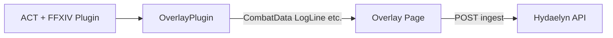

# FFXIV Overlay — Ember Baseline (Hydaelyn Reference)

This document defines the **Ember overlay** as a reference baseline for the Hydaelyn ACT overlay. We replicate its UI/UX and feature list in our stack (Next.js, shadcn) **without copying Ember source**; this doc is the single mapping for editing and feature parity.

---

## 1. Ember feature list

Source: [GoldenChrysus/ffxiv-ember-overlay](https://github.com/GoldenChrysus/ffxiv-ember-overlay) (bleeding-edge), [Ember Overlay site](https://goldenchrysus.github.io/ffxiv/ember-overlay/).

### Display tabs

- **Damage** — DPS table (name, job, DPS, damage %, etc.).
- **Healing** — Healing stats per combatant (HPS, heals, etc.).
- **Tanking** — Tank-related metrics (damage taken, threat, etc.).
- **Raiding** — Raid-wide or encounter-level stats.
- **Aggro** — Aggro / enmity table.
- **Click player** — Click a row to view detailed stats for that player.
- **Encounter title / duration** — Shown at top of parse view.

### Spell timers

- Spell, buff, and DOT timers.
- Optional minimal layout.
- Flexible layout and setup.

### UI and themes

- **Themes**: minimal, light, classic (minimal can combine with any theme).
- **Collapsible** interface to save space.
- **Name blur** for privacy (optional job icon blur).
- **Encounter history** — Browse last N encounters (e.g. 5).
- **Clear encounter** — Reset current encounter data.
- **Load sample data** — For setup/testing without live ACT.

### Quality of life

- **TTS alerts** — Text-to-speech for alerts.
- **Minimize** overlay left or right when not in use.
- **Overlay and data settings** — Persistent settings (theme, blur, timers, etc.).

---

## 2. OverlayPlugin events (for implementation)

The overlay receives data only from **OverlayPlugin** (embedded in ACT or via WSServer). It does **not** call the ACT API directly.

### Event types (ngld OverlayPlugin)

| Event | When | Payload (summary) |
|-------|------|-------------------|
| **CombatData** | Once per second while in combat | `Encounter` (hashtable: title, duration, ENCDPS, etc.), `Combatant` (hashtable: name → combatant data with ENCDPS, damage, healing, job, etc.), `zoneID`. Full field list: load [miniparse_debug.html](https://ngld.github.io/OverlayPlugin/assets/miniparse_debug.html) in an overlay. |
| **LogLine** | Each log line (network format) | `line` (array of split parts), `rawLine` (string). Used for spell/buff/DOT parsing in timers. |
| **ImportedLogLines** | Once per second during log import | `logLines` (array of strings). |
| **ChangeZone** | On login or zone/instance change | `zoneID`. |
| **ChangePrimaryPlayer** | Primary player change | `charID`, `charName`. |
| **OnlineStatusChanged** | Online status change | `target`, `rawStatus`, `status`. |
| **PartyChanged** | Party composition change | `party` (list: id, name, worldId, job, inParty). |

After registering listeners, call **`startOverlayEvents()`** once. Some events (e.g. ChangeZone, ChangePrimaryPlayer) fire immediately with current state.

**Script**: Include [common.min.js](https://ngld.github.io/OverlayPlugin/assets/shared/common.min.js). For browser/OBS, add `?OVERLAY_WS=ws://127.0.0.1:10501/ws` and start WSServer in ACT.

**Hydaelyn**: The overlay loads `common.min.js` in the root layout with `beforeInteractive` so it runs before React, matching Ember-style static load order. In ACT, add the overlay URL as a new overlay tab (same as Ember); CombatData is sent once per second while in combat.

---

## 3. ACT API vs OverlayPlugin (relationship)

- **Overlay** (our page) ↔ **OverlayPlugin** (CEF or WebSocket) ↔ **ACT** (FFXIV plugin, parsers).
- The overlay talks to OverlayPlugin only (`addOverlayListener`, `callOverlayHandler`, `startOverlayEvents`). It does **not** call the ACT .NET API.
- **ACT API** (e.g. `FormActMain`, `AddCombatAction`, `ChangeZone`, `EncDatabase`) is for **C# plugins** that run inside ACT. Use it only when building a companion plugin or local service that reads/writes ACT directly. For the Hydaelyn overlay, treat ACT API as reference only.

---

## 4. Hydaelyn mapping table (Ember → Hydaelyn)

| Ember feature | Hydaelyn equivalent | Notes |
|---------------|---------------------|--------|
| Damage tab | **Parse** tab in `/overlay/act` | DPS table (Name, Job, DPS, Dmg %). |
| Healing tab | **Healing** tab (planned or column set) | Use Combatant healing fields when present. |
| Tanking tab | **Tanking** tab (planned or column set) | Damage taken, threat from Combatant. |
| Raiding tab | **Raiding** tab or combined “Other” | Encounter-level / raid metrics. |
| Aggro tab | **Aggro** tab (planned) | From Combatant enmity/aggro data. |
| Click player for details | **Planned** — modal or slide-out | Component: `player-detail.tsx` (planned). |
| Encounter title/duration | **Parse tab** — encounter title line | Already shown. |
| Spell timers | **Spell timers** (planned) | Requires LogLine listener + parsing. Placeholder in UI. |
| Themes (minimal/light/classic) | **Settings** — theme selector | CSS classes or data-theme on overlay container. |
| Collapsible UI | **Settings** — collapse toggle | Collapse/expand overlay body. |
| Name blur | **Settings** — name blur toggle | CSS filter or replace names. |
| Job icon blur | **Settings** — optional | If job icons added. |
| Encounter history (last N) | **Encounter history** component | Last 5 encounters in state; dropdown to select. |
| Clear encounter | **Clear** button | Reset current encounter display (and optional history). |
| Load sample data | **Load sample** button | Inject fixture CombatData for testing. |
| TTS alerts | **Planned** | Browser TTS; settings for which alerts. |
| Minimize left/right | **Minimize** controls | Buttons to collapse overlay to strip on L or R. |
| Overlay/data settings | **Settings** tab | Token, theme, blur, WSServer hint, future: TTS, timers. |
| Ingest to backend | **Ingest** tab | POST to `/api/ingest/combat`; status and “last sent”. |

---

## 5. Optional references (temp/OverlayPlugin, temp/cactbot)

If **temp/OverlayPlugin** or **temp/cactbot** are added to the repo (or path is confirmed), use them for:

- **OverlayPlugin**: Event schemas, WSServer behavior, handler signatures (`callOverlayHandler`).
- **Cactbot**: Encounter IDs, trigger/timeline patterns — for spell timers and encounter history alignment (e.g. zoneID ↔ encounter name).

Until then, this doc and the overlay rely on:

- [ngld OverlayPlugin devs](https://ngld.github.io/OverlayPlugin/devs/) and [Event Types](https://ngld.github.io/OverlayPlugin/devs/event_types.html).
- [Ember overlay](https://github.com/GoldenChrysus/ffxiv-ember-overlay) (public).
- [ACT API](https://advancedcombattracker.com/apidoc/) (reference for companion/plugin work).

---

## 6. Implementation location

- **Overlay route**: [apps/hydaelyn/app/overlay/act/](apps/hydaelyn/app/overlay/act/).
- **Page**: `page.tsx` (client component; composes tabs and components).
- **Components**: Add under `app/overlay/act/components/` (e.g. `parse-tab.tsx`, `healing-tab.tsx`, `overlay-settings.tsx`, `encounter-history.tsx`).
- **Types**: [apps/hydaelyn/types/overlay-plugin.d.ts](apps/hydaelyn/types/overlay-plugin.d.ts) — extend for LogLine, ChangeZone if needed.
- **UI**: Reuse [apps/hydaelyn/components/ui/](apps/hydaelyn/components/ui/) (Tabs, Table, Button, Input, etc.).
