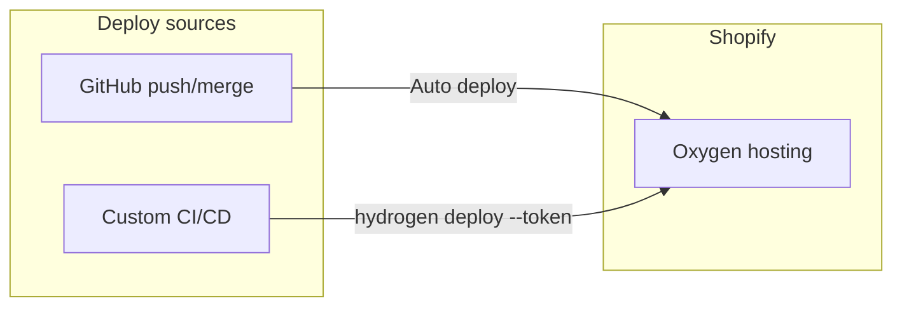

# Oxygen Deployments for MNKY VERSE – How It Works, Setup, and Relevance

## What the screenshot shows

The screenshot is **Shopify Admin → Sales channels → Hydrogen → MNKY VERSE → Storefront settings → Oxygen deployments**. It has two main parts:

1. **Git repository** – The repo `MOODMNKY-LLC/mood-mnky-command` is connected. Shopify can auto-deploy when you push (or merge) to the connected branch and can post **deployment preview links** on pull requests. You can restrict those links to staff only or "anyone with the link".
2. **Oxygen deployment tokens** – A table lists tokens (e.g. "Default", valid until Feb 16, 2027) with origin "CLI" / "GitHub". These tokens are used to deploy to **Oxygen** (Shopify's hosting for Hydrogen) from outside the built-in GitHub integration—e.g. custom CI/CD or other Git hosts.

So: **Git** = automatic deploys and PR previews from GitHub; **Tokens** = deploy from any system (Bitbucket, GitLab, CircleCI, or your own scripts) using the Hydrogen CLI.

---

## How Oxygen deployments work



- **Built-in GitHub path:** When the repo is connected, Shopify watches the configured branch. Pushes (or merges) trigger a build and deploy to Oxygen. If "Comment on pull requests with deployment preview links" is on, Shopify posts a preview URL on each PR.
- **Custom CI/CD path:** You run `npx shopify hydrogen deploy --token $SHOPIFY_HYDROGEN_DEPLOYMENT_TOKEN` in your pipeline. The token is created in this same "Oxygen deployment tokens" section and stored as a secret in your CI (e.g. GitHub Actions, GitLab, Bitbucket, CircleCI). See [Shopify: Deploy from any CI/CD system with deployment tokens](https://shopify.dev/docs/custom-storefronts/hydrogen/deployments/custom-ci-cd).

The **deploy** command expects a **Hydrogen (Remix)** project that the Hydrogen CLI can build and upload to Oxygen. It does not deploy an arbitrary Next.js app; Oxygen is for Hydrogen storefronts.

---

## How to set it up

### Option A – Use the existing Git connection (already in your screenshot)

- Repo is already connected; ensure the correct branch is selected and that "Comment on pull requests with deployment preview links" and "Who can view" are set as you want.
- Pushes to the connected branch (and optionally PRs) will trigger Oxygen builds. No extra setup unless you need a different branch or preview visibility.

### Option B – Custom CI/CD with a deployment token

1. **Create a token (if you need one besides Default):** In the same "Oxygen deployments" page, under "Oxygen deployment tokens", click **Create new token**. Name it (e.g. "GitLab" or "Staging"). Copy the value once; it won't be shown again.
2. **Store the token in your CI:** Add a secret/env var named **`SHOPIFY_HYDROGEN_DEPLOYMENT_TOKEN`** (exact name) in your CI (e.g. GitHub Actions secrets, GitLab CI/CD variables, Bitbucket pipeline variables). Mark it secret/masked.
3. **Run deploy in your pipeline:** After install and build, run:

   ```bash
   npm ci
   npx shopify hydrogen deploy --token $SHOPIFY_HYDROGEN_DEPLOYMENT_TOKEN
   ```

   The docs give examples for [Bitbucket](https://shopify.dev/docs/custom-storefronts/hydrogen/deployments/custom-ci-cd#bitbucket), [GitLab](https://shopify.dev/docs/custom-storefronts/hydrogen/deployments/custom-ci-cd#gitlab), and [CircleCI](https://shopify.dev/docs/custom-storefronts/hydrogen/deployments/custom-ci-cd#circleci).

**Important:** This flow only works for a **Hydrogen (Remix)** app. The CLI runs the Hydrogen build and uploads the result to Oxygen. There is no "deploy Next.js to Oxygen" via this command.

---

## Why this is useful for a Hydrogen headless storefront

- **Single place for storefront config:** The MNKY VERSE storefront in Shopify (Environments and variables, Storefront API, Customer Account API, Oxygen deployments) stays the source of truth for credentials and deploy targets.
- **Automation:** Either GitHub auto-deploy or custom CI/CD gives you "push → build → deploy" without manual steps.
- **Preview environments:** PR preview links let you test changes before merging; "staff only" keeps them private.
- **Flexibility:** If you use GitLab, Bitbucket, or your own pipeline, tokens let you deploy to the same Oxygen storefront without using Shopify's GitHub integration.
- **Oxygen hosting:** Low-friction, Shopify-optimized hosting (CDN, scaling) for Hydrogen apps.

So for a **Hydrogen (Remix) headless storefront**, this screen is the control center for how that storefront gets to Oxygen.

---

## How this relates to mood-mnky-command (this repo)

**This repo is a Next.js app deployed on Vercel**, not a Hydrogen (Remix) app deployed to Oxygen:

- Build is `next build`; deploy target is Vercel ([README](../README.md), [package.json](../package.json)).
- The app uses **@shopify/hydrogen-react** for Storefront API and cart (e.g. [lib/shopify/storefront-client.ts](../lib/shopify/storefront-client.ts), [components/verse/verse-providers.tsx](../components/verse/verse-providers.tsx)) and talks to the **MNKY VERSE** Hydrogen storefront in Shopify (Storefront API, Customer Account API). So "Hydrogen" here means the **storefront configuration and APIs** in Shopify, not "we deploy this codebase to Oxygen."

**Implications:**

- The **Oxygen deployments** screen you opened is for the **MNKY VERSE** storefront entity in Shopify. The connected repo is mood-mnky-command, but **Oxygen's auto-deploy and `hydrogen deploy` only work for a Hydrogen (Remix) project**. This codebase does not have a Hydrogen CLI build or `shopify hydrogen deploy` in scripts or CI, so nothing in this repo is currently being deployed to Oxygen.
- You can **leave the Git connection as-is** for future use (e.g. if you ever add a Hydrogen (Remix) app in this or another repo that should deploy to MNKY VERSE). The **Default** token is there for CLI or custom CI if you need it later.
- For **current** deployment of the MNKY VERSE storefront (Next.js), you continue using **Vercel**; no change is required on the Oxygen deployments page for that.

**Summary:** The screenshot explains how Oxygen deployments work and how to set them up for a Hydrogen headless storefront. For mood-mnky-command specifically, the app is Next.js on Vercel; Oxygen deploy would only become relevant if you introduce a Hydrogen (Remix) build and run `shopify hydrogen deploy` (from this repo or another) targeting the MNKY VERSE storefront.
