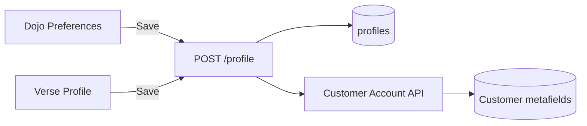

# Shopify Customer Metafields – Shopper Profile Sync

This document describes the customer metafields used to sync shopper profile data from MNKY Verse/Dojo (Supabase) to Shopify. Metafields enable checkout personalization, email flows, and storefront targeting based on shopper preferences.

## Architecture Overview

- **Source of truth:** Supabase `profiles` table
- **Sync target:** Shopify Customer metafields via Customer Account API
- **Trigger points:**
  - Dojo Preferences → “Save & sync to Shopify”
  - Verse Profile → save (when Shopify linked)

## Metafield Definitions

All definitions use namespace `custom` (store-level, non-app-owned). Access:

- `access.customerAccount: "READ_WRITE"` – so the Customer Account API can read/write
- `access.admin: "MERCHANT_READ"` – so merchants can view in Shopify Admin

| Namespace | Key                   | Type                   | Purpose                               |
| --------- | --------------------- | ---------------------- | ------------------------------------- |
| custom    | nickname              | single_line_text_field | Preferred display name (vs firstName) |
| custom    | bio                   | multi_line_text_field  | Short bio for personalization         |
| custom    | fragrance_preferences | json                   | Scent preferences (e.g. top notes)    |
| custom    | verse_handle          | single_line_text_field | @handle from Verse profile            |

## Supabase ↔ Metafield Mapping

| Supabase `profiles` | Shopify metafield   | Notes                                |
| -------------------- | ------------------- | ------------------------------------ |
| `display_name`       | `custom.nickname`   | Nickname for checkout/emails          |
| `bio`                | `custom.bio`        | Bio for personalization              |
| `handle`             | `custom.verse_handle` | @handle for Verse identity         |
| `profiles.preferences.favorite_notes` | `custom.fragrance_preferences` | JSON; favorite notes + saved blends summary |

## Setup

### 1. Create metafield definitions

Run the Admin API script once per store:

```bash
cd apps/web && npm run shopify:setup-customer-metafields
```

This calls `ensureCustomerMetafieldDefinitions()` in `lib/shopify-admin-graphql.ts`. Requires Admin API token with `write_metafield_definitions`.

### 2. Verify Customer Account API scopes

The Hydrogen channel (or headless Customer Account API client) must have:

- `customer_write_customers` – for `metafieldsSet` writes

Check in Shopify Admin → Apps → Your app → API access.

## API

### GET `/api/customer-account-api/profile`

Returns for the current session:

- `linked`: boolean – whether Shopify account is linked
- `needsReconnect`: boolean – whether token is invalid/expired
- `customer`: `{ id, displayName, email }` – Shopify customer
- `metafields`: `{ nickname?, bio?, fragrance_preferences?, verse_handle? }`

Used by Dojo preferences to prefill and show sync status.

### POST `/api/customer-account-api/profile`

Syncs profile data to Supabase and Shopify metafields.

**Body:** `{ nickname?, bio?, verse_handle?, fragrance_preferences? }`

**Requirements:**

- Authenticated (Supabase session)
- Shopify account linked (valid access token in cookie)

**Flow:**

1. Validate and update Supabase `profiles` (display_name, bio, handle)
2. Set `profiles.shopify_metafields_synced_at`
3. Call `metafieldsSet` via Customer Account API

## Sync Flow



## Verification

1. Run `shopify:setup-customer-metafields`; confirm definitions in **Settings → Custom data**
2. Link Shopify account in Verse; open **Dojo → Preferences**; edit nickname, save
3. In **Shopify Admin → Customers → [customer] → Metafields**, confirm `custom.nickname`
4. Unlink and re-link; confirm metafields can be re-synced from Supabase

## Dependencies

- Shopify Admin API token with `write_metafield_definitions`
- Customer Account API scopes on Hydrogen channel: `customer_write_customers`
- [Protected Customer Data](https://shopify.dev/docs/apps/launch/protected-customer-data) – verify if needed for your region

## Implemented Augmentations

1. **Wishlist metafield** (`custom.wishlist`) – JSON array of product/variant GIDs. Add via Verse product page "Add to wishlist" or Dojo preferences. API: `POST /api/customer-account-api/wishlist` with `{ action: "add"|"remove", gid }`.

2. **Size preferences metafield** (`custom.size_preferences`) – JSON: `{ clothing?, candle?, soap? }`. Dojo preferences: size dropdowns for clothing, candle, soap.

3. **Scent personality** (`custom.scent_personality`) – Create a reusable metaobject (e.g. “Scent Personality”) and link customers via `metaobject_reference` metafield. Blending Lab or funnel could assign a “designer profile” (e.g. “Gourmand Explorer”, “Woodsy Adventurer”) for segmentation and product suggestions.

4. **Bidirectional sync** – `POST /api/customer-account-api/profile/pull` fetches metafields from Shopify and updates Supabase. "Pull from Shopify" button in Dojo preferences.

5. **Sync conflict resolution** – `GET /api/customer-account-api/profile?compare=1` returns `hasConflict` and `conflicts`. Dojo shows conflict banner when detected. “Shopify has newer bio — overwrite?”) and support manual “pull from Shopify” to update Supabase from metafields when the merchant has edited customer data in Admin.
