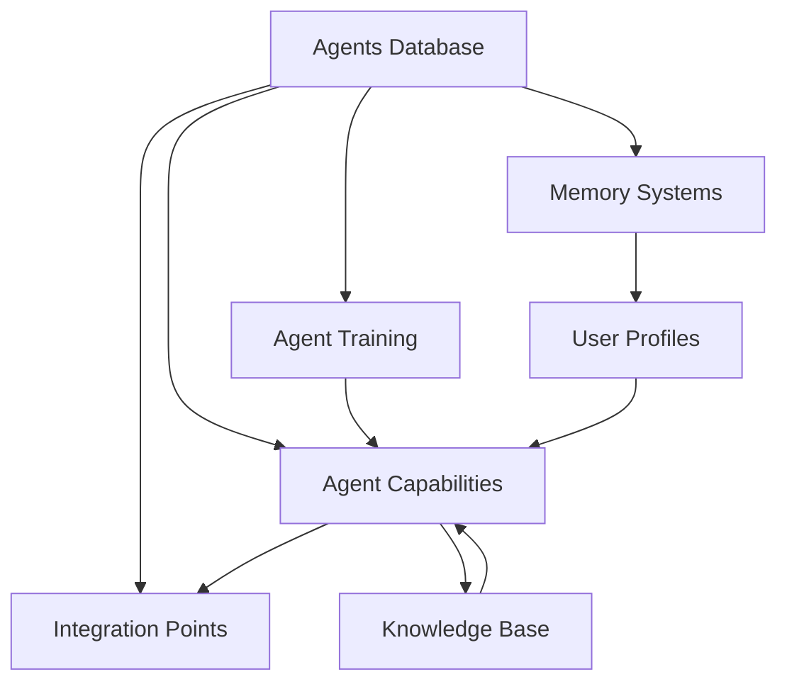

# Agent Database System

The MOOD MNKY agent system is powered by a sophisticated network of interconnected databases that store and manage all aspects of agent functionality. This modular database architecture follows a first-principles approach to agent design, with clear separation of concerns between agent identities, capabilities, knowledge sources, memory systems, and integration points.

## System Architecture

The system consists of seven specialized databases:

<CardGroup cols={2}>
  <Card title="Agents Database" icon="user-robot" href="/agents/agent-database/agents">
    Core identity and characteristics of each agent, including personality traits, communication styles, and archetypes
  </Card>
  <Card title="Agent Capabilities" icon="bolt" href="/agents/agent-database/capabilities">
    Technical and functional capabilities of each agent, with implementation details and performance metrics
  </Card>
  <Card title="Integration Points" icon="plug" href="/agents/agent-database/integration-points">
    Connection points with other systems, including API specifications and data exchange formats
  </Card>
  <Card title="Knowledge Base" icon="brain" href="/agents/agent-database/knowledge-base">
    Information sources powering agent capabilities, with indexing mechanisms and update frequencies
  </Card>
  <Card title="Memory Systems" icon="memory" href="/agents/agent-database/memory-systems">
    Agent memory architecture enabling context retention, with storage mechanisms and retrieval strategies
  </Card>
  <Card title="User Profiles" icon="user" href="/agents/agent-database/user-profiles">
    User preference data enabling personalization across all agent interactions
  </Card>
  <Card title="Agent Training" icon="graduation-cap" href="/agents/agent-database/training">
    Training methodologies, data sources, and performance metrics for agent improvement
  </Card>
</CardGroup>

## Database Relationships

The power of this system comes from the relationships between databases:

## Implementation in Notion

The agent database system is implemented in Notion, providing:

- **Centralized Management**: All agent information managed in one workspace
- **Real-time Collaboration**: Multiple team members can update simultaneously
- **Automated Integration**: Changes sync with production systems via n8n workflows
- **Version History**: Complete history of agent development and changes
- **Rich Media Support**: Documentation with images, videos, and interactive elements
- **Customizable Views**: Different perspectives for different stakeholders

## Using This Documentation

Each database has its own dedicated page in this documentation, covering:

- **Purpose and Role**: What the database stores and why it's important
- **Schema and Structure**: Data model, fields, and relationships
- **Integration Details**: How it connects with other databases
- **Usage Examples**: Common queries and operations
- **Best Practices**: Guidelines for maintaining and extending

For implementation details, developer guides, and technical reference, see the [Developer Guide](/agents/developer-guide).
