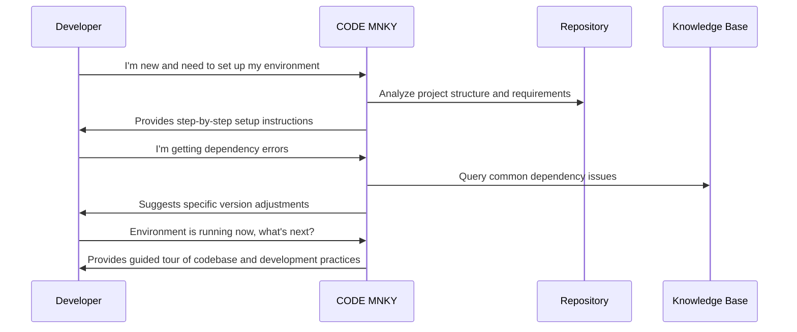
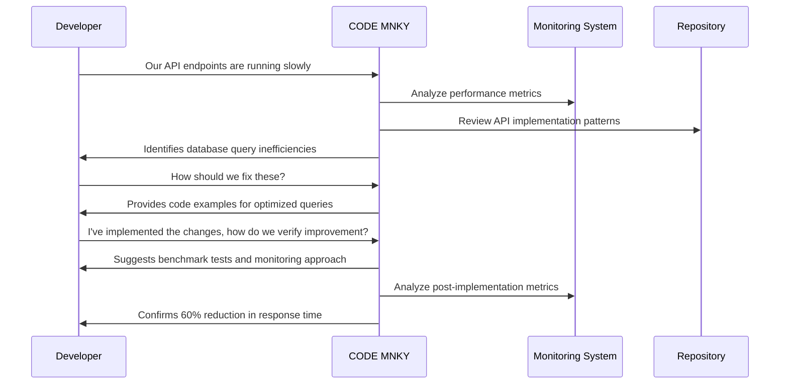

# CODE MNKY Capabilities

The CODE MNKY agent provides a sophisticated set of technical capabilities focused on development support, infrastructure management, and system optimization. This document details the technical features that power these development experiences.

## Core Capabilities

### Code Analysis and Generation

CODE MNKY employs advanced code analysis capabilities to understand and generate high-quality code:

- **Pattern recognition** for identifying code structures and design patterns
- **Static analysis** to detect potential bugs, vulnerabilities, and code smells
- **Type inference** for enhanced type safety in loosely typed contexts
- **Code suggestion** based on context and project patterns
- **Refactoring recommendations** for maintainable, efficient code

### Infrastructure Management

A comprehensive suite of capabilities for monitoring and optimizing system infrastructure:

- **Performance monitoring** across application components
- **Resource utilization analysis** for cost optimization
- **Scalability assessment** to identify potential bottlenecks
- **Deployment pipeline evaluation** for CI/CD optimization
- **Infrastructure-as-code validation** for best practices

### Documentation Intelligence

Sophisticated capabilities for managing technical documentation:

- **Documentation generation** from code and comments
- **Documentation gap analysis** to identify missing information
- **Knowledge graph construction** for connected technical information
- **Audience-appropriate content adaptation** for different technical levels
- **Consistency validation** across documentation resources

### Development Environment Optimization

Tools to improve developer experience and productivity:

- **Environment setup automation** for consistent onboarding
- **Dependency management** and optimization
- **Tool configuration and optimization** for development workflows
- **IDE integration** for context-aware assistance
- **Development process streamlining** through customized automation

### Testing and Quality Assurance

Capabilities for ensuring robust, reliable code:

- **Test coverage analysis** to identify untested code paths
- **Test strategy recommendations** based on project context
- **Automated test generation** for common patterns
- **Quality metric tracking** across the development lifecycle
- **Regression risk assessment** for proposed changes

## Integration Points

<CardGroup cols={2}>
  <Card title="GitHub Integration" icon="github">
    

      
The agent connects with GitHub to provide:

      <ul className="list-disc pl-5">
        <li>Pull request analysis and recommendations</li>
        <li>Code review assistance</li>
        <li>CI/CD workflow optimization</li>
        <li>Repository structure assessment</li>
      </ul>
    

  </Card>
  
  <Card title="Development Tools" icon="tools">
    

      
Integration with development tooling enables:

      <ul className="list-disc pl-5">
        <li>IDE-specific recommendations</li>
        <li>Build system optimization</li>
        <li>Package manager configuration</li>
        <li>Linter and formatter customization</li>
      </ul>
    

  </Card>
  
  <Card title="Monitoring Systems" icon="chart-line">
    

      
Connection to monitoring platforms for:

      <ul className="list-disc pl-5">
        <li>Performance data analysis</li>
        <li>Alert pattern recognition</li>
        <li>System health assessment</li>
        <li>Trend identification and forecasting</li>
      </ul>
    

  </Card>
  
  <Card title="Documentation Systems" icon="book">
    

      
Integration with documentation platforms for:

      <ul className="list-disc pl-5">
        <li>Automated docs generation and maintenance</li>
        <li>Technical content organization</li>
        <li>API reference management</li>
        <li>Documentation quality assessment</li>
      </ul>
    

  </Card>
</CardGroup>

## Capability Levels

The CODE MNKY agent capabilities are organized into progressive levels:

<Steps>
  <Step title="Foundation">
    Basic code analysis, documentation generation, and system monitoring capabilities. Available to all developers without special access.
  </Step>
  <Step title="Enhanced">
    Improved code generation, performance optimization recommendations, and infrastructure analysis. Available to registered team members.
  </Step>
  <Step title="Advanced">
    Sophisticated architecture analysis, predictive performance modeling, and automated technical documentation generation. Available to senior developers and architects.
  </Step>
  <Step title="Enterprise">
    Full system optimization, custom integration with proprietary systems, and advanced project lifecycle management. Available for enterprise implementations.
  </Step>
</Steps>

## Use Case Examples

### Development Environment Setup

### Performance Optimization

## Technical Implementation

### API Endpoints

The CODE MNKY agent exposes several API endpoints for integration:

| Endpoint | Description | Authentication |
|----------|-------------|----------------|
| `/code-mnky/analyze` | Code analysis endpoint | Required |
| `/code-mnky/optimize` | Performance optimization recommendations | Required |
| `/code-mnky/document` | Documentation generation | Required |
| `/code-mnky/test` | Test strategy and generation | Required |
| `/code-mnky/environment` | Development environment management | Required |

### Event Subscriptions

The agent subscribes to the following system events:

- `repository.push` - Triggered when code is pushed to a repository
- `pull_request.created` - Triggered when a new PR is created
- `build.completed` - Triggered when a build completes
- `test.completed` - Triggered when tests finish running
- `deployment.completed` - Triggered when a deployment finishes

### Data Models

Key data models used by the CODE MNKY agent:

- `CodebaseModel` - Representation of project structure and patterns
- `PerformanceProfile` - Performance characteristics and benchmarks
- `DeveloperEnvironment` - Development setup and configuration
- `DocumentationMap` - Documentation coverage and organization
- `SystemArchitecture` - System components and relationships

## Performance and Limitations

### Response Times

- Average analysis time: 1.2s
- 95th percentile: 2.5s
- Maximum allowed for complex analysis: 5s

### Concurrency

- Standard tier: 30 concurrent analyses
- Advanced tier: 100 concurrent analyses
- Enterprise tier: Customizable

### Analysis Limitations

- Maximum codebase size: 1M lines of code
- Language support: TypeScript, JavaScript, Python, Java, Go, Ruby, C#
- Maximum single file analysis: 10,000 lines
- Integration support: GitHub, GitLab, Bitbucket, Azure DevOps

## Future Capabilities

The CODE MNKY agent roadmap includes:

- **Architecture visualization** with interactive diagrams and recommendations
- **Automated code migration** assistance for framework and language upgrades
- **Security vulnerability detection** with remediation guidance
- **Cross-repository dependency analysis** for complex systems
- **Natural language to code** generation for rapid prototyping

  <h3>Implementation Resources</h3>
  
For developer resources on working with CODE MNKY capabilities, refer to:

  <ul>
    <li><a href="/agents/developer-guide">Agent Developer Guide</a></li>
    <li><a href="/agents/code-mnky/api-hooks">CODE MNKY API Hooks</a></li>
    <li><a href="/agents/agent-schema-reference">Agent Schema Reference</a></li>
  </ul>

