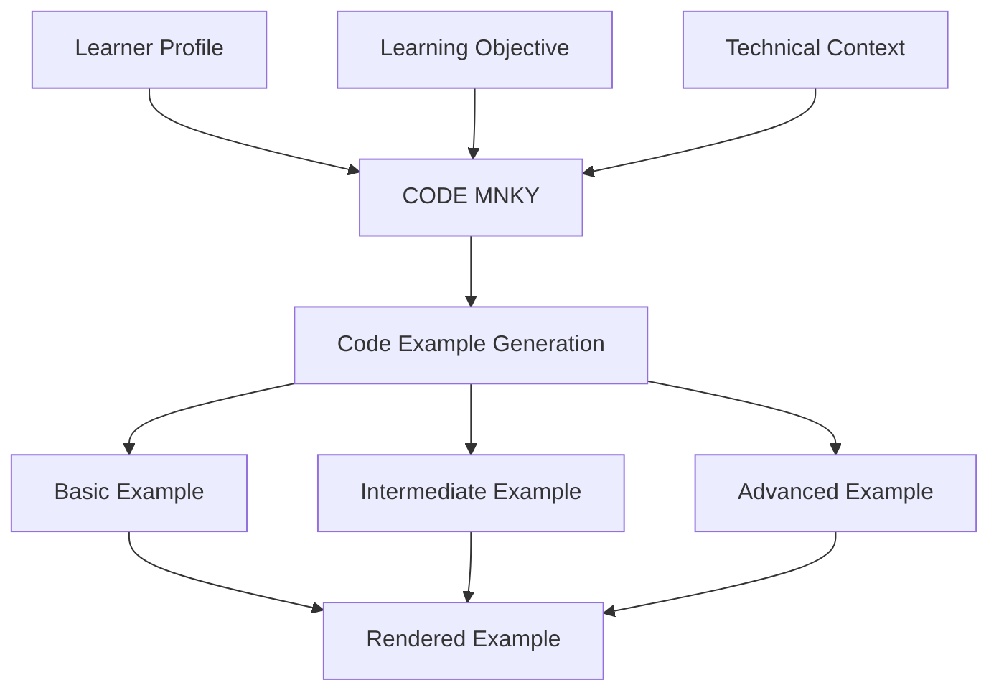
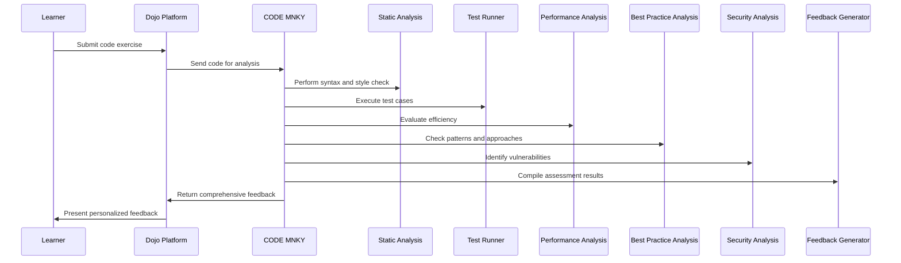
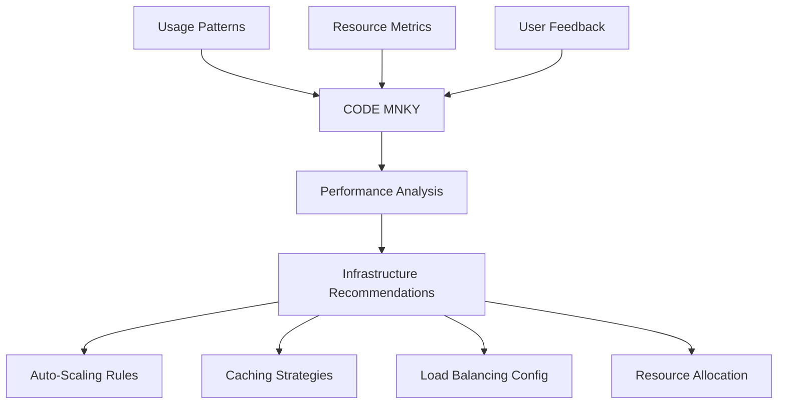

# CODE MNKY Dojo Integration

<div className="code-mnky-section p-4 rounded-lg mb-6">
The CODE MNKY agent integrates with the Dojo platform to provide technical development support, learning assistance, and infrastructure optimization. This document details how developers can leverage CODE MNKY capabilities within the Dojo learning environment.
</div>

## Integration Overview

The Dojo platform serves as MOOD MNKY's personalized learning and development environment. CODE MNKY enhances the technical aspects of this platform by:

1. **Supporting technical learning** with code examples and explanations
2. **Optimizing development environments** for learning exercises
3. **Providing automated code review** for learning exercises
4. **Generating technical documentation** for educational content
5. **Maintaining infrastructure** for the Dojo platform itself

## Key Integration Points

<CardGroup cols={2}>
  <Card title="Learning Materials" icon="code">
    <div className="space-y-2">
      <p>CODE MNKY enhances technical learning content with:</p>
      <ul className="list-disc pl-5">
        <li>Interactive code examples that adapt to skill level</li>
        <li>Technical explanations with appropriate depth</li>
        <li>Best practice highlighting and explanations</li>
        <li>Language-specific nuances and insights</li>
      </ul>
    </div>
  </Card>
  
  <Card title="Exercise Environments" icon="laptop-code">
    <div className="space-y-2">
      <p>For practical learning exercises, CODE MNKY provides:</p>
      <ul className="list-disc pl-5">
        <li>Pre-configured development environments</li>
        <li>Consistent setup across platforms</li>
        <li>Project scaffolding for exercises</li>
        <li>Dependency management and troubleshooting</li>
      </ul>
    </div>
  </Card>
  
  <Card title="Code Assessment" icon="clipboard-check">
    <div className="space-y-2">
      <p>For evaluating learner code, CODE MNKY offers:</p>
      <ul className="list-disc pl-5">
        <li>Automated code analysis and feedback</li>
        <li>Progress tracking against technical objectives</li>
        <li>Personalized improvement suggestions</li>
        <li>Security and performance evaluation</li>
      </ul>
    </div>
  </Card>
  
  <Card title="Platform Infrastructure" icon="server">
    <div className="space-y-2">
      <p>Behind the scenes, CODE MNKY manages:</p>
      <ul className="list-disc pl-5">
        <li>Dojo platform deployment optimization</li>
        <li>Scaling resources based on learning needs</li>
        <li>Development environment provisioning</li>
        <li>Technical monitoring and alerting</li>
      </ul>
    </div>
  </Card>
</CardGroup>

## Technical Learning Support

CODE MNKY enhances the technical learning experience within Dojo through several specialized capabilities:

### Adaptive Code Examples

CODE MNKY dynamically adjusts code examples based on the learner's skill level and learning goals:



The agent maintains a model of each learner's:

- **Technical proficiency** across different languages and frameworks
- **Conceptual understanding** of programming concepts
- **Learning style preferences** for code examples
- **Project interests** for contextually relevant examples
- **Common mistakes** to provide targeted guidance

### Interactive Coding Environments

CODE MNKY powers the interactive development environments used for hands-on learning:

```typescript
// Example environment configuration for a React learning module
const learningEnvironment = {
  technology: "react",
  skillLevel: "intermediate",
  exerciseType: "component_development",
  supportLevel: "guided",
  codeMnkyConfig: {
    // CODE MNKY specific configuration
    assistanceLevel: "hints",  // hints, solutions, or real-time
    analysisFeatures: ["syntax", "best_practices", "performance"],
    interactiveElements: ["code_completion", "error_explanation"],
    generateTests: true,
    provideFeedback: true
  }
};
```

These environments include:

- **Pre-configured setup** with necessary dependencies
- **Scaffolded projects** with the right structure for learning
- **Integrated testing** to validate solutions
- **Real-time feedback** on code quality and approach
- **Contextual hints** when learners get stuck

## Technical Documentation Generation

CODE MNKY automatically generates and maintains documentation for technical content within the Dojo platform:

### API Documentation

For Dojo platform APIs and learning exercises, CODE MNKY generates comprehensive documentation:

```tsx
import { useCodeMnkyDocs } from '@repo/code-mnky-hooks';

function APIDocumentationComponent({ apiId, audienceLevel }) {
  const {
    documentation,
    isLoading,
    examples,
    interactive,
    generateCustomExample
  } = useCodeMnkyDocs({
    entityType: 'api',
    entityId: apiId,
    level: audienceLevel,
    includeExamples: true
  });
  
  return (
    <div className="api-documentation">
      <h2>{documentation.name}</h2>
      <p className="description">{documentation.description}</p>
      
      <div className="endpoint-details">
        <EndpointMethod method={documentation.method} />
        <EndpointPath path={documentation.path} />
      </div>
      
      <div className="parameters">
        <h3>Parameters</h3>
        <ParameterTable parameters={documentation.parameters} />
      </div>
      
      <div className="response">
        <h3>Response</h3>
        <ResponseSchema schema={documentation.responseSchema} />
      </div>
      
      <div className="examples">
        <h3>Examples</h3>
        {examples.map(example => (
          <CodeExample
            key={example.id}
            language={example.language}
            code={example.code}
            description={example.description}
          />
        ))}
        
        <div className="custom-example">
          <h4>Try with your own parameters</h4>
          <ParameterForm 
            schema={documentation.parameters}
            onSubmit={(params) => generateCustomExample(params)}
          />
          {interactive.customExample && (
            <CodeExample
              language="javascript"
              code={interactive.customExample}
              runnable={true}
            />
          )}
        </div>
      </div>
    </div>
  );
}
```

### Architecture Documentation

CODE MNKY creates and maintains architectural documentation for technical learning modules:

```typescript
// Example architecture documentation generation
const architectureDoc = await codeMnkyClient.generateArchitectureDoc({
  projectType: 'e-commerce',
  technologiesUsed: ['react', 'node', 'mongodb'],
  audienceSkillLevel: 'intermediate',
  includeComponents: true,
  includeDiagrams: true,
  focusAreas: ['data-flow', 'authentication', 'deployment']
});
```

This documentation includes:

- **System diagrams** showing component relationships
- **Data flow visualizations** for understanding application logic
- **Deployment architecture** explanations and diagrams
- **Component hierarchies** for frontend applications
- **Database schema** documentation and relationship diagrams

## Code Assessment and Feedback

CODE MNKY provides automated assessment for coding exercises in the Dojo platform:

### Code Analysis Pipeline



The assessment includes:

- **Functional correctness** verification through test cases
- **Code quality** evaluation against industry standards
- **Performance analysis** with optimization suggestions
- **Security vulnerability** detection and remediation guidance
- **Best practice** recommendations relevant to skill level

### Personalized Feedback Delivery

CODE MNKY tailors feedback based on the learner's profile and learning path:

```tsx
import { useCodeMnkyFeedback } from '@repo/code-mnky-hooks';

function CodeFeedbackComponent({ submissionId, userId }) {
  const {
    feedback,
    isLoading,
    codeQuality,
    detailedIssues,
    suggestedFixes,
    applyFix
  } = useCodeMnkyFeedback({
    submissionId,
    userId
  });
  
  return (
    <div className="code-feedback">
      <div className="summary">
        <h2>Code Assessment</h2>
        <FeedbackSummary
          passing={feedback.passing}
          score={feedback.score}
          highlightAreas={feedback.highlightAreas}
        />
      </div>
      
      <div className="quality-metrics">
        <h3>Code Quality</h3>
        <QualityGraph metrics={codeQuality} />
      </div>
      
      <div className="issues">
        <h3>Areas for Improvement</h3>
        {detailedIssues.map(issue => (
          <IssueCard 
            key={issue.id}
            title={issue.title}
            description={issue.description}
            lineNumbers={issue.lineNumbers}
            severity={issue.severity}
            hasSuggestion={issue.hasSuggestion}
            onViewSuggestion={() => selectIssue(issue.id)}
          />
        ))}
      </div>
      
      {selectedIssue && (
        <div className="suggested-fix">
          <h3>Suggested Solution</h3>
          <CodeDiff
            original={suggestedFixes[selectedIssue].original}
            suggested={suggestedFixes[selectedIssue].suggested}
          />
          <button onClick={() => applyFix(selectedIssue)}>
            Apply This Fix
          </button>
          <button onClick={() => requestExplanation(selectedIssue)}>
            Explain This Fix
          </button>
        </div>
      )}
      
      <div className="next-steps">
        <h3>Next Steps</h3>
        <LearningRecommendations recommendations={feedback.nextSteps} />
      </div>
    </div>
  );
}
```

## Development Environment Management

CODE MNKY provides and manages development environments for technical learning:

### Environment Provisioning

```typescript
// Example environment provisioning request
const environment = await codeMnkyClient.provisionEnvironment({
  learningModule: 'full-stack-development',
  technologies: ['react', 'express', 'mongodb'],
  learnerSkillLevel: 'beginner',
  setupType: 'guided',
  resourceRequirements: {
    cpu: 'standard',
    memory: 'medium',
    storage: 'basic',
    duration: '4hours'
  }
});

// Returns details for connecting to the environment
// {
//   accessUrl: 'https://env-12345.dojo.moodmnky.com',
//   credentials: { username: 'learner', password: 'temporary-password' },
//   vscodeUrl: 'vscode://dojo-remote/env-12345',
//   expirationTime: '2023-07-15T16:30:00Z',
//   resourceIds: { containerId: 'cont_12345', projectId: 'proj_6789' }
// }
```

These environments are:

- **Pre-configured** with all necessary dependencies
- **Isolated** for security and consistency
- **Resource-appropriate** based on exercise requirements
- **Time-limited** to manage platform resources
- **Persistent** across sessions until completion

### IDE Integration

CODE MNKY integrates with various IDEs to enhance the learning experience:

```tsx
import { useCodeMnkyIDE } from '@repo/code-mnky-hooks';

function IntegratedIDEComponent({ exerciseId, userId }) {
  const {
    ideInstance,
    isLoading,
    currentFile,
    fileTree,
    openFile,
    saveFile,
    runCode,
    testCode,
    terminalOutput,
    codeAssistance,
    toggleAssistance
  } = useCodeMnkyIDE({
    exerciseId,
    userId,
    persistent: true
  });
  
  return (
    <div className="integrated-ide">
      <div className="ide-header">
        <h2>{ideInstance.exerciseName}</h2>
        <div className="controls">
          <button onClick={runCode}>Run Code</button>
          <button onClick={testCode}>Run Tests</button>
          <button onClick={toggleAssistance}>
            {codeAssistance.enabled ? 'Disable' : 'Enable'} Assistance
          </button>
        </div>
      </div>
      
      <div className="ide-layout">
        <div className="file-explorer">
          <FileTree 
            files={fileTree} 
            onSelectFile={(filePath) => openFile(filePath)}
            currentFile={currentFile}
          />
        </div>
        
        <div className="editor-container">
          <CodeEditor
            file={currentFile}
            content={currentFile.content}
            onChange={(content) => saveFile(currentFile.path, content)}
            language={currentFile.language}
            assistance={codeAssistance}
          />
        </div>
        
        <div className="output-panel">
          <h3>Output</h3>
          <Terminal output={terminalOutput} />
        </div>
      </div>
    </div>
  );
}
```

## Technical Curriculum Development

CODE MNKY assists in the creation and maintenance of technical curriculum:

### Curriculum Generation Assistance

```typescript
// Example curriculum generation
const curriculumOutline = await codeMnkyClient.generateCurriculum({
  subject: 'Modern JavaScript Development',
  audienceLevel: 'intermediate',
  duration: '8weeks',
  learningGoals: [
    'Understand ES6+ features and usage',
    'Build applications with modern frameworks',
    'Implement effective testing strategies',
    'Optimize for performance and accessibility'
  ],
  includeExercises: true,
  includeAssessments: true,
  technologies: ['javascript', 'react', 'jest', 'webpack']
});
```

The generated curriculum includes:

- **Module structure** with logical progression
- **Learning objectives** for each module
- **Practical exercises** with varying difficulty levels
- **Knowledge assessments** to validate understanding
- **Resource recommendations** for additional learning

### Exercise Generation

CODE MNKY creates targeted coding exercises for specific learning goals:

```typescript
// Generate an exercise for a specific concept
const exercise = await codeMnkyClient.generateExercise({
  concept: 'state management in React',
  difficulty: 'intermediate',
  exerciseType: 'implementation',
  constraints: {
    timeToComplete: '30minutes',
    prerequisites: ['basic-react', 'javascript-fundamentals'],
    focusAreas: ['hooks', 'context-api']
  },
  includeTests: true,
  includeSolution: true
});

// Returns a complete exercise package:
// {
//   instructions: '# State Management Exercise\n\nIn this exercise...',
//   starterCode: { 'src/App.js': '...', 'src/components/Counter.js': '...' },
//   tests: { 'src/__tests__/Counter.test.js': '...' },
//   solutionCode: { 'src/App.js': '...', 'src/components/Counter.js': '...' },
//   hints: ['Try using the useState hook for...', 'Remember that context...'],
//   learningResources: [{ title: 'React State Management', url: '...' }, ...]
// }
```

## Platform Infrastructure Support

CODE MNKY provides infrastructure support for the Dojo platform itself:

### Performance Optimization



The agent continually optimizes:

- **Server resource allocation** based on learning patterns
- **Database performance** for content delivery
- **Caching strategies** for frequently accessed content
- **Network optimization** for global learners
- **CDN configuration** for media and interactive elements

### Monitoring and Alerts

CODE MNKY maintains comprehensive monitoring for the Dojo platform:

```typescript
// Example monitoring dashboard configuration
const monitoringDashboard = await codeMnkyClient.configureDashboard({
  environmentId: 'dojo-production',
  metrics: [
    { name: 'active_learning_sessions', threshold: 5000, alertLevel: 'warning' },
    { name: 'environment_provision_time', threshold: 30, alertLevel: 'critical' },
    { name: 'exercise_assessment_latency', threshold: 5, alertLevel: 'warning' },
    { name: 'database_query_time', threshold: 0.5, alertLevel: 'critical' },
    { name: 'api_error_rate', threshold: 0.02, alertLevel: 'critical' }
  ],
  visualization: 'comprehensive',
  alertDestinations: ['operations_team', 'slack_engineering']
});
```

## Implementation Approaches

### Embedded CODE MNKY Interface

For technical learning modules, CODE MNKY is often embedded directly in the interface:

```tsx
import { CodeMnkyProvider, useCodeMnky } from '@repo/code-mnky-hooks';

function TechnicalLessonPage({ lessonId, userId }) {
  return (
    <CodeMnkyProvider
      userId={userId}
      context={{
        lessonId,
        environment: 'technical_learning'
      }}
    >
      <LessonContent />
      <CodeMnkyAssistant />
    </CodeMnkyProvider>
  );
}

function CodeMnkyAssistant() {
  const {
    assistant,
    codeContext,
    askQuestion,
    getCodeSuggestion,
    runDiagnostics,
    isVisible,
    toggleVisibility
  } = useCodeMnky();
  
  if (!isVisible) {
    return (
      <button 
        className="code-mnky-toggle"
        onClick={toggleVisibility}
      >
        <CodeMnkyIcon /> Technical Assistant
      </button>
    );
  }
  
  return (
    <div className="code-mnky-assistant">
      <div className="assistant-header">
        
        <h3>Technical Assistant</h3>
        <button onClick={toggleVisibility}>Minimize</button>
      </div>
      
      <div className="code-assistance">
        <div className="common-actions">
          <button onClick={() => askQuestion("How do I solve this exercise?")}>
            How do I solve this?
          </button>
          <button onClick={() => askQuestion("Explain this code")}>
            Explain this code
          </button>
          <button onClick={runDiagnostics}>
            Check my code
          </button>
          <button onClick={() => getCodeSuggestion(codeContext.currentFile)}>
            Suggest improvements
          </button>
        </div>
        
        <div className="custom-question">
          <input 
            type="text"
            placeholder="Ask a technical question..."
            onKeyPress={(e) => e.key === 'Enter' && askQuestion(e.target.value)}
          />
        </div>
      </div>
    </div>
  );
}
```

### API-Based Integration

For more seamless integration, the CODE MNKY API can be used:

```typescript
// Server-side technical content enhancement
import { codeMnkyClient } from '@repo/code-mnky-api';

async function getEnhancedTechnicalContent(lessonId, userId) {
  // Fetch base technical content
  const baseContent = await dojoAPI.getLessonContent(lessonId);
  
  // Enhanced with CODE MNKY
  const enhancedContent = await codeMnkyClient.enhanceTechnicalContent({
    content: baseContent,
    userId,
    enhancementTypes: [
      'code_examples',
      'technical_explanations',
      'best_practices',
      'common_pitfalls'
    ],
    userSkillLevel: await getUserSkillLevel(userId),
    languagePreference: await getUserLanguagePreference(userId)
  });
  
  return enhancedContent;
}
```

This approach allows:

- **Seamless enhancement** of existing content
- **Personalized technical depth** based on skill level
- **Language-specific examples** based on preferences
- **Just-in-time generation** of technical explanations

## Implementation Considerations

### Technical Accuracy and Currency

When implementing CODE MNKY in Dojo learning environments:

- **Regularly update technical content** to reflect current best practices
- **Version-specific examples** for different technology versions
- **Framework-specific guidance** that acknowledges different approaches
- **Compatibility information** for different platforms and environments

### Scalable Resource Management

For optimal resource management:

- **On-demand environment provisioning** rather than pre-allocation
- **Time-limited resource availability** based on session activity
- **Tiered resource allocation** based on exercise complexity
- **Shared environments** for introductory content
- **Dedicated environments** for complex learning modules

### Security in Learning Environments

Maintain security through:

- **Isolated execution environments** for code exercises
- **Resource limitations** to prevent abuse
- **Code scanning** for malicious patterns
- **Sandboxed network access** for exercises requiring external services
- **Regular security updates** for all learning environments

## Future Enhancements

The CODE MNKY and Dojo integration roadmap includes:

- **Advanced pair programming** with real-time AI assistance
- **Predictive learning paths** based on skill development patterns
- **Collaborative learning environments** for team-based technical exercises
- **AR/VR integration** for visualizing complex technical concepts
- **Integrated certification preparation** and skill verification

## Development Resources

For developers implementing CODE MNKY in Dojo environments:

- [Technical Integration Documentation](https://developers.moodmnky.com/code-mnky/dojo/integration)
- [Environment API Reference](https://developers.moodmnky.com/code-mnky/dojo/environments)
- [Assessment API Documentation](https://developers.moodmnky.com/code-mnky/dojo/assessment)
- [IDE Integration Guide](https://developers.moodmnky.com/code-mnky/dojo/ide-integration)
- [Code Example Repository](https://github.com/code-mnky/learning-examples)
