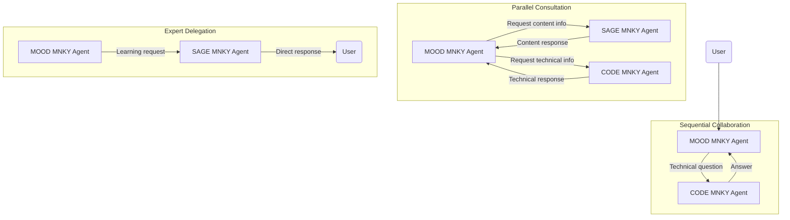

# MOOD MNKY Agent System

The MNKY VERSE is powered by a sophisticated AI agent system that delivers personalized experiences, technical support, and educational content. Our agents combine specialized knowledge, distinct personalities, and advanced capabilities to create meaningful interactions across all touchpoints.

## Our Specialized Agents

  

    

      
      <a href="/agents/mood-mnky/overview" className="text-xl font-semibold text-amber-600 hover:text-amber-800">MOOD MNKY</a>
      
The customer experience specialist focused on personalization and self-care guidance

    

    

      
      <a href="/agents/code-mnky/overview" className="text-xl font-semibold text-blue-600 hover:text-blue-800">CODE MNKY</a>
      
The technical expert providing development support and infrastructure management

    

    

      
      <a href="/agents/sage-mnky/overview" className="text-xl font-semibold text-green-600 hover:text-green-800">SAGE MNKY</a>
      
The knowledge specialist facilitating learning, content creation, and community engagement

    

  

## Agent System Capabilities

Our agent system provides several core capabilities that extend across the entire ecosystem:

<Frame caption="MNKY VERSE Agent System Architecture">
  
</Frame>

### Personalized Interactions
Each agent adapts to individual users through our sophisticated user profiling system, tailoring responses to preferences, history, and context.

### Multi-modal Communication
Agents communicate through text, visual elements, and interactive components to provide rich, engaging experiences.

### Context Awareness
Our memory system enables agents to maintain conversation context and recall relevant information from past interactions.

### Knowledge Integration
Agents access a comprehensive knowledge base that includes product information, technical documentation, learning content, and community resources.

### Seamless Collaboration
The orchestration layer coordinates agent activities, enabling smooth handoffs between specialized agents when different expertise is needed.

## Integration Throughout the Ecosystem

<Steps>
  <Step title="Web Platform">
    Agents are integrated throughout the web experience, providing contextual assistance, personalized recommendations, and conversational interfaces.
  </Step>
  <Step title="Dojo Platform">
    Within our learning environments, agents serve as guides, providing educational content, answering questions, and facilitating community interactions.
  </Step>
  <Step title="E-commerce Experience">
    Agents assist with product selection, custom fragrance creation, and post-purchase support throughout the customer journey.
  </Step>
  <Step title="Internal Tools">
    Specialized agent capabilities support internal teams with content creation, development assistance, and data analysis.
  </Step>
</Steps>

## Technical Foundation

The agent system is built on a robust infrastructure that ensures reliability, security, and scalability:

<AccordionGroup>
  <Accordion title="Agent Database System">
    The comprehensive database architecture that stores agent identities, capabilities, knowledge, memory, and integration points.
    
    [Explore Agent Database System](/agents/agent-database/overview)
  </Accordion>
  <Accordion title="Agent Infrastructure">
    The shared technical foundation that enables all agent capabilities, including knowledge management, orchestration, memory, and personalization.
    
    [Learn more about Agent Infrastructure](/agents/infrastructure)
  </Accordion>
  <Accordion title="User Experience Design">
    Guidelines and patterns for integrating agents into user interfaces while ensuring consistent, intuitive experiences.
    
    [Agent UX Guidelines](/agents/ux-guidelines)
  </Accordion>
  <Accordion title="Developer Resources">
    Documentation, APIs, and tools for integrating with the agent system and extending agent capabilities.
    
    [Agent APIs](/agents/api-reference)
  </Accordion>
  <Accordion title="Prompt Engineering">
    Techniques and best practices for crafting effective prompts that guide agent behavior and responses.
    
    [Prompt Engineering Guide](/agents/prompt-engineering)
  </Accordion>
</AccordionGroup>

## Design Principles

Our agent system is built on core principles that guide all interactions:

<CardGroup cols={2}>
  <Card title="Human-centered" icon="user">
    Agents exist to enhance human experiences, not replace them
  </Card>
  <Card title="Transparent" icon="eye">
    Users always understand when they're interacting with an agent
  </Card>
  <Card title="Privacy-focused" icon="lock">
    User data is handled with care and strong privacy protections
  </Card>
  <Card title="Continuously improving" icon="arrow-trend-up">
    Agents learn and evolve through feedback and evaluation
  </Card>
</CardGroup>

## Inter-agent Communication

<Frame caption="Agent Interaction Patterns">
  
</Frame>

Our agents collaborate to provide comprehensive assistance through several communication patterns:

## Getting Started

<CardGroup cols={3}>
  <Card title="Agent Database System" icon="database" href="/agents/agent-database/overview">
    Explore our comprehensive agent database architecture powering the MNKY VERSE
  </Card>
  <Card title="Developer Integration" icon="code" href="/agents/developer-guide">
    Learn how to integrate agents into your applications and extend their capabilities
  </Card>
  <Card title="Content Creation" icon="pen-to-square" href="/agents/content-guide">
    Guidelines for creating content that works effectively with our agent system
  </Card>
  <Card title="User Guide" icon="book-open-reader" href="/agents/user-guide">
    Information on how to interact with agents and get the most from their capabilities
  </Card>
  <Card title="Agent Schema" icon="sitemap" href="/agents/agent-schema-reference">
    Technical reference for the agent schema and configuration options
  </Card>
  <Card title="Styling Guide" icon="palette" href="/agents/agent-styling-guide">
    Guidelines for using agent-specific styles in documentation and interfaces
  </Card>
  <Card title="Changelog" icon="clock-rotate-left" href="/agents/changelog">
    History of updates and enhancements to the agent system
  </Card>
</CardGroup>

<Info>
The agent system is continuously evolving with new capabilities and improvements. Check the [changelog](/agents/changelog) for the latest updates and enhancements.
</Info>