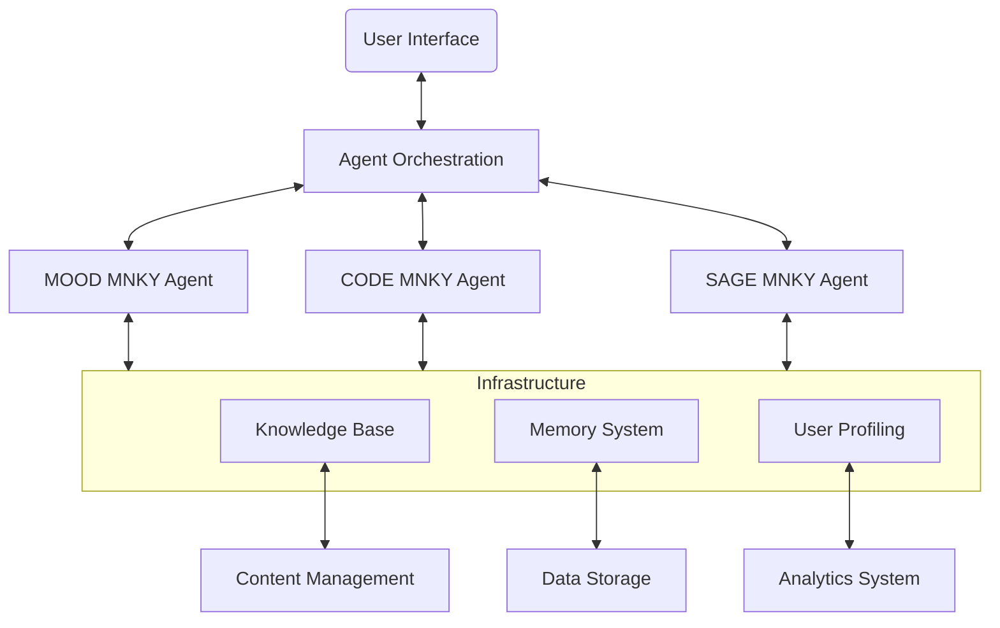

# Agent Infrastructure

The MOOD MNKY agent system is built on a robust infrastructure that powers all agent capabilities across the ecosystem. This infrastructure provides the foundation for our specialized agents to deliver personalized, context-aware assistance.

  

    
    
    
  

## Core Infrastructure Components

<CardGroup cols={2}>
  <Card title="Knowledge Base" icon="database" href="/agents/infrastructure/knowledge-base">
    The central repository of knowledge that enables agents to provide accurate, relevant information
  </Card>
  <Card title="Agent Orchestration" icon="diagram-project" href="/agents/infrastructure/orchestration">
    Coordination layer that manages agent selection, handoffs, and collaboration
  </Card>
  <Card title="Memory System" icon="brain" href="/agents/infrastructure/memory-system">
    Multi-layered memory architecture for maintaining conversation context and recalling past interactions
  </Card>
  <Card title="User Profiling" icon="user-gear" href="/agents/infrastructure/user-profiling">
    Personalization system that adapts agent interactions to individual users
  </Card>
</CardGroup>

## Architecture Overview

The agent infrastructure forms a cohesive system that supports all agent interactions:

## Integration Points

The agent infrastructure connects with several other systems in the MOOD MNKY ecosystem:

<AccordionGroup>
  <Accordion title="Web Platform">
    Agents are integrated throughout the web experience through chat interfaces, contextual assistance, and personalized recommendations.
  </Accordion>
  <Accordion title="Dojo Platform">
    The learning environment leverages agents for educational guidance, content recommendations, and progress tracking.
  </Accordion>
  <Accordion title="E-commerce System">
    Agents assist with product selection, custom product design, and provide post-purchase support.
  </Accordion>
  <Accordion title="Content Management">
    The knowledge base connects with content management systems to ensure agents have access to the latest information.
  </Accordion>
</AccordionGroup>

## Development Guidelines

When working with the agent infrastructure, developers should follow these guidelines:

<Steps>
  <Step title="Authentication">
    All interactions with agent infrastructure APIs require proper authentication using the provided developer credentials.
  </Step>
  <Step title="Error Handling">
    Implement robust error handling for agent interactions, with appropriate fallbacks when services are unavailable.
  </Step>
  <Step title="Request Optimization">
    Minimize the number of requests to agent services by batching operations and caching responses where appropriate.
  </Step>
  <Step title="Testing">
    Test agent integrations thoroughly using the provided sandbox environment before deploying to production.
  </Step>
</Steps>

## Performance Considerations

The agent infrastructure is designed to support high-performance interactions:

- **Response Time**: Agent responses should be delivered within 1-2 seconds for optimal user experience
- **Concurrency**: The system supports thousands of simultaneous agent conversations
- **Scaling**: Infrastructure automatically scales based on demand
- **Availability**: Designed for 99.9% uptime with fallback mechanisms for degraded service

## Security and Privacy

<CardGroup cols={2}>
  <Card title="Data Encryption" icon="lock">
    All data in transit and at rest is encrypted using industry-standard protocols
  </Card>
  <Card title="Access Controls" icon="shield-halved">
    Role-based access controls govern all access to agent infrastructure
  </Card>
  <Card title="Privacy by Design" icon="user-lock">
    User data is processed according to privacy principles with explicit consent
  </Card>
  <Card title="Audit Logging" icon="list-check">
    Comprehensive logging of all administrative actions for security monitoring
  </Card>
</CardGroup>

## Implementation Technologies

The agent infrastructure leverages several key technologies:

- **LangChain** for agent workflows and chains
- **Vector databases** (Pinecone) for semantic knowledge storage
- **Redis** for caching and short-term memory
- **PostgreSQL** for structured data storage
- **Node.js** for API services
- **Docker** and **Kubernetes** for deployment and scaling

## API Access

<Info>
Access to agent infrastructure APIs is managed through our developer portal. Contact the development team for API credentials and detailed documentation on available endpoints.
</Info>

## Future Development

The agent infrastructure roadmap includes:

- Enhanced multi-agent collaboration capabilities
- Advanced reasoning through retrieval-augmented generation
- Improved personalization through sophisticated user modeling
- Expanded knowledge management with automated updates
- Integration with additional platforms and services

For more information on specific components, please explore the detailed documentation for each system.