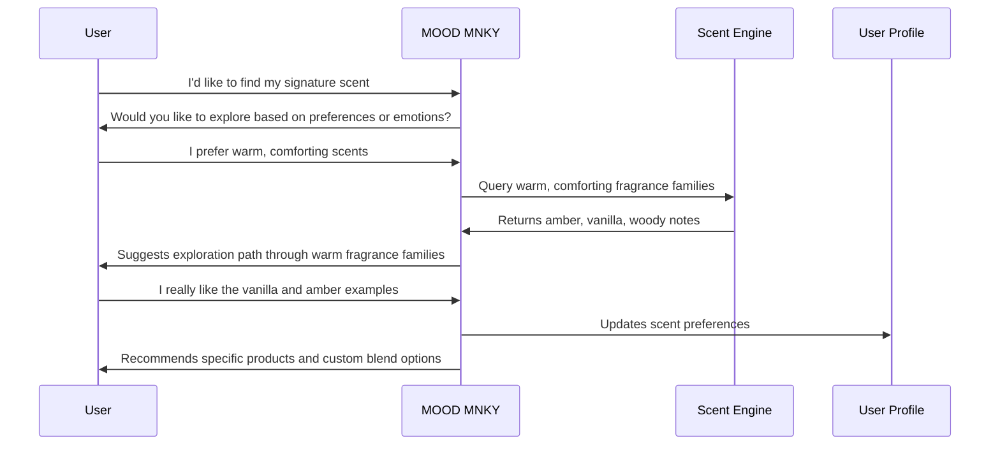
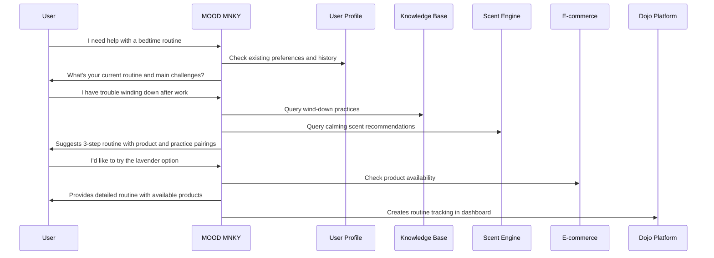

# MOOD MNKY Capabilities

The MOOD MNKY agent provides a rich set of capabilities focused on personalized customer experiences, emotional intelligence, and holistic self-care journeys. This document details the technical capabilities that power these experiences.

## Core Capabilities

### Natural Language Understanding

MOOD MNKY employs advanced natural language understanding to interpret user requests, preferences, and emotional states:

- **Intent recognition** to identify user goals and needs
- **Entity extraction** to identify products, preferences, and experiences
- **Sentiment analysis** to gauge emotional tone and adjust responses
- **Contextual memory** to maintain conversational continuity
- **Personality detection** to adapt communication style

### Personalization Engine

A sophisticated personalization system tailors experiences to individual preferences:

- **Preference mapping** across fragrance families, wellness interests, and product types
- **Dynamic user profiles** that evolve with each interaction
- **Behavioral analysis** to identify patterns and anticipate needs
- **Cross-channel consistency** for unified experiences
- **Recommendation algorithms** with explanation capabilities

### Emotional Intelligence

The agent demonstrates emotional awareness and appropriate responses:

- **Emotion recognition** in text-based communication
- **Empathetic response generation** that acknowledges feelings
- **Tone modulation** based on user state and context
- **Support escalation** for sensitive situations
- **Positive reinforcement** for wellness achievements

### Product Knowledge

Comprehensive understanding of the MOOD MNKY product ecosystem:

- **Detailed product information** including ingredients, usage, and benefits
- **Fragrance composition knowledge** with notes, accords, and emotional effects
- **Custom product configuration** support for personalized creations
- **Product compatibility insights** for complementary experiences
- **Usage optimization recommendations** for maximum benefit

### Journey Orchestration

Capabilities for guiding users through meaningful experiences:

- **Goal-based journey mapping** for personalized pathways
- **Milestone tracking and celebration** to mark progress
- **Seamless handoffs** to specialized agents when needed
- **Multi-channel consistency** across touchpoints
- **Context preservation** between sessions

## Integration Points

<CardGroup cols={2}>
  <Card title="E-commerce Integration" icon="shopping-cart">
    

      
The agent connects with our e-commerce system to provide:

      <ul className="list-disc pl-5">
        <li>Real-time product availability</li>
        <li>Order status updates</li>
        <li>Purchase history analysis</li>
        <li>Custom product configuration</li>
      </ul>
    

  </Card>
  
  <Card title="Dojo Platform" icon="graduation-cap">
    

      
Integration with the learning platform enables:

      <ul className="list-disc pl-5">
        <li>Personalized content recommendations</li>
        <li>Learning progress tracking</li>
        <li>Self-care practice guidance</li>
        <li>Community connection facilitation</li>
      </ul>
    

  </Card>
  
  <Card title="Scent Engine" icon="flask">
    

      
Connection to our proprietary scent system for:

      <ul className="list-disc pl-5">
        <li>Fragrance profile development</li>
        <li>Note and accord recommendations</li>
        <li>Emotional effect mapping</li>
        <li>Custom blend creation</li>
      </ul>
    

  </Card>
  
  <Card title="User Data Platform" icon="database">
    

      
Secure access to the customer data platform for:

      <ul className="list-disc pl-5">
        <li>Preference history retrieval</li>
        <li>Cross-channel journey tracking</li>
        <li>Privacy-compliant personalization</li>
        <li>Profile enrichment</li>
      </ul>
    

  </Card>
</CardGroup>

## Capability Levels

The MOOD MNKY agent capabilities are organized into progressive levels:

<Steps>
  <Step title="Foundation">
    Basic conversational abilities, product information, and simple personalization. Available to all users without authentication.
  </Step>
  <Step title="Enhanced">
    Improved personalization, order history access, and basic journey tracking. Available to registered users.
  </Step>
  <Step title="Premium">
    Advanced emotional intelligence, deep personalization, and sophisticated journey orchestration. Available to premium members.
  </Step>
  <Step title="Custom">
    Fully tailored agent behaviors, dedicated memory, and exclusive capabilities. Available for enterprise implementations.
  </Step>
</Steps>

## Use Case Examples

### Fragrance Profile Development

### Self-Care Routine Development

## Technical Implementation

### API Endpoints

The MOOD MNKY agent exposes several API endpoints for integration:

| Endpoint | Description | Authentication |
|----------|-------------|----------------|
| `/mood-mnky/converse` | Main conversation endpoint | Optional |
| `/mood-mnky/profile` | User profile management | Required |
| `/mood-mnky/recommendations` | Product and content recommendations | Required |
| `/mood-mnky/journeys` | Customer journey management | Required |
| `/mood-mnky/scent-profiles` | Fragrance preference management | Required |

### Event Subscriptions

The agent subscribes to the following system events:

- `user.login` - Triggered when a user logs in
- `order.created` - Triggered when a new order is placed
- `product.viewed` - Triggered when a user views a product
- `content.consumed` - Triggered when a user engages with content
- `routine.completed` - Triggered when a self-care routine is completed

### Data Models

Key data models used by the MOOD MNKY agent:

- `UserProfile` - Core user information and preferences
- `ConversationHistory` - Record of past interactions
- `ScentProfile` - Fragrance preferences and history
- `CustomerJourney` - Multi-touchpoint experience tracking
- `RoutineProgress` - Self-care routine adoption and progress

## Performance and Limitations

### Response Times

- Average response time: 800ms
- 95th percentile: 1.2s
- Maximum allowed: 3s

### Concurrency

- Standard tier: 50 concurrent sessions
- Premium tier: 250 concurrent sessions
- Enterprise tier: Customizable

### Content Limitations

- Maximum conversation history: 30 days or 100 interactions
- Recommendation limit: 5 products per request
- Content generation: Up to 500 words per response

## Future Capabilities

The MOOD MNKY agent roadmap includes:

- **Enhanced emotional intelligence** with more nuanced detection and response
- **Visual input processing** for image-based recommendations
- **Voice interaction** for hands-free experiences
- **Predictive personalization** that anticipates needs before explicit requests
- **AR/VR integration** for immersive product experiences

  <h3>Implementation Resources</h3>
  
For developer resources on implementing and extending MOOD MNKY capabilities, refer to:

  <ul>
    <li><a href="/agents/developer-guide">Agent Developer Guide</a></li>
    <li><a href="/agents/mood-mnky/api-hooks">MOOD MNKY API Hooks</a></li>
    <li><a href="/agents/agent-schema-reference">Agent Schema Reference</a></li>
  </ul>

