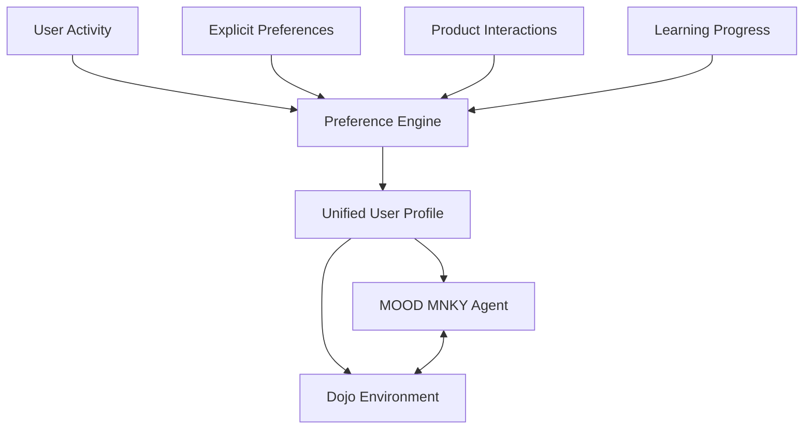

# MOOD MNKY Dojo Integration

<div className="mood-mnky-section p-4 rounded-lg mb-6">
The MOOD MNKY agent integrates deeply with the Dojo platform to provide personalized customer experiences within learning environments. This document details how the agent enhances self-care journeys through the Dojo platform's educational framework.
</div>

## Integration Overview

The Dojo platform serves as MOOD MNKY's primary "life OS" for personalized learning and development. The MOOD MNKY agent enhances this environment by:

1. **Personalizing learning experiences** based on individual preferences and goals
2. **Guiding self-care journeys** with empathetic support and recommendations
3. **Connecting product experiences** to educational content
4. **Facilitating community engagement** around wellness topics
5. **Tracking progress and celebrating milestones** in the self-care journey

## Key Integration Points

<CardGroup cols={2}>
  <Card title="Learning Environment" icon="graduation-cap">
    <div className="space-y-2">
      <p>MOOD MNKY integrates with learning environments to:</p>
      <ul className="list-disc pl-5">
        <li>Adapt content based on personal scent preferences</li>
        <li>Provide contextual product recommendations</li>
        <li>Guide practical exercises with personalized tips</li>
        <li>Offer emotional support during challenging lessons</li>
      </ul>
    </div>
  </Card>
  
  <Card title="Member Dashboard" icon="gauge">
    <div className="space-y-2">
      <p>Dashboard integration enables:</p>
      <ul className="list-disc pl-5">
        <li>Personalized welcome and status updates</li>
        <li>Journey progress visualization</li>
        <li>Custom routine reminders and check-ins</li>
        <li>Contextual recommendations based on recent activity</li>
      </ul>
    </div>
  </Card>
  
  <Card title="Community Features" icon="users">
    <div className="space-y-2">
      <p>Within community spaces, MOOD MNKY provides:</p>
      <ul className="list-disc pl-5">
        <li>Guided discussion facilitation on product experiences</li>
        <li>Connection recommendations between members with similar preferences</li>
        <li>Shared experience prompts and activities</li>
        <li>Supportive feedback on member contributions</li>
      </ul>
    </div>
  </Card>
  
  <Card title="Assessment System" icon="clipboard-check">
    <div className="space-y-2">
      <p>MOOD MNKY enhances assessment with:</p>
      <ul className="list-disc pl-5">
        <li>Preference discovery through interactive questions</li>
        <li>Emotional intelligence evaluation and development</li>
        <li>Scent association and response analysis</li>
        <li>Custom recommendation generation based on results</li>
      </ul>
    </div>
  </Card>
</CardGroup>

## Personalization Framework

The MOOD MNKY agent uses several layers of personalization to enhance the Dojo experience:

### User Preference Model



The agent maintains a comprehensive preference model that evolves over time based on:

- **Explicit preferences** provided through questionnaires and feedback
- **Implicit preferences** derived from content engagement and behavior
- **Product interactions** including purchases and usage patterns
- **Learning progress** across different modules and topics
- **Emotional responses** to different content types

### Adaptive Content Delivery

Based on the user's preference model, MOOD MNKY influences how the Dojo platform delivers content:

1. **Content selection** - Prioritizing topics aligned with interests
2. **Example customization** - Using product examples relevant to the user
3. **Practice personalization** - Tailoring exercises to user's goals
4. **Difficulty adaptation** - Adjusting challenge level based on progress
5. **Format optimization** - Delivering content in preferred learning styles

## Feature Integration

### Self-Care Journey Orchestration

MOOD MNKY works with the Dojo platform to create holistic self-care journeys:

```typescript
// Example self-care journey configuration
const selfCareJourney = {
  title: "Stress Relief Through Aromatherapy",
  personalizedFor: "user123",
  baseTemplate: "aromatherapy_foundations",
  customizations: {
    focuses: ["sleep_improvement", "anxiety_reduction"],
    intensity: "gentle",
    pacing: "relaxed",
    productIntegration: "high"
  },
  moodMnkySupport: {
    checkInFrequency: "daily",
    emotionalSupportLevel: "attentive",
    progressCelebration: true,
    adaptationTriggers: ["struggle_detected", "milestone_achieved"]
  }
};
```

The journey includes:

- **Personalized learning modules** based on wellness goals
- **Regular check-ins** from the MOOD MNKY agent
- **Adaptive support** that responds to emotional cues
- **Product integration points** where physical experiences enhance learning
- **Progress tracking** with meaningful milestones and celebrations

### Interactive Product Experiences

MOOD MNKY enables interactive product experiences within Dojo learning modules:

```tsx
import { useMoodProductExperience } from '@repo/mood-mnky-hooks';

function EssentialOilBlendingExercise({ lessonId, userId }) {
  const {
    productRecommendations,
    userProducts,
    virtualBlender,
    saveCreation,
    recordExperience,
    isLoading
  } = useMoodProductExperience({
    exerciseType: 'blending',
    lessonContext: lessonId,
    userId
  });
  
  return (
    <div className="blending-exercise">
      <h2>Create Your Custom Blend</h2>
      
      {isLoading ? (
        <LoadingIndicator />
      ) : (
        <>
          <div className="available-products">
            <h3>Your Collection</h3>
            <ProductGrid 
              products={userProducts}
              onSelect={(product) => virtualBlender.addOil(product.id)}
            />
            
            <h3>Recommended Additions</h3>
            <RecommendedProducts 
              products={productRecommendations}
              reasoningDisplay="tooltip"
            />
          </div>
          
          <div className="virtual-blender">
            <VirtualBlenderUI
              blender={virtualBlender}
              onSave={(blend) => saveCreation(blend)}
            />
          </div>
          
          <div className="experience-tracker">
            <h3>Record Your Experience</h3>
            <ExperienceForm
              onSubmit={(experience) => recordExperience(experience)}
              emotionTracker={true}
              associationPrompts={true}
            />
          </div>
        </>
      )}
    </div>
  );
}
```

These experiences allow members to:

- **Practice skills learned** in educational modules
- **Connect digital learning** with physical product usage
- **Record experiences and outcomes** for personalized insights
- **Receive contextual guidance** based on their specific products
- **Share creations** with the community for feedback

### Wellness Progress Tracking

MOOD MNKY collaborates with Dojo's tracking system to monitor wellness progress:

```tsx
import { useMoodWellnessTracking } from '@repo/mood-mnky-hooks';

function WellnessProgressDashboard({ userId, goalId }) {
  const {
    goal,
    metrics,
    progress,
    insights,
    milestones,
    updateProgress,
    isLoading
  } = useMoodWellnessTracking({
    userId,
    goalId,
    timeframe: '30days'
  });
  
  return (
    <div className="wellness-dashboard">
      <h2>{goal.title} Progress</h2>
      
      <div className="progress-overview">
        <CircularProgress value={progress.overall} />
        <MilestoneTimeline milestones={milestones} />
      </div>
      
      <div className="metric-tracking">
        {metrics.map(metric => (
          <MetricCard
            key={metric.id}
            title={metric.name}
            value={metric.value}
            target={metric.target}
            trend={metric.trend}
            updateFunction={(value) => updateProgress(metric.id, value)}
          />
        ))}
      </div>
      
      <div className="mood-insights">
        <h3>MOOD MNKY Insights</h3>
        {insights.map(insight => (
          <InsightCard
            key={insight.id}
            title={insight.title}
            description={insight.description}
            actionable={insight.actionItems}
            products={insight.relatedProducts}
          />
        ))}
      </div>
    </div>
  );
}
```

The progress tracking features include:

- **Goal setting and monitoring** for wellness objectives
- **Metric visualization** of various wellness indicators
- **Milestone celebration** at key achievement points
- **Personalized insights** based on progress patterns
- **Product recommendations** tied to specific goals

## Implementation Approaches

### Embedded MOOD MNKY Interface

The most common implementation embeds the MOOD MNKY interface directly within Dojo environments:

```tsx
import { MoodMnkyProvider, useMoodMnky } from '@repo/mood-mnky-hooks';

function DojoLessonPage({ lessonId, userId }) {
  return (
    <MoodMnkyProvider
      userId={userId}
      context={{
        location: 'dojo_lesson',
        lessonId,
        environment: 'learning'
      }}
    >
      <LessonContent />
      <MoodMnkyAssistant />
    </MoodMnkyProvider>
  );
}

function MoodMnkyAssistant() {
  const {
    agent,
    conversation,
    sendMessage,
    recommendations,
    isVisible,
    toggleVisibility
  } = useMoodMnky();
  
  if (!isVisible) {
    return (
      <button 
        className="mood-mnky-toggle"
        onClick={toggleVisibility}
      >
        <MoodMnkyIcon /> Ask MOOD MNKY
      </button>
    );
  }
  
  return (
    <div className="mood-mnky-assistant">
      <div className="assistant-header">
        
        <h3>{agent.greeting}</h3>
        <button onClick={toggleVisibility}>Minimize</button>
      </div>
      
      <div className="conversation">
        {conversation.messages.map(message => (
          <div 
            key={message.id} 
            className={`message ${message.sender}`}
          >
            {message.content}
          </div>
        ))}
      </div>
      
      <div className="input-area">
        <input 
          type="text"
          placeholder="Ask about this lesson..."
          onKeyPress={(e) => e.key === 'Enter' && sendMessage(e.target.value)}
        />
      </div>
      
      {recommendations.length > 0 && (
        <div className="recommendations">
          <h4>You might be interested in:</h4>
          {recommendations.map(rec => (
            <RecommendationCard key={rec.id} recommendation={rec} />
          ))}
        </div>
      )}
    </div>
  );
}
```

### Content Personalization API

For more subtle integration, the content personalization API adapts Dojo content:

```typescript
// Server-side content personalization
import { moodMnkyClient } from '@repo/mood-mnky-api';

async function getPersonalizedLessonContent(lessonId, userId) {
  // Fetch base lesson content
  const baseContent = await dojoAPI.getLessonContent(lessonId);
  
  // Get personalization from MOOD MNKY
  const personalization = await moodMnkyClient.personalizeContent({
    contentType: 'lesson',
    contentId: lessonId,
    userId,
    baseContent,
    personalizationLevel: 'moderate'
  });
  
  // Apply personalization transformations
  return {
    ...baseContent,
    examples: personalization.examples || baseContent.examples,
    exercises: personalization.exercises || baseContent.exercises,
    recommendations: personalization.recommendations || [],
    specialNotes: personalization.notes || []
  };
}
```

This approach:

- **Seamlessly integrates** personalization into existing content
- **Preserves the core curriculum** while adapting examples and exercises
- **Operates behind the scenes** without requiring explicit agent presence
- **Scales efficiently** across large amounts of content

## Emotional Intelligence Features

A key aspect of MOOD MNKY's Dojo integration is its emotional intelligence capabilities:

### Sentiment Analysis

The agent monitors emotional indicators in:

- **User messages** through text sentiment analysis
- **Progress patterns** that may indicate frustration or success
- **Feedback submissions** on lessons and exercises
- **Community interactions** and discussion tone

### Supportive Interventions

Based on emotional analysis, MOOD MNKY provides support through:

- **Encouraging messages** during challenging topics
- **Celebration prompts** for achievements and progress
- **Check-in questions** when struggle patterns are detected
- **Adaptive difficulty** to maintain an optimal challenge level

### Emotional Growth Guidance

Beyond reactive support, the agent provides proactive emotional guidance:

- **Emotional awareness exercises** integrated into wellness content
- **Reflection prompts** to process emotional responses to learning
- **Connection between emotions and scent** through guided experiences
- **Community sharing opportunities** for emotional growth

## Token Economy Integration

MOOD MNKY integrates with the Dojo token economy to reward engagement:

### Token Earning Activities

The agent facilitates token earning through:

- **Completing personalized challenges** aligned with learning goals
- **Sharing product experiences** in community spaces
- **Contributing to collective knowledge** through feedback and reviews
- **Consistent engagement** with self-care routines and practices

### Personalized Reward Recommendations

MOOD MNKY provides customized suggestions for token redemption:

```typescript
// Example token recommendation integration
const tokenRecommendations = await moodMnkyClient.getRewardRecommendations({
  userId: 'user123',
  availableTokens: 2500,
  rewardCategories: ['products', 'experiences', 'content'],
  personalityFactors: true
});

// Returns personalized recommendations like:
// [
//   {
//     id: 'reward_123',
//     type: 'product',
//     name: 'Custom Sleep Blend Creation',
//     tokenCost: 2000,
//     personalizedReason: 'Based on your recent focus on sleep improvement'
//   },
//   {
//     id: 'reward_456',
//     type: 'experience',
//     name: 'Private Aromatherapy Consultation',
//     tokenCost: 3000,
//     personalizedReason: 'To help refine your growing scent preferences'
//   }
// ]
```

## Implementation Considerations

### Privacy and Personalization Balance

When implementing MOOD MNKY in Dojo environments, consider:

- **Transparent personalization** that clearly indicates when content is adapted
- **Privacy controls** allowing users to adjust personalization level
- **Data minimization** by only sharing relevant preferences with the platform
- **Contextual relevance** to ensure personalization enhances learning

### Performance Optimization

For optimal performance:

- **Cache preference models** for frequently accessed information
- **Implement lazy loading** for personalization features
- **Batch API requests** to minimize network calls
- **Use progressive enhancement** for personalization features

### Consistency Across Touchpoints

Maintain a consistent experience by:

- **Synchronizing agent state** across different Dojo environments
- **Sharing context** between learning modules and product experiences
- **Consistent personalization rules** across content types
- **Unified tone and personality** in all agent interactions

## Future Enhancements

The MOOD MNKY and Dojo integration roadmap includes:

- **Multimodal learning** with voice and visual agent interactions
- **Predictive personalization** that anticipates needs before explicit requests
- **Group learning facilitation** for synchronized community experiences
- **Deeper product integration** with IoT-connected wellness devices
- **Cross-platform journey continuity** between web, mobile, and smart home

## Development Resources

For developers implementing MOOD MNKY in Dojo environments:

- [Integration Quick Start Guide](https://developers.moodmnky.com/mood-mnky/dojo/quickstart)
- [Personalization API Reference](https://developers.moodmnky.com/mood-mnky/dojo/personalization-api)
- [UI Component Library](https://developers.moodmnky.com/mood-mnky/dojo/components)
- [Token Economy Hooks](https://developers.moodmnky.com/mood-mnky/dojo/token-hooks)
- [Sample Integrations Repository](https://github.com/mood-mnky/dojo-examples)
