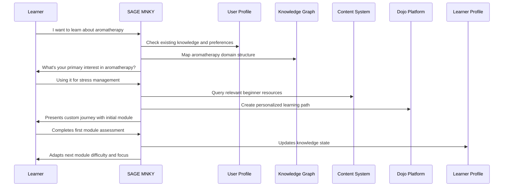
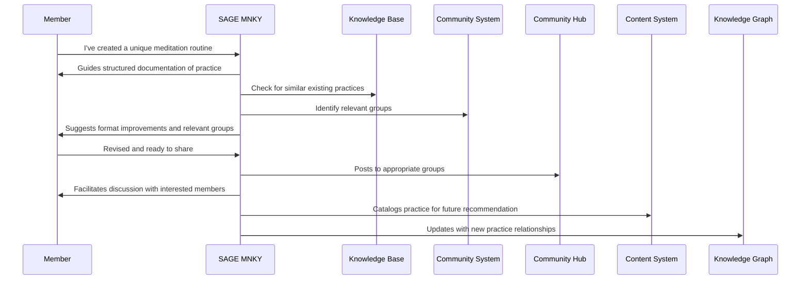

# SAGE MNKY Capabilities

The SAGE MNKY agent provides extensive capabilities focused on educational content, learning facilitation, and community building. This document details the technical features that power these knowledge-centered experiences.

## Core Capabilities

### Content Intelligence

SAGE MNKY employs sophisticated content analysis and generation capabilities:

- **Topic modeling** to understand and organize knowledge domains
- **Content classification** for appropriate categorization
- **Readability and complexity analysis** to match content to audience
- **Knowledge gap identification** for comprehensive coverage
- **Multi-format content generation** adapted to learning contexts

### Learning Journey Management

Advanced capabilities for personalized learning experiences:

- **Learning style identification** for tailored educational approaches
- **Adaptive learning path creation** based on goals and progress
- **Skill assessment** to identify strengths and improvement areas
- **Progress tracking** with meaningful milestones
- **Intervention detection** to address learning obstacles

### Community Facilitation

Tools for building and nurturing vibrant learning communities:

- **Discussion facilitation** with timely prompts and summaries
- **Community health monitoring** for positive, productive environments
- **Connection recommendation** between members with shared interests
- **Collaborative activity orchestration** for group learning
- **Contribution recognition** to encourage participation

### Knowledge Base Management

Capabilities for organizing and delivering comprehensive knowledge:

- **Information accuracy verification** against trusted sources
- **Knowledge organization** for intuitive discovery
- **Answer synthesis** from multiple information sources
- **Context-aware information delivery** based on user needs
- **Source attribution** for reference and further exploration

### Educational Design

Tools for creating effective learning experiences:

- **Learning objective mapping** to content and activities
- **Instructional scaffolding** for progressive skill development
- **Assessment design** for meaningful progress measurement
- **Interactive experience creation** for engaged learning
- **Multimedia learning integration** for multiple learning modalities

## Integration Points

<CardGroup cols={2}>
  <Card title="Dojo Platform" icon="graduation-cap">
    

      
The agent integrates with our learning platform to provide:

      <ul className="list-disc pl-5">
        <li>Learning environment customization</li>
        <li>Progress tracking and reporting</li>
        <li>Content recommendation and delivery</li>
        <li>Assessment and feedback systems</li>
      </ul>
    

  </Card>
  
  <Card title="Community Hub" icon="users">
    

      
Integration with community features enables:

      <ul className="list-disc pl-5">
        <li>Discussion moderation and facilitation</li>
        <li>Member connection and recommendation</li>
        <li>Collaborative activities and projects</li>
        <li>Knowledge sharing and curation</li>
      </ul>
    

  </Card>
  
  <Card title="Content Management" icon="newspaper">
    

      
Connection to content systems for:

      <ul className="list-disc pl-5">
        <li>Resource discovery and recommendation</li>
        <li>Content adaptation and personalization</li>
        <li>Educational material creation</li>
        <li>Media integration and optimization</li>
      </ul>
    

  </Card>
  
  <Card title="Knowledge Graph" icon="diagram-project">
    

      
Leverages our knowledge architecture for:

      <ul className="list-disc pl-5">
        <li>Conceptual relationship mapping</li>
        <li>Prerequisite identification</li>
        <li>Topic exploration guidance</li>
        <li>Cross-domain connections</li>
      </ul>
    

  </Card>
</CardGroup>

## Capability Levels

The SAGE MNKY agent capabilities are organized into progressive levels:

<Steps>
  <Step title="Foundation">
    Basic content recommendations, learning resources, and community participation. Available to all users without authentication.
  </Step>
  <Step title="Enhanced">
    Personalized learning paths, community connection recommendations, and adaptive content delivery. Available to registered users.
  </Step>
  <Step title="Premium">
    Fully adaptive learning journeys, expert-level content curation, and facilitated community experiences. Available to premium members.
  </Step>
  <Step title="Specialized">
    Domain-specific educational design, custom knowledge environments, and dedicated community facilitation. Available for specialized implementations.
  </Step>
</Steps>

## Use Case Examples

### Personalized Learning Journey

### Community Knowledge Sharing

## Technical Implementation

### API Endpoints

The SAGE MNKY agent exposes several API endpoints for integration:

| Endpoint | Description | Authentication |
|----------|-------------|----------------|
| `/sage-mnky/learn` | Learning path management | Optional |
| `/sage-mnky/content` | Content discovery and delivery | Optional |
| `/sage-mnky/community` | Community interaction and facilitation | Required |
| `/sage-mnky/knowledge` | Knowledge base access and querying | Optional |
| `/sage-mnky/assessment` | Learning progress assessment | Required |

### Event Subscriptions

The agent subscribes to the following system events:

- `content.created` - Triggered when new educational content is added
- `learning.milestone` - Triggered when a user reaches a learning milestone
- `community.interaction` - Triggered for meaningful community activities
- `question.asked` - Triggered when a user asks a knowledge-based question
- `feedback.provided` - Triggered when learning feedback is submitted

### Data Models

Key data models used by the SAGE MNKY agent:

- `LearningProfile` - Individual learning preferences and history
- `KnowledgeState` - Mastery and familiarity across knowledge domains
- `ContentRepository` - Educational resources and their metadata
- `CommunityMap` - Community structure and interaction patterns
- `LearningJourney` - Structured educational pathways and progress

## Performance and Limitations

### Response Times

- Average content recommendation: 650ms
- 95th percentile: 1.0s
- Maximum allowed for complex learning paths: 2.5s

### Concurrency

- Standard tier: 75 concurrent learning sessions
- Premium tier: 200 concurrent learning sessions
- Specialized tier: Customizable based on implementation

### Content Limitations

- Maximum learning path complexity: 50 interconnected modules
- Knowledge domain coverage: 12 primary domains with 50+ subdomains
- Community facilitation: Up to 500 members per community group
- Language support: English, Spanish, French, German, Japanese

## Future Capabilities

The SAGE MNKY agent roadmap includes:

- **Collaborative learning environments** with real-time group facilitation
- **Advanced knowledge visualization** for complex topic exploration
- **Multimodal learning assessment** beyond traditional testing
- **Neuroadaptive learning paths** based on cognitive science
- **Cross-cultural learning adaptation** for global educational contexts

  <h3>Implementation Resources</h3>
  
For developer resources on implementing and extending SAGE MNKY capabilities, refer to:

  <ul>
    <li><a href="/agents/developer-guide">Agent Developer Guide</a></li>
    <li><a href="/agents/sage-mnky/api-hooks">SAGE MNKY API Hooks</a></li>
    <li><a href="/agents/agent-schema-reference">Agent Schema Reference</a></li>
  </ul>

