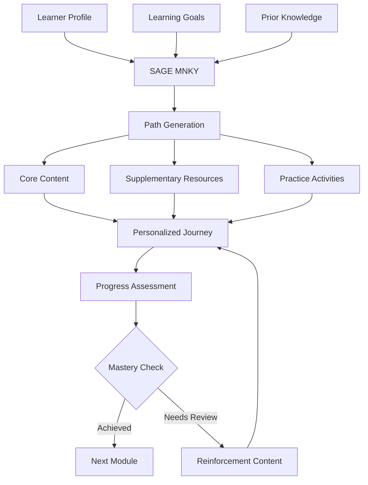
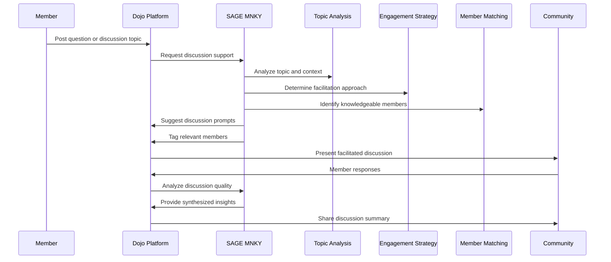
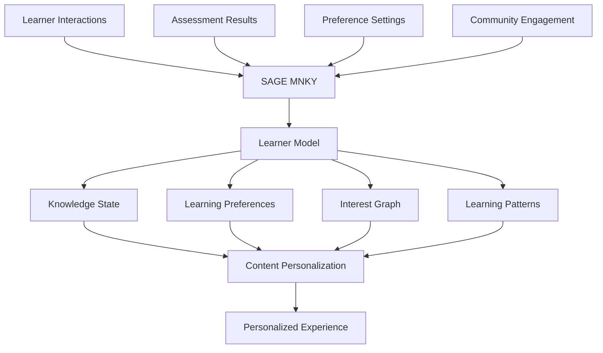

# SAGE MNKY Dojo Integration

<div className="sage-mnky-section p-4 rounded-lg mb-6">
The SAGE MNKY agent integrates deeply with the Dojo platform to enhance learning experiences, manage knowledge resources, and provide personalized educational support. This document details how SAGE MNKY capabilities are leveraged within the Dojo learning environment.
</div>

## Integration Overview

The Dojo platform serves as MOOD MNKY's personalized learning and development environment. SAGE MNKY enhances the knowledge and learning aspects of this platform by:

1. **Curating personalized learning paths** tailored to individual interests and goals
2. **Providing contextual knowledge** at the moment of need
3. **Facilitating community learning** and knowledge sharing
4. **Adapting content difficulty** based on learner progress
5. **Offering multi-modal learning approaches** to accommodate different learning styles

## Key Integration Points

<CardGroup cols={2}>
  <Card title="Learning Path Engine" icon="route">
    <div className="space-y-2">
      <p>SAGE MNKY powers the learning path engine with:</p>
      <ul className="list-disc pl-5">
        <li>Personalized learning journeys</li>
        <li>Adaptive sequencing of content</li>
        <li>Progress tracking and milestone celebration</li>
        <li>Just-in-time learning recommendations</li>
      </ul>
    </div>
  </Card>
  
  <Card title="Knowledge Repository" icon="brain">
    <div className="space-y-2">
      <p>For knowledge management, SAGE MNKY enables:</p>
      <ul className="list-disc pl-5">
        <li>Semantically organized content library</li>
        <li>Intelligent search and discovery</li>
        <li>Multi-modal content formats</li>
        <li>Knowledge graph relationship mapping</li>
      </ul>
    </div>
  </Card>
  
  <Card title="Community Facilitation" icon="users">
    <div className="space-y-2">
      <p>SAGE MNKY enhances community learning with:</p>
      <ul className="list-disc pl-5">
        <li>Guided discussion facilitation</li>
        <li>Group learning activities</li>
        <li>Knowledge sharing incentives</li>
        <li>Expert matchmaking for mentorship</li>
      </ul>
    </div>
  </Card>
  
  <Card title="Learning Assessment" icon="gauge-high">
    <div className="space-y-2">
      <p>To measure progress, SAGE MNKY provides:</p>
      <ul className="list-disc pl-5">
        <li>Comprehensive skill assessment</li>
        <li>Knowledge retention verification</li>
        <li>Practical application evaluation</li>
        <li>Learning effectiveness metrics</li>
      </ul>
    </div>
  </Card>
</CardGroup>

## Learning Path Personalization

SAGE MNKY creates deeply personalized learning experiences within the Dojo platform:

### Adaptive Learning Paths

The agent dynamically constructs and adapts learning paths based on individual needs:



The path personalization considers:

- **Learning preferences** (visual, auditory, reading/writing, kinesthetic)
- **Pace preferences** (comprehensive vs. accelerated)
- **Application goals** (theoretical understanding vs. practical application)
- **Interest areas** for contextually relevant examples
- **Learning history** to avoid unnecessary repetition

### Contextual Knowledge Delivery

SAGE MNKY delivers relevant knowledge exactly when needed:

```tsx
import { useSageMnkyContext } from '@repo/sage-mnky-hooks';

function ContextualKnowledgePanel({ currentTopic, learnerContext }) {
  const {
    contextualContent,
    isLoading,
    relatedConcepts,
    practicalApplications,
    commonQuestions,
    expandTopic
  } = useSageMnkyContext({
    topic: currentTopic,
    learnerContext,
    depth: 'adaptive',
    format: 'mixed-media'
  });
  
  return (
    <div className="knowledge-panel">
      <div className="current-concept">
        <h2>{contextualContent.title}</h2>
        <p className="description">{contextualContent.description}</p>
        
        {contextualContent.primaryContent && (
          <div className="primary-content">
            {/* Renders appropriate content based on type */}
            <ContentRenderer 
              content={contextualContent.primaryContent}
              format={contextualContent.format}
            />
          </div>
        )}
      </div>
      
      <div className="knowledge-extensions">
        <div className="related-concepts">
          <h3>Related Concepts</h3>
          <ConceptList 
            concepts={relatedConcepts} 
            onSelect={(concept) => expandTopic(concept.id)}
          />
        </div>
        
        <div className="applications">
          <h3>Practical Applications</h3>
          <ApplicationList applications={practicalApplications} />
        </div>
        
        <div className="common-questions">
          <h3>Frequently Asked Questions</h3>
          <FAQAccordion questions={commonQuestions} />
        </div>
      </div>
    </div>
  );
}
```

## Knowledge Repository Management

SAGE MNKY manages a comprehensive knowledge repository within the Dojo platform:

### Content Organization and Retrieval

```typescript
// Example content retrieval with SAGE MNKY
const knowledgeResults = await sageMnkyClient.retrieveKnowledge({
  query: "fragrance composition principles",
  learnerContext: {
    skillLevel: "intermediate",
    interestAreas: ["essential oils", "natural perfumery"],
    learningHistory: ["basic-scent-profiles", "fragrance-families"],
    preferredFormats: ["visual", "interactive"]
  },
  contentTypes: ["article", "video", "interactive", "assessment"],
  maxResults: 5,
  includeMetadata: true
});

// Returns structured content with intelligent organization
// {
//   primaryContent: { id: "frag-comp-101", type: "article", ... },
//   relatedConcepts: [
//     { id: "scent-layering", title: "Layering in Fragrance", relevance: 0.92 },
//     { id: "top-notes", title: "Understanding Top Notes", relevance: 0.87 },
//     ...
//   ],
//   supplementaryContent: [
//     { id: "video-blending", type: "video", title: "Blending Demonstration" },
//     ...
//   ],
//   practicalExercises: [
//     { id: "ex-identify-notes", type: "interactive", difficulty: "intermediate" },
//     ...
//   ],
//   knowledgeGraph: { nodes: [...], edges: [...] }
// }
```

### Multi-modal Content Generation

SAGE MNKY creates and adapts learning content in multiple formats:

```typescript
// Example content generation
const newContent = await sageMnkyClient.generateContent({
  topic: "Mindfulness in Daily Self-Care",
  targetAudience: {
    skillLevel: "beginner",
    interests: ["stress reduction", "morning routines"],
    demographicContext: "working professionals"
  },
  contentFormats: [
    { type: "article", length: "medium", style: "conversational" },
    { type: "infographic", focusAreas: ["key steps", "benefits"] },
    { type: "guided-practice", duration: "5min", complexity: "simple" }
  ],
  brandVoice: true,
  keyMessages: [
    "Simplicity in practice",
    "Integration with existing routines",
    "Scientific benefits of mindfulness"
  ]
});
```

The generated content includes:

- **Consistent messaging** across different formats
- **Format-appropriate structures** optimized for learning
- **Accessibility considerations** for diverse learners
- **Brand-aligned voice and tone**
- **Appropriate complexity** for the target audience

### Knowledge Graph Visualization

For complex topics, SAGE MNKY provides knowledge graph visualization:

```tsx
import { useSageMnkyKnowledgeGraph } from '@repo/sage-mnky-hooks';

function KnowledgeGraphVisualization({ topicId, explorationDepth }) {
  const {
    graphData,
    isLoading,
    focusedNode,
    expandNode,
    collapseNode,
    pathToMastery,
    highlightPath
  } = useSageMnkyKnowledgeGraph({
    rootTopicId: topicId,
    depth: explorationDepth,
    learnerContext: getCurrentLearnerContext(),
    includeProgress: true
  });
  
  return (
    <div className="knowledge-graph">
      <div className="controls">
        <button onClick={() => highlightPath(pathToMastery)}>
          Show Path to Mastery
        </button>
        <ZoomControls />
        <FilterOptions />
      </div>
      
      <div className="graph-container">
        {isLoading ? (
          <LoadingIndicator />
        ) : (
          <InteractiveGraph
            nodes={graphData.nodes}
            edges={graphData.edges}
            focusedNode={focusedNode}
            onNodeClick={(node) => expandNode(node.id)}
            learnerProgress={graphData.progress}
          />
        )}
      </div>
      
      <div className="focused-content">
        {focusedNode && (
          <NodeDetailPanel 
            node={focusedNode}
            relatedContent={graphData.relatedContent[focusedNode.id]}
          />
        )}
      </div>
    </div>
  );
}
```

## Community Learning Facilitation

SAGE MNKY enhances community-based learning within the Dojo platform:

### Discussion Facilitation

The agent actively facilitates meaningful discussions and knowledge sharing:



The facilitation includes:

- **Thoughtful prompts** to deepen exploration
- **Connection building** between related discussions
- **Expert identification** to involve knowledgeable members
- **Respectful conflict mediation** when opinions differ
- **Synthesis of key insights** from complex discussions

### Collaborative Learning Projects

SAGE MNKY guides collaborative projects for deeper learning:

```tsx
import { useSageMnkyCollaboration } from '@repo/sage-mnky-hooks';

function CollaborativeLearningHub({ projectId, memberIds }) {
  const {
    project,
    isLoading,
    members,
    learningGoals,
    contributionAreas,
    suggestedResources,
    progress,
    nextActions,
    assignTask
  } = useSageMnkyCollaboration({
    projectId,
    memberIds,
    facilitationLevel: 'active'
  });
  
  return (
    <div className="collab-project">
      <div className="project-header">
        <h2>{project.title}</h2>
        <p className="description">{project.description}</p>
        <GoalsList goals={learningGoals} progress={progress.goalProgress} />
      </div>
      
      <div className="collaboration-space">
        <div className="member-section">
          <h3>Team Members</h3>
          <MemberList 
            members={members} 
            contributions={progress.memberContributions}
            expertiseAreas={project.expertiseMap}
          />
        </div>
        
        <div className="contribution-areas">
          <h3>Contribution Areas</h3>
          {contributionAreas.map(area => (
            <ContributionCard
              key={area.id}
              area={area}
              assignedMembers={area.assignedMembers}
              completionStatus={area.completionStatus}
              onAssign={(memberId) => assignTask(area.id, memberId)}
            />
          ))}
        </div>
      </div>
      
      <div className="facilitation-panel">
        <h3>SAGE Insights</h3>
        <ResourceSuggestions resources={suggestedResources} />
        <NextActionsList actions={nextActions} />
        <FacilitationChat projectId={projectId} />
      </div>
    </div>
  );
}
```

### Learning Circles

SAGE MNKY supports ongoing learning communities focused on specific interest areas:

```typescript
// Example learning circle creation
const learningCircle = await sageMnkyClient.createLearningCircle({
  topic: "Sustainable Fragrance Practices",
  description: "A community exploring environmentally responsible approaches to fragrance creation and use",
  learningObjectives: [
    "Understand sustainable sourcing principles",
    "Explore eco-friendly packaging innovations",
    "Develop natural preservation techniques",
    "Share waste reduction practices"
  ],
  membershipCriteria: {
    interestAreas: ["sustainability", "natural-fragrances"],
    minKnowledgeLevel: "beginner",
    commitmentExpectation: "moderate"
  },
  facilitationSettings: {
    sageMnkySupport: "active",
    contentCadence: "weekly",
    discussionPrompts: "twice-weekly",
    expertSessions: "monthly"
  },
  resources: {
    initialLibrary: ["sustainable-basics", "natural-ingredients-guide"],
    suggestedActivities: ["sourcing-challenge", "packaging-redesign"]
  }
});
```

## Learning Assessment and Feedback

SAGE MNKY provides comprehensive assessment capabilities to measure learning effectiveness:

### Knowledge Assessment

The agent offers various assessment approaches to evaluate understanding:

```typescript
// Example assessment generation
const assessment = await sageMnkyClient.createAssessment({
  topicArea: "Aromatherapy Fundamentals",
  learnerProfile: {
    skillLevel: "intermediate",
    learningHistory: ["essential-oils-101", "scent-psychology"],
    preferredFormats: ["interactive", "application-based"]
  },
  assessmentType: "mixed",
  components: [
    { type: "knowledge-check", questionCount: 5, format: "multiple-choice" },
    { type: "case-analysis", scenario: "sleep-improvement", format: "short-answer" },
    { type: "practical-application", task: "blend-recommendation", format: "structured-response" }
  ],
  adaptiveDifficulty: true,
  showFeedback: "immediate",
  estimatedDuration: "15min"
});
```

The assessment includes:

- **Varied question types** to evaluate different cognitive levels
- **Real-world application scenarios** for authentic assessment
- **Adaptive difficulty** based on performance
- **Immediate feedback** with learning opportunities
- **Comprehensive results** with growth recommendations

### Progress Visualization

SAGE MNKY provides clear visualization of learning progress:

```tsx
import { useSageMnkyProgress } from '@repo/sage-mnky-hooks';

function LearningProgressDashboard({ learnerId, focusAreas }) {
  const {
    progress,
    isLoading,
    skillMastery,
    learningPatterns,
    milestones,
    recommendations,
    setTimePeriod
  } = useSageMnkyProgress({
    learnerId,
    focusAreas,
    timePeriod: 'last-90-days'
  });
  
  return (
    <div className="progress-dashboard">
      <div className="period-selector">
        <TimeRangeSelector 
          currentPeriod="last-90-days"
          onChange={(period) => setTimePeriod(period)}
        />
      </div>
      
      <div className="mastery-overview">
        <h2>Knowledge Mastery</h2>
        <SkillRadarChart data={skillMastery} />
      </div>
      
      <div className="achievement-timeline">
        <h2>Learning Journey</h2>
        <MilestoneTimeline milestones={milestones} />
      </div>
      
      <div className="learning-insights">
        <h2>Learning Insights</h2>
        <PatternAnalysis patterns={learningPatterns} />
        <StrengthsWeaknesses data={progress.strengths} />
      </div>
      
      <div className="next-steps">
        <h2>Recommended Next Steps</h2>
        <RecommendationList recommendations={recommendations} />
      </div>
    </div>
  );
}
```

### Adaptive Feedback

SAGE MNKY provides personalized feedback on learning activities:

```typescript
// Example feedback generation
const feedback = await sageMnkyClient.generateFeedback({
  submissionId: "sub_12345",
  submissionType: "reflection-essay",
  topic: "Personal Wellness Planning",
  rubric: {
    understanding: { weight: 0.3, criteria: ["concept-accuracy", "depth"] },
    application: { weight: 0.4, criteria: ["personalization", "practicality"] },
    reflection: { weight: 0.3, criteria: ["insight-quality", "growth-orientation"] }
  },
  learnerContext: await getLearnerContext("user_789"),
  feedbackStyle: "growth-oriented",
  includeStrengths: true,
  includeDevelopmentAreas: true,
  suggestResources: true
});
```

The feedback approach focuses on:

- **Strengths-based commentary** to reinforce positive aspects
- **Growth-oriented suggestions** rather than deficiency-focused critique
- **Specific, actionable guidance** for improvement
- **Contextually relevant examples** to illustrate concepts
- **Forward-looking recommendations** for continued development

## Content Personalization Framework

SAGE MNKY implements a sophisticated framework for content personalization:

### Learner Model



The model captures:

- **Knowledge state** across different domains
- **Learning preferences** for content format and pace
- **Interest patterns** to guide topic selection
- **Time and engagement patterns** for optimal delivery
- **Social learning preferences** for community integration

### Content Adaptation Engine

```typescript
// Example content adaptation
const adaptedContent = await sageMnkyClient.adaptContent({
  baseContentId: "cont_wellness_intro",
  learnerContext: {
    id: "user_789",
    skillLevel: "beginner",
    attentionCapacity: "limited", // e.g., busy professional
    interestAreas: ["stress-management", "sleep-improvement"],
    learningPreferences: {
      format: ["visual", "brief-text"],
      examples: "practical",
      complexity: "accessible",
      tone: "encouraging"
    }
  },
  adaptationParameters: {
    lengthAdjustment: "condense",
    complexityAdjustment: "simplify",
    exampleStyle: "real-world-application",
    mediaPreference: "increased-visual"
  }
});
```

The adaptation includes:

- **Length modifications** based on available time and attention
- **Complexity adjustments** to match comprehension level
- **Example customization** aligned with interests and goals
- **Format transformation** to preferred learning styles
- **Tone calibration** to motivational needs

### Personalized Learning Sequences

```tsx
import { useSageMnkySequence } from '@repo/sage-mnky-hooks';

function PersonalizedLearningModule({ moduleId, userId }) {
  const {
    sequence,
    isLoading,
    currentStep,
    progress,
    moveNext,
    movePrevious,
    jumpToStep,
    adaptStep
  } = useSageMnkySequence({
    moduleId,
    userId,
    adaptationLevel: 'dynamic'
  });
  
  return (
    <div className="learning-module">
      <div className="module-header">
        <h1>{sequence.title}</h1>
        <p className="description">{sequence.description}</p>
        <ProgressIndicator 
          steps={sequence.steps.length} 
          current={currentStep.index}
          completed={progress.completedSteps}
        />
      </div>
      
      <div className="content-container">
        <LearningStepContent
          content={currentStep.content}
          interactions={currentStep.interactions}
          onInteraction={(data) => adaptStep(data)}
          format={currentStep.format}
        />
      </div>
      
      <div className="navigation-controls">
        <button 
          onClick={movePrevious}
          disabled={currentStep.index === 0}
        >
          Previous
        </button>
        
        <StepSelector
          steps={sequence.steps}
          currentIndex={currentStep.index}
          completedSteps={progress.completedSteps}
          onSelectStep={(index) => jumpToStep(index)}
        />
        
        <button 
          onClick={moveNext}
          disabled={!currentStep.completed}
        >
          {currentStep.isLast ? 'Complete' : 'Next'}
        </button>
      </div>
    </div>
  );
}
```

## Implementation Approaches

### Embedded SAGE MNKY Interface

For learning environments, SAGE MNKY can be embedded directly in the interface:

```tsx
import { SageMnkyProvider, useSageMnky } from '@repo/sage-mnky-hooks';

function LearningPage({ contentId, userId }) {
  return (
    <SageMnkyProvider
      userId={userId}
      context={{
        contentId,
        environment: 'learning'
      }}
    >
      <ContentDisplay />
      <SageMnkyAssistant />
    </SageMnkyProvider>
  );
}

function SageMnkyAssistant() {
  const {
    assistant,
    knowledgeContext,
    askQuestion,
    exploreRelated,
    findResources,
    isVisible,
    toggleVisibility
  } = useSageMnky();
  
  if (!isVisible) {
    return (
      <button 
        className="sage-mnky-toggle"
        onClick={toggleVisibility}
      >
        <SageMnkyIcon /> Learning Guide
      </button>
    );
  }
  
  return (
    <div className="sage-mnky-assistant">
      <div className="assistant-header">
        
        <h3>Learning Guide</h3>
        <button onClick={toggleVisibility}>Minimize</button>
      </div>
      
      <div className="learning-assistance">
        <div className="common-actions">
          <button onClick={() => askQuestion("Can you explain this concept?")}>
            Explain This Concept
          </button>
          <button onClick={() => exploreRelated(knowledgeContext.currentTopic)}>
            Show Related Topics
          </button>
          <button onClick={() => findResources("practical applications")}>
            Find Practical Examples
          </button>
        </div>
        
        <div className="custom-question">
          <input 
            type="text"
            placeholder="Ask about this topic..."
            onKeyPress={(e) => e.key === 'Enter' && askQuestion(e.target.value)}
          />
        </div>
      </div>
    </div>
  );
}
```

### Content API Integration

For seamless content personalization, the SAGE MNKY API can be integrated:

```typescript
// Server-side content personalization
import { sageMnkyClient } from '@repo/sage-mnky-api';

async function getPersonalizedContent(contentId, userId) {
  // Fetch base content
  const baseContent = await dojoAPI.getContent(contentId);
  
  // Personalize with SAGE MNKY
  const personalizedContent = await sageMnkyClient.personalizeContent({
    content: baseContent,
    userId,
    personalizationTypes: [
      'examples',
      'difficulty',
      'format',
      'supplementary_resources'
    ],
    contentGoal: 'learning',
    preserveCore: true
  });
  
  return personalizedContent;
}
```

This approach allows:

- **Seamless enhancement** of existing content
- **Server-side personalization** for performance
- **Consistent content structure** with personalized elements
- **Separation of concerns** between content and personalization

## Token Economy Integration

SAGE MNKY integrates with the token economy to incentivize learning:

### Learning Rewards

```typescript
// Example learning reward configuration
const rewardStructure = await sageMnkyClient.configureRewards({
  learningActivities: [
    {
      type: 'content_completion',
      tokenReward: 5,
      conditions: {
        assessmentRequired: true,
        minimumScore: 70
      }
    },
    {
      type: 'knowledge_sharing',
      tokenReward: 10,
      conditions: {
        qualityThreshold: 'medium',
        helpfulnessVotes: 3
      }
    },
    {
      type: 'streak_maintenance',
      tokenReward: 3,
      conditions: {
        daysRequired: 5,
        minimumTimePerDay: 10 // minutes
      }
    },
    {
      type: 'challenge_completion',
      tokenReward: 25,
      conditions: {
        difficultyLevel: 'intermediate',
        timeConstraint: '7days'
      }
    }
  ],
  bonusCategories: [
    {
      type: 'exceptional_contribution',
      tokenReward: 50,
      evaluationCriteria: ['originality', 'depth', 'community_impact']
    },
    {
      type: 'learning_milestone',
      tokenReward: 100,
      milestones: ['domain_mastery', 'certification_completion']
    }
  ],
  antiGamingMeasures: {
    qualityChecks: true,
    distributionLimits: {
      daily: 50,
      weekly: 250
    },
    reviewProcess: 'automated_with_oversight'
  }
});
```

### Achievement Framework

```tsx
import { useSageMnkyAchievements } from '@repo/sage-mnky-hooks';

function LearningAchievements({ userId }) {
  const {
    achievements,
    isLoading,
    inProgress,
    completed,
    tokenRewards,
    milestones,
    recentlyUnlocked
  } = useSageMnkyAchievements({
    userId,
    includeProgress: true
  });
  
  return (
    <div className="achievements-dashboard">
      <div className="achievements-header">
        <h2>Learning Achievements</h2>
        <div className="stats-summary">
          <StatCard label="Achievements Unlocked" value={completed.length} />
          <StatCard label="Tokens Earned" value={tokenRewards.total} />
          <StatCard label="Current Streak" value={achievements.currentStreak} />
        </div>
      </div>
      
      {recentlyUnlocked.length > 0 && (
        <div className="recently-unlocked">
          <h3>Recently Unlocked</h3>
          <AchievementList 
            achievements={recentlyUnlocked}
            showAnimation={true}
          />
        </div>
      )}
      
      <div className="achievement-categories">
        <AchievementCategory
          title="Knowledge Mastery"
          achievements={achievements.categories.knowledge}
          progress={inProgress.categories.knowledge}
        />
        
        <AchievementCategory
          title="Community Contribution"
          achievements={achievements.categories.community}
          progress={inProgress.categories.community}
        />
        
        <AchievementCategory
          title="Learning Habits"
          achievements={achievements.categories.habits}
          progress={inProgress.categories.habits}
        />
        
        <AchievementCategory
          title="Special Achievements"
          achievements={achievements.categories.special}
          progress={inProgress.categories.special}
        />
      </div>
      
      <div className="learning-journey">
        <h3>Learning Journey</h3>
        <MilestoneRoadmap milestones={milestones} />
      </div>
    </div>
  );
}
```

## Implementation Considerations

### Content Quality and Currency

When implementing SAGE MNKY in Dojo learning environments:

- **Regular content audits** to ensure accuracy and relevance
- **Version control for learning materials** with clear update history
- **Source verification** for factual information
- **Diverse perspective inclusion** for comprehensive understanding
- **Timely updates** for rapidly evolving topics

### Learning Experience Optimization

For optimal learning experiences:

- **Cognitive load management** through appropriate content chunking
- **Interleaved practice** for better long-term retention
- **Spaced repetition** for knowledge reinforcement
- **Multi-modal presentation** for different learning styles
- **Just-in-time support** for learning challenges

### Privacy and Ethical Considerations

Maintain ethical standards through:

- **Transparent learning data collection** with clear purpose
- **Learner control over personal data** and profiles
- **Bias monitoring** in content recommendations
- **Inclusive content design** for diverse audiences
- **Clear attribution** for community-contributed content

## Future Enhancements

The SAGE MNKY and Dojo integration roadmap includes:

- **Advanced knowledge visualization** using AR/VR technologies
- **Emotional learning support** adaptive to learner states
- **Integrated expert-learner matching** for personalized mentorship
- **Cross-domain knowledge synthesis** for holistic understanding
- **Predictive learning interventions** to prevent challenges

## Development Resources

For developers implementing SAGE MNKY in Dojo environments:

- [Content Integration Documentation](https://developers.moodmnky.com/sage-mnky/dojo/content)
- [Learning Path API Reference](https://developers.moodmnky.com/sage-mnky/dojo/learning-paths)
- [Assessment API Documentation](https://developers.moodmnky.com/sage-mnky/dojo/assessment)
- [Community Integration Guide](https://developers.moodmnky.com/sage-mnky/dojo/community)
- [Example Implementation Repository](https://github.com/sage-mnky/learning-examples)
