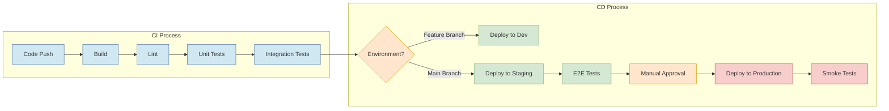

# Deployment Guide

This guide outlines the deployment process for MOOD MNKY applications across different environments, ensuring reliable and consistent releases.

## Deployment Environments

<CardGroup cols={3}>
  <Card title="Development" icon="code">
    - **Purpose**: Active development and testing
    - **URL**: dev.moodmnky.co
    - **Deployment**: Automatic on push to feature branches
    - **Data**: Anonymized test data
    - **Access**: Internal team only
  </Card>
  <Card title="Staging" icon="flask">
    - **Purpose**: Pre-production validation
    - **URL**: staging.moodmnky.co
    - **Deployment**: Manual trigger after PR merge to main
    - **Data**: Copy of production with anonymized PII
    - **Access**: Internal team and beta testers
  </Card>
  <Card title="Production" icon="rocket">
    - **Purpose**: Live customer-facing environment
    - **URL**: moodmnky.co
    - **Deployment**: Manual approval after staging validation
    - **Data**: Production data
    - **Access**: Public and authenticated users
  </Card>
</CardGroup>

## Deployment Pipeline

Our CI/CD pipeline automates the build, test, and deployment process:



## Deployment Prerequisites

Before initiating a deployment, ensure the following prerequisites are met:

<Steps>
  <Step title="Code Review">
    All code changes must be reviewed and approved by at least one team member.
  </Step>
  <Step title="Tests Passing">
    All automated tests (unit, integration, E2E) must pass in the CI pipeline.
  </Step>
  <Step title="Documentation Updated">
    Relevant documentation must be updated to reflect any changes.
  </Step>
  <Step title="Feature Flags">
    New features should be behind feature flags if not ready for all users.
  </Step>
  <Step title="Change Log">
    Update the change log with notable changes for the release.
  </Step>
</Steps>

## Deployment Process

### Standard Deployment

<Tabs>
  <Tab title="Development">
    1. Push code to a feature branch
    2. GitHub Actions automatically builds and tests the code
    3. If all checks pass, changes are automatically deployed to the development environment
    4. Verify changes in the development environment
    5. Create a pull request to merge changes into the main branch
    
    ```bash
    # Example workflow
    git checkout -b feature/new-feature
    # Make changes
    git add .
    git commit -m "feat: add new feature"
    git push origin feature/new-feature
    # CI/CD automatically deploys to dev environment
    # Create PR in GitHub UI
    ```
  </Tab>
  
  <Tab title="Staging">
    1. Merge approved PR into the main branch
    2. GitHub Actions builds and tests the code
    3. Manual approval required in GitHub Actions workflow
    4. Deployment to staging environment is triggered
    5. Run automated E2E tests on staging
    6. Perform manual QA verification
    
    ```bash
    # Post-merge, trigger staging deployment (if not automatic)
    gh workflow run deploy-staging.yml -R mood-mnky/mood-mnky
    
    # Verify staging deployment
    npm run test:e2e:staging
    ```
  </Tab>
  
  <Tab title="Production">
    1. Initiate production deployment from GitHub Actions
    2. Final approval required from authorized team member
    3. Deployment executed with zero-downtime strategy
    4. Run smoke tests against production
    5. Monitor application health and metrics
    6. Be prepared to rollback if issues are detected
    
    ```bash
    # Trigger production deployment
    gh workflow run deploy-production.yml -R mood-mnky/mood-mnky
    
    # Run smoke tests
    npm run test:smoke:production
    
    # If needed, trigger rollback
    gh workflow run rollback.yml -R mood-mnky/mood-mnky
    ```
  </Tab>
</Tabs>

### Database Migrations

For deployments involving database changes:

<Warning>
  Always backup the database before applying migrations in production.
</Warning>

<Steps>
  <Step title="Create Migration">
    Use Prisma to create and test migrations locally:
    
    ```bash
    npx prisma migrate dev --name add-new-field
    ```
  </Step>
  <Step title="Review Migration">
    Carefully review the generated SQL to ensure it's safe and efficient.
  </Step>
  <Step title="Test Migration">
    Apply migration in development and staging environments:
    
    ```bash
    # For staging
    npx prisma migrate deploy
    ```
  </Step>
  <Step title="Production Migration">
    Apply migration during a scheduled maintenance window or with zero-downtime strategy:
    
    ```bash
    # For production (executed as part of deployment)
    npx prisma migrate deploy
    ```
  </Step>
</Steps>

## Deployment Strategies

<CardGroup cols={2}>
  <Card title="Blue-Green Deployment" icon="arrows-rotate">
    We use blue-green deployments for zero-downtime updates:
    
    1. New version (green) is deployed alongside current version (blue)
    2. Tests are run against the green environment
    3. Traffic is gradually shifted from blue to green
    4. If issues occur, traffic is shifted back to blue
    5. Once stable, the old blue environment is decommissioned
  </Card>
  
  <Card title="Canary Releases" icon="bird">
    For high-risk changes, we use canary deployments:
    
    1. Deploy new version to a small subset of servers/users (5-10%)
    2. Monitor error rates, performance, and user feedback
    3. Gradually increase traffic to the new version if metrics are good
    4. Roll back if issues are detected
    5. Complete rollout when confident in stability
  </Card>
</CardGroup>

## Feature Flags

We use feature flags to decouple deployment from feature release:

<CodeGroup>
```typescript Feature Flag Implementation
// services/users/src/features.ts
import { createClient } from '@supabase/supabase-js'

const supabase = createClient(
  process.env.SUPABASE_URL,
  process.env.SUPABASE_SERVICE_KEY
)

export async function isFeatureEnabled(
  featureKey: string,
  userId?: string
): Promise<boolean> {
  try {
    const { data, error } = await supabase
      .from('feature_flags')
      .select('*')
      .eq('key', featureKey)
      .single()
    
    if (error) {
      console.error('Error fetching feature flag:', error)
      return false
    }
    
    if (!data.is_enabled) {
      return false
    }
    
    // Check for user targeting
    if (userId && data.user_targeting) {
      return userIsTargeted(userId, data.user_targeting)
    }
    
    // Check for percentage rollout
    if (data.percentage_rollout < 100) {
      if (!userId) return false
      return isUserInRolloutPercentage(userId, data.percentage_rollout)
    }
    
    return true
  } catch (err) {
    console.error('Unexpected error in feature flag check:', err)
    return false
  }
}

// Usage
if (await isFeatureEnabled('new-recommendation-engine', user.id)) {
  // Use new recommendation engine
} else {
  // Use existing recommendation logic
}
```

```typescript Feature Flag in React Component
// components/ProductPage.tsx
import { useFeatureFlag } from '@/hooks/useFeatureFlag'

export function ProductPage() {
  const isNewUIEnabled = useFeatureFlag('new-product-ui')
  
  return (
    <div>
      {isNewUIEnabled ? (
        <NewProductUI />
      ) : (
        <LegacyProductUI />
      )}
    </div>
  )
}
```
</CodeGroup>

## Rollback Procedures

If issues are detected in a deployment, follow these rollback procedures:

<AccordionGroup>
  <Accordion title="Automated Rollback">
    1. Trigger the rollback workflow in GitHub Actions:
       ```bash
       gh workflow run rollback.yml -R mood-mnky/mood-mnky --ref [DEPLOYMENT_ID]
       ```
    
    2. The workflow will:
       - Revert to the last stable deployment
       - Run smoke tests
       - Notify the team via Slack
  </Accordion>
  
  <Accordion title="Manual Rollback">
    If automated rollback fails:
    
    1. Access the infrastructure console (AWS/Vercel)
    2. Identify the previous stable deployment
    3. Manually restore the previous deployment
    4. Verify the rollback was successful
    5. Document the issue and process for post-mortem
  </Accordion>
  
  <Accordion title="Database Rollback">
    For database issues:
    
    1. Assess the impact and potential data loss
    2. If possible, execute compensating migrations
    3. For severe issues, restore from the latest backup
    4. Verify data integrity after restore
    5. Document lessons learned for future migrations
  </Accordion>
</AccordionGroup>

## Monitoring Deployments

<CardGroup cols={2}>
  <Card title="Real-time Monitoring" icon="chart-line">
    During and after deployment, closely monitor:
    
    - Error rates in logs and exception tracking
    - Application performance metrics
    - Server resource utilization
    - Business metrics (conversions, key user actions)
    - User reports of issues
  </Card>
  
  <Card title="Post-Deployment Verification" icon="clipboard-check">
    After a deployment is completed:
    
    - Run automated smoke tests
    - Perform manual verification of key flows
    - Check all integrations are functioning
    - Verify metrics are within expected ranges
    - Confirm monitoring alerts are properly set
  </Card>
</CardGroup>

## Release Communication

<Table>
  <Thead>
    <Tr>
      <Th>Audience</Th>
      <Th>Communication Channel</Th>
      <Th>Timing</Th>
      <Th>Content</Th>
    </Tr>
  </Thead>
  <Tbody>
    <Tr>
      <Td>Development Team</Td>
      <Td>Slack, GitHub</Td>
      <Td>Before, during, and after deployment</Td>
      <Td>Technical details, potential issues, deployment status</Td>
    </Tr>
    <Tr>
      <Td>Internal Stakeholders</Td>
      <Td>Email, Slack</Td>
      <Td>Before and after production deployment</Td>
      <Td>Features, benefits, potential impact, timing</Td>
    </Tr>
    <Tr>
      <Td>End Users</Td>
      <Td>In-app notifications, email</Td>
      <Td>After successful production deployment</Td>
      <Td>New features, improvements, usage instructions</Td>
    </Tr>
    <Tr>
      <Td>Support Team</Td>
      <Td>Email, knowledge base</Td>
      <Td>Before production deployment</Td>
      <Td>Features, potential issues, FAQ, support responses</Td>
    </Tr>
  </Tbody>
</Table>

## Deployment Checklist

<AccordionGroup>
  <Accordion title="Pre-Deployment">
    - [ ] All required PRs are merged
    - [ ] All tests are passing
    - [ ] Documentation is updated
    - [ ] Change log is updated
    - [ ] Database migrations are reviewed
    - [ ] Feature flags are properly configured
    - [ ] Rollback plan is in place
    - [ ] Team is notified of upcoming deployment
  </Accordion>
  
  <Accordion title="During Deployment">
    - [ ] Monitor deployment progress
    - [ ] Watch for errors in logs
    - [ ] Track performance metrics
    - [ ] Be available to address issues
    - [ ] Update team on status
  </Accordion>
  
  <Accordion title="Post-Deployment">
    - [ ] Run smoke tests
    - [ ] Verify all services are operational
    - [ ] Check monitoring dashboards
    - [ ] Confirm database migrations completed successfully
    - [ ] Notify stakeholders of successful deployment
    - [ ] Document any issues encountered
  </Accordion>
</AccordionGroup>

## Common Issues and Solutions

<AccordionGroup>
  <Accordion title="Database Connection Issues">
    **Problem**: Application cannot connect to the database after deployment.
    
    **Solutions**:
    - Verify database connection strings in environment variables
    - Check network security groups and firewall rules
    - Ensure database user has correct permissions
    - Confirm database service is running and healthy
  </Accordion>
  
  <Accordion title="Environment Variable Misconfiguration">
    **Problem**: Application fails due to missing or incorrect environment variables.
    
    **Solutions**:
    - Compare environment variables across environments
    - Verify sensitive values with environment owner
    - Check for typos or formatting issues
    - Ensure all required variables are documented
  </Accordion>
  
  <Accordion title="Performance Degradation">
    **Problem**: Application performance decreases after deployment.
    
    **Solutions**:
    - Check for new database queries without proper indexing
    - Look for N+1 query issues in API responses
    - Investigate memory leaks or resource exhaustion
    - Review third-party API calls that might be slow
  </Accordion>
</AccordionGroup>

## Continuous Improvement

After each deployment, look for ways to improve the process:

1. **Post-Deployment Review**: Document what went well and what could be improved
2. **Update Documentation**: Refine deployment procedures based on learnings
3. **Automation Opportunities**: Identify manual steps that could be automated
4. **Monitoring Enhancements**: Add metrics or alerts that would have helped detect issues sooner

---

<Info>
  For questions or assistance with deployments, contact the DevOps team through the #devops Slack channel or email devops@moodmnky.co.
</Info> 