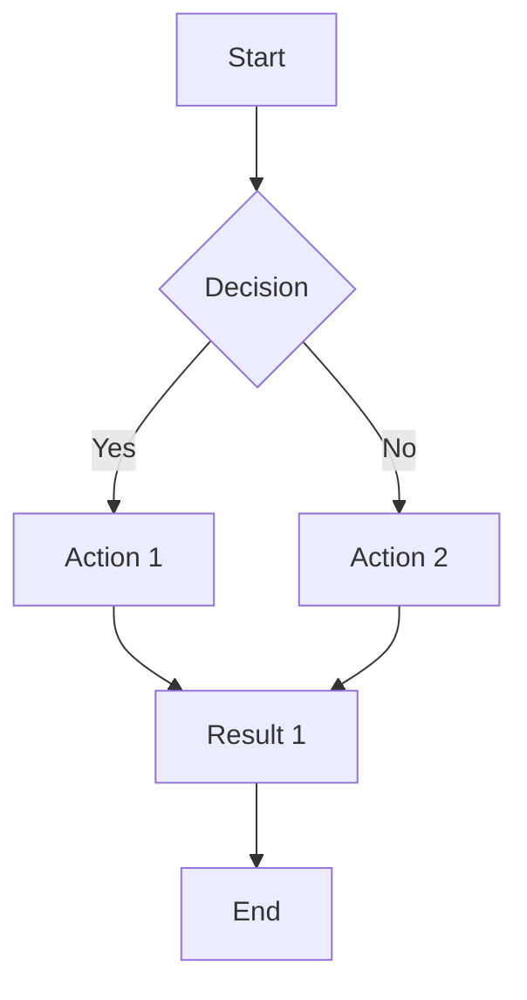
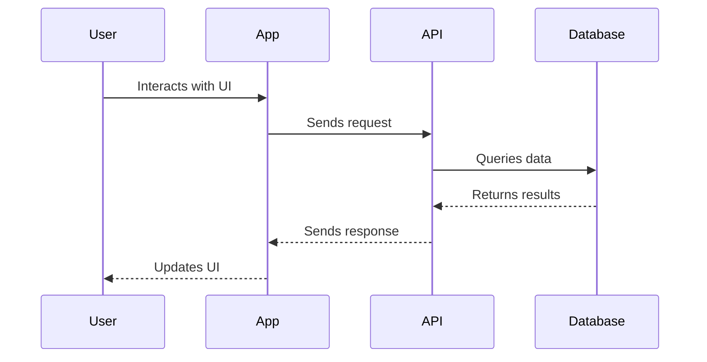
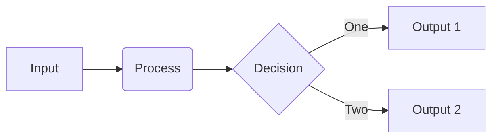

# Mintlify Component Gallery


## Overview

This page showcases all the Mintlify components available for MNKY MIND documentation. Use this as a reference when creating or updating documentation pages.

<Note>
  Copy and paste the examples from this gallery to use them in your own documentation.
</Note>

## Basic Components

### Cards

Cards are used to highlight key information or group related content.

<Card title="Single Card Example" icon="lightbulb">
  This is a single card that can contain any content, including text, lists, and even code blocks.
</Card>

#### Card Groups

<CardGroup cols={3}>
  <Card title="First Card" icon="code">
    Use cards in groups to organize content
  </Card>
  <Card title="Second Card" icon="wrench">
    Each card can have its own icon
  </Card>
  <Card title="Third Card" icon="rocket">
    And they can be arranged in columns
  </Card>
</CardGroup>

#### Linked Cards

<CardGroup cols={2}>
  <Card title="Documentation Guide" icon="book" href="/developer-resources/documentation-guide">
    Internal link to another documentation page
  </Card>
  <Card title="External Resource" icon="arrow-up-right-from-square" href="https://mintlify.com/docs" target="_blank">
    External link that opens in a new tab
  </Card>
</CardGroup>

### Tabs

Tabs are useful for presenting alternative content or different variations of the same concept.

<Tabs>
  <Tab title="TypeScript">
    ```typescript
    function greet(name: string): string {
      return `Hello, ${name}!`;
    }
    ```
  </Tab>
  <Tab title="JavaScript">
    ```javascript
    function greet(name) {
      return `Hello, ${name}!`;
    }
    ```
  </Tab>
  <Tab title="Python">
    ```python
    def greet(name):
        return f"Hello, {name}!"
    ```
  </Tab>
</Tabs>

### Steps

Steps are used for sequential processes or instructions.

<Steps>
  <Step title="First Step">
    This is the first step in the process. You can include any content here.
    
    ```bash
    npm install @moodmnky/ui-components
    ```
  </Step>
  <Step title="Second Step">
    After completing the first step, move on to this one.
    
    - You can include lists
    - And other formatted content
  </Step>
  <Step title="Final Step">
    Complete the process with this last step.
    
    <Note>
      You can even nest other components inside steps.
    </Note>
  </Step>
</Steps>

### Accordions

Accordions are useful for hiding lengthy content that not all users need to see.

<AccordionGroup>
  <Accordion title="Basics" icon="info-circle">
    Basic information that expands when clicked.
    
    - You can include any content inside
    - Including lists, code, and other elements
  </Accordion>
  <Accordion title="Advanced Usage" icon="wand-magic-sparkles">
    More detailed information for advanced users.
    
    ```typescript
    // Advanced code example
    const advancedOptions: AdvancedOptions = {
      enableFeature: true,
      logLevel: "debug",
      customHandlers: [
        new EventHandler("event", async (evt) => {
          await processEvent(evt);
        })
      ]
    };
    ```
  </Accordion>
</AccordionGroup>

### Callouts

Various callout styles to highlight different types of information.

<Note>
  This is a standard note for general information and tips.
</Note>

<Warning>
  This is a warning to alert users about potential issues or important considerations.
</Warning>

<Info>
  This is an info box for additional context that might be helpful.
</Info>

<Tip>
  This is a tip to provide best practices or shortcuts.
</Tip>

<Check>
  This is a success message to confirm that something works correctly.
</Check>

<Danger>
  This highlights critical information that could cause serious problems if ignored.
</Danger>

## Code Components

### Code Blocks

Standard code blocks with syntax highlighting.

```typescript
// TypeScript example
interface User {
  id: string;
  name: string;
  email: string;
  preferences: {
    theme: 'light' | 'dark' | 'system';
    notifications: boolean;
  };
}

function updateUserTheme(userId: string, theme: 'light' | 'dark' | 'system'): Promise<User> {
  return api.users.update(userId, {
    preferences: {
      theme
    }
  });
}
```

### Code Block with Title

```typescript title="src/api/users.ts"
// Code with a filename title
export async function getUser(userId: string): Promise<User> {
  const response = await fetch(`/api/users/${userId}`);
  if (!response.ok) {
    throw new Error(`Failed to fetch user: ${response.statusText}`);
  }
  return response.json();
}
```

### Code Block with Line Highlighting

```typescript showLineNumbers {3-6} title="src/components/UserProfile.tsx"
import { useState, useEffect } from 'react';

// These highlighted lines show the important part
function UserProfile({ userId }) {
  const [user, setUser] = useState(null);
  const [loading, setLoading] = useState(true);
  
  useEffect(() => {
    // Rest of the component
  }, [userId]);
  
  // Component rendering logic
}
```

## Diagrams

### Mermaid Diagrams

Mermaid can be used to create various types of diagrams.



### Sequence Diagram



### Flowchart



## Images and Media

### Standard Image


### Styled Image


### Image with Caption

<figure>
  
  <figcaption className="text-center text-sm text-gray-600 mt-2">
    Figure 1: Description of the image and what it represents
  </figcaption>
</figure>

## Layout Components

### Two-Column Layout

<div className="grid grid-cols-2 gap-4">
  <div>
    This is the left column. You can put any content here.
    
    - List item 1
    - List item 2
    - List item 3
  </div>
  <div>
    This is the right column. You can put different content here.
    
    ```typescript
    const rightColumnExample = "Code in right column";
    ```
  </div>
</div>

### Frame

<Frame>
  
</Frame>

### Frame with Caption

<Frame caption="Figure 2: Screenshot of the application interface">
  
</Frame>

## Interactive Components

### API Reference

<ResponseField name="user" type="object">
  User object containing all user data
  
  <Expandable title="Properties">
    <ResponseField name="id" type="string">
      Unique identifier for the user
    </ResponseField>
    <ResponseField name="name" type="string">
      User's full name
    </ResponseField>
    <ResponseField name="email" type="string">
      User's email address
    </ResponseField>
    <ResponseField name="role" type="string">
      User's role in the system (e.g., "admin", "user")
    </ResponseField>
    <ResponseField name="created_at" type="string">
      ISO timestamp when the user was created
    </ResponseField>
  </Expandable>
</ResponseField>

### Parameters

<ParamField query="filter" type="string">
  Filter results by specific criteria
</ParamField>

<ParamField query="limit" type="number" default="10">
  Maximum number of results to return
</ParamField>

<ParamField header="Authorization" type="string" required>
  Bearer token for authentication
</ParamField>

### Expandable Section

<Expandable title="Show more details">
  This content is hidden by default and can be expanded by clicking.
  
  - Perfect for additional details
  - Or content that not everyone needs to see
  - But should be available when necessary
</Expandable>

## Tables

### Standard Table

| Name | Type | Description |
|------|------|-------------|
| id | string | Unique identifier |
| name | string | Display name |
| created_at | timestamp | Creation date and time |
| status | enum | Status (active, inactive, pending) |

### Interactive Table with Search

<table>
  <thead>
    <tr>
      <th>Property</th>
      <th>Type</th>
      <th>Default</th>
      <th>Description</th>
    </tr>
  </thead>
  <tbody>
    <tr>
      <td>enableFeature</td>
      <td>boolean</td>
      <td>false</td>
      <td>Whether to enable the feature</td>
    </tr>
    <tr>
      <td>maxItems</td>
      <td>number</td>
      <td>10</td>
      <td>Maximum number of items to display</td>
    </tr>
    <tr>
      <td>itemType</td>
      <td>string</td>
      <td>"default"</td>
      <td>Type of items to display (default, compact, detailed)</td>
    </tr>
    <tr>
      <td>onSelect</td>
      <td>function</td>
      <td>undefined</td>
      <td>Callback function invoked when an item is selected</td>
    </tr>
  </tbody>
</table>

## Advanced Components

### Math Equations

Math can be written in LaTeX format:

```latex
$$
f(x) = \int_{-\infty}^{\infty} \hat{f}(\xi) e^{2\pi i \xi x} d\xi
$$
```

### Code File

<CodeGroup>
  ```typescript src/components/UserProfile.tsx
  import React, { useState, useEffect } from 'react';
  import { fetchUserData } from '../api/users';
  import { ProfileHeader } from './ProfileHeader';
  import { ProfileDetails } from './ProfileDetails';
  
  interface UserProfileProps {
    userId: string;
  }
  
  export function UserProfile({ userId }: UserProfileProps) {
    const [user, setUser] = useState(null);
    const [loading, setLoading] = useState(true);
    const [error, setError] = useState(null);
    
    useEffect(() => {
      async function loadUser() {
        try {
          setLoading(true);
          const userData = await fetchUserData(userId);
          setUser(userData);
        } catch (err) {
          setError(err.message);
        } finally {
          setLoading(false);
        }
      }
      
      loadUser();
    }, [userId]);
    
    if (loading) return <div>Loading user data...</div>;
    if (error) return <div>Error: {error}</div>;
    if (!user) return <div>User not found</div>;
    
    return (
      <div className="user-profile">
        <ProfileHeader
          name={user.name}
          avatar={user.avatar}
          role={user.role}
        />
        <ProfileDetails user={user} />
      </div>
    );
  }
  ```
</CodeGroup>

### Tooltip

This text has a <Tooltip tip="This is additional information that appears on hover">tooltip</Tooltip> that provides more information.

## How to Use This Gallery

1. Browse through the components to find what you need
2. Click on the "Copy" button in the code blocks to copy the example
3. Paste into your documentation and customize
4. Refer to the [Documentation Guide](/developer-resources/documentation-guide) for best practices

<Note>
  This gallery is a living document and will be updated as new components become available or best practices evolve.
</Note>

---

For questions about Mintlify components, please refer to the [official Mintlify documentation](https://mintlify.com/docs/components/overview) or contact the MOOD MNKY documentation team.