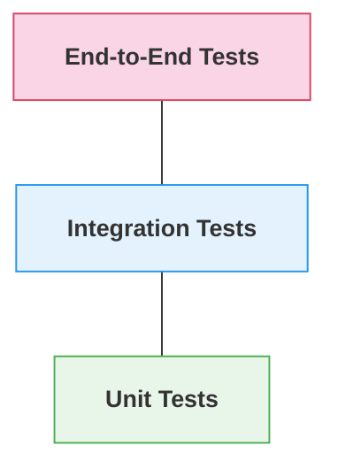

# Testing Strategy

This document outlines our testing approach for ensuring the quality, reliability, and performance of the MOOD MNKY platform.

## Testing Principles

Our testing strategy is built on these core principles:

- **Shift Left**: Test early and often throughout the development lifecycle
- **Automation First**: Automate tests wherever possible for consistency and efficiency
- **Risk-Based**: Focus testing efforts on high-impact and high-risk areas
- **Full Coverage**: Test at all levels from unit to end-to-end
- **Consumer-Driven**: Base test cases on actual user journeys and requirements

## Testing Pyramid

We follow the testing pyramid approach to balance testing types:



- **Many Unit Tests**: Fast, focused, testing individual functions and components
- **Some Integration Tests**: Testing interactions between components
- **Few E2E Tests**: Testing complete user flows and critical paths

## Test Types

<Tabs>
  <Tab title="Unit Tests">
    **Purpose**: Verify individual functions, methods, and components work correctly in isolation
    
    **Tools**:
    - **Frontend**: Jest, Vue Test Utils, React Testing Library
    - **Backend**: Jest, Mocha, pytest
    
    **Best Practices**:
    - Focus on testing logic, not implementation details
    - Use mocks for external dependencies
    - Aim for high code coverage (>80%)
    - Keep tests fast and isolated
    
    <CodeGroup>
    ```typescript Unit Test Example
    // utils/formatCurrency.test.ts
    import { formatCurrency } from './formatCurrency';
    
    describe('formatCurrency', () => {
      it('formats USD correctly', () => {
        expect(formatCurrency(1234.56, 'USD')).toBe('$1,234.56');
      });
    
      it('formats EUR correctly', () => {
        expect(formatCurrency(1234.56, 'EUR')).toBe('€1,234.56');
      });
    
      it('handles zero values', () => {
        expect(formatCurrency(0, 'USD')).toBe('$0.00');
      });
    
      it('handles negative values', () => {
        expect(formatCurrency(-1234.56, 'USD')).toBe('-$1,234.56');
      });
    });
    ```
    </CodeGroup>
  </Tab>
  
  <Tab title="Integration Tests">
    **Purpose**: Verify interactions between components and services
    
    **Tools**:
    - **Frontend**: Cypress component testing, Vitest
    - **Backend**: Supertest, testcontainers
    - **API**: Postman, REST-assured
    
    **Best Practices**:
    - Focus on boundaries between systems
    - Use test doubles when appropriate
    - Test error handling and edge cases
    - Validate data transformations
    
    <CodeGroup>
    ```typescript API Integration Test
    // services/orders/tests/createOrder.test.ts
    import request from 'supertest';
    import { app } from '../src/app';
    import { createTestUser, createTestProduct } from './helpers';
    import { prisma } from '../src/db';
    
    describe('POST /api/orders', () => {
      let user;
      let product;
      
      beforeAll(async () => {
        user = await createTestUser();
        product = await createTestProduct();
      });
      
      afterAll(async () => {
        await prisma.cleanDatabase();
      });
      
      it('creates a new order successfully', async () => {
        const response = await request(app)
          .post('/api/orders')
          .set('Authorization', `Bearer ${user.token}`)
          .send({
            items: [{ productId: product.id, quantity: 2 }],
            shippingAddress: {
              street: '123 Test St',
              city: 'Testville',
              state: 'TS',
              zipCode: '12345',
              country: 'US'
            }
          });
        
        expect(response.status).toBe(201);
        expect(response.body.id).toBeDefined();
        expect(response.body.status).toBe('pending');
        expect(response.body.items).toHaveLength(1);
        expect(response.body.items[0].productId).toBe(product.id);
      });
      
      it('returns 400 for invalid order data', async () => {
        const response = await request(app)
          .post('/api/orders')
          .set('Authorization', `Bearer ${user.token}`)
          .send({ items: [] });
        
        expect(response.status).toBe(400);
        expect(response.body.error).toBeDefined();
      });
    });
    ```
    </CodeGroup>
  </Tab>
  
  <Tab title="E2E Tests">
    **Purpose**: Verify complete user flows and critical business processes
    
    **Tools**:
    - Cypress
    - Playwright
    - Selenium WebDriver
    
    **Best Practices**:
    - Focus on critical user journeys
    - Use realistic test data
    - Test across supported browsers
    - Keep tests independent and resilient
    
    <CodeGroup>
    ```typescript E2E Test Example
    // cypress/e2e/checkout.cy.ts
    describe('Checkout Process', () => {
      beforeEach(() => {
        cy.intercept('GET', '/api/products*').as('getProducts');
        cy.intercept('POST', '/api/orders').as('createOrder');
        cy.intercept('POST', '/api/payments').as('processPayment');
        
        // Login and setup test state
        cy.login('test@example.com', 'password123');
      });
      
      it('allows a user to complete checkout with a custom product', () => {
        // Add product to cart
        cy.visit('/products/candles');
        cy.wait('@getProducts');
        cy.contains('Serenity Candle').click();
        cy.contains('Add to Cart').click();
        cy.contains('1 item in cart');
        
        // Go to cart and proceed to checkout
        cy.contains('View Cart').click();
        cy.contains('Proceed to Checkout').click();
        
        // Fill shipping information
        cy.get('[data-testid="address-form"]').within(() => {
          cy.get('[name="street"]').type('123 Test St');
          cy.get('[name="city"]').type('Testville');
          cy.get('[name="state"]').select('CA');
          cy.get('[name="zipCode"]').type('90210');
        });
        cy.contains('Continue to Payment').click();
        
        // Fill payment information
        cy.get('[data-testid="payment-form"]').within(() => {
          cy.get('[name="cardNumber"]').type('4242424242424242');
          cy.get('[name="cardExpiry"]').type('12/30');
          cy.get('[name="cardCvc"]').type('123');
        });
        cy.contains('Complete Order').click();
        
        // Verify order completion
        cy.wait('@createOrder');
        cy.wait('@processPayment');
        cy.contains('Order Confirmation');
        cy.contains('Thank you for your order!');
        cy.contains('Order #').should('be.visible');
      });
    });
    ```
    </CodeGroup>
  </Tab>
</Tabs>

## Specialized Testing

<AccordionGroup>
  <Accordion title="API Testing">
    **Approach**: Comprehensive testing of API endpoints for functionality, reliability, and security
    
    **Tools**:
    - Postman collections for manual testing
    - Supertest for automated API tests
    - OpenAPI validation for contract testing
    
    **Test Scenarios**:
    - Positive and negative test cases
    - Authentication and authorization
    - Rate limiting and throttling
    - Error handling and status codes
    - Request validation
    - Response schema validation
    
    **Documentation**: All API tests should be documented and maintained alongside the API specification
  </Accordion>
  
  <Accordion title="Performance Testing">
    **Approach**: Regular testing to ensure the system meets performance requirements under various conditions
    
    **Tools**:
    - K6 for load testing
    - Lighthouse for frontend performance
    - New Relic for monitoring and profiling
    
    **Test Types**:
    - Load testing (normal operating conditions)
    - Stress testing (beyond normal capacity)
    - Soak testing (extended duration)
    - Spike testing (sudden increase in load)
    
    **Key Metrics**:
    - Response time (average, 95th percentile)
    - Throughput (requests per second)
    - Error rate
    - Resource utilization (CPU, memory, network)
    - Time to First Byte (TTFB)
    - Core Web Vitals (LCP, FID, CLS)
  </Accordion>
  
  <Accordion title="Security Testing">
    **Approach**: Regular security testing to identify and address vulnerabilities
    
    **Tools**:
    - OWASP ZAP for automated scanning
    - SonarQube for code analysis
    - npm audit / Snyk for dependency scanning
    
    **Test Types**:
    - Static Application Security Testing (SAST)
    - Dynamic Application Security Testing (DAST)
    - Dependency scanning
    - Penetration testing (quarterly)
    
    **Focus Areas**:
    - Authentication and authorization
    - Data protection and privacy
    - Input validation and sanitization
    - Session management
    - API security
    - Dependency vulnerabilities
  </Accordion>
  
  <Accordion title="Accessibility Testing">
    **Approach**: Ensure applications are accessible to all users, including those with disabilities
    
    **Tools**:
    - Axe for automated accessibility testing
    - WAVE for visual accessibility testing
    - Lighthouse for accessibility audits
    
    **Standards**:
    - WCAG 2.1 AA compliance
    
    **Testing Methods**:
    - Automated testing (integrated in CI/CD)
    - Manual testing with screen readers
    - Keyboard navigation testing
    - Color contrast verification
  </Accordion>
</AccordionGroup>

## Testing in CI/CD

<Steps>
  <Step title="Continuous Integration">
    All code changes trigger automated tests through GitHub Actions:
    
    - Linting and static analysis
    - Unit tests
    - Integration tests
    - Code coverage reporting
    - Performance budget verification
    
    PRs cannot be merged without passing all CI checks.
  </Step>
  <Step title="Pre-deployment Testing">
    Before deployment to staging:
    
    - API contract tests
    - Database migration tests
    - Security scans
    - Performance tests (basic)
    
    Failures block deployment to staging.
  </Step>
  <Step title="Staging Environment">
    After deployment to staging:
    
    - Automated E2E tests
    - Smoke tests
    - Manual exploratory testing
    - User acceptance testing
    
    Issues block promotion to production.
  </Step>
  <Step title="Production Verification">
    After deployment to production:
    
    - Smoke tests on production
    - Canary testing for high-risk deployments
    - Synthetic monitoring
    - Observability validations
  </Step>
</Steps>

## Test Data Management

<Card title="Test Data Strategy" icon="database">
  **Approaches**:
  
  - **Test fixtures**: Small, purpose-built datasets for unit tests
  - **Factories**: Dynamic test data generation using tools like Faker
  - **Anonymized production data**: For realistic integration testing
  - **Seeded databases**: Consistent starting point for all tests
  
  **Best Practices**:
  
  - Isolate test data between test runs
  - Reset state before each test
  - Use realistic but anonymized data
  - Avoid dependencies between tests
  - Store test data separately from test logic
</Card>

## Testing Standards

<Table>
  <Thead>
    <Tr>
      <Th>Category</Th>
      <Th>Requirement</Th>
      <Th>Enforcement</Th>
    </Tr>
  </Thead>
  <Tbody>
    <Tr>
      <Td>Code Coverage</Td>
      <Td>80% minimum for unit tests</Td>
      <Td>CI check, Codecov report</Td>
    </Tr>
    <Tr>
      <Td>Critical Path Testing</Td>
      <Td>100% E2E coverage of critical user journeys</Td>
      <Td>Manual verification, test plan review</Td>
    </Tr>
    <Tr>
      <Td>Performance</Td>
      <Td>Lighthouse score > 90, API responses < 200ms</Td>
      <Td>CI check, performance monitoring</Td>
    </Tr>
    <Tr>
      <Td>Accessibility</Td>
      <Td>WCAG 2.1 AA compliance</Td>
      <Td>Automated testing, manual verification</Td>
    </Tr>
    <Tr>
      <Td>Security</Td>
      <Td>No high/critical vulnerabilities</Td>
      <Td>Security scanning, dependency checks</Td>
    </Tr>
  </Tbody>
</Table>

## Testing Responsibilities

<CardGroup cols={3}>
  <Card title="Developers" icon="code">
    - Write and maintain unit tests
    - Write integration tests for services
    - Run tests locally before pushing code
    - Fix failing tests in CI
    - Follow test-driven development when appropriate
  </Card>
  <Card title="QA Engineers" icon="magnifying-glass">
    - Develop and execute test plans
    - Write and maintain E2E tests
    - Perform exploratory testing
    - Create performance test scenarios
    - Verify accessibility compliance
  </Card>
  <Card title="DevOps" icon="gears">
    - Maintain test infrastructure
    - Ensure test reliability in CI/CD
    - Monitor test metrics and trends
    - Optimize test execution time
    - Setup production monitoring
  </Card>
</CardGroup>

## Test Documentation

Maintain comprehensive test documentation:

- **Test Plans**: Document test objectives, scope, approach, and resources
- **Test Cases**: Detailed steps, expected results, and prerequisites
- **Test Reports**: Results, defects found, and coverage metrics
- **Test Strategy**: Overall testing approach and standards (this document)

## Conclusion

Our testing strategy is designed to ensure high-quality software releases while balancing thoroughness with efficiency. By following these guidelines, we aim to deliver a robust, reliable platform that meets our users' needs and expectations.

---

<Info>
  This document should be reviewed and updated quarterly to incorporate new testing techniques, tools, and changing project requirements.
</Info> 