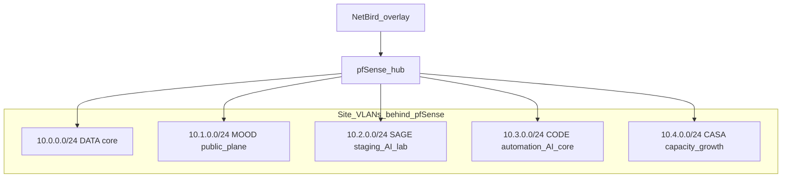

This page is the **canonical reference for layer-3 segment identity**: what each `/24` is for, which Proxmox node anchors it, and how it relates to the edge (**pfSense**) and overlay (**NetBird**). For live VM/LXC inventory, use the [Data Center Map](/docs/infra/data-center/data-center-map). For operator secrets and env keys, use [Datacenter Environment Inventory](/docs/infra/data-center/datacenter-env) (never commit secrets to Mintlify).

## How segments fit together

Site VLANs terminate at **pfSense** on **MNKY-HQ**. Remote peers reach them through **NetBird** to **pfSense** hub routing (not via competing subnet routers on hypervisors). See [Edge network overview](/docs/infra/edge-network/overview) and [NetBird](/docs/infra/edge-network/netbird) for routes and groups.

## Summary table

| CIDR | MNKY identity | Proxmox node (mgmt IP) | Primary intent | Typical exposure | Anchor services (examples) |
|------|----------------|-------------------------|----------------|------------------|----------------------------|
| `10.0.0.0/24` | **DATA** — site core | DATA-MNKY `10.0.0.10` | Stable core LAN: storage, monitoring, edge proxies, home or IoT-adjacent clients | Mostly internal; public names via Traefik or Cloudflare where published | TrueNAS `10.0.0.5`, NetBird control plane `10.0.0.20`, Traefik `10.0.0.25`, Coolify HQ `10.0.0.115`, Harbor `10.0.0.102` |
| `10.1.0.0/24` | **MOOD** — public production plane | MOOD-MNKY `10.1.0.10` | Customer-facing and prod-quality apps, media, gaming-related stacks | Public hostnames on moodmnky.com (Traefik, Coolify, Cloudflare) | Media stack LXC, Coolify MOOD `10.1.0.115`; see [Media stack](/docs/infra/data-center/media-stack) |
| `10.2.0.0/24` | **SAGE** — staging / lab | SAGE-MNKY `10.2.0.10` | Staging, experiments, large local pool (STUD-zfs), secondary AI or GPU (e.g. vision, Comfy UI) | Prefer internal; front user-facing APIs from MOOD or Traefik when needed | [SAGE-MNKY](/docs/infra/data-center/sage-mnky-node) |
| `10.3.0.0/24` | **CODE** — automation + AI core | CODE-MNKY `10.3.0.10` | Primary GPU (Tesla P40), automation DBs, workflow engines, LLM serving | Mixed: internal LAN plus published URLs for select services | Supabase VM, n8n VM, PegaProx LXC; Ollama at `10.3.0.33:11434` (confirmed reachable from the datacenter LAN); see [CODE-MNKY](/docs/infra/data-center/code-mnky-node), [LXC inventory](/docs/infra/data-center/code-mnky-lxc-inventory) |
| `10.4.0.0/24` | **CASA** — capacity / growth | CASA-MNKY `10.4.0.10` | Spare general-purpose capacity, migrations, workloads isolated from MOOD public path and CODE automation core | Default internal | [CASA-MNKY](/docs/infra/data-center/casa-mnky-node) |

An additional routed internal segment **`10.0.13.0/24`** (DATA internal, vmbr1) appears in NetBird route inventory; treat it as **infrastructure on the DATA side**, not a separate MNKY brand plane. See [NetBird](/docs/infra/edge-network/netbird).

## Per-segment narrative

### 10.0.0.0/24 — DATA (site core)

DATA is the **most stable anchor** next to the WAN path: default-gateway adjacency, **TrueNAS**, **self-hosted NetBird**, **Traefik**, **Coolify HQ**, container registry, and typical **monitoring** targets. Home-adjacent clients (for example Shield on the same L2 or L3 design) consume SMB or internal services here. This is **not** the primary segment for MOOD public customer apps; those lean on **10.1.0.0/24** and published hostnames.

### 10.1.0.0/24 — MOOD (public production plane)

MOOD hosts **production-quality, outward-facing** workloads: **Coolify MOOD**, the **media stack** (Jellyfin, arr suite, qBittorrent), and other apps you expect to expose or treat as prod. Traffic often leaves via **Traefik** on DATA and **Cloudflare**; keep segmentation in mind when opening firewall paths from WAN or overlay.

### 10.2.0.0/24 — SAGE (staging, storage-heavy lab)

SAGE is the **staging and experimentation** plane with a large dedicated ZFS pool (**STUD-zfs**). Use it for **smaller projects**, replicas, and **GPU-backed internal APIs** (for example local vision or Comfy UI). Think of an internal API layer here as **inference or tooling** that MOOD or edge proxies might call, not as a substitute for hosted cloud control planes.

### 10.3.0.0/24 — CODE (automation + primary AI accelerator)

CODE is the **automation and AI accelerator** host: **NVIDIA Tesla P40**, canonical **Supabase** and **n8n** VMs, **PegaProx**, and **Ollama** (for example `10.3.0.33:11434` on the CODE VLAN). It is the default home for **heavy automation**, **databases used by agents**, and **GPU inference** that the rest of the estate depends on. Reconcile exact IPs with live Proxmox and the [Data Center Map](/docs/infra/data-center/data-center-map) after changes.

### 10.4.0.0/24 — CASA (capacity and isolation)

CASA provides **general-purpose cluster capacity** without pinning you to MOOD public-facing posture or CODE core automation. Use it for **migration targets**, **burst capacity**, or experiments that should remain **logically separate** from production customer paths while still joining cluster storage (for example **hyper-mnky-shared** NFS).

## MNKY-HQ (standalone)

**MNKY-HQ** is **not** one of the five cluster nodes in the summary table. It hosts **pfSense** and cluster-adjacent networking; management may use a distinct prefix (for example `101.0.0.0/24` — see [MNKY-HQ node](/docs/infra/data-center/mnky-hq-node)). Do not conflate HQ management space with **DATA `10.0.0.0/24`**.

## Overlay (NetBird)

NetBird uses **CGNAT `100.64.0.0/10`** on peer interfaces (`wt0`). **RFC1918 site routes** (`10.0.0.0/24` through `10.4.0.0/24` and internal segments) are advertised from the **pfSense** hub peer. Details: [NetBird](/docs/infra/edge-network/netbird).

## Operational hygiene

When you add or move a service:

1. Record which **segment** it belongs to and whether it is **internal-only** or **internet-published**.
2. Update **datacenter.env** (or Infisical) variable blocks — see [Datacenter Environment Inventory](/docs/infra/data-center/datacenter-env).
3. Refresh the [Data Center Map](/docs/infra/data-center/data-center-map) and any affected node deep dives.

## Related pages

<CardGroup cols={2}>
  <Card title="Edge network overview" icon="shield" href="/docs/infra/edge-network/overview">
    pfSense + NetBird traffic model and RFC1918 listing.
  </Card>
  <Card title="Storage and network topology" icon="hard-drive" href="/docs/infra/data-center/storage-and-network">
    ZFS pools, NFS, and physical or logical storage paths.
  </Card>
  <Card title="Data Center Map" icon="map" href="/docs/infra/data-center/data-center-map">
    Live-style inventory of nodes, VMs, and LXCs.
  </Card>
  <Card title="Datacenter env inventory" icon="key" href="/docs/infra/data-center/datacenter-env">
    Operator env layout and secret-handling rules.
  </Card>
</CardGroup>
