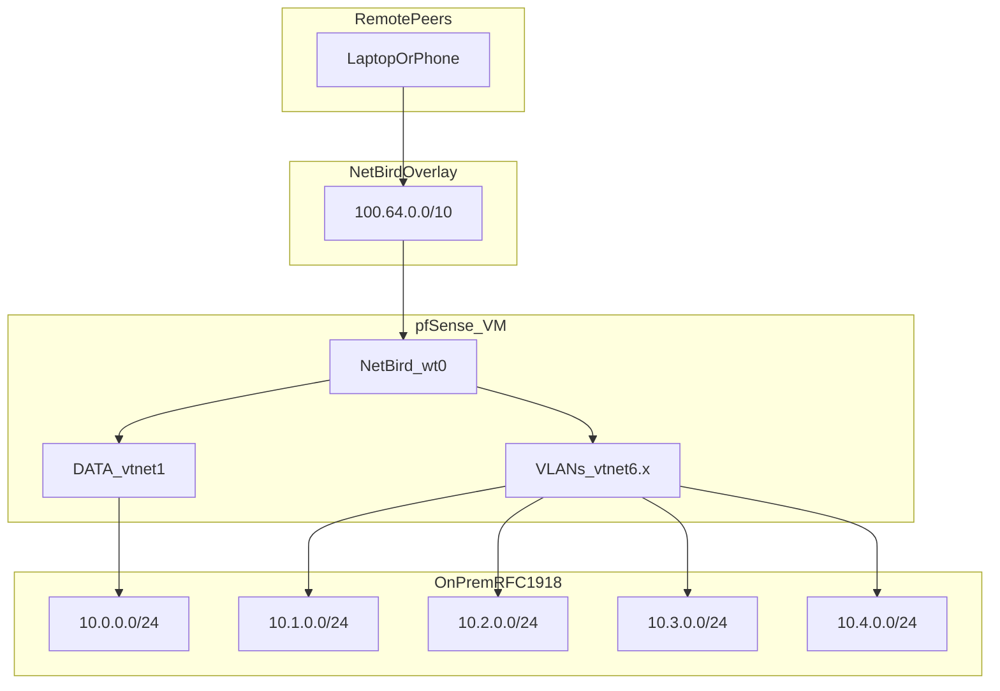

This page is the **internal source of truth** for how remote access and site routing fit together: **pfSense** at the LAN edge, **NetBird** as the overlay and control plane, and **Proxmox** nodes as workload hosts. It complements the [Data Center Map](/docs/infra/data-center/data-center-map) (what runs on cluster nodes) with **how traffic enters RFC1918 networks from the internet**.

<Note>
  Operational detail also lives in the private repo under `docs/network/` (Markdown). These Mintlify pages are the **published** mirror for engineers using **docs.moodmnky.com**. Keep both in sync when topology or route IDs change.
</Note>

<Note>
  **Split DNS (NetBird → pfSense):** the nameserver group **`Internal mnky.internal (pfSense)`** forwards **`mnky.internal`**, **`moodmnky.local`**, and **`mnkylab.moodmnky.com`** to **`10.0.0.1`**. LAN-style monitoring and infra names are typically **`*.mnkylab.moodmnky.com`** (e.g. `grafana.mnkylab.moodmnky.com`). Public apps stay on **`moodmnky.com`** via Traefik/Coolify/Cloudflare.
</Note>

## What we have now (summary)

| Layer | Role | Location / anchor |
| ----- | ---- | ----------------- |
| **Edge router** | Default gateway for DATA + inter-site VLANs; WAN, NAT, port forwards | **pfSense** VM on **MNKY-HQ** (`10.0.0.1` on DATA); see [pfSense edge](/docs/infra/edge-network/pfsense) |
| **NetBird overlay** | WireGuard mesh + CGNAT range `100.64.0.0/10`; client `wt0` on peers | Every NetBird-enabled host; **authoritative subnet router** is **pfSense** only |
| **NetBird control plane** | Management API, Signal, Relay, STUN; dashboard UI | Docker on **LXC 102** at **`10.0.0.20`** (MNKY-HQ); see [NetBird platform](/docs/infra/edge-network/netbird) |
| **Public entry** | TLS + routing to management | **`https://netbird.moodmnky.com`** via reverse proxy (**Traefik** `10.0.0.25`); STUN/WireGuard UDP forwarded from WAN to `10.0.0.20` |
| **RFC1918 islands** | Site LANs | `10.0.0.0/24` (DATA), `10.0.13.0/24` (DATA internal / routed via pfSense), `10.1.0.0/24`–`10.4.0.0/24` (site VLANs on `vtnet6.x`) — all advertised as NetBird **network routes** on pfSense |
| **Proxmox cluster** | Workloads; **not** competing subnet routers | Nodes may keep NetBird for **admin** access; **network routes** for site prefixes are **disabled** on hypervisors in favor of pfSense |
| **Identity / policy tags** | Flat **groups** (no nesting); peers in **multiple** groups | **2026-03-26:** **Hypervisors**, **Infra-Edge**, **Monitoring**, **Apps**, **Remote-Operators**, **BreakGlass** — see [NetBird platform](/docs/infra/edge-network/netbird). **Cluster hypervisors** keep **`DisableClientRoutes: true`** locally so **Corosync** never uses **`wt0`** for site prefixes. |

## Traffic model (hub-and-spoke)

Remote users and devices connect to NetBird; **routed** traffic to on-prem prefixes goes **through the pfSense peer** (not through a second Linux router on DATA unless you intentionally design HA).

## Package and version snapshot (pfSense)

As of the **2026-03-25** rollout, the pfSense NetBird packages were upgraded to align with the Docker management stack:

- **`netbird`** **0.67.0**
- **`pfSense-pkg-NetBird`** **0.2.2**

Install on FreeBSD/pfSense may require `IGNORE_OSVERSION=yes` when package ABI labels lag the running OS. See [pfSense edge](/docs/infra/edge-network/pfsense) for caveats (`wt0` assignment, UDP buffers, duplicate resolver).

## Where to read next

<CardGroup cols={2}>
  <Card title="NetBird platform" icon="globe" href="/docs/infra/edge-network/netbird">
    Docker stack, URLs, control-plane inventory (routes, hub peer, masquerade).
  </Card>
  <Card title="pfSense edge" icon="shield" href="/docs/infra/edge-network/pfsense">
    Interfaces, NAT themes, NetBird client on the firewall, DNS/hairpin.
  </Card>
  <Card title="Alignment & validation" icon="list-check" href="/docs/infra/edge-network/alignment-and-validation">
    Paths, firewall aliases, masquerade tradeoffs, post-change checklist.
  </Card>
  <Card title="Data center map" icon="server" href="/docs/infra/data-center/data-center-map">
    Proxmox nodes, VMs, and LXCs—cluster topology.
  </Card>
</CardGroup>

## Security reminders

<Warning>
  Do **not** commit Personal Access Tokens, `datacenter.env`, or `config.xml` exports to any public repo. Use a secrets manager and rotate credentials if they were ever copied to tickets or unencrypted backups.
</Warning>

- Management API auth uses **`Authorization: Token &lt;PAT&gt;`** — treat PATs like passwords.
- Exposing **`101.0.0.0/24`** (HQ management) into NetBird widens blast radius; keep it out of route sets unless there is a documented need.
