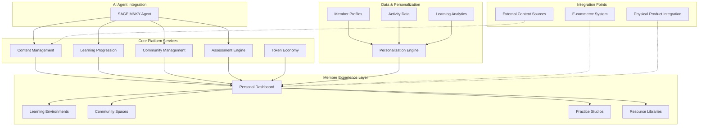
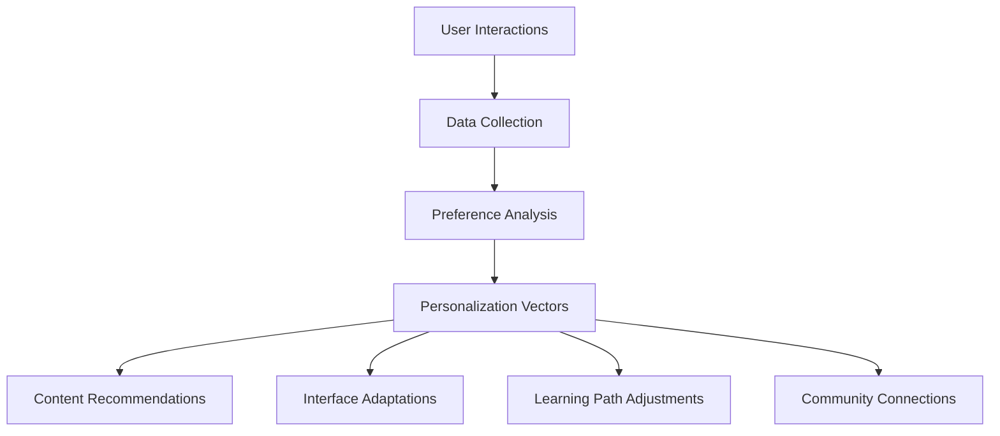
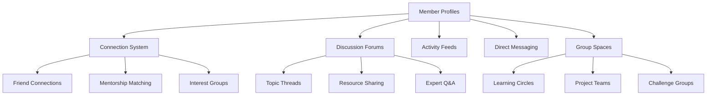
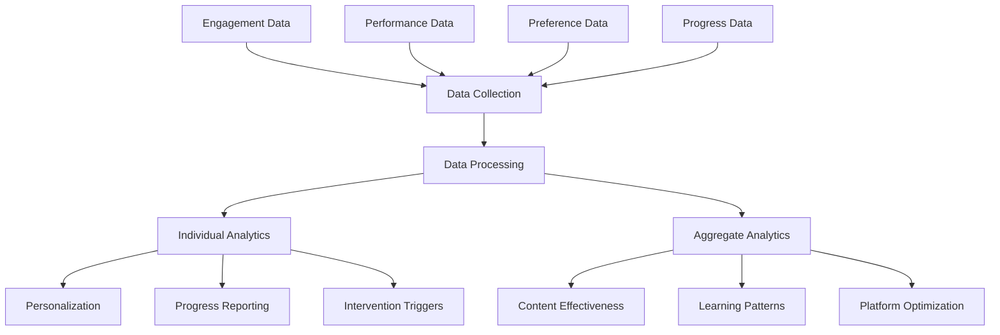

# Dojo Core Manual

<Note>
This is a starter document outlining the MOOD MNKY Dojo platform. Future iterations will include more detailed implementation guides and examples.
</Note>

## Introduction

The Dojo platform is MOOD MNKY's integrated learning and development environment, designed to create personalized "life OS" experiences for members. This manual outlines the core principles, architecture, and implementation guidelines for the Dojo platform, serving as the primary reference for developers, content creators, and platform administrators.

## Vision and Purpose

The Dojo platform exists to transform personal development from isolated learning experiences into an integrated growth journey. It combines AI-guided learning, community engagement, personalized content, and token-based incentives into a cohesive ecosystem.

### Core Principles

1. **Personalized Learning Pathways**: Adapting to individual goals, preferences, and learning styles
2. **Community-Enhanced Growth**: Leveraging collective wisdom and support
3. **Multi-sensory Integration**: Connecting digital content with physical experiences
4. **Applied Knowledge Focus**: Emphasizing practical application over passive consumption
5. **Continuous Evolution**: Learning from user engagement to improve the platform

## Platform Architecture

### System Overview

The Dojo platform consists of several integrated components:



### Key Components

<CardGroup cols={2}>
  <Card title="Learning Environment Engine" icon="graduation-cap">
    <div className="space-y-2">
      <p>Creates and manages learning spaces</p>
      <ul className="list-disc pl-5">
        <li>Environment templates</li>
        <li>Content integration</li>
        <li>Progress tracking</li>
        <li>Assessment capabilities</li>
      </ul>
    </div>
  </Card>
  
  <Card title="Community Platform" icon="users">
    <div className="space-y-2">
      <p>Enables member connections and collaboration</p>
      <ul className="list-disc pl-5">
        <li>Discussion forums</li>
        <li>Collaborative projects</li>
        <li>Mentorship matching</li>
        <li>Event management</li>
      </ul>
    </div>
  </Card>
  
  <Card title="Content Management System" icon="book-open">
    <div className="space-y-2">
      <p>Organizes and delivers learning content</p>
      <ul className="list-disc pl-5">
        <li>Multi-format content library</li>
        <li>Content creation tools</li>
        <li>Recommendation engine</li>
        <li>Content effectiveness analytics</li>
      </ul>
    </div>
  </Card>
  
  <Card title="Token Economy System" icon="coin">
    <div className="space-y-2">
      <p>Manages engagement incentives</p>
      <ul className="list-disc pl-5">
        <li>Token earning mechanisms</li>
        <li>Redemption marketplace</li>
        <li>Achievement system</li>
        <li>Economic balance tooling</li>
      </ul>
    </div>
  </Card>
</CardGroup>

## Technical Implementation

### Frontend Architecture

The Dojo platform frontend is built with:

- **Next.js**: Application framework
- **React**: UI component library
- **Tailwind CSS**: Styling framework
- **ShadCN/UI**: Component library

Key implementation patterns:

```typescript
// Example Learning Environment Component
import { useState, useEffect } from 'react';
import { useRouter } from 'next/router';
import { useEnvironment } from '@/hooks/useEnvironment';
import { EnvironmentHeader } from '@/components/environment/EnvironmentHeader';
import { ContentViewer } from '@/components/content/ContentViewer';
import { ProgressTracker } from '@/components/progress/ProgressTracker';
import { AgentAssistant } from '@/components/agent/AgentAssistant';

export default function LearningEnvironment() {
  const router = useRouter();
  const { environmentId } = router.query;
  const { environment, loading, error } = useEnvironment(environmentId);
  
  if (loading) return <EnvironmentSkeleton />;
  if (error) return <ErrorDisplay message={error.message} />;
  
  return (
    <div className="flex flex-col min-h-screen">
      <EnvironmentHeader 
        title={environment.title}
        description={environment.description}
        progress={environment.progress}
      />
      
      <div className="flex flex-col lg:flex-row flex-1">
        <div className="lg:w-3/4">
          <ContentViewer 
            content={environment.currentContent}
            onComplete={environment.markContentComplete}
          />
        </div>
        
        <div className="lg:w-1/4 border-l border-gray-200">
          <ProgressTracker 
            modules={environment.modules}
            currentModuleId={environment.currentModuleId}
            onModuleSelect={environment.selectModule}
          />
          
          <AgentAssistant 
            environmentId={environmentId}
            contextType="learning"
          />
        </div>
      </div>
    </div>
  );
}
```

### Backend Services

Core backend services include:

1. **Environment Service**
   - Environment template management
   - Instance creation and configuration
   - Progress tracking and state management
   - Environment recommendations

2. **Content Service**
   - Content storage and retrieval
   - Metadata management
   - Content recommendation engine
   - Content effectiveness analytics

3. **Community Service**
   - Member profiles and connections
   - Discussion management
   - Activity feeds
   - Moderation tools

4. **Token Economy Service**
   - Token ledger management
   - Earning rule definitions
   - Redemption marketplace
   - Economic health monitoring

### Database Schema

The Dojo platform uses Supabase (PostgreSQL) with this core schema:

```sql
-- Example schema (simplified)

-- Users and Profiles
CREATE TABLE profiles (
  id UUID REFERENCES auth.users NOT NULL PRIMARY KEY,
  display_name TEXT,
  bio TEXT,
  avatar_url TEXT,
  preferences JSONB,
  created_at TIMESTAMP WITH TIME ZONE DEFAULT NOW(),
  updated_at TIMESTAMP WITH TIME ZONE DEFAULT NOW()
);

-- Learning Environments
CREATE TABLE environments (
  id UUID PRIMARY KEY DEFAULT uuid_generate_v4(),
  title TEXT NOT NULL,
  description TEXT,
  template_id UUID REFERENCES environment_templates,
  owner_id UUID REFERENCES profiles NOT NULL,
  is_public BOOLEAN DEFAULT FALSE,
  settings JSONB,
  created_at TIMESTAMP WITH TIME ZONE DEFAULT NOW(),
  updated_at TIMESTAMP WITH TIME ZONE DEFAULT NOW()
);

-- Environment Templates
CREATE TABLE environment_templates (
  id UUID PRIMARY KEY DEFAULT uuid_generate_v4(),
  title TEXT NOT NULL,
  description TEXT,
  icon TEXT,
  modules JSONB,
  category TEXT,
  is_featured BOOLEAN DEFAULT FALSE,
  created_at TIMESTAMP WITH TIME ZONE DEFAULT NOW(),
  updated_at TIMESTAMP WITH TIME ZONE DEFAULT NOW()
);

-- Content Library
CREATE TABLE content_items (
  id UUID PRIMARY KEY DEFAULT uuid_generate_v4(),
  title TEXT NOT NULL,
  description TEXT,
  content_type TEXT NOT NULL,
  content_data JSONB NOT NULL,
  metadata JSONB,
  tags TEXT[],
  created_by UUID REFERENCES profiles,
  is_published BOOLEAN DEFAULT FALSE,
  created_at TIMESTAMP WITH TIME ZONE DEFAULT NOW(),
  updated_at TIMESTAMP WITH TIME ZONE DEFAULT NOW()
);

-- Learning Progress
CREATE TABLE progress_records (
  id UUID PRIMARY KEY DEFAULT uuid_generate_v4(),
  user_id UUID REFERENCES profiles NOT NULL,
  environment_id UUID REFERENCES environments NOT NULL,
  module_id TEXT NOT NULL,
  content_id UUID REFERENCES content_items,
  status TEXT NOT NULL,
  completion_date TIMESTAMP WITH TIME ZONE,
  assessment_results JSONB,
  created_at TIMESTAMP WITH TIME ZONE DEFAULT NOW(),
  updated_at TIMESTAMP WITH TIME ZONE DEFAULT NOW(),
  UNIQUE(user_id, environment_id, module_id, content_id)
);

-- Token Transactions
CREATE TABLE token_transactions (
  id UUID PRIMARY KEY DEFAULT uuid_generate_v4(),
  user_id UUID REFERENCES profiles NOT NULL,
  amount INTEGER NOT NULL,
  transaction_type TEXT NOT NULL,
  reference_id UUID,
  reference_type TEXT,
  metadata JSONB,
  created_at TIMESTAMP WITH TIME ZONE DEFAULT NOW()
);
```

### API Design

The Dojo platform exposes a comprehensive API:

<CardGroup cols={2}>
  <Card title="Environment API" icon="sitemap">
    <div className="space-y-2">
      <p>Manage learning environments</p>
      <ul className="list-disc pl-5">
        <li>Create environment</li>
        <li>Update configuration</li>
        <li>Track progress</li>
        <li>Access environment content</li>
      </ul>
    </div>
  </Card>
  
  <Card title="Content API" icon="book">
    <div className="space-y-2">
      <p>Work with learning content</p>
      <ul className="list-disc pl-5">
        <li>Retrieve content items</li>
        <li>Submit content</li>
        <li>Rate and review</li>
        <li>Track content engagement</li>
      </ul>
    </div>
  </Card>
  
  <Card title="Community API" icon="users">
    <div className="space-y-2">
      <p>Engage with community features</p>
      <ul className="list-disc pl-5">
        <li>Member profiles</li>
        <li>Discussion forums</li>
        <li>Connection management</li>
        <li>Activity feeds</li>
      </ul>
    </div>
  </Card>
  
  <Card title="Token API" icon="coins">
    <div className="space-y-2">
      <p>Interact with token economy</p>
      <ul className="list-disc pl-5">
        <li>Token balances</li>
        <li>Transaction history</li>
        <li>Redemption marketplace</li>
        <li>Achievement tracking</li>
      </ul>
    </div>
  </Card>
</CardGroup>

Example API endpoint definition:

```typescript
/**
 * Create a new learning environment
 * 
 * POST /api/environments
 * 
 * @body {
 *   templateId: string;
 *   title: string;
 *   description?: string;
 *   isPublic?: boolean;
 *   settings?: Record<string, any>;
 * }
 * 
 * @returns {
 *   id: string;
 *   title: string;
 *   description: string;
 *   isPublic: boolean;
 *   ownerId: string;
 *   createdAt: string;
 *   modules: Array<{
 *     id: string;
 *     title: string;
 *     contentItems: string[];
 *   }>;
 * }
 */
export async function createEnvironment(
  req: NextApiRequest,
  res: NextApiResponse
) {
  const { templateId, title, description, isPublic, settings } = req.body;
  const session = await getSession({ req });
  
  if (!session || !session.user) {
    return res.status(401).json({ error: 'Unauthorized' });
  }
  
  try {
    // Get the template
    const { data: template, error: templateError } = await supabase
      .from('environment_templates')
      .select('*')
      .eq('id', templateId)
      .single();
    
    if (templateError || !template) {
      return res.status(404).json({ error: 'Template not found' });
    }
    
    // Create the environment
    const { data: environment, error } = await supabase
      .from('environments')
      .insert({
        title,
        description,
        template_id: templateId,
        owner_id: session.user.id,
        is_public: isPublic || false,
        settings
      })
      .select()
      .single();
    
    if (error) {
      return res.status(500).json({ error: error.message });
    }
    
    // Initialize modules from template
    const modules = template.modules;
    
    return res.status(201).json({
      id: environment.id,
      title: environment.title,
      description: environment.description,
      isPublic: environment.is_public,
      ownerId: environment.owner_id,
      createdAt: environment.created_at,
      modules
    });
  } catch (error) {
    return res.status(500).json({ error: (error as Error).message });
  }
}
```

## Learning Environment Structure

### Environment Templates

The Dojo platform provides standardized environment templates:

<CardGroup cols={3}>
  <Card title="Self-Care Studio" icon="spa">
    <div className="space-y-2">
      <p>Wellness practice development</p>
      <ul className="list-disc pl-5">
        <li>Routine building</li>
        <li>Self-care education</li>
        <li>Practice tracking</li>
        <li>Fragrance integration</li>
      </ul>
    </div>
  </Card>
  
  <Card title="Fragrance Academy" icon="flask">
    <div className="space-y-2">
      <p>Scent education and creation</p>
      <ul className="list-disc pl-5">
        <li>Scent theory</li>
        <li>Blending techniques</li>
        <li>Olfactory training</li>
        <li>Custom creation</li>
      </ul>
    </div>
  </Card>
  
  <Card title="Creative Workshop" icon="paint-brush">
    <div className="space-y-2">
      <p>Creative skill development</p>
      <ul className="list-disc pl-5">
        <li>Project-based learning</li>
        <li>Technique tutorials</li>
        <li>Inspiration resources</li>
        <li>Showcase features</li>
      </ul>
    </div>
  </Card>
</CardGroup>

### Module Structure

Each environment contains modules with standardized structure:

```typescript
interface Module {
  id: string;
  title: string;
  description: string;
  contentItems: ContentItem[];
  assessments: Assessment[];
  activities: Activity[];
  completionRequirements: CompletionRequirement[];
}

interface ContentItem {
  id: string;
  type: 'article' | 'video' | 'audio' | 'interactive' | 'reference';
  title: string;
  description: string;
  content: any; // Type depends on content type
  estimatedTime: number; // In minutes
  tags: string[];
}

interface Assessment {
  id: string;
  type: 'quiz' | 'reflection' | 'project' | 'practice';
  title: string;
  description: string;
  questions: Question[];
  passingScore: number;
  allowRetries: boolean;
}

interface Activity {
  id: string;
  type: 'practice' | 'reflection' | 'creation' | 'social';
  title: string;
  description: string;
  instructions: string;
  resources: Resource[];
  submissionType: 'text' | 'media' | 'external' | 'none';
}
```

### Content Types

The platform supports multiple content formats:

1. **Articles**: Text-based educational content
2. **Videos**: Instructional and demonstration videos
3. **Audio**: Podcasts, guided meditations, ambient sounds
4. **Interactive**: Quizzes, exercises, simulations
5. **References**: Glossaries, resource lists, tools

## Personalization System

### Personalization Framework

The Dojo platform adapts to individual preferences through:



### Implementation Approach

```typescript
// Example personalization service
export class PersonalizationService {
  // Get personalized recommendations
  async getRecommendations(userId: string, context: PersonalizationContext): Promise<Recommendation[]> {
    // 1. Retrieve user profile and preferences
    const userProfile = await this.profileService.getProfile(userId);
    
    // 2. Get user activity history
    const activityHistory = await this.activityService.getUserActivity(userId);
    
    // 3. Analyze learning patterns
    const learningPatterns = this.analyzeLearningPatterns(activityHistory);
    
    // 4. Generate personalization vectors
    const personalizationVectors = this.generatePersonalizationVectors(
      userProfile, 
      learningPatterns,
      context
    );
    
    // 5. Query content database with vectors
    const contentItems = await this.contentService.findSimilarContent(
      personalizationVectors.contentAffinities,
      context.contentType,
      context.limit
    );
    
    // 6. Rank and diversify recommendations
    return this.rankAndDiversify(contentItems, personalizationVectors);
  }
  
  // Generate personalization vectors from user data
  private generatePersonalizationVectors(
    profile: UserProfile,
    learningPatterns: LearningPatterns,
    context: PersonalizationContext
  ): PersonalizationVectors {
    return {
      contentAffinities: this.calculateContentAffinities(profile, learningPatterns),
      formatPreferences: this.determineFormatPreferences(profile, learningPatterns),
      difficultyPreference: this.calculateOptimalDifficulty(learningPatterns),
      pacePreference: this.determineLearningPace(learningPatterns),
      socialPreferences: this.analyzeSocialEngagement(profile, learningPatterns)
    };
  }
  
  // Other methods for personalization logic...
}
```

## Token Economy

### Token System Architecture

The token economy incentivizes engagement:

<CardGroup cols={2}>
  <Card title="Earning Mechanisms" icon="circle-plus">
    <div className="space-y-2">
      <p>Ways to earn tokens</p>
      <ul className="list-disc pl-5">
        <li>Learning milestone completion</li>
        <li>Content contribution</li>
        <li>Community participation</li>
        <li>Challenge completion</li>
        <li>Daily engagement</li>
      </ul>
    </div>
  </Card>
  
  <Card title="Redemption Options" icon="circle-arrow-down">
    <div className="space-y-2">
      <p>Ways to use tokens</p>
      <ul className="list-disc pl-5">
        <li>Product discounts</li>
        <li>Premium content access</li>
        <li>Virtual goods and customizations</li>
        <li>Real-world experiences</li>
        <li>Exclusive community access</li>
      </ul>
    </div>
  </Card>
</CardGroup>

### Token Implementation

```typescript
// Example token transaction service
export class TokenService {
  // Award tokens to a user
  async awardTokens(
    userId: string, 
    amount: number, 
    reason: TokenReason, 
    reference?: TokenReference
  ): Promise<TokenTransaction> {
    // Validate the token award
    this.validateTokenAward(userId, amount, reason);
    
    // Create the transaction record
    const transaction = await this.createTransaction({
      userId,
      amount,
      transactionType: 'CREDIT',
      reason,
      reference,
      metadata: {
        awardedAt: new Date().toISOString(),
        awardReason: reason
      }
    });
    
    // Update user balance
    await this.updateUserBalance(userId, amount);
    
    // Trigger any achievement checks
    await this.checkAchievements(userId);
    
    // Notify the user
    await this.notificationService.notifyTokenAward(userId, amount, reason);
    
    return transaction;
  }
  
  // Spend tokens from a user's balance
  async spendTokens(
    userId: string,
    amount: number,
    reason: TokenReason,
    reference?: TokenReference
  ): Promise<TokenTransaction> {
    // Validate the token spend
    const currentBalance = await this.getUserBalance(userId);
    
    if (currentBalance < amount) {
      throw new Error('Insufficient token balance');
    }
    
    // Create the transaction record
    const transaction = await this.createTransaction({
      userId,
      amount: -amount,
      transactionType: 'DEBIT',
      reason,
      reference,
      metadata: {
        spentAt: new Date().toISOString(),
        spendReason: reason
      }
    });
    
    // Update user balance
    await this.updateUserBalance(userId, -amount);
    
    // Trigger redemption process if applicable
    if (reference && reference.type === 'REDEMPTION') {
      await this.processRedemption(userId, reference.id);
    }
    
    return transaction;
  }
  
  // Other token management methods...
}
```

## Community Features

### Community Architecture

The community system enables connection and collaboration:



### Implementation Examples

```typescript
// Example community service
export class CommunityService {
  // Create a discussion thread
  async createDiscussionThread(
    authorId: string,
    title: string,
    content: string,
    categoryId: string,
    tags: string[] = []
  ): Promise<DiscussionThread> {
    // Validate inputs
    if (!title || !content) {
      throw new Error('Title and content are required');
    }
    
    // Check user permissions
    const canCreate = await this.permissionService.canCreateThread(authorId, categoryId);
    if (!canCreate) {
      throw new Error('User does not have permission to create threads in this category');
    }
    
    // Create the thread
    const thread = await this.threadRepository.create({
      authorId,
      title,
      content,
      categoryId,
      tags,
      status: 'ACTIVE',
      createdAt: new Date()
    });
    
    // Process mentions and notifications
    const mentions = this.extractMentions(content);
    if (mentions.length > 0) {
      await this.processMentions(thread.id, mentions);
    }
    
    // Index for search
    await this.searchService.indexThread(thread);
    
    // Award tokens for contribution
    await this.tokenService.awardTokens(
      authorId,
      10, // Base amount for thread creation
      'CONTENT_CREATION',
      { type: 'DISCUSSION_THREAD', id: thread.id }
    );
    
    return thread;
  }
  
  // Connect with another member
  async createConnection(
    userId: string,
    targetUserId: string,
    connectionType: 'FRIEND' | 'FOLLOW' | 'MENTOR' | 'MENTEE'
  ): Promise<UserConnection> {
    // Prevent self-connections
    if (userId === targetUserId) {
      throw new Error('Cannot connect with yourself');
    }
    
    // Check if connection already exists
    const existingConnection = await this.connectionRepository.findByUsers(
      userId,
      targetUserId
    );
    
    if (existingConnection) {
      throw new Error('Connection already exists');
    }
    
    // Create connection record
    const connection = await this.connectionRepository.create({
      userId,
      targetUserId,
      connectionType,
      status: connectionType === 'FOLLOW' ? 'ACTIVE' : 'PENDING',
      createdAt: new Date()
    });
    
    // Notify target user if approval needed
    if (connectionType !== 'FOLLOW') {
      await this.notificationService.notifyConnectionRequest(
        targetUserId,
        userId,
        connectionType
      );
    }
    
    return connection;
  }
  
  // Other community methods...
}
```

## Agent Integration

### SAGE MNKY Integration

The Dojo platform deeply integrates with the SAGE MNKY agent:

<CardGroup cols={2}>
  <Card title="Learning Assistance" icon="chalkboard-teacher">
    <div className="space-y-2">
      <p>Agent support for learning</p>
      <ul className="list-disc pl-5">
        <li>Concept explanations</li>
        <li>Learning path guidance</li>
        <li>Practice facilitation</li>
        <li>Progress assessments</li>
      </ul>
    </div>
  </Card>
  
  <Card title="Content Creation" icon="pen-to-square">
    <div className="space-y-2">
      <p>Agent-assisted content development</p>
      <ul className="list-disc pl-5">
        <li>Content suggestion</li>
        <li>Draft assistance</li>
        <li>Resource curation</li>
        <li>Media generation</li>
      </ul>
    </div>
  </Card>
  
  <Card title="Community Support" icon="people-group">
    <div className="space-y-2">
      <p>Agent engagement in community</p>
      <ul className="list-disc pl-5">
        <li>Discussion facilitation</li>
        <li>Question answering</li>
        <li>Connection recommendations</li>
        <li>Group coordination</li>
      </ul>
    </div>
  </Card>
  
  <Card title="Personalization" icon="user-gear">
    <div className="space-y-2">
      <p>Tailored agent interactions</p>
      <ul className="list-disc pl-5">
        <li>Learning style adaptation</li>
        <li>Interest-based recommendations</li>
        <li>Pace adjustment</li>
        <li>Challenge calibration</li>
      </ul>
    </div>
  </Card>
</CardGroup>

### Implementation Patterns

```typescript
// Example agent integration component
import { useState, useEffect } from 'react';
import { useAgent } from '@/hooks/useAgent';
import { AgentMessage } from '@/components/agent/AgentMessage';
import { UserMessage } from '@/components/agent/UserMessage';
import { AgentInput } from '@/components/agent/AgentInput';

export function AgentAssistant({ 
  environmentId, 
  contextType 
}: AgentAssistantProps) {
  const [messages, setMessages] = useState<Message[]>([]);
  const [inputValue, setInputValue] = useState('');
  const { 
    sendMessage, 
    isLoading, 
    agentContext, 
    suggestedPrompts 
  } = useAgent('SAGE_MNKY', {
    environmentId,
    contextType,
    historyLength: 10
  });
  
  // Load initial context-based greeting
  useEffect(() => {
    if (agentContext) {
      const greeting = generateContextualGreeting(agentContext);
      setMessages([{
        id: 'greeting',
        role: 'agent',
        content: greeting,
        timestamp: new Date()
      }]);
    }
  }, [agentContext]);
  
  // Handle message submission
  const handleSubmit = async (event: React.FormEvent) => {
    event.preventDefault();
    if (!inputValue.trim()) return;
    
    // Add user message to the list
    const userMessage: Message = {
      id: `user-${Date.now()}`,
      role: 'user',
      content: inputValue,
      timestamp: new Date()
    };
    
    setMessages(prev => [...prev, userMessage]);
    setInputValue('');
    
    // Get agent response
    const response = await sendMessage(inputValue);
    
    // Add agent response to the list
    const agentMessage: Message = {
      id: `agent-${Date.now()}`,
      role: 'agent',
      content: response.content,
      timestamp: new Date(),
      actions: response.actions
    };
    
    setMessages(prev => [...prev, agentMessage]);
  };
  
  return (
    <div className="flex flex-col h-full border rounded-md">
      <div className="p-4 border-b bg-gray-50">
        <h3 className="font-medium">SAGE MNKY Assistant</h3>
        <p className="text-sm text-gray-500">
          Learning support and guidance
        </p>
      </div>
      
      <div className="flex-1 overflow-y-auto p-4 space-y-4">
        {messages.map(message => (
          message.role === 'agent' ? (
            <AgentMessage 
              key={message.id} 
              content={message.content} 
              actions={message.actions}
              timestamp={message.timestamp}
            />
          ) : (
            <UserMessage 
              key={message.id} 
              content={message.content}
              timestamp={message.timestamp}
            />
          )
        ))}
        
        {isLoading && <AgentTypingIndicator />}
      </div>
      
      {suggestedPrompts?.length > 0 && (
        <div className="p-2 border-t flex gap-2 overflow-x-auto">
          {suggestedPrompts.map(prompt => (
            <button
              key={prompt.id}
              className="text-sm bg-gray-100 hover:bg-gray-200 rounded-full px-3 py-1 whitespace-nowrap"
              onClick={() => setInputValue(prompt.text)}
            >
              {prompt.text}
            </button>
          ))}
        </div>
      )}
      
      <form onSubmit={handleSubmit} className="p-2 border-t">
        <AgentInput
          value={inputValue}
          onChange={e => setInputValue(e.target.value)}
          onSubmit={handleSubmit}
          placeholder="Ask SAGE MNKY..."
          isLoading={isLoading}
        />
      </form>
    </div>
  );
}
```

## Analytics and Measurement

### Learning Analytics

The platform collects and analyzes learning data:



### Implementation Approach

```typescript
// Example analytics service
export class AnalyticsService {
  // Track a learning event
  async trackLearningEvent(event: LearningEvent): Promise<void> {
    // Validate event data
    this.validateEvent(event);
    
    // Enrich event with context
    const enrichedEvent = await this.enrichEvent(event);
    
    // Store the event
    await this.eventRepository.store(enrichedEvent);
    
    // Process real-time analytics
    await this.processRealTimeAnalytics(enrichedEvent);
    
    // Queue for batch processing
    await this.analyticsQueue.add(enrichedEvent);
  }
  
  // Get learning progress for a user and environment
  async getLearningProgress(
    userId: string,
    environmentId: string
  ): Promise<LearningProgress> {
    // Get environment structure
    const environment = await this.environmentService.getEnvironment(environmentId);
    
    // Get all progress records
    const progressRecords = await this.progressRepository.findByUserAndEnvironment(
      userId,
      environmentId
    );
    
    // Calculate module completion
    const moduleProgress = environment.modules.map(module => {
      const moduleRecords = progressRecords.filter(
        record => record.moduleId === module.id
      );
      
      const completedItems = moduleRecords.filter(
        record => record.status === 'COMPLETED'
      ).length;
      
      const totalItems = module.contentItems.length;
      
      return {
        moduleId: module.id,
        title: module.title,
        completedItems,
        totalItems,
        percentComplete: totalItems > 0 ? (completedItems / totalItems) * 100 : 0,
        isComplete: completedItems === totalItems && totalItems > 0
      };
    });
    
    // Calculate overall progress
    const totalComplete = moduleProgress.reduce(
      (sum, module) => sum + module.completedItems, 
      0
    );
    
    const totalItems = moduleProgress.reduce(
      (sum, module) => sum + module.totalItems, 
      0
    );
    
    return {
      userId,
      environmentId,
      environmentTitle: environment.title,
      moduleProgress,
      overallPercentComplete: totalItems > 0 ? (totalComplete / totalItems) * 100 : 0,
      startedAt: progressRecords.length > 0 
        ? new Date(Math.min(...progressRecords.map(r => r.createdAt.getTime())))
        : null,
      lastActivityAt: progressRecords.length > 0
        ? new Date(Math.max(...progressRecords.map(r => r.updatedAt.getTime())))
        : null,
      isComplete: totalItems > 0 && totalComplete === totalItems
    };
  }
  
  // Other analytics methods...
}
```

## Administration and Management

### Admin Dashboard

The platform includes comprehensive management tools:

<CardGroup cols={2}>
  <Card title="Content Management" icon="file-lines">
    <div className="space-y-2">
      <p>Content creation and curation</p>
      <ul className="list-disc pl-5">
        <li>Content library management</li>
        <li>Media asset management</li>
        <li>Template administration</li>
        <li>Quality assurance tools</li>
      </ul>
    </div>
  </Card>
  
  <Card title="User Management" icon="users-gear">
    <div className="space-y-2">
      <p>Member account administration</p>
      <ul className="list-disc pl-5">
        <li>Account management</li>
        <li>Role assignments</li>
        <li>Permission controls</li>
        <li>Activity monitoring</li>
      </ul>
    </div>
  </Card>
  
  <Card title="Community Management" icon="people-roof">
    <div className="space-y-2">
      <p>Community monitoring and support</p>
      <ul className="list-disc pl-5">
        <li>Moderation tools</li>
        <li>Content review</li>
        <li>Report handling</li>
        <li>Community insights</li>
      </ul>
    </div>
  </Card>
  
  <Card title="Analytics Dashboard" icon="chart-simple">
    <div className="space-y-2">
      <p>Platform performance monitoring</p>
      <ul className="list-disc pl-5">
        <li>Usage statistics</li>
        <li>Engagement metrics</li>
        <li>Content effectiveness</li>
        <li>Economic health indicators</li>
      </ul>
    </div>
  </Card>
</CardGroup>

## Implementation Resources

<CardGroup cols={2}>
  <Card title="Component Library" icon="puzzle-piece" href="#">
    UI components for Dojo implementation
  </Card>
  <Card title="API Documentation" icon="code" href="#">
    Detailed API references and examples
  </Card>
  <Card title="Environment Templates" icon="cubes" href="#">
    Starter templates for learning environments
  </Card>
  <Card title="Integration Guides" icon="plug" href="#">
    Integration with other platform services
  </Card>
</CardGroup>

## Roadmap and Evolution

The Dojo platform will evolve in these key areas:

1. **Enhanced Personalization**
   - AI-driven learning path optimization
   - Dynamic difficulty adjustment
   - Emotional state-aware interactions
   - Multimodal learning style adaptation

2. **Expanded Content Capabilities**
   - Interactive simulation environments
   - AR/VR learning experiences
   - AI-generated adaptive content
   - Real-time collaborative creation

3. **Community Evolution**
   - Mentor marketplace and matching
   - Expertise verification and badging
   - Micro-community frameworks
   - Cross-platform community integration

4. **Advanced Token Economy**
   - Contribution-based token mining
   - Governance participation rewards
   - Multi-tier token structure
   - Value-backed redemption options