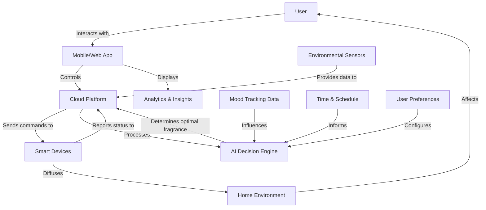

# Dojo Platform Features


## Overview

The MOOD MNKY Dojo is our comprehensive digital platform that enhances the fragrance and wellness experience through personalization, education, and community. This document details the core features and capabilities that make up the Dojo platform.

<Note>
  The Dojo platform integrates digital experiences with physical products to create a holistic ecosystem for fragrance exploration and wellness.
</Note>

## Core Modules

<CardGroup cols={3}>
  <Card title="Mood Tracking" icon="chart-line">
    Personalized mood tracking and analytics
  </Card>
  <Card title="Fragrance Studio" icon="flask">
    Digital fragrance exploration and creation
  </Card>
  <Card title="Learning Center" icon="graduation-cap">
    Educational content on fragrances and wellness
  </Card>
  <Card title="Community Hub" icon="users">
    Social features and community engagement
  </Card>
  <Card title="Wellness Rituals" icon="spa">
    Guided wellness practices and routines
  </Card>
  <Card title="Smart Home Integration" icon="home">
    IoT connectivity for fragrance devices
  </Card>
</CardGroup>

## Mood Tracking & Analytics

The Mood Tracking system forms the foundation of the Dojo platform's personalization capabilities.

<Tabs>
  <Tab title="Core Functionality">
    ```typescript
    // Types for mood tracking
    export interface MoodEntry {
      id: string;
      userId: string;
      mood: string; // Primary mood (e.g., "happy", "calm", "energetic")
      intensity: number; // 1-10 scale
      notes?: string; // Optional user notes
      tags?: string[]; // Associated tags (e.g., "work", "exercise", "social")
      activities?: string[]; // What the user was doing
      location?: {
        type: string; // e.g., "home", "work", "outdoors"
        coordinates?: [number, number]; // Optional lat/long
      };
      weather?: {
        condition: string; // e.g., "sunny", "rainy"
        temperature?: number;
      };
      createdAt: string; // ISO date string
    }
    
    // Available moods with their properties
    export const moodOptions = [
      {
        id: 'happy',
        name: 'Happy',
        emoji: '😊',
        color: '#FFD700',
        fragranceNotes: ['citrus', 'floral', 'fruity'],
      },
      {
        id: 'calm',
        name: 'Calm',
        emoji: '😌',
        color: '#90EE90',
        fragranceNotes: ['lavender', 'chamomile', 'sandalwood'],
      },
      {
        id: 'energetic',
        name: 'Energetic',
        emoji: '⚡',
        color: '#FF6F61',
        fragranceNotes: ['mint', 'citrus', 'spice'],
      },
      {
        id: 'reflective',
        name: 'Reflective',
        emoji: '🤔',
        color: '#7B68EE',
        fragranceNotes: ['woody', 'amber', 'musk'],
      },
      {
        id: 'tired',
        name: 'Tired',
        emoji: '😴',
        color: '#A9A9A9',
        fragranceNotes: ['lavender', 'chamomile', 'vanilla'],
      },
      // Additional moods...
    ];
    ```
  </Tab>
  <Tab title="Analytics">
    The Mood Analytics system processes user mood data to generate insights and recommendations:
    
    - **Mood Patterns**: Identification of recurring mood patterns based on time, day, activities, and location
    - **Correlation Analysis**: Discovering relationships between moods and external factors
    - **Trend Visualization**: Interactive charts and graphs showing mood trends over time
    - **Comparison Reports**: Comparing personal mood patterns with anonymized community data
    - **Seasonal Effects**: Analysis of how seasons and weather affect mood states
  </Tab>
  <Tab title="Personalization">
    Mood data drives personalization throughout the platform:
    
    - **Fragrance Recommendations**: Suggesting fragrances that complement current mood or help transition to desired mood states
    - **Wellness Routine Suggestions**: Customized wellness practices based on mood patterns
    - **Content Curation**: Tailored educational content and community posts
    - **Smart Home Automation**: Triggering appropriate scent diffusion based on mood and time of day
  </Tab>
</Tabs>

## Fragrance Studio

The Fragrance Studio allows users to explore, learn about, and create custom fragrances digitally.

<AccordionGroup>
  <Accordion title="Fragrance Library" icon="book">
    A comprehensive database of fragrance notes, accords, and complete fragrances:
    
    ```typescript
    // Type definitions for the fragrance library
    export interface FragranceNote {
      id: string;
      name: string;
      category: 'top' | 'middle' | 'base';
      family: string; // e.g., "floral", "woody", "citrus"
      description: string;
      intensity: number; // 1-10 scale
      volatility: number; // 1-10 scale (how quickly it dissipates)
      mood: string[]; // Associated moods
      pairsWith: string[]; // IDs of complementary notes
      image: string; // URL to image representation
      scent_profile: {
        sweet: number; // 0-100 values representing
        woody: number; // intensity of different
        citrus: number; // scent characteristics
        floral: number;
        spicy: number;
        earthy: number;
        fruity: number;
      };
    }
    
    export interface Fragrance {
      id: string;
      name: string;
      description: string;
      creator: string; // "MOOD MNKY" or user ID
      isPublic: boolean;
      topNotes: FragranceNote[];
      middleNotes: FragranceNote[];
      baseNotes: FragranceNote[];
      intensity: number; // 1-10 scale
      longevity: number; // 1-10 scale (how long it lasts)
      sillage: number; // 1-10 scale (projection)
      seasons: ('spring' | 'summer' | 'fall' | 'winter')[];
      occasions: string[]; // e.g., "casual", "formal", "evening"
      mood: string[]; // Associated moods
      rating: number; // Average user rating
      reviewCount: number;
      createdAt: string; // ISO date string
    }
    ```
    
    The library includes:
    - 200+ individual fragrance notes
    - 50+ fragrance accords (combinations of notes)
    - Complete catalog of MOOD MNKY fragrances
    - Community-created fragrances (with creator permission)
  </Accordion>
  
  <Accordion title="Virtual Fragrance Creation" icon="magic">
    Interactive tools for creating virtual custom fragrances:
    
    - **Note Selection**: Choose from top, middle, and base notes
    - **Proportion Adjustment**: Adjust the ratio of different notes
    - **Visual Representation**: See how notes interact and evolve over time
    - **Compatibility Analysis**: Automatic suggestions for complementary notes
    - **Mood Association**: Connect fragrances to specific moods and occasions
    
    Created fragrances can be:
    - Saved to the user's personal collection
    - Shared with the community (optional)
    - Ordered as physical custom products
    - Set for diffusion through smart home integration
  </Accordion>
  
  <Accordion title="Scent Visualization" icon="eye">
    Innovative visual representations of fragrances to help users "see" scents:
    
    - **Scent Mapping**: Visual mappings of fragrance notes on interactive charts
    - **Evolution Timeline**: Visualization of how a fragrance evolves over time
    - **Color Association**: Synesthetic color representations of different notes
    - **Mood Connection**: Visual connections between fragrances and emotional states
    - **AR Visualization**: Augmented reality visualizations of scent molecules and diffusion patterns
  </Accordion>
</AccordionGroup>

## Learning Center

The Learning Center provides educational content about fragrances, ingredients, wellness practices, and more.

<CardGroup cols={2}>
  <Card title="Fragrance Academy" icon="school">
    - Fragrance fundamentals courses
    - Ingredient encyclopedia
    - History of perfumery
    - Cultural perspectives on scent
  </Card>
  <Card title="Wellness Education" icon="heart">
    - Aromatherapy basics
    - Scent and psychological wellbeing
    - Meditation and mindfulness practices
    - Sleep optimization guides
  </Card>
  <Card title="Master Classes" icon="crown">
    - Virtual workshops with perfumers
    - Interactive blending sessions
    - Seasonal fragrance trends
    - Professional techniques
  </Card>
  <Card title="Personalized Learning Paths" icon="road">
    - Customized curriculum based on interests
    - Skill progression tracking
    - Knowledge assessment quizzes
    - Certification programs
  </Card>
</CardGroup>

### Content Format

<Tabs>
  <Tab title="Video">
    - Professional tutorials
    - Perfumer interviews
    - Ingredient spotlights
    - Behind-the-scenes footage
  </Tab>
  <Tab title="Interactive">
    - Fragrance note identification games
    - Scent pairing exercises
    - Virtual blending simulations
    - Knowledge quizzes
  </Tab>
  <Tab title="Articles">
    - In-depth ingredient guides
    - Scientific research summaries
    - Historical perspectives
    - Trend analysis
  </Tab>
  <Tab title="Live Events">
    - Scheduled expert sessions
    - Community discussions
    - Virtual tasting events
    - Q&A with perfumers
  </Tab>
</Tabs>

## Community Hub

The Community Hub connects fragrance enthusiasts, enabling sharing, discussion, and collaborative creation.

<Steps>
  <Step title="User Profiles">
    Personalized profiles showcasing:
    - Fragrance collections
    - Created custom blends
    - Reviews and ratings
    - Mood journeys
    - Badges and achievements
    - Learning progress
  </Step>
  
  <Step title="Social Features">
    Community interaction through:
    - Following other members
    - Sharing fragrance discoveries
    - Commenting on creations
    - Collaborative fragrance projects
    - Private messaging
    - Interest-based groups
  </Step>
  
  <Step title="Content Sharing">
    User-generated content including:
    - Custom fragrance recipes
    - Mood-enhancing rituals
    - Product reviews
    - Wellness practice guides
    - Event announcements
    - Challenge participation
  </Step>
  
  <Step title="Community Challenges">
    Engagement activities such as:
    - Monthly fragrance creation contests
    - Seasonal scent exploration
    - Collaborative mood-mapping projects
    - Wellness practice challenges
    - Photo and story sharing prompts
  </Step>
</Steps>

## Wellness Rituals

The Wellness Rituals module guides users through scent-enhanced practices for wellbeing.

<AccordionGroup>
  <Accordion title="Guided Practices" icon="spa">
    ```typescript
    // Types for wellness rituals
    export interface WellnessRitual {
      id: string;
      name: string;
      description: string;
      duration: number; // in minutes
      benefit: string[];
      mood: string[]; // target moods
      timeOfDay: ('morning' | 'afternoon' | 'evening' | 'night')[];
      steps: RitualStep[];
      recommendedProducts: string[]; // Product IDs
      difficulty: 'beginner' | 'intermediate' | 'advanced';
      tags: string[];
      createdBy: string; // "MOOD MNKY" or user ID
      imageUrl: string;
      videoUrl?: string;
    }
    
    export interface RitualStep {
      id: string;
      order: number;
      title: string;
      description: string;
      duration: number; // in seconds
      fragrance?: {
        id: string;
        name: string;
        usage: 'diffuse' | 'apply' | 'inhale';
        intensity: number; // 1-10
      };
      audioUrl?: string; // Guided audio
      imageUrl?: string;
    }
    ```
    
    Example ritual categories:
    - Morning energizing routines
    - Stress reduction practices
    - Focus enhancement sessions
    - Sleep preparation rituals
    - Mood transition practices
    - Seasonal wellness routines
  </Accordion>
  
  <Accordion title="Personalized Recommendations" icon="user-check">
    The system recommends personalized wellness rituals based on:
    
    - Current mood state
    - Historical mood patterns
    - Time of day and day of week
    - Weather conditions
    - User preferences and past engagement
    - Wellness goals
    - Available fragrance products
    
    Recommendations adapt over time based on:
    - Reported effectiveness
    - Completion rates
    - Mood changes following ritual completion
    - Seasonal adjustments
    - New product acquisitions
  </Accordion>
  
  <Accordion title="Progress Tracking" icon="chart-line">
    Users can track their wellness journey through:
    
    - Ritual completion logging
    - Mood state before and after practices
    - Consistency streaks and achievements
    - Cumulative practice time
    - Effectiveness ratings
    - Notes and reflections
    
    The system generates insights such as:
    - Most effective rituals for specific mood states
    - Optimal times for different practices
    - Progress toward wellness goals
    - Comparisons with previous periods
    - Suggestions for advancing practice
  </Accordion>
</AccordionGroup>

## Smart Home Integration

The Smart Home Integration module connects physical fragrance devices with the digital platform.

<CardGroup cols={2}>
  <Card title="Compatible Devices" icon="plug">
    - MOOD MNKY Smart Diffuser
    - Third-party compatible diffusers
    - Smart home platforms (e.g., Home Assistant, SmartThings)
    - Voice assistants (e.g., Alexa, Google Home)
  </Card>
  <Card title="Control Features" icon="sliders-h">
    - Remote diffuser control
    - Scheduling and routines
    - Intensity adjustment
    - Mood-based activation
    - Location-aware diffusion
    - Multi-room coordination
  </Card>
  <Card title="Automation" icon="robot">
    - Mood-triggered fragrance selection
    - Time-based fragrance programs
    - Weather-responsive scents
    - Activity-linked diffusion
    - Sleep/wake cycle integration
    - Presence detection
  </Card>
  <Card title="Monitoring" icon="gauge-high">
    - Fragrance consumption tracking
    - Air quality metrics
    - Usage patterns and statistics
    - Refill notifications
    - Device performance data
    - Environmental conditions
  </Card>
</CardGroup>

### Integration Architecture



## Personalization & AI

The Dojo platform uses AI to create highly personalized experiences across all modules.

<AccordionGroup>
  <Accordion title="Data Collection" icon="database">
    The system collects and processes multiple data streams (with user permission):
    
    - Explicit user inputs (mood tracking, preferences, ratings)
    - Implicit signals (engagement patterns, content consumption)
    - Contextual information (time, location, weather)
    - Device usage data (diffusion patterns, intensity preferences)
    - Social interactions (community engagement, shared content)
    
    All data collection follows strict privacy guidelines with:
    - Clear user consent mechanisms
    - Data minimization principles
    - Privacy-preserving processing
    - Secure storage and transmission
    - User control over data retention
  </Accordion>
  
  <Accordion title="Recommendation Engines" icon="brain">
    Multiple AI models power recommendations across the platform:
    
    **Fragrance Recommendation Engine**
    ```typescript
    interface FragranceRecommendation {
      fragrance: Fragrance;
      score: number; // 0-100 matching score
      reasons: {
        moodMatch: number; // Component scores
        seasonalRelevance: number;
        pastPreference: number;
        communityRating: number;
        occasionMatch: number;
      };
      explanation: string; // Human-readable explanation
    }
    ```
    
    **Wellness Ritual Recommendation Engine**
    ```typescript
    interface RitualRecommendation {
      ritual: WellnessRitual;
      score: number;
      contextFactors: {
        timeOfDay: number;
        currentMood: number;
        weatherInfluence: number;
        previousEffectiveness: number;
        userGoals: number;
      };
      timing: {
        idealTimeStart: string; // ISO time
        idealTimeEnd: string; // ISO time
        duration: number; // minutes
      };
    }
    ```
    
    **Content Recommendation Engine**
    ```typescript
    interface ContentRecommendation {
      content: LearningContent;
      score: number;
      factors: {
        interestMatch: number;
        skillLevel: number;
        learningPath: number;
        communityPopularity: number;
        completionProbability: number;
      };
      learningObjective: string;
    }
    ```
  </Accordion>
  
  <Accordion title="Personalization Features" icon="user-cog">
    AI-powered personalization extends to multiple aspects of the platform:
    
    - **Adaptive UI**: Interface elements that adjust based on user behavior
    - **Custom Home Screen**: Personalized dashboard showing relevant content and recommendations
    - **Smart Notifications**: Contextually appropriate alerts and suggestions
    - **Predictive Mood Support**: Anticipating mood changes and suggesting preventive measures
    - **Learning Progression**: Adaptive educational content that matches user knowledge and interest
    - **Community Connections**: Suggesting relevant community members and content
    - **Routine Building**: Help constructing effective fragrance and wellness routines
  </Accordion>
</AccordionGroup>

## Engagement & Gamification

The platform incorporates gamification elements to increase engagement and habit formation.

<CardGroup cols={3}>
  <Card title="Achievement System" icon="trophy">
    - Badges for platform milestones
    - Skill mastery recognition
    - Collection completion rewards
    - Streak maintenance incentives
  </Card>
  <Card title="Challenges" icon="flag-checkered">
    - Daily mood tracking challenges
    - Seasonal fragrance exploration
    - Community participation goals
    - Wellness practice consistency
  </Card>
  <Card title="Progress Visualization" icon="chart-bar">
    - Learning journey mapping
    - Habit formation tracking
    - Collection completion metrics
    - Community contribution impact
  </Card>
  <Card title="Rewards" icon="gift">
    - Exclusive digital content
    - Early access to new features
    - Virtual collectible elements
    - Product discounts and samples
  </Card>
  <Card title="Levels" icon="layer-group">
    - Expertise progression system
    - Unlockable platform features
    - Enhanced creation capabilities
    - Expanded social functionality
  </Card>
  <Card title="Social Recognition" icon="users">
    - Community leaderboards
    - Featured user creations
    - Influence measurements
    - Mentor status recognition
  </Card>
</CardGroup>

## Platform Analytics

The Dojo platform includes comprehensive analytics to track performance and guide development.

<Tabs>
  <Tab title="User Analytics">
    - Acquisition channels and conversion rates
    - Engagement metrics across platform features
    - Retention patterns and churn analysis
    - Feature adoption and usage frequency
    - User journey mapping and friction points
    - Segmentation by behavior and preferences
  </Tab>
  <Tab title="Product Analytics">
    - Product view-to-purchase ratios
    - Cross-selling effectiveness
    - Recommendation conversion rates
    - Cart abandonment analysis
    - Review sentiment and rating trends
    - Product association patterns
  </Tab>
  <Tab title="Community Analytics">
    - Content engagement metrics
    - Social interaction patterns
    - Influential user identification
    - Community growth and activity trends
    - Content diffusion analysis
    - Discussion topic clustering
  </Tab>
  <Tab title="Wellness Analytics">
    - Ritual completion rates
    - Reported effectiveness of practices
    - Mood improvement patterns
    - Long-term wellbeing trends
    - Correlation between practices and outcomes
    - Seasonal wellness impacts
  </Tab>
</Tabs>

## Integration Ecosystem

The Dojo platform connects with other systems and services to enhance functionality.

<CardGroup cols={2}>
  <Card title="E-commerce Integration" icon="shopping-cart">
    - Seamless product purchasing
    - Personalized product recommendations
    - Automatic replenishment options
    - Subscription management
    - Order history and tracking
  </Card>
  <Card title="IoT Ecosystem" icon="network-wired">
    - Smart home platform connections
    - Voice assistant integration
    - Wearable device data incorporation
    - Environmental sensor networks
    - Connected wellness devices
  </Card>
  <Card title="Third-Party Services" icon="plug">
    - Calendar applications
    - Fitness and health tracking
    - Weather services
    - Social media platforms
    - Music streaming services
  </Card>
  <Card title="Data Portability" icon="file-export">
    - Personal data export options
    - Health app data sharing
    - API access for developers
    - Research collaboration capabilities
    - Backup and restoration services
  </Card>
</CardGroup>

## Resources

<CardGroup cols={3}>
  <Card title="Dojo User Guide" icon="book" href="/platform-services/dojo-user-guide">
    Comprehensive guide for platform users
  </Card>
  <Card title="Developer Documentation" icon="code" href="/developer-resources/dojo-api">
    API documentation and integration guides
  </Card>
  <Card title="Roadmap" icon="road" href="/platform-services/dojo-roadmap">
    Upcoming features and platform development
  </Card>
</CardGroup>

---

For questions about the Dojo platform, please contact the MOOD MNKY product team.