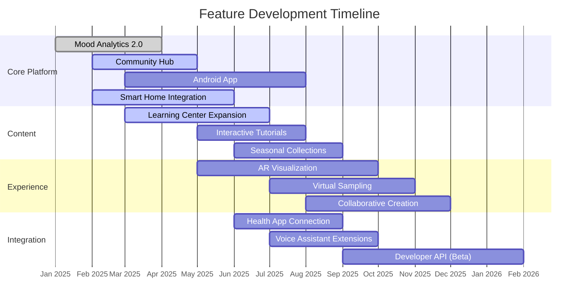

# Dojo Platform Roadmap


## Overview

The MOOD MNKY Dojo platform roadmap outlines our strategic vision for platform evolution, planned features, and development timelines. This living document provides visibility into our priorities and helps align stakeholder expectations.

<Note>
  This roadmap represents our current plans and is subject to change based on market conditions, user feedback, and technical considerations.
</Note>

## Vision & Strategy

<CardGroup cols={2}>
  <Card title="Platform Vision" icon="eye">
    Create the world's most immersive and personalized fragrance and wellness ecosystem that seamlessly blends digital experiences with physical products.
  </Card>
  <Card title="Core Pillars" icon="columns">
    - Personalization through AI
    - Sensory education and exploration
    - Community and social connection
    - Physical-digital integration
    - Wellness and mindfulness
  </Card>
</CardGroup>

## Current Status

<Tabs>
  <Tab title="Platform Metrics">
    ```
    Status: Beta Release
    Version: 0.9.2
    Users: 5,000+ beta participants
    Core Features: 70% complete
    Mobile App: iOS (Beta), Android (In Development)
    Web Platform: Responsive (Beta)
    Integration Ecosystem: 10+ partners onboarded
    ```
  </Tab>
  <Tab title="Recent Releases">
    **Version 0.9.2 (Current)**
    - Enhanced mood analytics dashboard
    - Community sharing functionality
    - Basic smart diffuser integration
    - Initial learning center content
    - iOS mobile app beta
    
    **Version 0.9.1**
    - Fragrance studio with 150+ notes
    - User profiles and preferences
    - Mood tracking core functionality
    - Wellness rituals (first collection)
    - Web platform responsive design
  </Tab>
</Tabs>

## Development Phases

<Steps>
  <Step title="Phase 1: Foundation (Completed)">
    The initial phase focused on building the core platform architecture and essential features:
    
    - Basic user account system
    - Initial mood tracking functionality
    - Fragrance database and recommendation engine
    - Web application framework
    - Cloud infrastructure setup
    - Data security implementations
    
    **Key Milestones Achieved:**
    - System architecture design
    - Core database models
    - Authentication and authorization
    - Initial API endpoints
    - Basic web platform
    - Pilot user testing
  </Step>
  
  <Step title="Phase 2: Core Experience (Current)">
    The current phase is focused on developing the core user experience and feature set:
    
    - Comprehensive mood tracking system
    - Advanced fragrance studio
    - Community and social features
    - Learning center content
    - Wellness rituals collection
    - Mobile application (iOS)
    - Smart diffuser integration
    
    **Progress:**
    - 70% complete (as of Q1 2025)
    - Beta testing with 5,000+ users
    - Iterative improvements based on feedback
    - Performance optimization
  </Step>
  
  <Step title="Phase 3: Expansion (Upcoming)">
    The next phase will expand platform capabilities and reach:
    
    - Android mobile application
    - Advanced smart home integration
    - Expanded IoT device support
    - Enhanced AI recommendation engine
    - Augmented reality experiences
    - Advanced analytics and insights
    - Third-party developer API
    
    **Timeline:**
    - Beginning Q3 2025
    - Public release by Q4 2025
    - Full feature parity across devices
  </Step>
  
  <Step title="Phase 4: Ecosystem Growth (Future)">
    The long-term phase will focus on growing the platform ecosystem:
    
    - Expanded partner integrations
    - Advanced content creator tools
    - Enterprise solutions
    - International expansion
    - Advanced research capabilities
    - Marketplace for community creators
    
    **Timeline:**
    - Beginning Q1 2026
    - Continuous development throughout 2026
  </Step>
</Steps>

## Upcoming Releases

<AccordionGroup>
  <Accordion title="Version 1.0 (Q2 2025)" icon="flag">
    Our first full release will include all core functionality in a polished, production-ready state:
    
    **Platform:**
    - Complete web platform
    - iOS application (full release)
    - Android application (beta)
    
    **Features:**
    - Comprehensive mood tracking and analytics
    - Complete fragrance studio with all planned functionality
    - Full learning center curriculum
    - Enhanced community features with moderation tools
    - Expanded wellness ritual collection
    - Robust smart home integration
    
    **Technical:**
    - Performance optimization
    - Comprehensive testing suite
    - Enhanced security auditing
    - Scalability improvements
    - Improved error handling and monitoring
    
    **Timeline:**
    - Feature freeze: Early Q2 2025
    - Internal testing: Mid Q2 2025
    - Public release: Late Q2 2025
  </Accordion>
  
  <Accordion title="Version 1.1 (Q3 2025)" icon="rocket">
    The first major update after full release will enhance the platform with new capabilities:
    
    **Core Enhancements:**
    - Advanced mood pattern recognition
    - Expanded fragrance library (200+ additional notes)
    - Community challenges and events system
    - Enhanced recommendation algorithm
    
    **New Features:**
    - Fragrance journey timelines
    - Social sharing integration
    - Custom ritual creation tools
    - Virtual fragrance sampling
    
    **Mobile:**
    - Android application (full release)
    - Enhanced mobile notifications
    - Offline mode functionality
    - Mobile widget support
    
    **Timeline:**
    - Development: Q2-Q3 2025
    - Beta testing: Mid Q3 2025
    - Public release: Late Q3 2025
  </Accordion>
  
  <Accordion title="Version 1.2 (Q4 2025)" icon="layer-group">
    This update will focus on expanding integration capabilities and advanced features:
    
    **Integration Ecosystem:**
    - Expanded smart home platform support
    - Health app data integration
    - Calendar and scheduling connections
    - Voice assistant advanced commands
    
    **Advanced Features:**
    - Augmented reality scent visualization
    - Collaborative fragrance creation
    - Advanced wellness program builder
    - Seasonal collections and experiences
    
    **Analytics:**
    - Enhanced personal insights dashboard
    - Longitudinal mood analysis
    - Fragrance effectiveness tracking
    - Wellness impact assessments
    
    **Timeline:**
    - Development: Q3-Q4 2025
    - Beta testing: Mid Q4 2025
    - Public release: Late Q4 2025
  </Accordion>
  
  <Accordion title="Version 2.0 (2026)" icon="binoculars">
    Our major 2.0 release will introduce transformative new capabilities:
    
    **Core Platform Evolution:**
    - Complete UX/UI refresh
    - AI-driven personalization engine 2.0
    - Advanced machine learning implementation
    - Real-time collaboration features
    
    **New Major Features:**
    - Digital scent profile system
    - Virtual perfumer assistant
    - Advanced wellness programs with coaching
    - Expanded IoT device ecosystem
    - Community marketplace for creators
    
    **Developer Platform:**
    - Public API for third-party developers
    - Plugin and extension system
    - Developer documentation and tools
    - Partner integration program
    
    **Timeline:**
    - Planning and design: Q1 2026
    - Development: Q1-Q3 2026
    - Beta program: Q3 2026
    - Public release: Q4 2026
  </Accordion>
</AccordionGroup>

## Feature Pipeline

The following features are currently in our development pipeline, organized by priority and status.



## High-Priority Features

<CardGroup cols={3}>
  <Card title="Android Application" icon="android">
    **Status:** In Development
    
    **Priority:** High
    
    **Description:** Native Android application with feature parity to iOS version
    
    **Timeline:** Beta in Q3 2025, Full Release in Q4 2025
  </Card>
  <Card title="Advanced Smart Home Integration" icon="home">
    **Status:** In Development
    
    **Priority:** High
    
    **Description:** Enhanced integration with major smart home platforms and expanded device support
    
    **Timeline:** Initial in Q2 2025, Enhanced in Q3 2025
  </Card>
  <Card title="Community Hub" icon="users">
    **Status:** In Development
    
    **Priority:** High
    
    **Description:** Comprehensive social and community features with content sharing
    
    **Timeline:** Basic in Q2 2025, Enhanced in Q3 2025
  </Card>
  <Card title="Learning Center Expansion" icon="graduation-cap">
    **Status:** In Development
    
    **Priority:** High
    
    **Description:** Additional educational content and interactive learning features
    
    **Timeline:** Continuous through 2025
  </Card>
  <Card title="Augmented Reality Experiences" icon="vr-cardboard">
    **Status:** Planning
    
    **Priority:** High
    
    **Description:** AR visualization of fragrances, notes, and mood effects
    
    **Timeline:** Q3-Q4 2025
  </Card>
  <Card title="Expanded Analytics Dashboard" icon="chart-pie">
    **Status:** Planning
    
    **Priority:** High
    
    **Description:** Enhanced personal insights and analytics visualization
    
    **Timeline:** Q3 2025
  </Card>
</CardGroup>

## Medium-Priority Features

<CardGroup cols={3}>
  <Card title="Virtual Sampling" icon="flask">
    **Status:** Planned
    
    **Description:** Digital exploration of fragrance samples with recommendation engine
    
    **Timeline:** Q4 2025
  </Card>
  <Card title="Health App Integration" icon="heartbeat">
    **Status:** Planned
    
    **Description:** Connection with health tracking applications for comprehensive wellness insights
    
    **Timeline:** Q3 2025
  </Card>
  <Card title="Collaborative Creation" icon="users-cog">
    **Status:** Concept
    
    **Description:** Tools for multiple users to collaborate on fragrance and ritual creation
    
    **Timeline:** Q4 2025
  </Card>
  <Card title="Voice Assistant Integration" icon="microphone">
    **Status:** Planned
    
    **Description:** Enhanced voice controls for platform features and smart devices
    
    **Timeline:** Q3-Q4 2025
  </Card>
  <Card title="Seasonal Collections" icon="calendar">
    **Status:** Planned
    
    **Description:** Curated seasonal fragrance and wellness experiences
    
    **Timeline:** Q3 2025 (Fall Collection)
  </Card>
  <Card title="Interactive Tutorials" icon="chalkboard-teacher">
    **Status:** Concept
    
    **Description:** Guided interactive learning experiences for fragrance exploration
    
    **Timeline:** Q3 2025
  </Card>
</CardGroup>

## Long-Term Features

<CardGroup cols={2}>
  <Card title="Developer API" icon="code">
    **Target:** Version 2.0 (2026)
    
    **Description:** Public API for third-party developers to build on the Dojo platform
  </Card>
  <Card title="Digital Scent Profiles" icon="fingerprint">
    **Target:** Version 2.0 (2026)
    
    **Description:** Advanced digital representation of individual scent preferences and experiences
  </Card>
  <Card title="Community Marketplace" icon="store">
    **Target:** Version 2.0 (2026)
    
    **Description:** Platform for community creators to share and sell custom creations
  </Card>
  <Card title="Virtual Perfumer" icon="robot">
    **Target:** Version 2.0 (2026)
    
    **Description:** AI assistant for personalized fragrance creation and education
  </Card>
</CardGroup>

## Technical Roadmap

In addition to user-facing features, our roadmap includes significant technical improvements to enhance platform performance, security, and scalability.

<Tabs>
  <Tab title="Infrastructure">
    **Current Quarters (Q1-Q2 2025):**
    - Cloud infrastructure optimization
    - Database performance tuning
    - Content delivery network enhancements
    - Monitoring and alerting improvements
    
    **Upcoming (Q3-Q4 2025):**
    - Distributed caching implementation
    - Regional deployment expansion
    - Containerization of all services
    - Automated scaling improvements
    
    **Long-term (2026):**
    - Edge computing capabilities
    - Multi-region data synchronization
    - Advanced disaster recovery
    - Green computing initiatives
  </Tab>
  <Tab title="Performance">
    **Current Quarters (Q1-Q2 2025):**
    - Front-end performance optimization
    - API response time improvements
    - Image and asset optimization
    - Mobile app performance tuning
    
    **Upcoming (Q3-Q4 2025):**
    - Advanced caching strategies
    - Database query optimization
    - Real-time data processing enhancements
    - Progressive web app capabilities
    
    **Long-term (2026):**
    - Predictive resource allocation
    - Machine learning performance optimization
    - Custom visualization engine
    - Offline-first architecture
  </Tab>
  <Tab title="Security">
    **Current Quarters (Q1-Q2 2025):**
    - Security audit and remediation
    - Enhanced authentication options
    - Data encryption improvements
    - Privacy controls expansion
    
    **Upcoming (Q3-Q4 2025):**
    - Advanced threat detection
    - Security monitoring enhancements
    - Compliance certification preparation
    - Penetration testing program
    
    **Long-term (2026):**
    - Behavioral security analysis
    - Zero-trust architecture implementation
    - Hardware security integration
    - Advanced privacy engineering
  </Tab>
</Tabs>

## Research Initiatives

The Dojo platform roadmap includes research initiatives that may influence future development:

<CardGroup cols={2}>
  <Card title="Scent-Mood Correlation Research" icon="brain">
    - Collaboration with academic institutions
    - Data analysis of mood and fragrance interactions
    - Longitudinal studies of scent effects
    - Development of scientific fragrance models
  </Card>
  <Card title="Advanced Sensor Technology" icon="microchip">
    - Digital scent detection methods
    - Environmental fragrance monitoring
    - Wearable scent technology
    - Non-invasive physiological sensors
  </Card>
  <Card title="AI Fragrance Creation" icon="robot">
    - Machine learning for scent formula development
    - Predictive models for fragrance preferences
    - Neural networks for scent classification
    - Virtual testing of fragrance interactions
  </Card>
  <Card title="Cross-sensory Experience" icon="eye">
    - Fragrance and visual connection
    - Audio-olfactory experiences
    - Multi-sensory wellness applications
    - Cross-modal digital representations
  </Card>
</CardGroup>

## User Feedback Integration

Our development roadmap is continuously shaped by user feedback through multiple channels:

<Steps>
  <Step title="Feedback Collection">
    We gather user input through:
    - In-app feedback mechanisms
    - Beta tester community
    - User research sessions
    - Usage analytics
    - Support interactions
    - Community discussions
  </Step>
  
  <Step title="Analysis & Prioritization">
    Feedback is processed through:
    - Quantitative analysis of trends
    - Qualitative research insights
    - Feature request frequency tracking
    - Impact vs. effort evaluation
    - Strategic alignment assessment
    - Technical feasibility analysis
  </Step>
  
  <Step title="Roadmap Integration">
    Feedback influences the roadmap through:
    - Quarterly roadmap reviews
    - Feature priority adjustments
    - Bug fix prioritization
    - UX improvement initiatives
    - New feature ideation
    - Release timeline adjustments
  </Step>
  
  <Step title="Validation">
    We validate changes through:
    - A/B testing
    - Beta program
    - User testing sessions
    - Analytics tracking
    - Satisfaction surveys
    - Iterative improvement
  </Step>
</Steps>

## Release Vehicles

Features and improvements are delivered through different release vehicles based on their nature and scope:

<CardGroup cols={3}>
  <Card title="Major Releases" icon="rocket">
    - Significant feature additions
    - Platform architectural changes
    - Every 6-12 months
    - Extended beta testing period
    - Comprehensive documentation
  </Card>
  <Card title="Feature Updates" icon="puzzle-piece">
    - Individual feature additions
    - UX improvements
    - Every 2-3 months
    - Focused testing on specific features
    - Feature-specific documentation
  </Card>
  <Card title="Maintenance Updates" icon="wrench">
    - Bug fixes
    - Performance improvements
    - Security updates
    - Every 2-4 weeks
    - Regression testing
  </Card>
  <Card title="Beta Program" icon="flask">
    - Early access to new features
    - Opt-in testing environment
    - Continuous updates
    - Structured feedback channels
    - Testing-focused documentation
  </Card>
  <Card title="A/B Testing" icon="random">
    - User experience variations
    - Feature variations
    - Limited user segments
    - Metric-driven evaluation
    - Automated deployment
  </Card>
  <Card title="Experimental Features" icon="vial">
    - Opt-in cutting-edge capabilities
    - Early concept validation
    - Limited support
    - High iteration frequency
    - Subject to significant changes
  </Card>
</CardGroup>

## Getting Involved

There are multiple ways to contribute to and influence the Dojo platform roadmap:

<AccordionGroup>
  <Accordion title="Beta Testing Program" icon="bug">
    Join our beta testing program to get early access to upcoming features and provide valuable feedback:
    
    - **Application:** Open to all users through in-app opt-in
    - **Commitment:** Varies from passive testing to active participation
    - **Benefits:** Early access, direct communication with product team, exclusive events
    - **Current Focus:** Android application, smart home integration, community features
    
    [Apply to the Beta Program](https://dojo.moodmnky.co/beta)
  </Accordion>
  
  <Accordion title="Feature Requests" icon="lightbulb">
    Submit and vote on feature requests to influence development priorities:
    
    - **Submission:** Available through in-app feedback or community portal
    - **Voting:** Community members can upvote and comment on requests
    - **Transparency:** Public status updates on popular requests
    - **Product Team Review:** Monthly review of top requests
    
    [View Feature Request Board](https://dojo.moodmnky.co/requests)
  </Accordion>
  
  <Accordion title="Research Participation" icon="microscope">
    Contribute to our research initiatives to help shape the future of fragrance technology:
    
    - **Studies:** Regular studies on fragrance preferences, mood effects, and wellness impacts
    - **Commitment:** From quick surveys to longer-term participation
    - **Compensation:** Varies by study (product credit, early access, monetary)
    - **Requirements:** Varies by study focus and needs
    
    [View Current Research Opportunities](https://dojo.moodmnky.co/research)
  </Accordion>
  
  <Accordion title="Developer Preview" icon="code">
    For developers interested in future integration opportunities:
    
    - **Early API Access:** Limited preview of upcoming developer tools
    - **Documentation:** Early access to technical specifications
    - **Support:** Direct communication with platform engineering team
    - **Timeline:** Formal program launching Q1 2026
    
    [Express Interest in Developer Preview](https://dojo.moodmnky.co/developers)
  </Accordion>
</AccordionGroup>

## Resources

<CardGroup cols={3}>
  <Card title="Release Notes" icon="clipboard-list" href="/platform-services/dojo-releases">
    Detailed notes for all platform releases
  </Card>
  <Card title="Feature Documentation" icon="book" href="/platform-services/dojo-features">
    Comprehensive documentation of current features
  </Card>
  <Card title="Community Forums" icon="comments" href="https://community.moodmnky.co">
    Discussion forums for platform feedback and ideas
  </Card>
</CardGroup>

---

For questions about the Dojo platform roadmap, please contact the MOOD MNKY product team.