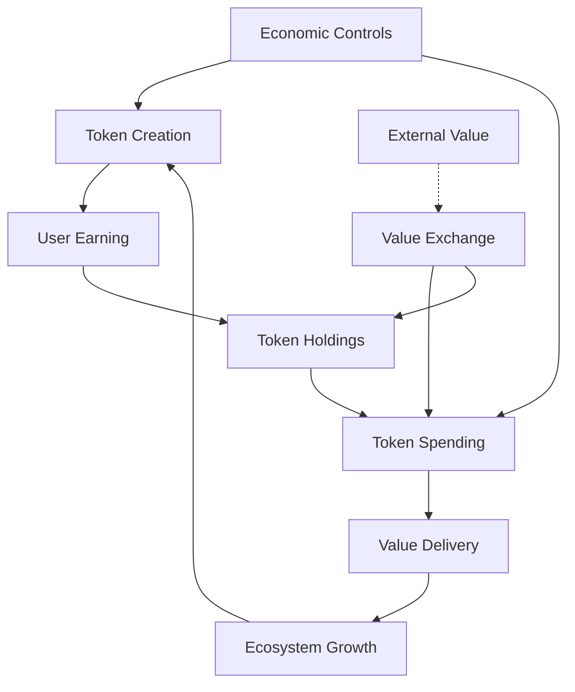
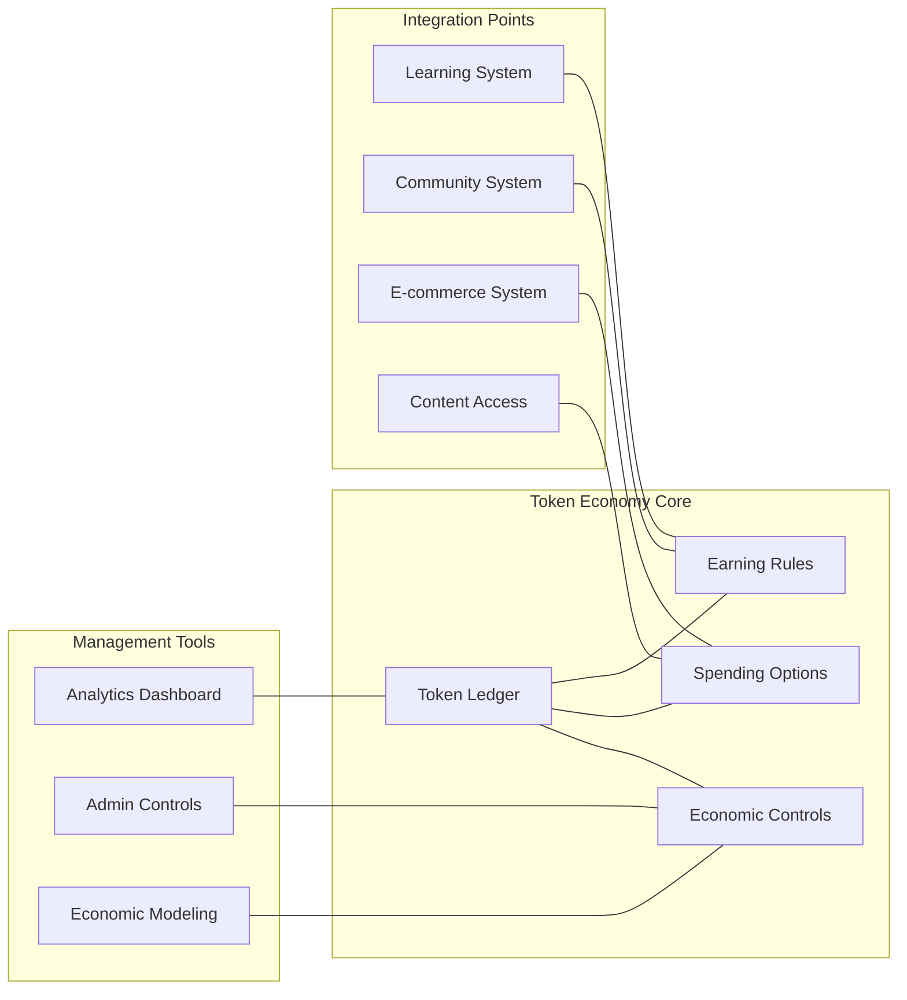
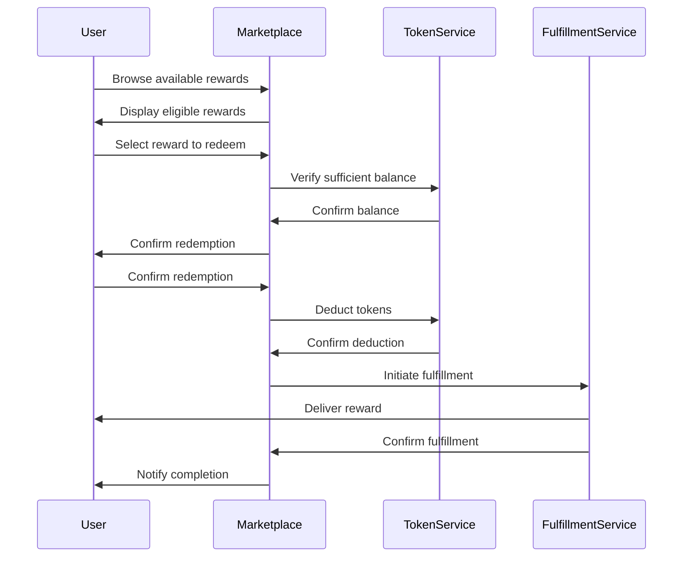
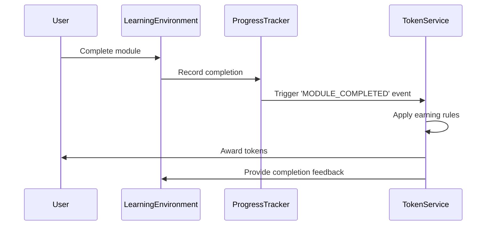
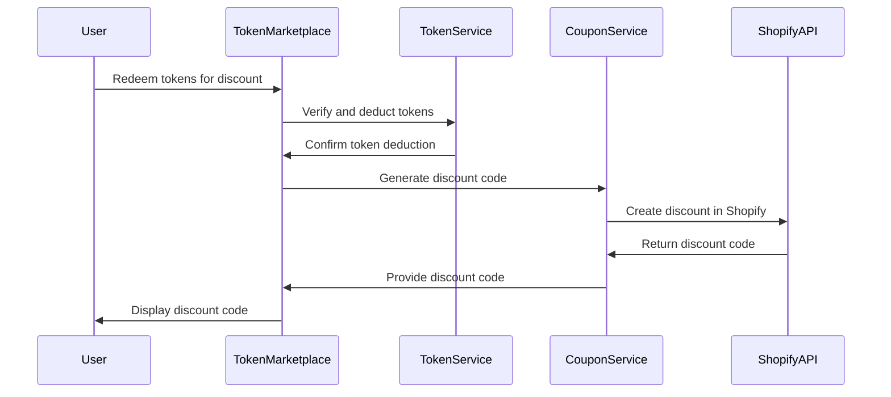
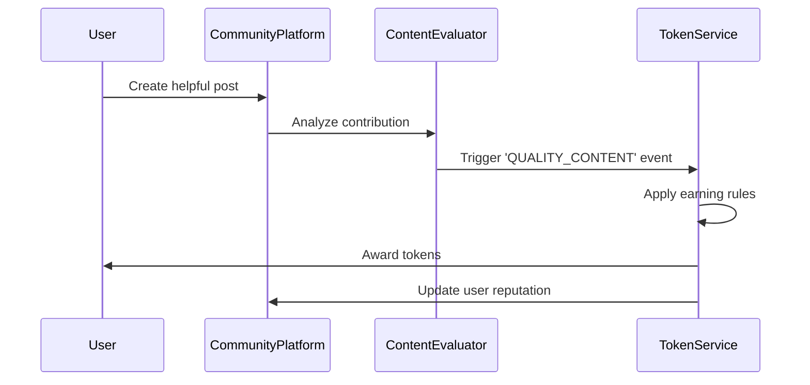

# Token Economy Design

<Note>
This is a starter document outlining the MOOD MNKY token economy framework. Future iterations will include more detailed implementation guides and economic modeling.
</Note>

## Overview

The MOOD MNKY token economy creates a value-based ecosystem that incentivizes engagement, rewards contribution, and provides alternative access paths to premium products and experiences. This document outlines the economic principles, token mechanics, implementation guidelines, and management strategies for the platform's token system.

## Core Principles

The token economy is designed around these fundamental principles:

1. **Value-Backed Currency**: Tokens represent real value within the ecosystem
2. **Balanced Economics**: Sustainable token creation and consumption cycles
3. **Meaningful Rewards**: Incentives aligned with platform goals and user desires
4. **Inclusive Access**: Alternative pathways to premium experiences
5. **Community Contribution**: Rewards for platform enhancement and support

## Token System Architecture

### Economic Model

The MOOD MNKY token economy follows a circular flow model:



### Token Types

<CardGroup cols={2}>
  <Card title="Experience Tokens (XP)" icon="star">
    <div className="space-y-2">
      <p>Primary currency of the ecosystem</p>
      <ul className="list-disc pl-5">
        <li>Earned through platform engagement</li>
        <li>Spent on rewards and experiences</li>
        <li>No expiration date</li>
        <li>Non-transferable between users</li>
      </ul>
    </div>
  </Card>
  
  <Card title="Achievement Badges" icon="medal">
    <div className="space-y-2">
      <p>Status markers and special capabilities</p>
      <ul className="list-disc pl-5">
        <li>Earned through milestone achievements</li>
        <li>Unlocks special features or capabilities</li>
        <li>Displayed in user profiles</li>
        <li>Permanent once earned</li>
      </ul>
    </div>
  </Card>
</CardGroup>

### Token Ecosystem Components



## Token Earning Mechanisms

### Core Earning Activities

<CardGroup cols={3}>
  <Card title="Learning Engagement" icon="graduation-cap">
    <div className="space-y-2">
      <p>Educational participation rewards</p>
      <ul className="list-disc pl-5">
        <li>Module completion: 25-100 XP</li>
        <li>Environment mastery: 250 XP</li>
        <li>Assessment completion: 15-50 XP</li>
        <li>Daily learning streak: 5-25 XP</li>
      </ul>
    </div>
  </Card>
  
  <Card title="Community Contribution" icon="users">
    <div className="space-y-2">
      <p>Social and community rewards</p>
      <ul className="list-disc pl-5">
        <li>Helpful responses: 10-50 XP</li>
        <li>Content creation: 25-200 XP</li>
        <li>Event participation: 25-75 XP</li>
        <li>Mentorship activities: 50-150 XP</li>
      </ul>
    </div>
  </Card>
  
  <Card title="Platform Activities" icon="rectangle-list">
    <div className="space-y-2">
      <p>General engagement rewards</p>
      <ul className="list-disc pl-5">
        <li>Daily login: 5 XP</li>
        <li>Profile completion: 50 XP</li>
        <li>Feedback provision: 10-25 XP</li>
        <li>Challenge completion: 25-100 XP</li>
      </ul>
    </div>
  </Card>
</CardGroup>

### Earning Rules Implementation

Token earning rules are implemented through a rule-based engine:

```typescript
export interface TokenRule {
  id: string;
  eventType: string;
  conditions: TokenCondition[];
  rewards: TokenReward[];
  limits: TokenLimit[];
  priority: number;
  isActive: boolean;
}

export interface TokenCondition {
  field: string;
  operator: 'equals' | 'notEquals' | 'contains' | 'greaterThan' | 'lessThan';
  value: any;
}

export interface TokenReward {
  type: 'XP' | 'BADGE';
  amount: number;
  itemId?: string; // For badges
}

export interface TokenLimit {
  type: 'daily' | 'weekly' | 'monthly' | 'lifetime' | 'perItem';
  maxCount: number;
  currentCount?: number;
}

// Example rule definitions
const tokenRules: TokenRule[] = [
  {
    id: 'module-completion',
    eventType: 'MODULE_COMPLETED',
    conditions: [
      { field: 'status', operator: 'equals', value: 'COMPLETED' }
    ],
    rewards: [
      { type: 'XP', amount: 50 }
    ],
    limits: [
      { type: 'perItem', maxCount: 1 }
    ],
    priority: 10,
    isActive: true
  },
  {
    id: 'helpful-response',
    eventType: 'POST_REACTION',
    conditions: [
      { field: 'reactionType', operator: 'equals', value: 'HELPFUL' },
      { field: 'uniqueUsers', operator: 'greaterThan', value: 2 }
    ],
    rewards: [
      { type: 'XP', amount: 10 }
    ],
    limits: [
      { type: 'daily', maxCount: 5 }
    ],
    priority: 5,
    isActive: true
  }
];
```

### Reward Schedules

Token rewards follow strategic schedules to maximize engagement:

1. **Fixed-Ratio Rewards**: Predictable rewards for specific achievements
2. **Variable-Ratio Rewards**: Occasional surprise bonuses for sustained engagement
3. **Progressive Rewards**: Increasing rewards for consecutive actions
4. **Milestone Bonuses**: Significant rewards for major achievements
5. **Community Multipliers**: Enhanced rewards during community events

Example implementation of a progressive reward:

```typescript
// Streak reward calculation
function calculateStreakReward(userId: string, activityType: string): number {
  const userStreaks = getUserStreakData(userId);
  const currentStreak = userStreaks[activityType] || 0;
  
  // Base reward
  let reward = 5;
  
  // Progressive multipliers
  if (currentStreak >= 30) {
    reward = 25; // 5x for 30+ day streak
  } else if (currentStreak >= 14) {
    reward = 15; // 3x for 14+ day streak
  } else if (currentStreak >= 7) {
    reward = 10; // 2x for 7+ day streak
  }
  
  // Apply any active event multipliers
  const eventMultiplier = getActiveEventMultiplier(activityType);
  reward = reward * eventMultiplier;
  
  return reward;
}
```

## Token Spending Options

### Redemption Categories

<CardGroup cols={3}>
  <Card title="Product Benefits" icon="shopping-bag">
    <div className="space-y-2">
      <p>E-commerce related rewards</p>
      <ul className="list-disc pl-5">
        <li>Product discounts: 100-500 XP</li>
        <li>Free shipping: 200 XP</li>
        <li>Exclusive products: 500-2000 XP</li>
        <li>Early access: 300-800 XP</li>
      </ul>
    </div>
  </Card>
  
  <Card title="Experience Access" icon="key">
    <div className="space-y-2">
      <p>Premium content and features</p>
      <ul className="list-disc pl-5">
        <li>Premium environments: 200-800 XP</li>
        <li>Expert sessions: 300-1000 XP</li>
        <li>Advanced tools: 150-600 XP</li>
        <li>Event access: 200-1500 XP</li>
      </ul>
    </div>
  </Card>
  
  <Card title="Community Status" icon="crown">
    <div className="space-y-2">
      <p>Recognition and influence</p>
      <ul className="list-disc pl-5">
        <li>Profile customization: 50-300 XP</li>
        <li>Featured creator status: 1000 XP</li>
        <li>Community moderator: 2000 XP</li>
        <li>Custom badges: 300-800 XP</li>
      </ul>
    </div>
  </Card>
</CardGroup>

### Redemption Implementation

The token redemption system is implemented through a marketplace:

```typescript
export interface RedemptionItem {
  id: string;
  title: string;
  description: string;
  category: 'PRODUCT' | 'EXPERIENCE' | 'STATUS' | 'FEATURE';
  costXP: number;
  inventory: number | 'unlimited';
  startDate: Date;
  endDate: Date | null;
  isActive: boolean;
  redemptionProcess: RedemptionProcess;
  image?: string;
  tags: string[];
}

export type RedemptionProcess = 
  | { type: 'COUPON_CODE' }
  | { type: 'FEATURE_UNLOCK', featureId: string }
  | { type: 'ACCESS_GRANT', contentId: string }
  | { type: 'PROFILE_ENHANCEMENT', enhancementId: string }
  | { type: 'CUSTOM_FULFILLMENT', instructions: string };

// Example redemption marketplace
const redemptionItems: RedemptionItem[] = [
  {
    id: 'product-discount-10',
    title: '10% Off Your Next Purchase',
    description: 'Receive a 10% discount code for your next order',
    category: 'PRODUCT',
    costXP: 100,
    inventory: 'unlimited',
    startDate: new Date('2023-01-01'),
    endDate: null,
    isActive: true,
    redemptionProcess: { type: 'COUPON_CODE' },
    tags: ['discount', 'product']
  },
  {
    id: 'premium-environment-access',
    title: 'Master Blender Environment Access',
    description: 'Gain access to our advanced fragrance creation environment',
    category: 'EXPERIENCE',
    costXP: 500,
    inventory: 'unlimited',
    startDate: new Date('2023-01-01'),
    endDate: null,
    isActive: true,
    redemptionProcess: { 
      type: 'ACCESS_GRANT', 
      contentId: 'env-master-blender'
    },
    tags: ['premium', 'learning', 'fragrance']
  }
];
```

### Redemption Process Flow



## Token Economy Management

### Economic Controls

The token economy includes controls to maintain economic health:

<CardGroup cols={2}>
  <Card title="Supply Management" icon="gauge">
    <div className="space-y-2">
      <p>Controls on token creation</p>
      <ul className="list-disc pl-5">
        <li>Daily earning caps</li>
        <li>Velocity controls</li>
        <li>Event-based token multipliers</li>
        <li>Activity-specific limits</li>
      </ul>
    </div>
  </Card>
  
  <Card title="Sink Mechanisms" icon="circle-down">
    <div className="space-y-2">
      <p>Token consumption methods</p>
      <ul className="list-disc pl-5">
        <li>Redemption marketplace</li>
        <li>Premium feature access</li>
        <li>Time-limited opportunities</li>
        <li>Special event entries</li>
      </ul>
    </div>
  </Card>
</CardGroup>

### Analytical Monitoring

The token economy is monitored through comprehensive analytics:

```typescript
// Example token economy health metrics
interface TokenEconomyHealth {
  // Supply Metrics
  totalTokensCreated: number;
  tokenCreationRate: number; // per day
  activeUserEarningRate: number; // avg per user per day
  earningDistribution: Distribution;
  
  // Demand Metrics
  totalTokensRedeemed: number;
  redemptionRate: number; // per day
  popularRedemptionItems: RankedItem[];
  redemptionDistribution: Distribution;
  
  // Balance Metrics
  currentCirculatingSupply: number;
  averageUserBalance: number;
  balanceDistribution: Distribution;
  
  // Activity Metrics
  earningActivityDistribution: Record<string, number>;
  userEngagementCorrelation: number; // correlation between token activity and overall engagement
  redemptionConversionRate: number; // % of users who redeem tokens
  
  // Health Indicators
  economyVelocity: number; // turnover rate
  inflationRate: number; // % change in purchasing power
  participationRate: number; // % of users engaging with token system
}
```

### Administrative Controls

The token economy includes administrative tools:

1. **Rules Management Console**: Configure and adjust earning rules
2. **Marketplace Administration**: Manage redemption offerings
3. **User Balance Management**: Address issues and special cases
4. **Reporting Dashboard**: Monitor economy health
5. **Simulation Tools**: Test economic changes before implementation

Example administrative interface for rule configuration:

```typescript
// Rule management service
export class TokenRuleManagementService {
  // Create a new token rule
  async createRule(rule: TokenRule): Promise<TokenRule> {
    this.validateRule(rule);
    
    // Check for conflicting rules
    const conflicts = await this.checkForConflicts(rule);
    if (conflicts.length > 0) {
      throw new Error(`Rule conflicts with existing rules: ${conflicts.map(r => r.id).join(', ')}`);
    }
    
    // Create the rule
    const createdRule = await this.ruleRepository.create(rule);
    
    // Log the creation
    await this.activityLog.logAdminAction({
      actionType: 'RULE_CREATED',
      adminId: this.currentAdmin.id,
      resourceId: createdRule.id,
      metadata: { ruleSummary: this.summarizeRule(createdRule) }
    });
    
    // Clear cache
    await this.cacheService.invalidate('token:rules');
    
    return createdRule;
  }
  
  // Update an existing rule
  async updateRule(id: string, updates: Partial<TokenRule>): Promise<TokenRule> {
    const existingRule = await this.ruleRepository.findById(id);
    if (!existingRule) {
      throw new Error(`Rule not found: ${id}`);
    }
    
    // Apply updates
    const updatedRule = { ...existingRule, ...updates };
    this.validateRule(updatedRule);
    
    // Check for conflicts
    const conflicts = await this.checkForConflicts(updatedRule);
    if (conflicts.length > 0) {
      throw new Error(`Rule conflicts with existing rules: ${conflicts.map(r => r.id).join(', ')}`);
    }
    
    // Save the updated rule
    const savedRule = await this.ruleRepository.update(id, updates);
    
    // Log the update
    await this.activityLog.logAdminAction({
      actionType: 'RULE_UPDATED',
      adminId: this.currentAdmin.id,
      resourceId: savedRule.id,
      metadata: { 
        beforeSummary: this.summarizeRule(existingRule),
        afterSummary: this.summarizeRule(savedRule)
      }
    });
    
    // Clear cache
    await this.cacheService.invalidate('token:rules');
    
    return savedRule;
  }
  
  // Other rule management methods...
}
```

## Member Experience

### Token Interface Design

The token system is presented through intuitive interfaces:

<CardGroup cols={2}>
  <Card title="Token Dashboard" icon="gauge-high">
    <div className="space-y-2">
      <p>Personal token status</p>
      <ul className="list-disc pl-5">
        <li>Current balance</li>
        <li>Earning history</li>
        <li>Redemption history</li>
        <li>Progress toward goals</li>
      </ul>
    </div>
  </Card>
  
  <Card title="Earning Opportunities" icon="hand-holding-dollar">
    <div className="space-y-2">
      <p>Discover ways to earn tokens</p>
      <ul className="list-disc pl-5">
        <li>Featured opportunities</li>
        <li>Personalized suggestions</li>
        <li>Available challenges</li>
        <li>Special events</li>
      </ul>
    </div>
  </Card>
  
  <Card title="Redemption Marketplace" icon="store">
    <div className="space-y-2">
      <p>Browse and redeem rewards</p>
      <ul className="list-disc pl-5">
        <li>Available rewards</li>
        <li>Category filtering</li>
        <li>Featured items</li>
        <li>Limited-time offerings</li>
      </ul>
    </div>
  </Card>
  
  <Card title="Achievement Gallery" icon="trophy">
    <div className="space-y-2">
      <p>Showcase accomplishments</p>
      <ul className="list-disc pl-5">
        <li>Earned badges</li>
        <li>Milestone achievements</li>
        <li>Progress tracking</li>
        <li>Community recognition</li>
      </ul>
    </div>
  </Card>
</CardGroup>

### User Feedback Integration

The token system includes embedded feedback mechanisms:

1. **Satisfaction Ratings**: Quick reactions to redemption experiences
2. **Value Perception**: Assessment of reward value relative to effort
3. **Suggestion System**: User input on new rewards and opportunities
4. **Preference Tracking**: Analysis of redemption patterns
5. **A/B Testing**: Controlled experiments for token system improvements

Example implementation of a redemption feedback component:

```typescript
// Redemption feedback component
import { useState } from 'react';
import { StarRating } from '@/components/common/StarRating';
import { Button } from '@/components/ui/button';
import { useTokenService } from '@/hooks/useTokenService';

export function RedemptionFeedback({ redemptionId, itemTitle }: RedemptionFeedbackProps) {
  const [rating, setRating] = useState<number | null>(null);
  const [comment, setComment] = useState('');
  const [submitted, setSubmitted] = useState(false);
  const { submitRedemptionFeedback } = useTokenService();
  
  const handleSubmit = async () => {
    if (rating === null) return;
    
    await submitRedemptionFeedback({
      redemptionId,
      rating,
      comment,
      submittedAt: new Date()
    });
    
    setSubmitted(true);
    
    // Add token reward for providing feedback
    // This encourages feedback without biasing the rating
  };
  
  if (submitted) {
    return (
      <div className="p-4 bg-green-50 rounded-md">
        <p className="text-green-800 font-medium">
          Thank you for your feedback!
        </p>
        <p className="text-green-600 text-sm mt-1">
          Your input helps us improve our rewards.
        </p>
      </div>
    );
  }
  
  return (
    <div className="p-4 border rounded-md">
      <h4 className="font-medium mb-2">How was your experience with "{itemTitle}"?</h4>
      
      <div className="mb-4">
        <StarRating 
          value={rating} 
          onChange={setRating} 
          size="medium" 
        />
      </div>
      
      <div className="mb-4">
        <label className="block text-sm mb-1">
          Additional comments (optional)
        </label>
        <textarea
          className="w-full border rounded-md p-2 text-sm"
          rows={3}
          value={comment}
          onChange={e => setComment(e.target.value)}
          placeholder="Tell us more about your experience..."
        />
      </div>
      
      <Button
        onClick={handleSubmit}
        disabled={rating === null}
      >
        Submit Feedback
      </Button>
    </div>
  );
}
```

## Integration With Other Systems

### Learning System Integration

The token economy integrates with the Dojo learning platform:



### E-commerce Integration

The token economy connects with the Shopify e-commerce system:



### Community Integration

The token economy enhances community participation:



### Implementation Examples

```typescript
// Example learning achievement hook
export function useTrackLearningAchievements() {
  const { user } = useAuth();
  const { trackEvent } = useTokenEvents();
  
  // Track module completion
  const trackModuleCompletion = async (moduleId: string, environmentId: string) => {
    if (!user) return;
    
    await trackEvent({
      eventType: 'MODULE_COMPLETED',
      userId: user.id,
      metadata: {
        moduleId,
        environmentId,
        completedAt: new Date().toISOString()
      }
    });
  };
  
  // Track assessment completion
  const trackAssessmentCompletion = async (
    assessmentId: string, 
    score: number, 
    maxScore: number
  ) => {
    if (!user) return;
    
    await trackEvent({
      eventType: 'ASSESSMENT_COMPLETED',
      userId: user.id,
      metadata: {
        assessmentId,
        score,
        maxScore,
        percentage: (score / maxScore) * 100,
        completedAt: new Date().toISOString()
      }
    });
  };
  
  return {
    trackModuleCompletion,
    trackAssessmentCompletion
  };
}
```

## Economic Modeling and Balancing

### Economic Simulation

The token economy is balanced through simulation models:

<CardGroup cols={2}>
  <Card title="Supply Simulation" icon="chart-line">
    <div className="space-y-2">
      <p>Projecting token creation</p>
      <ul className="list-disc pl-5">
        <li>User growth modeling</li>
        <li>Activity pattern analysis</li>
        <li>Seasonal variation effects</li>
        <li>Promotional impact assessment</li>
      </ul>
    </div>
  </Card>
  
  <Card title="Demand Simulation" icon="chart-bar">
    <div className="space-y-2">
      <p>Projecting token consumption</p>
      <ul className="list-disc pl-5">
        <li>Redemption preference modeling</li>
        <li>Price sensitivity analysis</li>
        <li>Limited-item demand spikes</li>
        <li>Satisfaction correlation</li>
      </ul>
    </div>
  </Card>
</CardGroup>

### Balance Adjustment Mechanisms

The token economy includes several adjustment levers:

1. **Earning Rate Adjustments**: Fine-tuning token creation rates
2. **Dynamic Pricing**: Adjusting redemption costs based on demand
3. **Limited-Time Opportunities**: Creating periodic demand spikes
4. **Progressive Value Scale**: Increasing reward value efficiency at scale
5. **Seasonal Promotions**: Scheduled variations in token creation/consumption

Example of a dynamic pricing implementation:

```typescript
// Dynamic pricing service
export class DynamicPricingService {
  // Calculate the current price for a redemption item
  async calculateCurrentPrice(itemId: string): Promise<number> {
    const item = await this.itemRepository.findById(itemId);
    if (!item) {
      throw new Error(`Item not found: ${itemId}`);
    }
    
    // Start with base price
    let currentPrice = item.baseCostXP;
    
    // Apply demand adjustment if enabled
    if (item.dynamicPricing?.demandBased) {
      const demandFactor = await this.calculateDemandFactor(itemId);
      currentPrice = Math.round(currentPrice * demandFactor);
    }
    
    // Apply inventory adjustment if enabled and limited inventory
    if (item.dynamicPricing?.inventoryBased && typeof item.inventory === 'number') {
      const inventoryFactor = await this.calculateInventoryFactor(item.inventory, item.initialInventory);
      currentPrice = Math.round(currentPrice * inventoryFactor);
    }
    
    // Apply time-based adjustment if enabled
    if (item.dynamicPricing?.timeBased && item.endDate) {
      const timeFactor = this.calculateTimeFactor(item.startDate, item.endDate);
      currentPrice = Math.round(currentPrice * timeFactor);
    }
    
    // Apply global economic adjustment
    const economicFactor = await this.getEconomicAdjustmentFactor();
    currentPrice = Math.round(currentPrice * economicFactor);
    
    // Ensure price doesn't go below minimum
    const minPrice = item.dynamicPricing?.minimumPrice || item.baseCostXP * 0.5;
    currentPrice = Math.max(currentPrice, minPrice);
    
    // Ensure price doesn't exceed maximum
    const maxPrice = item.dynamicPricing?.maximumPrice || item.baseCostXP * 2;
    currentPrice = Math.min(currentPrice, maxPrice);
    
    return currentPrice;
  }
  
  // Calculate factor based on recent demand
  private async calculateDemandFactor(itemId: string): Promise<number> {
    const redemptionCount = await this.redemptionRepository.countRecent(itemId, 7); // Last 7 days
    const expectedRate = 10; // Expected redemptions per week
    
    // Calculate demand ratio (actual / expected)
    const demandRatio = redemptionCount / expectedRate;
    
    // Apply demand curve: price = base * (1 + log(demand ratio))
    // This creates a logarithmic price increase as demand increases
    const demandFactor = 1 + (Math.log(demandRatio + 0.1) / Math.log(10));
    
    // Constrain the factor within reasonable bounds
    return Math.max(0.8, Math.min(demandFactor, 1.5));
  }
  
  // Other pricing calculation methods...
}
```

## Implementation Roadmap

### Development Phases

The token economy will be implemented in phases:

<Steps>
  <Step title="Foundation (Q1)">
    <div className="space-y-2">
      <p>Core token system implementation</p>
      <ul className="list-disc pl-5">
        <li>Token ledger system</li>
        <li>Basic earning rules</li>
        <li>Simple redemption options</li>
        <li>User interface foundations</li>
      </ul>
    </div>
  </Step>
  
  <Step title="Expansion (Q2)">
    <div className="space-y-2">
      <p>Enhanced functionality and offerings</p>
      <ul className="list-disc pl-5">
        <li>Additional earning opportunities</li>
        <li>Expanded redemption marketplace</li>
        <li>Badge achievement system</li>
        <li>Basic analytics dashboard</li>
      </ul>
    </div>
  </Step>
  
  <Step title="Integration (Q3)">
    <div className="space-y-2">
      <p>System connections and advanced features</p>
      <ul className="list-disc pl-5">
        <li>E-commerce integration</li>
        <li>Community integration</li>
        <li>Advanced analytics</li>
        <li>Dynamic pricing engine</li>
      </ul>
    </div>
  </Step>
  
  <Step title="Optimization (Q4)">
    <div className="space-y-2">
      <p>Refinement and advanced economics</p>
      <ul className="list-disc pl-5">
        <li>Economic modeling tools</li>
        <li>Simulation capabilities</li>
        <li>Personalized opportunities</li>
        <li>Enhanced user experiences</li>
      </ul>
    </div>
  </Step>
</Steps>

### Key Milestones

1. **MVP Launch**: Basic token earning and redemption
2. **Marketplace Expansion**: Diverse reward offerings
3. **E-commerce Integration**: Product discount redemption
4. **Community Achievement System**: Social recognition framework
5. **Dynamic Economy**: Automated balancing mechanisms

## Ethical Considerations

### Value Transparency

The token economy maintains clear value communication:

1. **Clear Value Representation**: Transparent correlation between effort and reward
2. **Honest Pricing**: Redemption costs aligned with actual value
3. **Effort Respect**: Appropriate rewards for user time and energy
4. **Value Education**: Helping users understand the economic system
5. **Preference Accommodation**: Multiple paths to rewards for different preferences

### Inclusivity Design

The token economy is designed for all users:

1. **Multiple Earning Pathways**: Diverse ways to earn tokens
2. **Accessibility Considerations**: Earning opportunities for all ability levels
3. **Time Flexibility**: Options for different time commitment levels
4. **Skill Diversity**: Opportunities for various skill sets
5. **Progressive Access**: Entry points at multiple commitment levels

## Resources and References

<CardGroup cols={2}>
  <Card title="Implementation Guides" icon="book" href="#">
    Technical guides for implementation
  </Card>
  <Card title="Rule Designer" icon="sliders" href="#">
    Token rule creation tool
  </Card>
  <Card title="Economic Dashboard" icon="chart-pie" href="#">
    Token economy analytics
  </Card>
  <Card title="Integration Samples" icon="puzzle-piece" href="#">
    Code examples for system integration
  </Card>
</CardGroup>