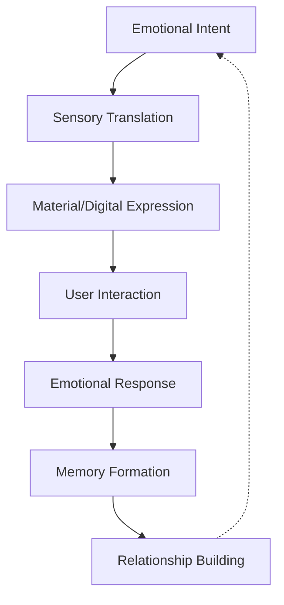
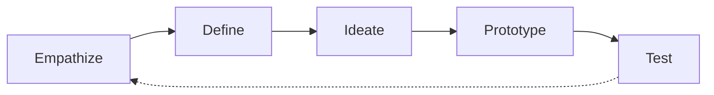

# Product Design Philosophy

<Note>
This is a starter document outlining the MOOD MNKY product design philosophy. Future iterations will include more detailed case studies and examples.
</Note>

## Core Philosophy

MOOD MNKY approaches product design with a distinctive philosophy that combines sensory intelligence, emotional resonance, personalization, and sustainable craftsmanship. Our products bridge physical and digital realms to create holistic experiences that enhance wellbeing and self-expression.

### Foundational Principles

1. **Sensory Intelligence**: Designing for the complete sensory experience
2. **Emotional Resonance**: Creating meaningful emotional connections
3. **Personalized Expression**: Enabling authentic individualization
4. **Sustainable Craft**: Responsible materiality and production
5. **Digital-Physical Harmony**: Seamless integration across realms
6. **Ritual Enhancement**: Transforming routines into meaningful moments

## Design Ethos

### Sensory Design Integration

Our approach to sensory design:

<CardGroup cols={2}>
  <Card title="Olfactory Design" icon="nose">
    

      
Scent experience principles

      <ul className="list-disc pl-5">
        <li>Emotional scent mapping</li>
        <li>Fragrance storytelling</li>
        <li>Scent architecture</li>
        <li>Temporal fragrance evolution</li>
      </ul>
    

  </Card>
  
  <Card title="Tactile Design" icon="hand">
    

      
Touch experience principles

      <ul className="list-disc pl-5">
        <li>Textural language</li>
        <li>Temperature semantics</li>
        <li>Ergonomic comfort</li>
        <li>Interactive surfaces</li>
      </ul>
    

  </Card>
  
  <Card title="Visual Design" icon="eye">
    

      
Visual experience principles

      <ul className="list-disc pl-5">
        <li>Color psychology</li>
        <li>Form language</li>
        <li>Light interaction</li>
        <li>Visual rhythm</li>
      </ul>
    

  </Card>
  
  <Card title="Auditory Design" icon="ear-listen">
    

      
Sound experience principles

      <ul className="list-disc pl-5">
        <li>Functional sound design</li>
        <li>Ambient soundscapes</li>
        <li>Interaction sonification</li>
        <li>Branded audio elements</li>
      </ul>
    

  </Card>
</CardGroup>

### Emotional Design Framework

Products are designed to create meaningful emotional connections:

#### Emotional Mapping

We map products to emotional states and needs:

| Emotional Need | Design Response | Sensory Expression |
|----------------|-----------------|-------------------|
| **Calm & Balance** | Organic forms, gentle transitions, space for pause | Soft textures, rounded edges, muted colors, gentle sounds |
| **Energy & Vitality** | Dynamic forms, contrast, movement suggestion | Textural variety, vibrant accents, energizing scents |
| **Focus & Clarity** | Clean lines, intentional hierarchy, reduced noise | Cool tones, defined edges, refreshing scents |
| **Comfort & Security** | Embracing forms, weight, warmth | Soft materials, warm colors, comforting scents |
| **Joy & Playfulness** | Unexpected details, interactive elements, discovery | Tactile surprises, bright moments, uplifting scents |

### Personalization Framework

Our approach to creating personalized experiences:

<CardGroup cols={2}>
  <Card title="Expression Spectrum" icon="palette">
    

      
Spectrum of personalization depth

      <ul className="list-disc pl-5">
        <li>Curated selection</li>
        <li>Configured options</li>
        <li>Co-creation</li>
        <li>Complete customization</li>
      </ul>
    

  </Card>
  
  <Card title="Personalization Layers" icon="layer-group">
    

      
Dimensions of personalization

      <ul className="list-disc pl-5">
        <li>Functional adaptation</li>
        <li>Aesthetic personalization</li>
        <li>Sensory customization</li>
        <li>Interaction preferences</li>
      </ul>
    

  </Card>
</CardGroup>

#### Personalization Principles

1. **Meaningful Choices**: Options that matter, not overwhelming variety
2. **Adaptive Intelligence**: Learning from preferences to improve recommendations
3. **Expression Support**: Tools and frameworks that enable creativity
4. **Personalization Memory**: Systems that remember and evolve with users
5. **Bounded Creativity**: Frameworks that guide successful outcomes

## Design Methodology

### Human-Centered Design Process

Our design process follows a human-centered approach:

### Multi-Sensory Design Method

Our distinctive approach to multi-sensory design:

<Steps>
  <Step title="Emotional Intent Mapping">
    

      
Define emotional goals and user needs

      <ul className="list-disc pl-5">
        <li>Emotional need identification</li>
        <li>User context understanding</li>
        <li>Intent articulation</li>
        <li>Desired emotional journey</li>
      </ul>
    

  </Step>
  
  <Step title="Sensory Translation">
    

      
Translate emotion to sensory experiences

      <ul className="list-disc pl-5">
        <li>Cross-modal mapping</li>
        <li>Sensory palette creation</li>
        <li>Sensory journey mapping</li>
        <li>Emotional-sensory correlation</li>
      </ul>
    

  </Step>
  
  <Step title="Form & Interaction Evolution">
    

      
Develop product form and interaction

      <ul className="list-disc pl-5">
        <li>Form exploration</li>
        <li>Material/digital expression</li>
        <li>Interaction paradigm</li>
        <li>Temporal experience</li>
      </ul>
    

  </Step>
  
  <Step title="Integration & Harmony">
    

      
Create cohesive multi-sensory experience

      <ul className="list-disc pl-5">
        <li>Cross-sensory consistency</li>
        <li>Physical-digital integration</li>
        <li>Brand language alignment</li>
        <li>Experience orchestration</li>
      </ul>
    

  </Step>
  
  <Step title="Testing & Refinement">
    

      
Validate and enhance experience

      <ul className="list-disc pl-5">
        <li>Multi-sensory user testing</li>
        <li>Emotional response validation</li>
        <li>Preference mapping</li>
        <li>Iterative refinement</li>
      </ul>
    

  </Step>
</Steps>

### Fragrance Design Methodology

Our specialized approach to scent creation:

<CardGroup cols={2}>
  <Card title="Emotional Scent Mapping" icon="map">
    

      
Connecting emotions to scents

      <ul className="list-disc pl-5">
        <li>Emotional state definition</li>
        <li>Scent-emotion correlation</li>
        <li>Cultural context consideration</li>
        <li>Memory association</li>
      </ul>
    

  </Card>
  
  <Card title="Scent Architecture" icon="building">
    

      
Structured fragrance development

      <ul className="list-disc pl-5">
        <li>Note structure planning</li>
        <li>Temporal evolution design</li>
        <li>Scent intensity mapping</li>
        <li>Complementary balance</li>
      </ul>
    

  </Card>
</CardGroup>

## Design Language

### Visual Design Language

Our visual design principles:

1. **Natural Minimalism**: Inspired by nature's efficiency and beauty
2. **Honest Materials**: True expression of material properties
3. **Considered Details**: Thoughtful details that create moments of delight
4. **Adaptive Contrast**: Balanced tension between elements
5. **Sensory Cues**: Visual elements that suggest other sensory experiences

### Form Language

Our form design principles:

<CardGroup cols={2}>
  <Card title="Organic Geometry" icon="shapes">
    

      
Balancing natural & geometric forms

      <ul className="list-disc pl-5">
        <li>Soft geometric shapes</li>
        <li>Nature-inspired contours</li>
        <li>Balanced asymmetry</li>
        <li>Harmonious proportion</li>
      </ul>
    

  </Card>
  
  <Card title="Sensory Affordance" icon="hand-point-up">
    

      
Forms that invite interaction

      <ul className="list-disc pl-5">
        <li>Intuitive handling cues</li>
        <li>Textural invitation</li>
        <li>Ergonomic comfort</li>
        <li>Discovery moments</li>
      </ul>
    

  </Card>
</CardGroup>

### Material Philosophy

Our approach to materials:

1. **Material Honesty**: Authentic expression of material properties
2. **Sensorial Quality**: Materials selected for sensory experience
3. **Sustainable Sourcing**: Environmentally responsible materials
4. **Considered Aging**: Designing for beautiful patina and evolution
5. **Meaningful Contrast**: Juxtaposition of complementary materials

### Interaction Design Principles

Our approach to interaction design:

<CardGroup cols={2}>
  <Card title="Ritual Enhancement" icon="hand-sparkles">
    

      
Elevating everyday moments

      <ul className="list-disc pl-5">
        <li>Meaningful gestures</li>
        <li>Pace consideration</li>
        <li>Ceremonial moments</li>
        <li>State transitions</li>
      </ul>
    

  </Card>
  
  <Card title="Intuitive Progression" icon="arrow-trend-up">
    

      
Natural interaction flow

      <ul className="list-disc pl-5">
        <li>Discoverable interactions</li>
        <li>Consistent patterns</li>
        <li>Progressive disclosure</li>
        <li>Feedback loops</li>
      </ul>
    

  </Card>
</CardGroup>

## Physical-Digital Integration

### Integration Principles

Our approach to bridging physical and digital:

1. **Seamless Transitions**: Fluid movement between realms
2. **Complementary Strengths**: Leveraging the best of each domain
3. **Consistent Identity**: Unified experience across touchpoints
4. **Synchronized Evolution**: Coordinated updates across realms
5. **Cross-Domain Enrichment**: Each realm enhances the other

### Integration Patterns

<CardGroup cols={2}>
  <Card title="Physical to Digital" icon="arrow-right-to-arc">
    

      
Physical objects enhancing digital

      <ul className="list-disc pl-5">
        <li>Physical authentication</li>
        <li>Tangible control interfaces</li>
        <li>Real-world data collection</li>
        <li>Spatial anchoring</li>
      </ul>
    

  </Card>
  
  <Card title="Digital to Physical" icon="arrow-right-from-arc">
    

      
Digital enhancing physical

      <ul className="list-disc pl-5">
        <li>Product customization</li>
        <li>Usage guidance</li>
        <li>Enhanced information</li>
        <li>Community connection</li>
      </ul>
    

  </Card>
  
  <Card title="Parallel Experiences" icon="arrows-left-right">
    

      
Coordinated parallel experiences

      <ul className="list-disc pl-5">
        <li>Synchronized content</li>
        <li>Complementary interactions</li>
        <li>Shared aesthetics</li>
        <li>Cross-domain references</li>
      </ul>
    

  </Card>
  
  <Card title="Hybrid Objects" icon="object-group">
    

      
Truly integrated experiences

      <ul className="list-disc pl-5">
        <li>Smart physical products</li>
        <li>Connected objects</li>
        <li>Digital twins</li>
        <li>Augmented reality layers</li>
      </ul>
    

  </Card>
</CardGroup>

## Sustainability Approach

### Sustainable Design Principles

Our approach to environmentally responsible design:

1. **Circular Design**: Products designed for disassembly, repair, and recycling
2. **Material Selection**: Sustainably sourced, renewable, and recycled materials
3. **Production Ethics**: Ethical manufacturing with minimized impact
4. **Longevity Focus**: Creating products that improve with age and use
5. **Waste Minimization**: Reducing packaging and production waste

### Implementation Approach

<CardGroup cols={2}>
  <Card title="Materials Strategy" icon="leaf">
    

      
Sustainable material selection

      <ul className="list-disc pl-5">
        <li>Renewable material preference</li>
        <li>Recycled material integration</li>
        <li>Biodegradable options</li>
        <li>Ethical sourcing verification</li>
      </ul>
    

  </Card>
  
  <Card title="Production Ethics" icon="industry">
    

      
Responsible manufacturing

      <ul className="list-disc pl-5">
        <li>Energy-efficient processes</li>
        <li>Water conservation</li>
        <li>Waste reduction strategies</li>
        <li>Ethical labor practices</li>
      </ul>
    

  </Card>
  
  <Card title="Product Lifecycle" icon="recycle">
    

      
End-to-end lifecycle planning

      <ul className="list-disc pl-5">
        <li>Designed for disassembly</li>
        <li>Repair-friendly construction</li>
        <li>Recycling program</li>
        <li>Second-life planning</li>
      </ul>
    

  </Card>
  
  <Card title="Packaging Design" icon="box">
    

      
Sustainable packaging approach

      <ul className="list-disc pl-5">
        <li>Minimalist packaging</li>
        <li>Recycled/recyclable materials</li>
        <li>Multi-use packaging</li>
        <li>Plastic elimination</li>
      </ul>
    

  </Card>
</CardGroup>

## Applying Our Philosophy

### Product Categories

How our philosophy manifests across product types:

<CardGroup cols={2}>
  <Card title="Fragrance Products" icon="spray-can-sparkles">
    

      
Scent-focused offerings

      <ul className="list-disc pl-5">
        <li>Custom blend fragrances</li>
        <li>Scent diffusion systems</li>
        <li>Ritual-enhancing vessels</li>
        <li>Digital-physical scent experiences</li>
      </ul>
    

  </Card>
  
  <Card title="Self-Care Products" icon="hand-holding-heart">
    

      
Personal care and wellness

      <ul className="list-disc pl-5">
        <li>Bath and body products</li>
        <li>Ritual objects</li>
        <li>Wellness tools</li>
        <li>Sensory enhancement products</li>
      </ul>
    

  </Card>
  
  <Card title="Digital Applications" icon="mobile-screen-button">
    

      
Software experiences

      <ul className="list-disc pl-5">
        <li>Customization platforms</li>
        <li>Ritual guidance apps</li>
        <li>Community platforms</li>
        <li>Product companions</li>
      </ul>
    

  </Card>
  
  <Card title="Experience Products" icon="star">
    

      
Multi-dimensional offerings

      <ul className="list-disc pl-5">
        <li>Subscription experiences</li>
        <li>Limited edition collaborations</li>
        <li>Event-based products</li>
        <li>Learning journeys</li>
      </ul>
    

  </Card>
</CardGroup>

### Case Study: Custom Fragrance Creation

How our philosophy manifests in our flagship custom scent experience:

1. **Emotional Intent**: Capturing personal emotional landscapes
2. **Sensory Translation**: Mapping emotions to scent compositions
3. **Material Expression**: Selecting natural ingredients and vessels
4. **Digital Integration**: Blending digital tools with physical outcomes
5. **Ritual Enhancement**: Creating moments of pause and intention
6. **Sustainable Crafting**: Responsible formulation and packaging

## Implementation Resources

<CardGroup cols={2}>
  <Card title="Design Toolkit" icon="toolbox" href="#">
    Methods and tools for product design
  </Card>
  <Card title="Material Library" icon="swatchbook" href="#">
    Sustainable material options
  </Card>
  <Card title="Case Studies" icon="magnifying-glass-chart" href="#">
    Examples of philosophy in practice
  </Card>
  <Card title="Design Templates" icon="object-group" href="#">
    Starting points for new products
  </Card>
</CardGroup>