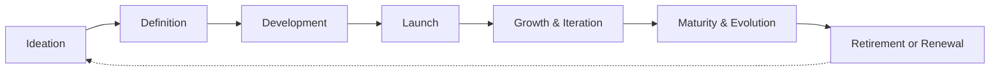

# Product Lifecycle

<Note>
This is a starter document outlining the MOOD MNKY product lifecycle management framework. Future iterations will include more detailed workflows and implementation examples.
</Note>

## Overview

The MOOD MNKY product lifecycle management (PLM) framework defines the end-to-end process for conceiving, developing, launching, maintaining, and eventually retiring both physical and digital products. This document establishes standardized processes, roles, and metrics to ensure consistent, high-quality product development across the ecosystem.

## Core Principles

Our product lifecycle management is guided by these principles:

1. **User-Centered Design**: Customer needs drive all product decisions
2. **Iterative Development**: Continuous improvement through feedback loops
3. **Cross-Functional Collaboration**: Integrated teams across disciplines
4. **Data-Driven Decision Making**: Metrics guide product evolution
5. **Sustainability Focus**: Environmental and business sustainability
6. **Multi-Sensory Integration**: Coordinated physical and digital experiences

## Lifecycle Phases

### End-to-End Product Lifecycle

The MOOD MNKY product lifecycle consists of six primary phases:

### Phase Descriptions

<CardGroup cols={2}>
  <Card title="Ideation" icon="lightbulb">
    

      
Concept exploration and validation

      <ul className="list-disc pl-5">
        <li>Market research and trend analysis</li>
        <li>Customer need identification</li>
        <li>Concept generation workshops</li>
        <li>Early concept validation</li>
        <li>Business case development</li>
      </ul>
    

  </Card>
  
  <Card title="Definition" icon="pencil">
    

      
Detailed product specification

      <ul className="list-disc pl-5">
        <li>Product requirements document</li>
        <li>Technical specification</li>
        <li>Experience design</li>
        <li>Regulatory review</li>
        <li>Go/no-go decision</li>
      </ul>
    

  </Card>
  
  <Card title="Development" icon="code">
    

      
Building and testing the product

      <ul className="list-disc pl-5">
        <li>Iterative development cycles</li>
        <li>Prototyping and testing</li>
        <li>Quality assurance</li>
        <li>Production preparation</li>
        <li>Pre-launch validation</li>
      </ul>
    

  </Card>
  
  <Card title="Launch" icon="rocket">
    

      
Market introduction and scaling

      <ul className="list-disc pl-5">
        <li>Go-to-market strategy</li>
        <li>Launch communication plan</li>
        <li>Sales enablement</li>
        <li>Initial production run</li>
        <li>Early adopter feedback</li>
      </ul>
    

  </Card>
  
  <Card title="Growth & Iteration" icon="chart-line">
    

      
Expanding reach and enhancing offering

      <ul className="list-disc pl-5">
        <li>Performance monitoring</li>
        <li>Iterative improvements</li>
        <li>Market expansion</li>
        <li>Production scaling</li>
        <li>Ecosystem integration</li>
      </ul>
    

  </Card>
  
  <Card title="Maturity & Evolution" icon="balance-scale">
    

      
Optimizing mature products

      <ul className="list-disc pl-5">
        <li>Performance optimization</li>
        <li>Cost engineering</li>
        <li>Extension opportunities</li>
        <li>Maintenance planning</li>
        <li>Next-generation planning</li>
      </ul>
    

  </Card>
  
  <Card title="Retirement or Renewal" icon="clock-rotate-left">
    

      
Graceful end-of-life or reinvention

      <ul className="list-disc pl-5">
        <li>Sunset planning</li>
        <li>Customer migration</li>
        <li>Legacy support strategy</li>
        <li>Renewal assessment</li>
        <li>Knowledge capture</li>
      </ul>
    

  </Card>
</CardGroup>

## Product Categories and Lifecycles

### Product Type Variations

Different product types follow customized lifecycle variations:

<CardGroup cols={2}>
  <Card title="Physical Products" icon="box">
    

      
Fragrance and self-care items

      <ul className="list-disc pl-5">
        <li>Extended development phase</li>
        <li>Formulation and safety testing</li>
        <li>Supply chain coordination</li>
        <li>Physical production lead times</li>
        <li>Inventory management</li>
        <li>Shipping and fulfillment</li>
      </ul>
    

  </Card>
  
  <Card title="Digital Products" icon="laptop-code">
    

      
Applications and digital experiences

      <ul className="list-disc pl-5">
        <li>Rapid iteration cycles</li>
        <li>Continuous deployment</li>
        <li>Feature-driven development</li>
        <li>A/B testing and experimentation</li>
        <li>Analytics-driven optimization</li>
        <li>Version management</li>
      </ul>
    

  </Card>
  
  <Card title="Custom Products" icon="wand-magic-sparkles">
    

      
Personalized customer creations

      <ul className="list-disc pl-5">
        <li>Creation platform development</li>
        <li>Component system architecture</li>
        <li>Customization boundaries</li>
        <li>On-demand production</li>
        <li>Personalization infrastructure</li>
        <li>Custom fulfillment processes</li>
      </ul>
    

  </Card>
  
  <Card title="Experience Products" icon="glasses">
    

      
Mixed physical-digital experiences

      <ul className="list-disc pl-5">
        <li>Multi-channel design</li>
        <li>Physical-digital integration</li>
        <li>Sensory mapping</li>
        <li>Experience orchestration</li>
        <li>Multi-touchpoint testing</li>
        <li>Holistic measurement</li>
      </ul>
    

  </Card>
</CardGroup>

### Timeline Variations

Typical timeline ranges for different product categories:

| Phase | Physical Products | Digital Products | Custom Products | Experience Products |
|-------|-------------------|------------------|-----------------|---------------------|
| **Ideation** | 4-8 weeks | 2-4 weeks | 4-6 weeks | 6-10 weeks |
| **Definition** | 6-12 weeks | 2-6 weeks | 4-8 weeks | 8-12 weeks |
| **Development** | 12-24 weeks | 4-12 weeks | 8-16 weeks | 12-20 weeks |
| **Launch** | 4-8 weeks | 2-4 weeks | 2-4 weeks | 4-8 weeks |
| **Growth** | 6-12 months | 3-6 months | 4-8 months | 6-12 months |
| **Maturity** | 12-36 months | 6-18 months | 12-24 months | 12-24 months |
| **Retirement** | 3-6 months | 1-3 months | 2-4 months | 3-6 months |

## Phase-Specific Activities

### Ideation Phase

The starting point for all product journeys:

<Steps>
  <Step title="Opportunity Identification">
    

      
Explore market gaps and customer needs

      <ul className="list-disc pl-5">
        <li>Market research and trend analysis</li>
        <li>Customer feedback review</li>
        <li>Competitive landscape assessment</li>
        <li>Technology capability exploration</li>
        <li>Brand alignment assessment</li>
      </ul>
    

  </Step>
  
  <Step title="Concept Generation">
    

      
Create and refine product concepts

      <ul className="list-disc pl-5">
        <li>Ideation workshops</li>
        <li>Cross-functional brainstorming</li>
        <li>Concept sketching</li>
        <li>Initial technical assessment</li>
        <li>Preliminary financial modeling</li>
      </ul>
    

  </Step>
  
  <Step title="Concept Validation">
    

      
Test market interest and viability

      <ul className="list-disc pl-5">
        <li>Customer concept testing</li>
        <li>Technical feasibility assessment</li>
        <li>Preliminary cost estimation</li>
        <li>Regulatory review</li>
        <li>Strategic fit evaluation</li>
      </ul>
    

  </Step>
  
  <Step title="Opportunity Assessment">
    

      
Evaluate business potential

      <ul className="list-disc pl-5">
        <li>Market sizing</li>
        <li>Revenue projection</li>
        <li>Cost modeling</li>
        <li>Investment requirements</li>
        <li>Preliminary business case</li>
      </ul>
    

  </Step>
  
  <Step title="Concept Selection">
    

      
Prioritize and select concepts to advance

      <ul className="list-disc pl-5">
        <li>Concept prioritization framework</li>
        <li>Evaluation against success criteria</li>
        <li>Risk assessment</li>
        <li>Resource requirement review</li>
        <li>Go/no-go decision for definition phase</li>
      </ul>
    

  </Step>
</Steps>

#### Key Deliverables

- Concept brief
- Market opportunity assessment
- Preliminary business case
- Initial product vision
- Concept selection documentation

#### Decision Gate: Concept Approval

Products must meet these criteria to advance:

- Clear customer need validation
- Technical feasibility confirmation
- Business case viability
- Strategic alignment with ecosystem
- Resource availability

### Definition Phase

Translating concepts into detailed specifications:

<Steps>
  <Step title="Product Requirements">
    

      
Define detailed product requirements

      <ul className="list-disc pl-5">
        <li>User needs documentation</li>
        <li>Functional requirements specification</li>
        <li>Performance requirements</li>
        <li>Quality standards</li>
        <li>Regulatory requirements</li>
      </ul>
    

  </Step>
  
  <Step title="Experience Design">
    

      
Design the customer experience

      <ul className="list-disc pl-5">
        <li>User journey mapping</li>
        <li>Experience architecture</li>
        <li>Interaction design</li>
        <li>Sensory experience mapping</li>
        <li>Brand experience alignment</li>
      </ul>
    

  </Step>
  
  <Step title="Technical Specification">
    

      
Define technical implementation

      <ul className="list-disc pl-5">
        <li>Architecture definition</li>
        <li>Technology selection</li>
        <li>Integration requirements</li>
        <li>Technical constraints</li>
        <li>Security requirements</li>
      </ul>
    

  </Step>
  
  <Step title="Go-To-Market Planning">
    

      
Develop marketing and launch strategy

      <ul className="list-disc pl-5">
        <li>Target audience definition</li>
        <li>Positioning and messaging</li>
        <li>Pricing strategy</li>
        <li>Channel strategy</li>
        <li>Launch planning</li>
      </ul>
    

  </Step>
  
  <Step title="Product Roadmap">
    

      
Define development and evolution plan

      <ul className="list-disc pl-5">
        <li>Feature prioritization</li>
        <li>Development phasing</li>
        <li>Release planning</li>
        <li>Resource allocation</li>
        <li>Risk mitigation planning</li>
      </ul>
    

  </Step>
</Steps>

#### Key Deliverables

- Product requirements document (PRD)
- Technical specification document
- Experience design documentation
- Go-to-market strategy
- Development roadmap
- Updated business case

#### Decision Gate: Development Approval

Products must meet these criteria to advance:

- Comprehensive requirements documentation
- Clear technical feasibility
- Approved business case
- Defined success metrics
- Secured resources and budget

### Development Phase

Building and testing the product:

<Steps>
  <Step title="Planning and Setup">
    

      
Prepare for development execution

      <ul className="list-disc pl-5">
        <li>Team formation</li>
        <li>Development environment setup</li>
        <li>Detailed planning</li>
        <li>Work breakdown</li>
        <li>Progress tracking mechanisms</li>
      </ul>
    

  </Step>
  
  <Step title="Iterative Development">
    

      
Build the product in increments

      <ul className="list-disc pl-5">
        <li>Agile development sprints</li>
        <li>Regular progress reviews</li>
        <li>Prototype creation</li>
        <li>Internal testing</li>
        <li>Cross-functional collaboration</li>
      </ul>
    

  </Step>
  
  <Step title="Testing and Validation">
    

      
Ensure quality and requirement fulfillment

      <ul className="list-disc pl-5">
        <li>Quality assurance testing</li>
        <li>User acceptance testing</li>
        <li>Performance testing</li>
        <li>Regulatory compliance validation</li>
        <li>Security testing</li>
      </ul>
    

  </Step>
  
  <Step title="Pre-Launch Preparation">
    

      
Prepare for market introduction

      <ul className="list-disc pl-5">
        <li>Production preparation</li>
        <li>Documentation finalization</li>
        <li>Support readiness</li>
        <li>Marketing asset creation</li>
        <li>Launch planning finalization</li>
      </ul>
    

  </Step>
  
  <Step title="Launch Readiness">
    

      
Final validation before launch

      <ul className="list-disc pl-5">
        <li>Go-to-market readiness assessment</li>
        <li>Final product validation</li>
        <li>Launch risk review</li>
        <li>Contingency planning</li>
        <li>Launch decision</li>
      </ul>
    

  </Step>
</Steps>

#### Key Deliverables

- Functional product
- Quality assurance documentation
- User documentation
- Production specifications
- Launch plan
- Support documentation

#### Decision Gate: Launch Approval

Products must meet these criteria to advance:

- Quality standards achievement
- Validated user experience
- Completed go-to-market preparation
- Support readiness
- Regulatory compliance

### Launch Phase

Bringing the product to market:

<Steps>
  <Step title="Pre-Launch Activities">
    

      
Final preparations before launch

      <ul className="list-disc pl-5">
        <li>Sales enablement training</li>
        <li>Support team training</li>
        <li>Marketing campaign activation</li>
        <li>Initial inventory preparation</li>
        <li>System deployment</li>
      </ul>
    

  </Step>
  
  <Step title="Launch Execution">
    

      
Coordinated market introduction

      <ul className="list-disc pl-5">
        <li>Public announcement</li>
        <li>Availability enablement</li>
        <li>Marketing campaign execution</li>
        <li>Sales activation</li>
        <li>Community engagement</li>
      </ul>
    

  </Step>
  
  <Step title="Early Adoption Management">
    

      
Support initial customer experience

      <ul className="list-disc pl-5">
        <li>Customer onboarding</li>
        <li>Early feedback collection</li>
        <li>Issue monitoring and resolution</li>
        <li>Usage analysis</li>
        <li>Support optimization</li>
      </ul>
    

  </Step>
  
  <Step title="Market Response Analysis">
    

      
Evaluate initial market reception

      <ul className="list-disc pl-5">
        <li>Sales performance tracking</li>
        <li>Customer feedback analysis</li>
        <li>Market sentiment monitoring</li>
        <li>Competitive response assessment</li>
        <li>Early success metrics evaluation</li>
      </ul>
    

  </Step>
  
  <Step title="Post-Launch Adjustment">
    

      
Respond to early market feedback

      <ul className="list-disc pl-5">
        <li>Quick-win improvements</li>
        <li>Messaging refinement</li>
        <li>Support enhancement</li>
        <li>Production adjustment</li>
        <li>Roadmap refinement</li>
      </ul>
    

  </Step>
</Steps>

#### Key Deliverables

- Launch execution documentation
- Early performance reports
- Customer feedback analysis
- Post-launch adjustment plan
- Updated product roadmap

#### Decision Gate: Growth Investment

Products must meet these criteria to advance:

- Positive market reception
- Operational stability
- Financial performance meeting targets
- Validated product-market fit
- Sustainable growth opportunity

### Growth & Iteration Phase

Expanding reach and enhancing the offering:

<Steps>
  <Step title="Performance Monitoring">
    

      
Track and analyze product performance

      <ul className="list-disc pl-5">
        <li>Key metric tracking</li>
        <li>Customer feedback monitoring</li>
        <li>Usage pattern analysis</li>
        <li>Performance against goals</li>
        <li>Competitive position tracking</li>
      </ul>
    

  </Step>
  
  <Step title="Continuous Improvement">
    

      
Enhance product based on feedback

      <ul className="list-disc pl-5">
        <li>Feature enhancement</li>
        <li>Quality improvement</li>
        <li>Performance optimization</li>
        <li>User experience refinement</li>
        <li>Technical debt management</li>
      </ul>
    

  </Step>
  
  <Step title="Market Expansion">
    

      
Extend reach to new customers

      <ul className="list-disc pl-5">
        <li>Market segment expansion</li>
        <li>Channel development</li>
        <li>Geographic expansion</li>
        <li>Use case extension</li>
        <li>Partnership development</li>
      </ul>
    

  </Step>
  
  <Step title="Scaling Operations">
    

      
Evolve operations for growth

      <ul className="list-disc pl-5">
        <li>Production scaling</li>
        <li>Supply chain optimization</li>
        <li>Support capability expansion</li>
        <li>Process improvement</li>
        <li>Infrastructure scaling</li>
      </ul>
    

  </Step>
  
  <Step title="Ecosystem Integration">
    

      
Strengthen product connections

      <ul className="list-disc pl-5">
        <li>Cross-product integration</li>
        <li>Platform incorporation</li>
        <li>Complementary product development</li>
        <li>Service expansion</li>
        <li>Community engagement</li>
      </ul>
    

  </Step>
</Steps>

#### Key Deliverables

- Performance reports
- Product improvement roadmap
- Market expansion plan
- Scaling strategy
- Ecosystem integration plan

#### Decision Gate: Long-term Investment

Products must meet these criteria to maintain investment:

- Sustainable revenue growth
- Positive customer satisfaction
- Operational efficiency
- Strategic ecosystem importance
- Ongoing market relevance

### Maturity & Evolution Phase

Optimizing established products:

<Steps>
  <Step title="Performance Optimization">
    

      
Maximize product efficiency

      <ul className="list-disc pl-5">
        <li>Operational efficiency improvements</li>
        <li>Cost optimization</li>
        <li>Quality enhancement</li>
        <li>Technical performance improvement</li>
        <li>User experience refinement</li>
      </ul>
    

  </Step>
  
  <Step title="Product Extension">
    

      
Extend product value

      <ul className="list-disc pl-5">
        <li>Feature expansion</li>
        <li>Variant development</li>
        <li>Packaging refresh</li>
        <li>New use case development</li>
        <li>Complementary offering creation</li>
      </ul>
    

  </Step>
  
  <Step title="Market Optimization">
    

      
Fine-tune market approach

      <ul className="list-disc pl-5">
        <li>Pricing optimization</li>
        <li>Channel efficiency improvement</li>
        <li>Marketing message refinement</li>
        <li>Customer segment focus</li>
        <li>Competitive response strategies</li>
      </ul>
    

  </Step>
  
  <Step title="Strategic Assessment">
    

      
Evaluate long-term position

      <ul className="list-disc pl-5">
        <li>Market trend analysis</li>
        <li>Technological evolution assessment</li>
        <li>Competitive landscape review</li>
        <li>Long-term viability assessment</li>
        <li>Next-generation planning</li>
      </ul>
    

  </Step>
  
  <Step title="Evolution Planning">
    

      
Plan product future

      <ul className="list-disc pl-5">
        <li>Replacement product planning</li>
        <li>Major upgrade evaluation</li>
        <li>End-of-life consideration</li>
        <li>Migration path development</li>
        <li>Transition strategy</li>
      </ul>
    

  </Step>
</Steps>

#### Key Deliverables

- Optimization reports
- Extension roadmap
- Market optimization plan
- Strategic assessment
- Evolution strategy

#### Decision Gate: Future Path

Products must be assessed for their next step:

- Renewal through major update
- Replacement with next-generation product
- Sustained maintenance
- Planned sunset

### Retirement or Renewal Phase

Graceful end-of-life or reinvention:

<Steps>
  <Step title="End-of-Life Assessment">
    

      
Evaluate retirement needs

      <ul className="list-disc pl-5">
        <li>Usage analysis</li>
        <li>Customer impact assessment</li>
        <li>Revenue impact analysis</li>
        <li>Technical dependencies</li>
        <li>Brand considerations</li>
      </ul>
    

  </Step>
  
  <Step title="Sunset Planning">
    

      
Plan for graceful discontinuation

      <ul className="list-disc pl-5">
        <li>Timeline development</li>
        <li>Customer communication strategy</li>
        <li>Support wind-down plan</li>
        <li>Inventory management</li>
        <li>Technical decommissioning</li>
      </ul>
    

  </Step>
  
  <Step title="Migration Strategy">
    

      
Support customer transition

      <ul className="list-disc pl-5">
        <li>Alternative product recommendations</li>
        <li>Migration tools and support</li>
        <li>Incentive programs</li>
        <li>Data transition planning</li>
        <li>Support continuity</li>
      </ul>
    

  </Step>
  
  <Step title="Knowledge Preservation">
    

      
Capture key learnings

      <ul className="list-disc pl-5">
        <li>Success factor documentation</li>
        <li>Challenge documentation</li>
        <li>Customer insight preservation</li>
        <li>Technical knowledge transfer</li>
        <li>Process improvement recommendations</li>
      </ul>
    

  </Step>
  
  <Step title="Retirement Execution">
    

      
Implement retirement plan

      <ul className="list-disc pl-5">
        <li>Customer notification</li>
        <li>Sales discontinuation</li>
        <li>Support transition</li>
        <li>System decommissioning</li>
        <li>Final reporting</li>
      </ul>
    

  </Step>
</Steps>

#### Renewal Alternative

For products selected for renewal rather than retirement:

1. **Renewal Vision**: Define the transformation scope
2. **Market Validation**: Confirm continued market need
3. **Renewal Planning**: Develop comprehensive renewal roadmap
4. **Resource Allocation**: Secure renewal investment
5. **Renewal Execution**: Implement major product update

#### Key Deliverables

- Sunset plan
- Migration strategy
- Knowledge capture report
- Customer communication plan
- Retirement execution documentation

## Roles and Responsibilities

### Core Product Team

<CardGroup cols={2}>
  <Card title="Product Manager" icon="clipboard-list">
    

      
Overall product success ownership

      <ul className="list-disc pl-5">
        <li>Product vision and strategy</li>
        <li>Requirements definition</li>
        <li>Roadmap management</li>
        <li>Cross-functional coordination</li>
        <li>Business case ownership</li>
      </ul>
    

  </Card>
  
  <Card title="Experience Designer" icon="wand-magic-sparkles">
    

      
Customer experience design

      <ul className="list-disc pl-5">
        <li>User research</li>
        <li>Experience architecture</li>
        <li>Interaction design</li>
        <li>Sensory experience mapping</li>
        <li>Usability testing</li>
      </ul>
    

  </Card>
  
  <Card title="Technical Lead" icon="code">
    

      
Technical implementation leadership

      <ul className="list-disc pl-5">
        <li>Architecture design</li>
        <li>Technical specifications</li>
        <li>Development oversight</li>
        <li>Quality standards</li>
        <li>Technical risk management</li>
      </ul>
    

  </Card>
  
  <Card title="Quality Assurance Lead" icon="clipboard-check">
    

      
Product quality assurance

      <ul className="list-disc pl-5">
        <li>Test planning</li>
        <li>Quality standards definition</li>
        <li>Testing coordination</li>
        <li>Defect management</li>
        <li>Release validation</li>
      </ul>
    

  </Card>
</CardGroup>

### Extended Team

<CardGroup cols={3}>
  <Card title="Marketing Manager" icon="bullhorn">
    Marketing strategy and execution
  </Card>
  <Card title="Supply Chain Manager" icon="truck-fast">
    Production and logistics coordination
  </Card>
  <Card title="Customer Support Lead" icon="headset">
    Support readiness and delivery
  </Card>
  <Card title="Finance Partner" icon="chart-pie">
    Financial modeling and tracking
  </Card>
  <Card title="Legal Counsel" icon="scale-balanced">
    Regulatory and compliance guidance
  </Card>
  <Card title="Agent Integration Lead" icon="robot">
    AI agent capability integration
  </Card>
</CardGroup>

### RACI Matrix

```mermaid
%%{init: {'theme': 'neutral' } }%%
gantt
    title Product Lifecycle RACI Matrix
    dateFormat  X
    axisFormat %s
    
    section Ideation
    Product Manager          :active, 0, 1
    Experience Designer      :active, 0, 1
    Technical Lead           :active, 0, 1
    Marketing Manager        :active, 0, 1
    
    section Definition
    Product Manager          :active, 0, 1
    Experience Designer      :active, 0, 1
    Technical Lead           :active, 0, 1
    Quality Assurance Lead   :active, 0, 1
    
    section Development
    Product Manager          :active, 0, 1
    Technical Lead           :active, 0, 1
    Quality Assurance Lead   :active, 0, 1
    Experience Designer      :active, 0, 1
    
    section Launch
    Product Manager          :active, 0, 1
    Marketing Manager        :active, 0, 1
    Supply Chain Manager     :active, 0, 1
    Customer Support Lead    :active, 0, 1
    
    section Growth
    Product Manager          :active, 0, 1
    Marketing Manager        :active, 0, 1
    Technical Lead           :active, 0, 1
    Finance Partner          :active, 0, 1
    
    section Maturity
    Product Manager          :active, 0, 1
    Finance Partner          :active, 0, 1
    Supply Chain Manager     :active, 0, 1
    Marketing Manager        :active, 0, 1
    
    section Retirement
    Product Manager          :active, 0, 1
    Customer Support Lead    :active, 0, 1
    Marketing Manager        :active, 0, 1
    Technical Lead           :active, 0, 1
```

## Documentation and Artifacts

### Core Documentation

<CardGroup cols={2}>
  <Card title="Product Brief" icon="file-lines">
    

      
Concept summary document

      <ul className="list-disc pl-5">
        <li>Product vision</li>
        <li>Target audience</li>
        <li>Key features</li>
        <li>Value proposition</li>
        <li>Success metrics</li>
      </ul>
    

  </Card>
  
  <Card title="Product Requirements Document" icon="file-contract">
    

      
Detailed requirements specification

      <ul className="list-disc pl-5">
        <li>User stories</li>
        <li>Functional requirements</li>
        <li>Non-functional requirements</li>
        <li>Constraints</li>
        <li>Acceptance criteria</li>
      </ul>
    

  </Card>
  
  <Card title="Technical Specification" icon="file-code">
    

      
Implementation guidelines

      <ul className="list-disc pl-5">
        <li>Architecture design</li>
        <li>Technical requirements</li>
        <li>Integration points</li>
        <li>Security requirements</li>
        <li>Performance standards</li>
      </ul>
    

  </Card>
  
  <Card title="Go-to-Market Plan" icon="rocket">
    

      
Launch strategy and execution

      <ul className="list-disc pl-5">
        <li>Launch timeline</li>
        <li>Marketing strategy</li>
        <li>Sales enablement</li>
        <li>Channel strategy</li>
        <li>Success metrics</li>
      </ul>
    

  </Card>
</CardGroup>

### Documentation By Phase

Each lifecycle phase requires specific documentation:

| Phase | Key Documents |
|-------|---------------|
| **Ideation** | Concept Brief, Market Research, Opportunity Assessment |
| **Definition** | PRD, Technical Spec, Experience Design Document, Business Case |
| **Development** | Development Plan, Test Plan, Progress Reports, Release Notes |
| **Launch** | Launch Plan, Marketing Collateral, Support Documentation, Training Materials |
| **Growth** | Performance Reports, Improvement Plans, Market Expansion Strategy |
| **Maturity** | Optimization Reports, Extension Plans, Strategic Assessment |
| **Retirement** | Sunset Plan, Migration Guide, Retirement Communication Plan |

## Success Metrics and KPIs

### Metric Categories

Product performance is measured across multiple dimensions:

<CardGroup cols={2}>
  <Card title="Business Performance" icon="chart-line">
    

      
Financial and business impact

      <ul className="list-disc pl-5">
        <li>Revenue</li>
        <li>Profit margin</li>
        <li>Customer acquisition cost</li>
        <li>Customer lifetime value</li>
        <li>Return on investment</li>
      </ul>
    

  </Card>
  
  <Card title="Customer Success" icon="user-check">
    

      
Customer experience metrics

      <ul className="list-disc pl-5">
        <li>Customer satisfaction (CSAT)</li>
        <li>Net Promoter Score (NPS)</li>
        <li>Retention rate</li>
        <li>Adoption rate</li>
        <li>Feature utilization</li>
      </ul>
    

  </Card>
  
  <Card title="Operational Excellence" icon="gauge-high">
    

      
Efficiency and quality metrics

      <ul className="list-disc pl-5">
        <li>Cost of goods sold</li>
        <li>Defect rate</li>
        <li>Support ticket volume</li>
        <li>On-time delivery</li>
        <li>Inventory turnover</li>
      </ul>
    

  </Card>
  
  <Card title="Strategic Impact" icon="chess">
    

      
Long-term strategic value

      <ul className="list-disc pl-5">
        <li>Market share</li>
        <li>Brand perception</li>
        <li>Platform adoption</li>
        <li>Ecosystem integration</li>
        <li>Innovation index</li>
      </ul>
    

  </Card>
</CardGroup>

### Phase-Specific KPIs

Each phase has distinct success metrics:

| Phase | Primary KPIs |
|-------|-------------|
| **Ideation** | Concept validation score, Market opportunity size, Technical feasibility rating |
| **Definition** | Requirements clarity score, Stakeholder alignment, Development estimate accuracy |
| **Development** | On-time delivery, Quality metrics, Budget adherence, Scope completion |
| **Launch** | Initial sales volume, Customer acquisition rate, Media coverage, Feedback sentiment |
| **Growth** | Revenue growth rate, Market share growth, Unit economics, Customer retention |
| **Maturity** | Profit margin, Cost reduction, Customer satisfaction stability, Competitive position |
| **Retirement** | Migration success rate, Customer retention through transition, Knowledge preservation |

## Implementation Resources

<CardGroup cols={2}>
  <Card title="Template Library" icon="file-lines" href="#">
    Standardized documentation templates
  </Card>
  <Card title="Process Guides" icon="book" href="#">
    Detailed process instructions
  </Card>
  <Card title="Tool Documentation" icon="screwdriver-wrench" href="#">
    Product lifecycle management tools
  </Card>
  <Card title="Training Resources" icon="graduation-cap" href="#">
    Role-specific training materials
  </Card>
</CardGroup>