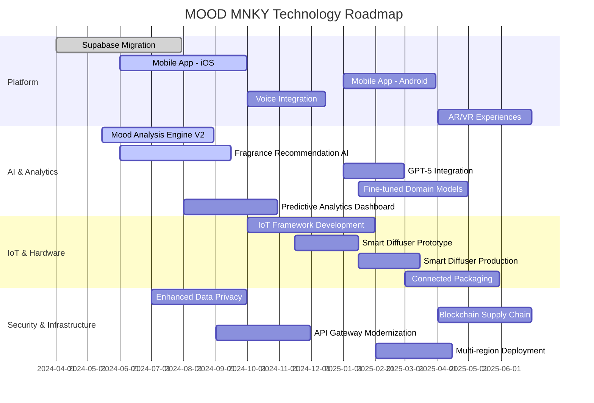

# Strategic Vision & Roadmap

This document outlines MOOD MNKY's strategic vision and product roadmap for 2024-2025, providing insights into our planned features, enhancements, and technological innovations.

## Vision Statement

By the end of 2025, MOOD MNKY will establish itself as the leading AI-powered personalized fragrance and self-care platform, blending cutting-edge technology with artisanal craftsmanship to create uniquely tailored experiences that enhance users' emotional well-being.

## Core Strategic Pillars

<CardGroup cols={3}>
  <Card title="Personalization" icon="fingerprint">
    Leverage AI to create increasingly personalized product recommendations and custom fragrances based on individual preferences, mood states, and usage patterns.
  </Card>
  <Card title="Technological Innovation" icon="microchip">
    Push the boundaries of AI, IoT, and sensory technology to create novel experiences at the intersection of digital and physical.
  </Card>
  <Card title="Sustainability" icon="leaf">
    Implement eco-friendly practices throughout our supply chain, product design, and business operations, targeting carbon neutrality by 2025.
  </Card>
</CardGroup>

## 2024-2025 Roadmap

<Tabs>
  <Tab title="Q3 2024">
    ### Product Launches
    - **Custom Fragrance Designer 2.0**
      - Enhanced AI blending algorithm with 50+ new base notes
      - Mood-based fragrance recommendation engine
      - Improved visualization of fragrance compositions
    
    ### Platform Enhancements
    - **Mobile App Beta Launch**
      - iOS app with core functionality
      - Integration with Apple Health for mood tracking
      - AR visualization for product testing
    
    ### Technology Infrastructure
    - **Supabase Integration Completion**
      - Migration of all legacy data
      - Real-time sync implementation
      - Advanced analytics dashboard
    
    ### Community & Marketing
    - **MOOD Community Hub Launch**
      - User-generated content platform
      - Fragrance sharing and rating system
      - Community challenges and rewards program
  </Tab>
  
  <Tab title="Q4 2024">
    ### Product Launches
    - **Winter Collection 2024**
      - Limited edition seasonal fragrances
      - Holiday gift sets with custom packaging
      - Subscription box special edition

    ### Platform Enhancements
    - **Voice Integration**
      - Voice-controlled fragrance designer
      - Audio mood analysis for product recommendations
      - Voice journaling for emotional tracking
    
    ### Technology Infrastructure
    - **IoT Framework Alpha**
      - Developer SDK for smart home integration
      - Protocol for IoT device communication
      - Data collection and privacy framework
    
    ### Community & Marketing
    - **Influencer Partnership Program**
      - Custom fragrance lines with key influencers
      - Co-created content strategy
      - Exclusive early access for partner communities
  </Tab>
  
  <Tab title="Q1 2025">
    ### Product Launches
    - **MOOD Home Diffuser**
      - Smart WiFi-enabled diffuser
      - Mobile app control and scheduling
      - Custom fragrance cartridge system
      - Mood-responsive automatic adjustment
    
    ### Platform Enhancements
    - **Android App Launch**
      - Feature parity with iOS app
      - Google Fit integration
      - Material Design 3.0 implementation
    
    ### Technology Infrastructure
    - **AI Model Upgrade**
      - GPT-5 integration for conversational UI
      - Fine-tuned models for fragrance domain
      - Improved emotion detection accuracy
    
    ### Community & Marketing
    - **MOOD Ambassador Program**
      - User-generated content rewards
      - Tiered benefits system
      - Early product testing group
  </Tab>
  
  <Tab title="Q2 2025">
    ### Product Launches
    - **Personalized Skincare Line**
      - AI-driven custom skincare formulations
      - Integration with fragrance preferences
      - Subscription model with adaptive formulation
    
    ### Platform Enhancements
    - **Virtual Reality Experience**
      - VR fragrance testing environment
      - Digital fragrance creation studio
      - Multi-user collaborative blending
    
    ### Technology Infrastructure
    - **Blockchain Integration**
      - NFT certificates for custom fragrances
      - Transparent supply chain tracking
      - Creator royalty program
    
    ### Community & Marketing
    - **MOOD Flagship Experience Store**
      - Physical retail concept in Los Angeles
      - Technology-enhanced testing environment
      - Appointment-based custom blending service
  </Tab>
</Tabs>

## Technology Roadmap

## Product Development Process

Our product development process follows these key stages:

### 1. Ideation & Research

<Steps>
  <Step title="Market Analysis">
    Identify market trends, gaps, and opportunities through competitive analysis and market research.
  </Step>
  <Step title="User Research">
    Conduct surveys, interviews, and user testing to understand needs, pain points, and preferences.
  </Step>
  <Step title="Concept Development">
    Generate product concepts through cross-functional brainstorming sessions with design, technology, and fragrance teams.
  </Step>
  <Step title="Feasibility Assessment">
    Evaluate technical, operational, and financial viability of concepts before moving to development.
  </Step>
</Steps>

### 2. Design & Development

<Steps>
  <Step title="UX/UI Design">
    Create user-centered designs with iterative prototyping and usability testing.
  </Step>
  <Step title="Formulation & Engineering">
    Develop product formulations, hardware specifications, or software architecture based on requirements.
  </Step>
  <Step title="Prototype Development">
    Build functional prototypes for testing and validation with internal teams.
  </Step>
  <Step title="User Testing">
    Conduct alpha testing with select users to gather feedback on product experience.
  </Step>
</Steps>

### 3. Launch & Iteration

<Steps>
  <Step title="Beta Program">
    Release to limited audience for real-world testing and feedback collection.
  </Step>
  <Step title="Marketing Preparation">
    Develop go-to-market strategy, content, and promotional materials.
  </Step>
  <Step title="Official Launch">
    Full public release with coordinated marketing campaign.
  </Step>
  <Step title="Continuous Improvement">
    Ongoing data collection, analysis, and product refinement based on user feedback and performance metrics.
  </Step>
</Steps>

## Key Metrics & Success Indicators

<AccordionGroup>
  <Accordion title="Growth Metrics">
    - Monthly Active Users: Target 50% YoY growth
    - Customer Acquisition Cost: Reduce by 15% in 2024
    - Conversion Rate: Improve from 2.7% to 3.5% by Q4 2024
    - Retention Rate: Reach 60% annual retention by end of 2025
  </Accordion>
  
  <Accordion title="Engagement Metrics">
    - Average Session Duration: Target 12+ minutes in mobile app
    - Feature Adoption: 40%+ users creating custom blends
    - Community Participation: 30%+ of users contributing content
    - Personalization Usage: 75%+ users utilizing AI recommendations
  </Accordion>
  
  <Accordion title="Technical Metrics">
    - AI Recommendation Accuracy: 85%+ positive feedback on suggestions
    - System Uptime: Maintain 99.9% availability
    - API Response Time: &lt;100ms average response time
    - Mobile App Performance: &lt;1.5s initial load time
  </Accordion>
  
  <Accordion title="Business Metrics">
    - Revenue Growth: 75% YoY growth for 2024-2025
    - Repeat Purchase Rate: Increase from 45% to 60%
    - Average Order Value: Increase by 25% through personalization
    - Customer Lifetime Value: Increase by 40% through expanded product line
  </Accordion>
</AccordionGroup>

## Strategic Partnerships

<CardGroup cols={2}>
  <Card title="Technology Partners" icon="handshake">
    - **OpenAI**: Advanced language models for customer interaction and content generation
    - **Pinecone**: Vector database for fragrance recommendation system
    - **Cloudflare**: Edge computing and global CDN infrastructure
    - **Formlabs**: 3D printing technology for custom product containers
  </Card>
  
  <Card title="Industry Partners" icon="building">
    - **Givaudan**: Premium fragrance components and formulation expertise
    - **Eastman**: Sustainable packaging materials and innovation
    - **Neiman Marcus**: Exclusive retail partnership for in-store experiences
    - **Sephora**: Strategic retail and distribution partner
  </Card>
</CardGroup>

## Risk Assessment & Mitigation

<Table>
  <Thead>
    <Tr>
      <Th>Risk Category</Th>
      <Th>Potential Risks</Th>
      <Th>Mitigation Strategy</Th>
      <Th>Risk Level</Th>
    </Tr>
  </Thead>
  <Tbody>
    <Tr>
      <Td>Technology</Td>
      <Td>IoT device reliability issues</Td>
      <Td>Extended testing, phased rollout, redundant systems</Td>
      <Td>Medium</Td>
    </Tr>
    <Tr>
      <Td>Market</Td>
      <Td>Increased competition in personalized fragrance</Td>
      <Td>Accelerate innovation timeline, strengthen AI differentiation</Td>
      <Td>High</Td>
    </Tr>
    <Tr>
      <Td>Operational</Td>
      <Td>Supply chain disruptions</Td>
      <Td>Diversify supplier relationships, increase safety stock</Td>
      <Td>Medium</Td>
    </Tr>
    <Tr>
      <Td>Financial</Td>
      <Td>R&D cost overruns</Td>
      <Td>Phased development approach, regular milestone reviews</Td>
      <Td>Low</Td>
    </Tr>
    <Tr>
      <Td>Regulatory</Td>
      <Td>Changes in data privacy regulations</Td>
      <Td>Privacy-by-design architecture, regular compliance reviews</Td>
      <Td>Medium</Td>
    </Tr>
  </Tbody>
</Table>

## Sustainability Goals

Our commitment to sustainability is reflected in these concrete goals:

<CardGroup cols={2}>
  <Card title="Environmental Impact" icon="leaf">
    - 100% recyclable or biodegradable packaging by Q4 2024
    - Carbon-neutral operations by end of 2025
    - 50% reduction in water usage in manufacturing by Q2 2025
    - Sustainable sourcing for 80% of natural ingredients by Q1 2025
  </Card>
  
  <Card title="Social Responsibility" icon="people-group">
    - Ethical sourcing program with fair labor practices verification
    - Community initiative supporting fragrance education in underserved communities
    - Diversity and inclusion program for fragrance creators
    - Mental wellness program integration with product experiences
  </Card>
</CardGroup>

## Conclusion

The MOOD MNKY 2024-2025 roadmap represents our bold vision for the future of personalized fragrance and self-care. By combining technological innovation with our commitment to sustainability and personalization, we are positioned to transform how people experience and engage with fragrance products. This living document will be reviewed quarterly and updated as we progress in our journey.

---

<Info>
  This roadmap is for internal planning purposes and represents our current intentions. Timelines and specific features may evolve based on market conditions, technological developments, and user feedback.
</Info> 