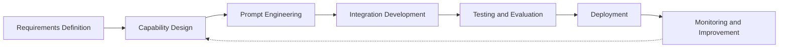
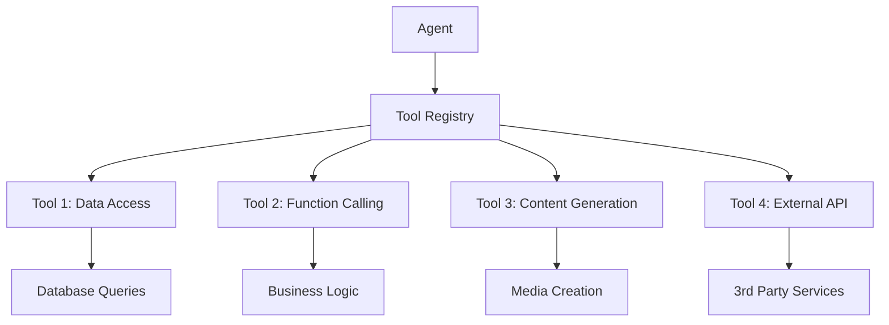
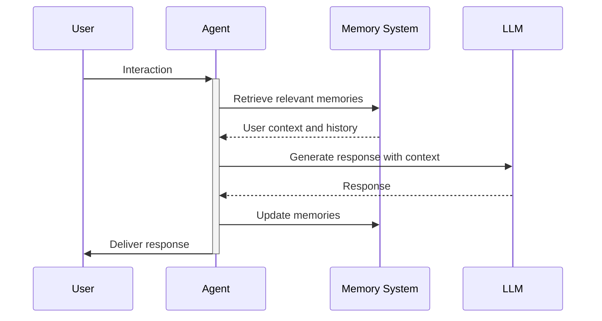
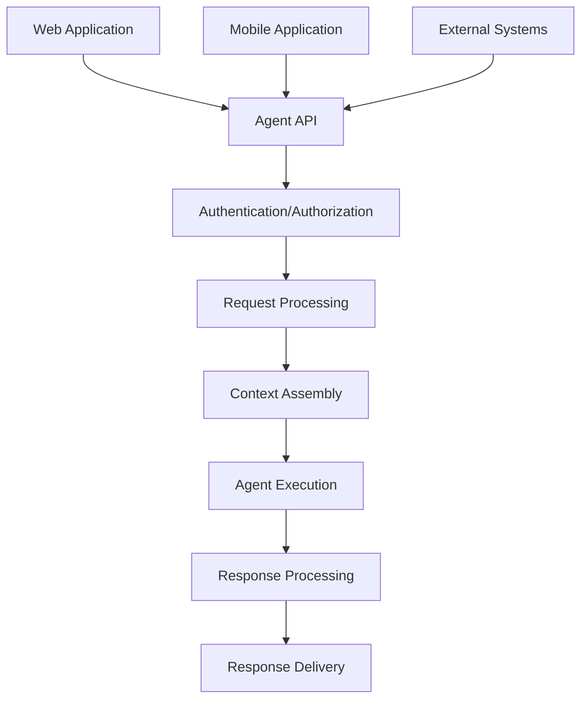

# Agent Development Protocol

<Note>
This is a starter document outlining the MOOD MNKY agent development protocol. Future iterations will include more detailed implementation examples and advanced techniques.
</Note>

## Introduction

The MOOD MNKY ecosystem leverages specialized AI agents to deliver personalized, intelligent experiences. This document defines the standards, methodologies, and best practices for developing and evolving these agents, ensuring consistent quality, capabilities, and personality.

## Agent System Architecture

### Core Agent Framework

The MOOD MNKY agent system is built on a modular architecture that enables specialized capabilities while maintaining a consistent foundation:

```mermaid
graph TD
    subgraph "Agent Core Framework"
        A[Base Agent] --> B[Memory System]
        A --> C[Knowledge Retrieval]
        A --> D[Reasoning Engine]
        A --> E[Interaction Protocol]
        A --> F[Tool Usage Framework]
    end
    
    subgraph "Specialized Agent Layers"
        G[MOOD MNKY Agent] -.-> A
        H[CODE MNKY Agent] -.-> A
        I[SAGE MNKY Agent] -.-> A
    end
    
    subgraph "Agent Capabilities"
        G --> J[Personalization]
        G --> K[Emotional Intelligence]
        G --> L[Experience Orchestration]
        
        H --> M[Code Analysis]
        H --> N[Documentation Generation]
        H --> O[Technical Solution Design]
        
        I --> P[Learning Experience]
        I --> Q[Content Creation]
        I --> R[Community Support]
    end
    
    subgraph "Integration Points"
        J --> S[User Profile System]
        K --> T[Interaction History]
        L --> U[E-commerce System]
        
        M --> V[Development Environment]
        N --> W[Documentation System]
        O --> X[Infrastructure]
        
        P --> Y[Dojo Platform]
        Q --> Z[Content Management]
        R --> AA[Community Platform]
    end
```



### Agent Types and Roles

Each agent in the ecosystem has a distinct role and specialized capabilities:

<CardGroup cols={3}>
  <Card title="MOOD MNKY" icon="user">
    <div className="space-y-2">
      <p>Customer experience and personalization</p>
      <ul className="list-disc pl-5">
        <li>Emotional intelligence</li>
        <li>Personalization services</li>
        <li>Product recommendations</li>
        <li>Customer relationship</li>
      </ul>
    </div>
  </Card>
  
  <Card title="CODE MNKY" icon="code">
    <div className="space-y-2">
      <p>Development support and infrastructure</p>
      <ul className="list-disc pl-5">
        <li>Code analysis and generation</li>
        <li>Documentation automation</li>
        <li>Technical problem solving</li>
        <li>Architecture assistance</li>
      </ul>
    </div>
  </Card>
  
  <Card title="SAGE MNKY" icon="graduation-cap">
    <div className="space-y-2">
      <p>Content, learning, and community</p>
      <ul className="list-disc pl-5">
        <li>Learning experience design</li>
        <li>Content creation and curation</li>
        <li>Knowledge synthesis</li>
        <li>Community engagement</li>
      </ul>
    </div>
  </Card>
</CardGroup>

## Development Lifecycle

### Agent Development Process

The development of agents follows a structured lifecycle:



### Development Phases

<Steps>
  <Step title="Requirements Definition">
    <div className="space-y-2">
      <p>Define the agent's purpose, capabilities, and success criteria</p>
      <ul className="list-disc pl-5">
        <li>User needs analysis</li>
        <li>Capability specification</li>
        <li>Performance requirements</li>
        <li>Integration requirements</li>
      </ul>
    </div>
  </Step>
  
  <Step title="Capability Design">
    <div className="space-y-2">
      <p>Design the agent's capabilities and interaction patterns</p>
      <ul className="list-disc pl-5">
        <li>Voice and tone definition</li>
        <li>Conversation flows</li>
        <li>Knowledge requirements</li>
        <li>Tool definitions</li>
      </ul>
    </div>
  </Step>
  
  <Step title="Prompt Engineering">
    <div className="space-y-2">
      <p>Develop prompts and context for the agent's behavior</p>
      <ul className="list-disc pl-5">
        <li>System message development</li>
        <li>Few-shot examples</li>
        <li>Guardrails and boundaries</li>
        <li>Knowledge integration</li>
      </ul>
    </div>
  </Step>
  
  <Step title="Integration Development">
    <div className="space-y-2">
      <p>Build technical integration with platform systems</p>
      <ul className="list-disc pl-5">
        <li>API integrations</li>
        <li>Tool implementations</li>
        <li>Data access patterns</li>
        <li>User interface elements</li>
      </ul>
    </div>
  </Step>
  
  <Step title="Testing and Evaluation">
    <div className="space-y-2">
      <p>Validate agent performance against requirements</p>
      <ul className="list-disc pl-5">
        <li>Capability testing</li>
        <li>Performance evaluation</li>
        <li>User testing</li>
        <li>Safety and ethics review</li>
      </ul>
    </div>
  </Step>
</Steps>

## Prompt Engineering Framework

### System Message Architecture

The system message is the foundation of agent behavior, structured in layers:

1. **Identity and Role**: Core identity and purpose
2. **Personality and Voice**: Tone, style, and expression patterns
3. **Core Capabilities**: Primary functions and skills
4. **Knowledge Access**: Information sources and retrieval patterns
5. **Interaction Patterns**: Conversational flows and techniques
6. **Guardrails and Limitations**: Boundaries and safety measures
7. **Performance Guidelines**: Quality and effectiveness standards

### Example System Message Structure

```markdown
# AGENT IDENTITY: [Agent Name]

## ROLE
[Concise description of the agent's role in the ecosystem]

## PERSONALITY
[Description of personality, tone, and communication style]

## CORE CAPABILITIES
- [Capability 1]: [Description]
- [Capability 2]: [Description]
- [Capability 3]: [Description]

## KNOWLEDGE ACCESS
[Description of knowledge sources and how they should be used]

## INTERACTION GUIDELINES
[Guidelines for conversation flow, response structure, etc.]

## LIMITATIONS AND BOUNDARIES
[Clear boundaries on what the agent should not do/discuss]

## PERFORMANCE STANDARDS
[Standards for response quality, helpfulness, etc.]
```

### Few-Shot Examples

Few-shot examples are critical for consistent agent behavior:

1. **Example Selection Criteria**
   - Represent common use cases
   - Demonstrate ideal response patterns
   - Illustrate edge case handling
   - Show appropriate tool usage

2. **Example Structure**
   ```
   USER: [Example user input]
   
   AGENT: [Ideal agent response demonstrating desired behavior]
   ```

3. **Coverage Requirements**
   - Basic information requests
   - Complex problem-solving scenarios
   - Emotional or sensitive topics
   - Tool usage scenarios
   - Multi-turn conversations

## Knowledge Management

### Knowledge Architecture

Agent knowledge is organized in a multi-layer architecture:

<CardGroup cols={2}>
  <Card title="Core Knowledge" icon="brain">
    <div className="space-y-2">
      <p>Fundamental knowledge embedded in prompts</p>
      <ul className="list-disc pl-5">
        <li>Agent identity and role</li>
        <li>Core product information</li>
        <li>Brand voice guidelines</li>
        <li>Basic domain expertise</li>
      </ul>
    </div>
  </Card>
  
  <Card title="Retrieved Knowledge" icon="database">
    <div className="space-y-2">
      <p>Information retrieved from knowledge bases</p>
      <ul className="list-disc pl-5">
        <li>Detailed product specifications</li>
        <li>Customer-specific information</li>
        <li>Technical documentation</li>
        <li>Educational content</li>
      </ul>
    </div>
  </Card>
</CardGroup>

### Retrieval Augmented Generation (RAG)

Our agents use RAG for accessing extended knowledge:

1. **Vector Database Integration**
   - Document chunking strategy
   - Embedding model selection
   - Query construction techniques
   - Result ranking and filtering

2. **Knowledge Integration**
   - Contextual insertion of retrieved information
   - Source attribution and transparency
   - Conflict resolution between sources
   - Confidence-based reasoning

3. **Knowledge Freshness**
   - Update frequency for knowledge bases
   - Versioning of critical information
   - Timestamp-based relevance assessment
   - Automated knowledge refresh triggers

## Tool Use Framework

### Tool Architecture

Agents can access tools to extend their capabilities beyond language generation:



### Tool Types

<CardGroup cols={2}>
  <Card title="Data Access Tools" icon="database">
    <div className="space-y-2">
      <p>Access to user and system data</p>
      <ul className="list-disc pl-5">
        <li>User profile retrieval</li>
        <li>Order history access</li>
        <li>Product catalog search</li>
        <li>Community content access</li>
      </ul>
    </div>
  </Card>
  
  <Card title="Function Tools" icon="code">
    <div className="space-y-2">
      <p>Execution of system functions</p>
      <ul className="list-disc pl-5">
        <li>Content creation requests</li>
        <li>Workflow initiation</li>
        <li>Scheduling operations</li>
        <li>Notification triggering</li>
      </ul>
    </div>
  </Card>
</CardGroup>

### Tool Definition Standard

Tools are defined with consistent structure:

```typescript
interface Tool {
  name: string;              // Unique tool identifier
  description: string;       // Clear description of tool purpose
  parameters: Parameter[];   // Required and optional parameters
  returns: ReturnType;       // Output structure and type
  permissions: Permission[]; // Required access permissions
  examples: Example[];       // Usage examples
}
```

## Memory System

### Memory Architecture

Agents maintain different types of memory:

1. **Short-term Conversation Memory**
   - Current conversation history
   - Recent user preferences and choices
   - Session-specific context

2. **Long-term User Memory**
   - Persistent user preferences
   - Historical interactions
   - Relationship development

3. **Episodic Memory**
   - Significant interaction events
   - Previous problem resolutions
   - User milestone achievements

### Memory Integration



## Testing and Evaluation

### Evaluation Framework

Agent capabilities are evaluated across multiple dimensions:

<CardGroup cols={2}>
  <Card title="Functional Evaluation" icon="check">
    <div className="space-y-2">
      <p>Capability testing</p>
      <ul className="list-disc pl-5">
        <li>Task completion accuracy</li>
        <li>Knowledge accuracy</li>
        <li>Tool usage correctness</li>
        <li>Edge case handling</li>
      </ul>
    </div>
  </Card>
  
  <Card title="Experience Evaluation" icon="heart">
    <div className="space-y-2">
      <p>User experience assessment</p>
      <ul className="list-disc pl-5">
        <li>Personality consistency</li>
        <li>Helpfulness perception</li>
        <li>Emotional intelligence</li>
        <li>Conversation flow</li>
      </ul>
    </div>
  </Card>
</CardGroup>

### Test Suite Architecture

1. **Automated Evaluations**
   - Unit tests for specific capabilities
   - Regression tests for established functionality
   - Performance benchmarks
   - Safety and boundary tests

2. **Human Evaluation**
   - Expert review panels
   - User testing sessions
   - Comparative evaluations
   - Blind A/B testing

## Security and Safety

### Guardrails Implementation

Agents implement multiple layers of protection:

1. **Input Filtering**
   - Harmful content detection
   - Intent classification
   - Topic boundary enforcement
   - Privacy protection

2. **Output Monitoring**
   - Toxic content filtering
   - Fact-checking for critical domains
   - Uncertainty signaling
   - Response diversity

3. **Operational Safeguards**
   - Rate limiting
   - Authentication requirements
   - Permission-based tool access
   - Audit logging

### Ethical Use Guidelines

All agent development adheres to these principles:

1. **Transparency**: Clear identification as AI system
2. **Honesty**: Accurate representation of capabilities
3. **Privacy**: Minimal data usage and strong protection
4. **Inclusivity**: Design for diverse user needs
5. **Human-centricity**: Augment rather than replace
6. **Accessibility**: Usable by people of all abilities

## Integration Patterns

### Agent-to-Platform Integration



### Inter-Agent Communication

When agents need to collaborate:

1. **Handoff Protocol**
   - Context preservation
   - Purpose specification
   - Identity transparency
   - Continuity management

2. **Consultation Pattern**
   - Capability identification
   - Query formulation
   - Response integration
   - Attribution preservation

## Implementation Resources

<CardGroup cols={2}>
  <Card title="Agent Templates" icon="file-code" href="#">
    Starter templates for new agent development
  </Card>
  <Card title="Prompt Library" icon="book" href="#">
    Reusable prompt components and examples
  </Card>
  <Card title="Testing Framework" icon="vial" href="#">
    Tools for agent evaluation and testing
  </Card>
  <Card title="Integration Samples" icon="puzzle-piece" href="#">
    Example code for platform integration
  </Card>
</CardGroup>

## Version Control and Management

### Agent Versioning

Agents follow semantic versioning:

1. **Major Version**: Significant personality or capability changes
2. **Minor Version**: New features or capability enhancements
3. **Patch Version**: Bug fixes and minor improvements

### Change Management

Changes to production agents follow a controlled process:

1. **Proposal and Specification**
2. **Impact Analysis**
3. **Development and Testing**
4. **Gradual Rollout (A/B Testing)**
5. **Full Deployment**
6. **Monitoring and Validation**

## Future Development Roadmap

The agent framework will evolve in these key areas:

1. **Enhanced Personalization**
   - Deeper user preference integration
   - Adaptive personality traits
   - Learning from interaction patterns

2. **Multimodal Capabilities**
   - Image understanding and generation
   - Audio processing and generation
   - Interactive visualization

3. **Advanced Reasoning**
   - Complex problem decomposition
   - Multi-step planning
   - Verification and self-correction

4. **Collaborative Intelligence**
   - Agent teaming frameworks
   - Specialized agent cooperation
   - Human-AI collaboration patterns