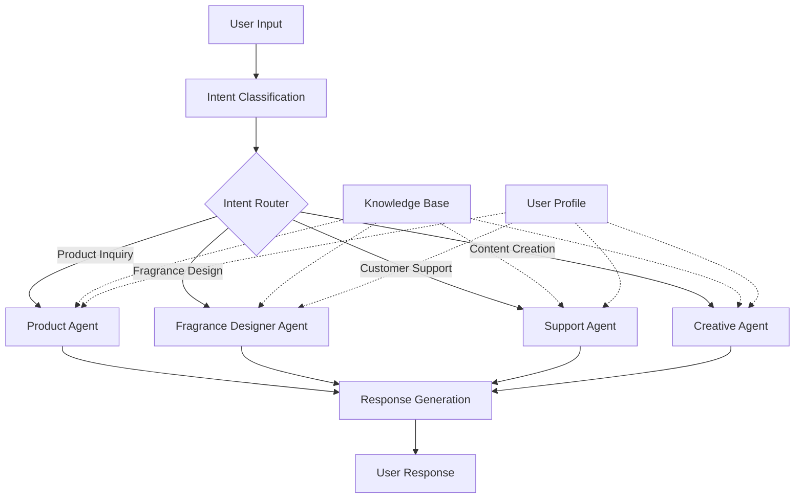
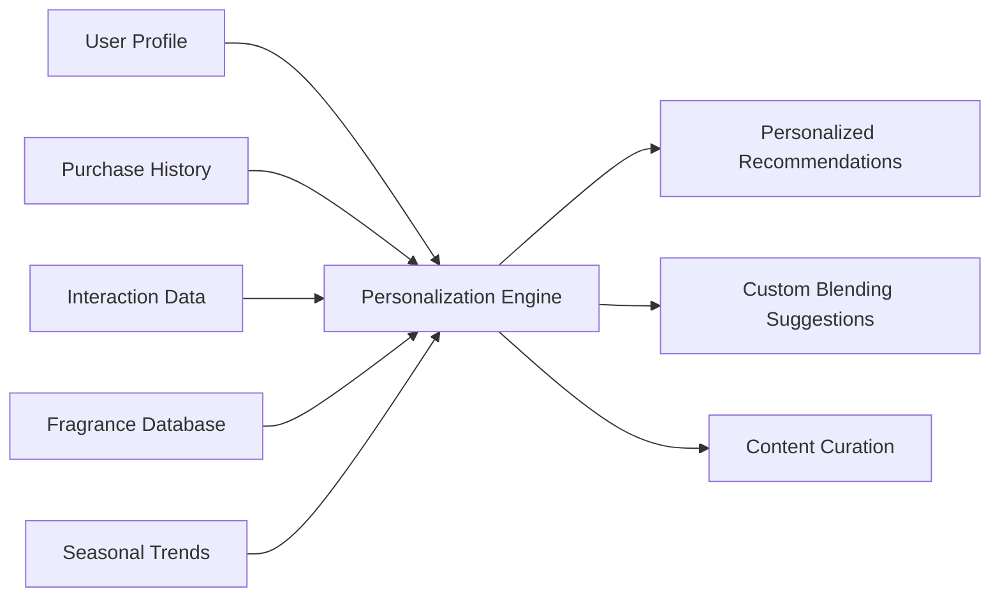
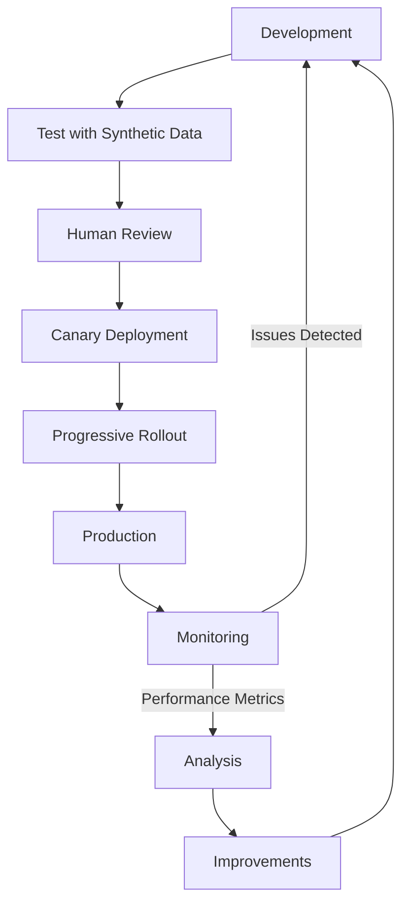

# AI Integration

MOOD MNKY leverages cutting-edge AI technologies to enhance product personalization, customer experience, and operational efficiency. This documentation outlines our AI technology stack, implementation details, and best practices.

## Technology Overview

<Tabs>
  <Tab title="Core Models">
    * **OpenAI GPT-4o** - Primary large language model powering conversational experiences
    * **Anthropic Claude 3.5 Sonnet** - Specialized for complex reasoning tasks and long-form content generation
    * **Mistral Large** - Utilized for efficient processing of routine queries
    * **Custom Fine-tuned Models** - Domain-specific models trained on fragrance and product data
  </Tab>
  <Tab title="Specialized AI">
    * **Stability AI** - Image generation for product visualization
    * **OpenAI DALL-E 3** - Creative content generation
    * **LangChain** - Framework for building AI agent workflows
    * **Hugging Face Transformers** - Text classification and sentiment analysis
  </Tab>
  <Tab title="Infrastructure">
    * **Vector Database (Pinecone)** - For efficient semantic search and retrieval
    * **Supabase** - Primary database for structured data and integration
    * **FastAPI** - Backend services for AI operations
    * **LlamaIndex** - Knowledge retrieval from structured and unstructured data
  </Tab>
</Tabs>

## Flowise vs OpenAI Separation

MOOD MNKY uses a clear architectural separation between chatflow/chatbot workflows and server-side AI processing:

**Flowise (primary for chatflows/chatbots):**
- Dojo Blending Lab chat, custom tools, document store RAG
- Hosted Flowise instance with S3/MinIO for document storage
- Elements AI SDK for chat UI; flowise-sdk as app bridge
- Automatic fallback to OpenAI when Flowise is unavailable

**OpenAI (exclusive for server-side):**
- LABZ chat, Verse chat, storefront assistant
- Platform AI-SQL, blend description, image/video generation
- Vercel AI SDK (streamText, useChat) and OpenAI Agents SDK (stub)
- Not routed through Flowise

See [Flowise vs OpenAI Separation](/technology-stack/flowise-openai-separation) for architecture, env vars, and document store setup.

## AI Agents Architecture

Our AI system is built around specialized agents that work together to deliver personalized experiences:



## Core Capabilities

### Natural Language Understanding

Our NLU system processes user inputs to extract intents, entities, and sentiment:

<CodeGroup>
```typescript TypeScript
import { OpenAI } from 'langchain/llms/openai'
import { PromptTemplate } from 'langchain/prompts'
import { LLMChain } from 'langchain/chains'

const llm = new OpenAI({
  modelName: 'gpt-4o',
  temperature: 0.2,
})

const template = `
Analyze the following customer message and extract:
1. Primary intent (question, purchase, support, feedback)
2. Product categories mentioned
3. Sentiment (positive, negative, neutral)
4. Key entities

Customer message: {userMessage}

Response in JSON format:
`

const promptTemplate = new PromptTemplate({
  template,
  inputVariables: ['userMessage'],
})

const chain = new LLMChain({ llm, prompt: promptTemplate })
const result = await chain.call({ userMessage: 'I love your vanilla candles but would like something with more citrus notes.' })
console.log(result.text)
```

```javascript JavaScript
import { OpenAI } from 'langchain/llms/openai'
import { PromptTemplate } from 'langchain/prompts'
import { LLMChain } from 'langchain/chains'

const llm = new OpenAI({
  modelName: 'gpt-4o',
  temperature: 0.2,
})

const template = `
Analyze the following customer message and extract:
1. Primary intent (question, purchase, support, feedback)
2. Product categories mentioned
3. Sentiment (positive, negative, neutral)
4. Key entities

Customer message: {userMessage}

Response in JSON format:
`

const promptTemplate = new PromptTemplate({
  template,
  inputVariables: ['userMessage'],
})

const chain = new LLMChain({ llm, prompt: promptTemplate })
const result = await chain.call({ userMessage: 'I love your vanilla candles but would like something with more citrus notes.' })
console.log(result.text)
```
</CodeGroup>

### Fragrance Recommendation Engine

Our proprietary fragrance recommendation system matches customer preferences with our fragrance library:

<CodeGroup>
```typescript TypeScript
import { PineconeClient } from '@pinecone-database/pinecone'
import { OpenAIEmbeddings } from 'langchain/embeddings/openai'

// Initialize Pinecone
const pinecone = new PineconeClient()
await pinecone.init({
  apiKey: process.env.PINECONE_API_KEY,
  environment: process.env.PINECONE_ENVIRONMENT,
})
const index = pinecone.Index('fragrances')

// Generate embeddings for user preferences
const embeddings = new OpenAIEmbeddings()
const userPreferencesText = 'I prefer warm, spicy scents with vanilla and amber notes. Nothing too floral or sweet.'
const userEmbedding = await embeddings.embedQuery(userPreferencesText)

// Query for similar fragrances
const queryResponse = await index.query({
  vector: userEmbedding,
  topK: 5,
  includeMetadata: true
})

const recommendations = queryResponse.matches.map(match => match.metadata)
console.log('Recommended fragrances:', recommendations)
```

```javascript JavaScript
import { PineconeClient } from '@pinecone-database/pinecone'
import { OpenAIEmbeddings } from 'langchain/embeddings/openai'

// Initialize Pinecone
const pinecone = new PineconeClient()
await pinecone.init({
  apiKey: process.env.PINECONE_API_KEY,
  environment: process.env.PINECONE_ENVIRONMENT,
})
const index = pinecone.Index('fragrances')

// Generate embeddings for user preferences
const embeddings = new OpenAIEmbeddings()
const userPreferencesText = 'I prefer warm, spicy scents with vanilla and amber notes. Nothing too floral or sweet.'
const userEmbedding = await embeddings.embedQuery(userPreferencesText)

// Query for similar fragrances
const queryResponse = await index.query({
  vector: userEmbedding,
  topK: 5,
  includeMetadata: true
})

const recommendations = queryResponse.matches.map(match => match.metadata)
console.log('Recommended fragrances:', recommendations)
```
</CodeGroup>

### Virtual Fragrance Testing

Our AI creates detailed descriptions of fragrance experiences based on composition:

<CodeGroup>
```typescript TypeScript
import { ChatOpenAI } from 'langchain/chat_models/openai'
import { HumanMessage, SystemMessage } from 'langchain/schema'

const chat = new ChatOpenAI({
  modelName: 'gpt-4o',
  temperature: 0.7,
})

// Get fragrance composition from database
const fragrance = {
  name: 'Midnight Amber',
  notes: {
    top: ['Bergamot', 'Orange'],
    middle: ['Jasmine', 'Rose'],
    base: ['Amber', 'Vanilla', 'Sandalwood']
  },
  intensity: 'moderate',
  family: 'Oriental'
}

const messages = [
  new SystemMessage(
    `You are an expert perfumer with decades of experience. 
    Describe how a fragrance would smell and evolve over time based on its composition.
    Include details about the initial impression, how it develops, and the lasting impression.
    Use sensory, evocative language that helps the reader imagine the scent experience.`
  ),
  new HumanMessage(
    `Create a virtual testing experience for this fragrance:
    Name: ${fragrance.name}
    Top notes: ${fragrance.notes.top.join(', ')}
    Middle notes: ${fragrance.notes.middle.join(', ')}
    Base notes: ${fragrance.notes.base.join(', ')}
    Intensity: ${fragrance.intensity}
    Family: ${fragrance.family}`
  ),
]

const response = await chat.call(messages)
console.log(response.content)
```

```javascript JavaScript
import { ChatOpenAI } from 'langchain/chat_models/openai'
import { HumanMessage, SystemMessage } from 'langchain/schema'

const chat = new ChatOpenAI({
  modelName: 'gpt-4o',
  temperature: 0.7,
})

// Get fragrance composition from database
const fragrance = {
  name: 'Midnight Amber',
  notes: {
    top: ['Bergamot', 'Orange'],
    middle: ['Jasmine', 'Rose'],
    base: ['Amber', 'Vanilla', 'Sandalwood']
  },
  intensity: 'moderate',
  family: 'Oriental'
}

const messages = [
  new SystemMessage(
    `You are an expert perfumer with decades of experience. 
    Describe how a fragrance would smell and evolve over time based on its composition.
    Include details about the initial impression, how it develops, and the lasting impression.
    Use sensory, evocative language that helps the reader imagine the scent experience.`
  ),
  new HumanMessage(
    `Create a virtual testing experience for this fragrance:
    Name: ${fragrance.name}
    Top notes: ${fragrance.notes.top.join(', ')}
    Middle notes: ${fragrance.notes.middle.join(', ')}
    Base notes: ${fragrance.notes.base.join(', ')}
    Intensity: ${fragrance.intensity}
    Family: ${fragrance.family}`
  ),
]

const response = await chat.call(messages)
console.log(response.content)
```
</CodeGroup>

## Product Personalization Framework

Our AI-driven product personalization system integrates user preferences, behavioral data, and fragrance knowledge:



### Custom Blend Generation

<CodeGroup>
```typescript TypeScript
import { Claude } from 'langchain/llms/claude'
import { PromptTemplate } from 'langchain/prompts'
import { StructuredOutputParser } from 'langchain/output_parsers'

const llm = new Claude({
  modelName: 'claude-3-5-sonnet-20240229',
  temperature: 0.3,
})

// Define the structured output format
const parser = StructuredOutputParser.fromZodSchema(z.object({
  blendName: z.string().describe('A creative name for the custom fragrance blend'),
  baseFragrance: z.string().describe('The primary fragrance to use as a base'),
  additionalNotes: z.array(z.string()).describe('Additional fragrance notes to include'),
  proportions: z.record(z.number()).describe('Proportions of each component as percentages'),
  description: z.string().describe('A marketing description of the final blend'),
  useCases: z.array(z.string()).describe('Recommended use cases for this blend')
}))

const formatInstructions = parser.getFormatInstructions()

const template = `
You are an expert perfumer creating a custom fragrance blend.

User preferences:
- Preferred scent families: {preferredFamilies}
- Favorite notes: {favoriteNotes}
- Dislikes: {dislikedNotes}
- Occasion: {occasion}
- Mood desired: {desiredMood}

Create a custom fragrance blend based on these preferences.
${formatInstructions}
`

const promptTemplate = new PromptTemplate({
  template,
  inputVariables: ['preferredFamilies', 'favoriteNotes', 'dislikedNotes', 'occasion', 'desiredMood'],
  partialVariables: { format_instructions: formatInstructions }
})

const input = {
  preferredFamilies: 'Woody, Oriental',
  favoriteNotes: 'Sandalwood, Vanilla, Amber',
  dislikedNotes: 'Overly floral, Powdery',
  occasion: 'Evening events',
  desiredMood: 'Warm and sophisticated'
}

const prompt = await promptTemplate.format(input)
const result = await llm.call(prompt)
const parsedResult = await parser.parse(result)

console.log('Custom Blend:', parsedResult)
```

```javascript JavaScript
import { Claude } from 'langchain/llms/claude'
import { PromptTemplate } from 'langchain/prompts'
import { StructuredOutputParser } from 'langchain/output_parsers'
import { z } from 'zod'

const llm = new Claude({
  modelName: 'claude-3-5-sonnet-20240229',
  temperature: 0.3,
})

// Define the structured output format
const parser = StructuredOutputParser.fromZodSchema(z.object({
  blendName: z.string().describe('A creative name for the custom fragrance blend'),
  baseFragrance: z.string().describe('The primary fragrance to use as a base'),
  additionalNotes: z.array(z.string()).describe('Additional fragrance notes to include'),
  proportions: z.record(z.number()).describe('Proportions of each component as percentages'),
  description: z.string().describe('A marketing description of the final blend'),
  useCases: z.array(z.string()).describe('Recommended use cases for this blend')
}))

const formatInstructions = parser.getFormatInstructions()

const template = `
You are an expert perfumer creating a custom fragrance blend.

User preferences:
- Preferred scent families: {preferredFamilies}
- Favorite notes: {favoriteNotes}
- Dislikes: {dislikedNotes}
- Occasion: {occasion}
- Mood desired: {desiredMood}

Create a custom fragrance blend based on these preferences.
${formatInstructions}
`

const promptTemplate = new PromptTemplate({
  template,
  inputVariables: ['preferredFamilies', 'favoriteNotes', 'dislikedNotes', 'occasion', 'desiredMood'],
  partialVariables: { format_instructions: formatInstructions }
})

const input = {
  preferredFamilies: 'Woody, Oriental',
  favoriteNotes: 'Sandalwood, Vanilla, Amber',
  dislikedNotes: 'Overly floral, Powdery',
  occasion: 'Evening events',
  desiredMood: 'Warm and sophisticated'
}

const prompt = await promptTemplate.format(input)
const result = await llm.call(prompt)
const parsedResult = await parser.parse(result)

console.log('Custom Blend:', parsedResult)
```
</CodeGroup>

## Customer Support AI

Our customer support AI handles inquiries, troubleshooting, and order status updates:

<CodeGroup>
```typescript TypeScript
import { RetrievalQAChain } from 'langchain/chains'
import { ChatOpenAI } from 'langchain/chat_models/openai'
import { SupabaseVectorStore } from 'langchain/vectorstores/supabase'
import { OpenAIEmbeddings } from 'langchain/embeddings/openai'
import { supabase } from '../lib/supabaseClient'

// Initialize the LLM
const model = new ChatOpenAI({
  modelName: 'gpt-4o',
  temperature: 0.2,
})

// Initialize the vector store
const embeddings = new OpenAIEmbeddings()
const vectorStore = new SupabaseVectorStore(embeddings, {
  client: supabase,
  tableName: 'support_documents',
  queryName: 'match_documents',
})

// Create a retriever
const retriever = vectorStore.asRetriever({
  searchKwargs: { k: 5 },
})

// Create the chain
const chain = RetrievalQAChain.fromLLM(model, retriever, {
  returnSourceDocuments: true,
})

// Handle a customer support inquiry
async function handleSupportInquiry(question: string, userId: string) {
  // Get user context from database
  const { data: userData } = await supabase
    .from('profiles')
    .select('*, orders(*)')
    .eq('id', userId)
    .single()
  
  // Append user context to the question
  const contextualizedQuestion = `
    Question: ${question}
    
    User Context:
    - Name: ${userData.full_name}
    - Member since: ${userData.member_since}
    - Recent orders: ${userData.orders.map(order => order.id).join(', ')}
  `
  
  const response = await chain.call({
    query: contextualizedQuestion,
  })
  
  return {
    answer: response.text,
    sources: response.sourceDocuments.map(doc => doc.metadata.source),
  }
}

const result = await handleSupportInquiry(
  'When will my order #MNKY-12345 arrive?', 
  'user-123'
)
console.log(result)
```

```javascript JavaScript
import { RetrievalQAChain } from 'langchain/chains'
import { ChatOpenAI } from 'langchain/chat_models/openai'
import { SupabaseVectorStore } from 'langchain/vectorstores/supabase'
import { OpenAIEmbeddings } from 'langchain/embeddings/openai'
import { supabase } from '../lib/supabaseClient'

// Initialize the LLM
const model = new ChatOpenAI({
  modelName: 'gpt-4o',
  temperature: 0.2,
})

// Initialize the vector store
const embeddings = new OpenAIEmbeddings()
const vectorStore = new SupabaseVectorStore(embeddings, {
  client: supabase,
  tableName: 'support_documents',
  queryName: 'match_documents',
})

// Create a retriever
const retriever = vectorStore.asRetriever({
  searchKwargs: { k: 5 },
})

// Create the chain
const chain = RetrievalQAChain.fromLLM(model, retriever, {
  returnSourceDocuments: true,
})

// Handle a customer support inquiry
async function handleSupportInquiry(question, userId) {
  // Get user context from database
  const { data: userData } = await supabase
    .from('profiles')
    .select('*, orders(*)')
    .eq('id', userId)
    .single()
  
  // Append user context to the question
  const contextualizedQuestion = `
    Question: ${question}
    
    User Context:
    - Name: ${userData.full_name}
    - Member since: ${userData.member_since}
    - Recent orders: ${userData.orders.map(order => order.id).join(', ')}
  `
  
  const response = await chain.call({
    query: contextualizedQuestion,
  })
  
  return {
    answer: response.text,
    sources: response.sourceDocuments.map(doc => doc.metadata.source),
  }
}

const result = await handleSupportInquiry(
  'When will my order #MNKY-12345 arrive?', 
  'user-123'
)
console.log(result)
```
</CodeGroup>

## Mood Analysis & Recommendation

Our mood analysis system helps suggest products based on user emotional state:

<CodeGroup>
```typescript TypeScript
import { Pipeline } from '@huggingface/inference'
import { OpenAI } from 'langchain/llms/openai'

// Initialize the models
const hfPipeline = new Pipeline(process.env.HF_API_KEY)
const llm = new OpenAI({
  modelName: 'gpt-4o',
  temperature: 0.3,
})

// Analyze user text for emotional indicators
async function analyzeMood(userText: string) {
  // Use Hugging Face for sentiment analysis
  const sentimentResult = await hfPipeline.sentiment({
    model: 'distilbert-base-uncased-finetuned-sst-2-english',
    inputs: userText,
  })
  
  // Use emotion detection model
  const emotionResult = await hfPipeline.classification({
    model: 'SamLowe/roberta-base-go_emotions',
    inputs: userText,
  })
  
  return {
    sentiment: sentimentResult,
    emotions: emotionResult,
  }
}

// Generate product recommendations based on mood
async function getMoodBasedRecommendations(moodAnalysis: any) {
  const prompt = `
    Based on the following mood analysis, recommend 3 MOOD MNKY products
    that would help enhance or complement the user's current emotional state.
    
    Sentiment: ${moodAnalysis.sentiment.label} (${moodAnalysis.sentiment.score})
    Primary emotions: ${moodAnalysis.emotions.slice(0, 3).map(e => `${e.label} (${e.score})`).join(', ')}
    
    For each product:
    1. Name and category
    2. Key fragrance notes
    3. Why it's appropriate for this mood
    4. How it might benefit the user
    
    Format as a JSON array.
  `
  
  const result = await llm.call(prompt)
  return JSON.parse(result)
}

// Example usage
const userJournal = "I've been feeling overwhelmed with work lately, but today I finally completed a big project. I'm relieved but still feeling a bit anxious about the next steps."

const moodAnalysis = await analyzeMood(userJournal)
const recommendations = await getMoodBasedRecommendations(moodAnalysis)

console.log('Mood Analysis:', moodAnalysis)
console.log('Recommended Products:', recommendations)
```

```javascript JavaScript
import { Pipeline } from '@huggingface/inference'
import { OpenAI } from 'langchain/llms/openai'

// Initialize the models
const hfPipeline = new Pipeline(process.env.HF_API_KEY)
const llm = new OpenAI({
  modelName: 'gpt-4o',
  temperature: 0.3,
})

// Analyze user text for emotional indicators
async function analyzeMood(userText) {
  // Use Hugging Face for sentiment analysis
  const sentimentResult = await hfPipeline.sentiment({
    model: 'distilbert-base-uncased-finetuned-sst-2-english',
    inputs: userText,
  })
  
  // Use emotion detection model
  const emotionResult = await hfPipeline.classification({
    model: 'SamLowe/roberta-base-go_emotions',
    inputs: userText,
  })
  
  return {
    sentiment: sentimentResult,
    emotions: emotionResult,
  }
}

// Generate product recommendations based on mood
async function getMoodBasedRecommendations(moodAnalysis) {
  const prompt = `
    Based on the following mood analysis, recommend 3 MOOD MNKY products
    that would help enhance or complement the user's current emotional state.
    
    Sentiment: ${moodAnalysis.sentiment.label} (${moodAnalysis.sentiment.score})
    Primary emotions: ${moodAnalysis.emotions.slice(0, 3).map(e => `${e.label} (${e.score})`).join(', ')}
    
    For each product:
    1. Name and category
    2. Key fragrance notes
    3. Why it's appropriate for this mood
    4. How it might benefit the user
    
    Format as a JSON array.
  `
  
  const result = await llm.call(prompt)
  return JSON.parse(result)
}

// Example usage
const userJournal = "I've been feeling overwhelmed with work lately, but today I finally completed a big project. I'm relieved but still feeling a bit anxious about the next steps."

const moodAnalysis = await analyzeMood(userJournal)
const recommendations = await getMoodBasedRecommendations(moodAnalysis)

console.log('Mood Analysis:', moodAnalysis)
console.log('Recommended Products:', recommendations)
```
</CodeGroup>

## Implementation Best Practices

### Prompt Engineering

Follow these guidelines for effective prompts:

1. **Be specific and detailed** - Provide context, objectives, and expected format
2. **Use examples** - Include few-shot examples for complex tasks
3. **Control temperature** - Use lower values (0.1-0.3) for factual responses, higher (0.7-0.9) for creative content
4. **Implement guardrails** - Include safety checks and content moderation
5. **Iterate and refine** - Test prompts with various inputs and refine based on results

### Model Selection

<Card title="Model Selection Framework" icon="brain">
  When selecting AI models for specific tasks, consider:
  
  - **Task complexity** - More complex tasks require more capable models
  - **Input/output length** - Choose models with appropriate context windows
  - **Speed requirements** - Balance quality vs. latency needs
  - **Cost considerations** - More powerful models have higher cost per token
  - **Specialization** - Some models excel at specific domains (code, creative content, etc.)
</Card>

### Performance Optimization

Optimize AI implementation with these techniques:

1. **Caching** - Store model responses for common queries
2. **Batching** - Combine similar requests to reduce API calls
3. **Transfer learning** - Fine-tune smaller models on domain-specific data
4. **Quantization** - Use model quantization for edge deployment
5. **Progressive generation** - Generate content in stages for faster perceived response
6. **Asynchronous processing** - Use background workers for non-critical AI tasks

### Security and Privacy

<Warning>
  AI systems must adhere to strict security and privacy standards:
  
  - Never store or process sensitive PII through external AI services without proper consent
  - Implement robust input validation to prevent prompt injection attacks
  - Use role-based access controls for AI features
  - Maintain audit logs for all AI interactions
  - Regularly test for vulnerabilities in AI implementation
</Warning>

## Testing and Evaluation

Evaluate AI systems with:

1. **Automated test suites** - Regression testing with expected outputs
2. **Human evaluation** - Regular reviews by subject matter experts
3. **A/B testing** - Compare different AI implementations with real users
4. **Metrics tracking** - Monitor performance, accuracy, and user satisfaction
5. **Adversarial testing** - Probe for weaknesses and edge cases

## Deployment Pipeline



## Future Roadmap

Our AI technology roadmap includes:

- **Multimodal interaction** - Integrating visual and voice interfaces
- **Advanced personalization** - Deeper preference learning and adaptation
- **Edge AI deployment** - Moving select AI capabilities to client devices
- **Cross-product intelligence** - Unified AI across the product ecosystem
- **Emotional intelligence** - Enhanced mood detection and response

For detailed implementation guides and API references, see the [AI Integration API Reference](/developer-resources/supabase-api#ai-agents-api) documentation. 