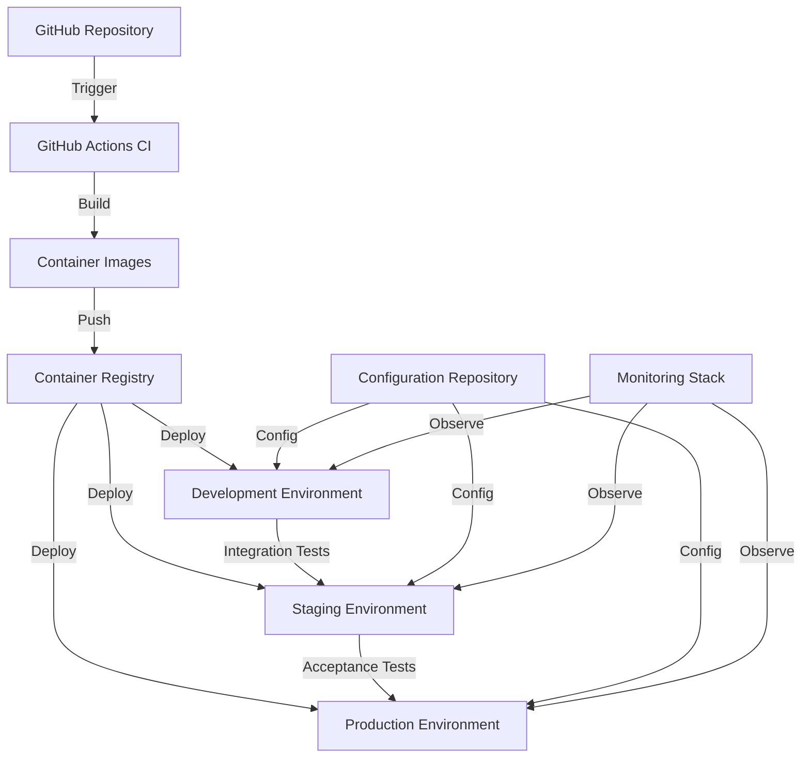

# Deployment Architecture


## Overview

The MOOD MNKY deployment architecture is designed for reliability, scalability, and developer productivity. Our infrastructure follows cloud-native principles and leverages modern deployment techniques to ensure consistent and efficient delivery of our applications.

<Note>
  Our deployment architecture is built on containerization, infrastructure as code, and automated CI/CD pipelines to ensure reliable and consistent deployments.
</Note>

## Infrastructure Stack

<CardGroup cols={3}>
  <Card title="Compute" icon="server">
    Docker containers orchestrated with Kubernetes for scalable and reliable deployments
  </Card>
  <Card title="Database" icon="database">
    Supabase for relational database, authentication, and storage
  </Card>
  <Card title="Content Delivery" icon="network-wired">
    CloudFlare for CDN, DNS, and edge functions
  </Card>
</CardGroup>

## Environments

We maintain separate environments to support our development process:

<Tabs>
  <Tab title="Development">
    ```yaml
    # Development Environment
    Domain: dev.moodmnky.co
    Purpose: Active development and feature testing
    Infrastructure: Containerized applications with shared services
    Data: Anonymized production data
    Access: Internal team only
    Deployment: Automatic from feature branches
    ```
  </Tab>
  <Tab title="Staging">
    ```yaml
    # Staging Environment
    Domain: staging.moodmnky.co
    Purpose: Pre-production verification and integration testing
    Infrastructure: Mirrors production setup
    Data: Full copy of production data (anonymized where necessary)
    Access: Internal team and selected testers
    Deployment: Automatic from main branch
    ```
  </Tab>
  <Tab title="Production">
    ```yaml
    # Production Environment
    Domain: moodmnky.co
    Purpose: Live customer-facing application
    Infrastructure: Fully scaled, high-availability configuration
    Data: Live customer data with backup and disaster recovery
    Access: Public (with authentication)
    Deployment: Controlled releases from release branches
    ```
  </Tab>
</Tabs>

## Deployment Architecture

Our deployment architecture follows a modern containerized approach:



## Container Strategy

<AccordionGroup>
  <Accordion title="Base Images" icon="cubes">
    We use a set of standardized base images to ensure consistency across services:
    
    ```dockerfile
    # Example base image for Node.js applications
    FROM node:20-alpine AS base
    
    # Set working directory
    WORKDIR /app
    
    # Install dependencies
    RUN apk add --no-cache libc6-compat
    RUN npm install -g pnpm turbo
    
    # Set environment variables
    ENV NODE_ENV=production
    ENV PORT=3000
    
    # Set health check
    HEALTHCHECK --interval=30s --timeout=10s --start-period=5s --retries=3 \
      CMD wget -qO- http://localhost:$PORT/api/health || exit 1
    
    # Set user to non-root
    USER node
    
    # Expose port
    EXPOSE $PORT
    
    # Command is set in the app-specific Dockerfile
    ```
  </Accordion>
  
  <Accordion title="Application Images" icon="box">
    Each application has its own optimized Dockerfile tailored to its specific needs:
    
    ```dockerfile
    # Example Dockerfile for a Next.js application
    FROM moodmnky/base-node:20 AS builder
    
    # Copy package files
    COPY --chown=node:node package.json pnpm-lock.yaml ./
    COPY --chown=node:node apps/web/package.json ./apps/web/
    COPY --chown=node:node packages/ui/package.json ./packages/ui/
    COPY --chown=node:node packages/config/package.json ./packages/config/
    
    # Install dependencies
    RUN pnpm install --frozen-lockfile
    
    # Copy source code
    COPY --chown=node:node . .
    
    # Build application
    RUN pnpm turbo run build --filter=web...
    
    # Production image
    FROM moodmnky/base-node:20 AS runner
    
    # Copy built application
    COPY --from=builder --chown=node:node /app/apps/web/.next/standalone ./
    COPY --from=builder --chown=node:node /app/apps/web/.next/static ./apps/web/.next/static
    COPY --from=builder --chown=node:node /app/apps/web/public ./apps/web/public
    
    # Set environment variables
    ENV NODE_ENV production
    ENV PORT 3000
    
    # Start the application
    CMD ["node", "apps/web/server.js"]
    ```
  </Accordion>
  
  <Accordion title="Container Optimization" icon="sliders">
    We implement several optimizations to minimize container size and improve security:
    
    - Multi-stage builds to reduce final image size
    - Layer caching for faster build times
    - Non-root users for improved security
    - Dependency scanning for vulnerabilities
    - Image signing for authenticity verification
    - Minimal base images to reduce attack surface
  </Accordion>
</AccordionGroup>

## Kubernetes Configuration

We use Kubernetes to orchestrate our containerized applications:

<Tabs>
  <Tab title="Namespace Structure">
    ```yaml
    # Example namespace structure
    apiVersion: v1
    kind: Namespace
    metadata:
      name: mood-mnky-production
      labels:
        environment: production
    ---
    apiVersion: v1
    kind: Namespace
    metadata:
      name: mood-mnky-staging
      labels:
        environment: staging
    ---
    apiVersion: v1
    kind: Namespace
    metadata:
      name: mood-mnky-development
      labels:
        environment: development
    ```
  </Tab>
  <Tab title="Deployment Configuration">
    ```yaml
    # Example deployment configuration
    apiVersion: apps/v1
    kind: Deployment
    metadata:
      name: web-app
      namespace: mood-mnky-production
    spec:
      replicas: 3
      selector:
        matchLabels:
          app: web-app
      template:
        metadata:
          labels:
            app: web-app
        spec:
          containers:
          - name: web-app
            image: ghcr.io/mood-mnky/web-app:${VERSION}
            ports:
            - containerPort: 3000
            resources:
              limits:
                cpu: "1"
                memory: "1Gi"
              requests:
                cpu: "500m"
                memory: "512Mi"
            livenessProbe:
              httpGet:
                path: /api/health
                port: 3000
              initialDelaySeconds: 30
              periodSeconds: 15
            readinessProbe:
              httpGet:
                path: /api/health
                port: 3000
              initialDelaySeconds: 5
              periodSeconds: 10
            env:
            - name: DATABASE_URL
              valueFrom:
                secretKeyRef:
                  name: db-credentials
                  key: url
            - name: NODE_ENV
              value: "production"
    ```
  </Tab>
  <Tab title="Service Configuration">
    ```yaml
    # Example service configuration
    apiVersion: v1
    kind: Service
    metadata:
      name: web-app
      namespace: mood-mnky-production
    spec:
      selector:
        app: web-app
      ports:
      - port: 80
        targetPort: 3000
      type: ClusterIP
    ---
    apiVersion: networking.k8s.io/v1
    kind: Ingress
    metadata:
      name: web-app
      namespace: mood-mnky-production
      annotations:
        kubernetes.io/ingress.class: "nginx"
        cert-manager.io/cluster-issuer: "letsencrypt-prod"
    spec:
      tls:
      - hosts:
        - moodmnky.co
        secretName: moodmnky-tls
      rules:
      - host: moodmnky.co
        http:
          paths:
          - path: /
            pathType: Prefix
            backend:
              service:
                name: web-app
                port:
                  number: 80
    ```
  </Tab>
</Tabs>

## CI/CD Pipeline

Our continuous integration and delivery pipeline is implemented using GitHub Actions:

<Steps>
  <Step title="Source Control">
    All code is maintained in our GitHub repository, with dedicated branches for features, releases, and hotfixes.
    
    ```bash
    # Branch naming convention
    feature/add-mood-tracking
    bugfix/login-error
    release/v1.2.0
    hotfix/security-patch
    ```
  </Step>
  <Step title="Continuous Integration">
    Every commit triggers automated tests, linting, and builds.
    
    ```yaml
    # Simplified CI workflow
    name: CI
    
    on:
      push:
        branches: [ main, develop, 'feature/**', 'bugfix/**' ]
      pull_request:
        branches: [ main, develop ]
    
    jobs:
      lint:
        runs-on: ubuntu-latest
        steps:
          - uses: actions/checkout@v3
          - uses: pnpm/action-setup@v2
          - uses: actions/setup-node@v3
          - run: pnpm install
          - run: pnpm lint
      
      test:
        runs-on: ubuntu-latest
        steps:
          - uses: actions/checkout@v3
          - uses: pnpm/action-setup@v2
          - uses: actions/setup-node@v3
          - run: pnpm install
          - run: pnpm test
      
      build:
        runs-on: ubuntu-latest
        needs: [lint, test]
        steps:
          - uses: actions/checkout@v3
          - uses: pnpm/action-setup@v2
          - uses: actions/setup-node@v3
          - run: pnpm install
          - run: pnpm build
          - name: Archive build artifacts
            uses: actions/upload-artifact@v3
            with:
              name: build-artifacts
              path: |
                apps/*/dist
                apps/*/.next
    ```
  </Step>
  <Step title="Container Building">
    Successful builds are packaged into Docker containers and pushed to our registry.
    
    ```yaml
    # Simplified container build workflow
    name: Build Container
    
    on:
      workflow_run:
        workflows: ["CI"]
        types:
          - completed
    
    jobs:
      build-container:
        runs-on: ubuntu-latest
        if: ${{ github.event.workflow_run.conclusion == 'success' }}
        steps:
          - uses: actions/checkout@v3
          
          - name: Set up Docker Buildx
            uses: docker/setup-buildx-action@v2
          
          - name: Login to GitHub Container Registry
            uses: docker/login-action@v2
            with:
              registry: ghcr.io
              username: ${{ github.actor }}
              password: ${{ secrets.GITHUB_TOKEN }}
          
          - name: Build and push
            uses: docker/build-push-action@v4
            with:
              context: .
              file: ./apps/web/Dockerfile
              push: true
              tags: |
                ghcr.io/mood-mnky/web-app:${{ github.sha }}
                ghcr.io/mood-mnky/web-app:latest
    ```
  </Step>
  <Step title="Deployment">
    Containers are deployed to the appropriate environment based on the branch.
    
    ```yaml
    # Simplified deployment workflow
    name: Deploy
    
    on:
      workflow_run:
        workflows: ["Build Container"]
        types:
          - completed
    
    jobs:
      deploy-development:
        if: ${{ github.ref == 'refs/heads/develop' || startsWith(github.ref, 'refs/heads/feature/') }}
        runs-on: ubuntu-latest
        steps:
          - uses: actions/checkout@v3
          - name: Set Kubernetes context
            uses: azure/k8s-set-context@v3
            with:
              kubeconfig: ${{ secrets.KUBE_CONFIG_DEV }}
          - name: Deploy to development
            run: |
              sed -i "s/\${VERSION}/${{ github.sha }}/g" ./kubernetes/development/deployment.yaml
              kubectl apply -f ./kubernetes/development/
      
      deploy-staging:
        if: ${{ github.ref == 'refs/heads/main' }}
        runs-on: ubuntu-latest
        steps:
          - uses: actions/checkout@v3
          - name: Set Kubernetes context
            uses: azure/k8s-set-context@v3
            with:
              kubeconfig: ${{ secrets.KUBE_CONFIG_STAGING }}
          - name: Deploy to staging
            run: |
              sed -i "s/\${VERSION}/${{ github.sha }}/g" ./kubernetes/staging/deployment.yaml
              kubectl apply -f ./kubernetes/staging/
      
      deploy-production:
        if: ${{ startsWith(github.ref, 'refs/heads/release/') || startsWith(github.ref, 'refs/heads/hotfix/') }}
        runs-on: ubuntu-latest
        environment: production
        steps:
          - uses: actions/checkout@v3
          - name: Set Kubernetes context
            uses: azure/k8s-set-context@v3
            with:
              kubeconfig: ${{ secrets.KUBE_CONFIG_PROD }}
          - name: Deploy to production
            run: |
              sed -i "s/\${VERSION}/${{ github.sha }}/g" ./kubernetes/production/deployment.yaml
              kubectl apply -f ./kubernetes/production/
    ```
  </Step>
</Steps>

## Database Deployments

Our database migrations are managed using Supabase migrations:

<AccordionGroup>
  <Accordion title="Migration Process" icon="database">
    Database changes follow a structured process:
    
    1. **Development**: Migrations are created locally and tested in development
    2. **Version Control**: Migration files are committed to the repository
    3. **CI Verification**: Migrations are tested against a test database
    4. **Staging Apply**: Migrations are applied to the staging environment
    5. **Production Apply**: After verification, migrations are applied to production
    
    ```bash
    # Create a new migration
    pnpm supabase:migration create add_user_preferences
    
    # Apply migrations to local development
    pnpm supabase:migration up
    
    # Generate migration from current database state
    pnpm supabase:migration dump
    ```
  </Accordion>
  
  <Accordion title="Migration Safety" icon="shield">
    We follow several practices to ensure safe database migrations:
    
    - Backwards-compatible schema changes when possible
    - Multi-stage migrations for complex changes
    - Pre-migration backups for critical environments
    - Read-only transition periods during major changes
    - Rollback plans for each migration
  </Accordion>
  
  <Accordion title="Migration Strategies" icon="code-branch">
    Different types of schema changes require different approaches:
    
    **Adding Tables/Columns**: Safe operation that can be performed without downtime
    
    ```sql
    -- Adding a new table
    create table if not exists public.user_preferences (
      id uuid primary key default uuid_generate_v4(),
      user_id uuid references public.users not null,
      preference_key text not null,
      preference_value jsonb not null,
      created_at timestamp with time zone default now(),
      updated_at timestamp with time zone default now(),
      unique(user_id, preference_key)
    );
    
    -- Add RLS policies
    alter table public.user_preferences enable row level security;
    
    create policy "Users can view their own preferences"
      on public.user_preferences for select
      using (auth.uid() = user_id);
      
    create policy "Users can insert their own preferences"
      on public.user_preferences for insert
      with check (auth.uid() = user_id);
      
    create policy "Users can update their own preferences"
      on public.user_preferences for update
      using (auth.uid() = user_id);
    ```
    
    **Modifying Columns**: Requires careful planning for existing data
    
    ```sql
    -- Step 1: Add new column without constraints
    alter table public.users add column display_name text;
    
    -- Step 2: Populate the new column
    update public.users set display_name = username where display_name is null;
    
    -- Step 3: Add constraints after data is populated
    alter table public.users alter column display_name set not null;
    ```
    
    **Removing Tables/Columns**: Multi-stage process with code changes first
    
    ```sql
    -- Step 1: Deprecate in code (no longer write to column)
    -- Step 2: After release, drop column
    alter table public.users drop column if exists legacy_field;
    ```
  </Accordion>
</AccordionGroup>

## Secrets Management

We use a combination of approaches to manage secrets and configuration:

<CardGroup cols={2}>
  <Card title="Kubernetes Secrets" icon="lock">
    Sensitive information is stored as Kubernetes secrets and mounted into containers at runtime.
    
    ```yaml
    apiVersion: v1
    kind: Secret
    metadata:
      name: api-keys
      namespace: mood-mnky-production
    type: Opaque
    data:
      supabase-anon-key: <base64-encoded-value>
      stripe-secret-key: <base64-encoded-value>
    ```
  </Card>
  <Card title="Environment Configuration" icon="gear">
    Non-sensitive configuration is stored as ConfigMaps and environment variables.
    
    ```yaml
    apiVersion: v1
    kind: ConfigMap
    metadata:
      name: app-config
      namespace: mood-mnky-production
    data:
      NODE_ENV: "production"
      LOG_LEVEL: "info"
      FEATURE_FLAGS: '{"newCheckout":true,"moodTracker":true}'
    ```
  </Card>
</CardGroup>

## Monitoring and Observability

Our observability stack ensures we can monitor application health and performance:

<CardGroup cols={3}>
  <Card title="Logging" icon="file-lines">
    Structured logs from all services are centralized in our logging platform for analysis.
  </Card>
  <Card title="Metrics" icon="chart-line">
    Application and infrastructure metrics provide insights into system behavior and performance.
  </Card>
  <Card title="Tracing" icon="diagram-project">
    Distributed tracing helps us understand request flows across our microservices architecture.
  </Card>
  <Card title="Alerting" icon="bell">
    Proactive alerting notifies the team of potential issues before they impact users.
  </Card>
  <Card title="Dashboards" icon="gauge-high">
    Custom dashboards visualize system health and business metrics for different stakeholders.
  </Card>
  <Card title="Error Tracking" icon="bug">
    Automated error collection and analysis helps us identify and fix issues quickly.
  </Card>
</CardGroup>

## Deployment Strategies

We employ different deployment strategies depending on the nature of the change:

<AccordionGroup>
  <Accordion title="Blue-Green Deployments" icon="circle-half-stroke">
    For significant updates, we use blue-green deployments to minimize risk:
    
    1. Deploy the new version (green) alongside the current version (blue)
    2. Gradually redirect traffic to the green environment
    3. Monitor for issues and quickly rollback if needed by routing traffic back to blue
    4. Once stable, decommission the blue environment
    
    ```yaml
    # Example blue-green service configuration
    apiVersion: v1
    kind: Service
    metadata:
      name: web-app
      namespace: mood-mnky-production
    spec:
      selector:
        app: web-app
        version: green  # Switch between blue and green
      ports:
      - port: 80
        targetPort: 3000
    ```
  </Accordion>
  
  <Accordion title="Canary Releases" icon="vial">
    For testing new features with a subset of users:
    
    1. Deploy the new version to a small subset of servers
    2. Route a percentage of traffic to the new version
    3. Gradually increase the percentage as confidence grows
    4. Complete the rollout when the feature is proven stable
    
    ```yaml
    # Example Kubernetes manifest for canary deployment
    apiVersion: networking.k8s.io/v1
    kind: Ingress
    metadata:
      name: web-app
      namespace: mood-mnky-production
      annotations:
        nginx.ingress.kubernetes.io/canary: "true"
        nginx.ingress.kubernetes.io/canary-weight: "20"
    spec:
      rules:
      - host: moodmnky.co
        http:
          paths:
          - path: /
            pathType: Prefix
            backend:
              service:
                name: web-app-canary
                port:
                  number: 80
    ```
  </Accordion>
  
  <Accordion title="Rolling Updates" icon="arrows-rotate">
    For routine changes and updates:
    
    1. Deploy the new version to a subset of servers
    2. Wait for the new instances to become healthy
    3. Gradually replace old instances with new ones
    4. Continue until all instances are updated
    
    ```yaml
    # Example Kubernetes deployment with rolling update strategy
    apiVersion: apps/v1
    kind: Deployment
    metadata:
      name: web-app
      namespace: mood-mnky-production
    spec:
      replicas: 3
      strategy:
        type: RollingUpdate
        rollingUpdate:
          maxSurge: 1
          maxUnavailable: 0
      # ... rest of deployment configuration
    ```
  </Accordion>
</AccordionGroup>

## Feature Flags

We use feature flags to safely deploy new features and control their availability:

```typescript
// Example feature flag implementation
import { useUser } from '@mood-mnky/auth'
import { getFeatureFlag } from '@mood-mnky/config'

function NewFeatureComponent() {
  const { user } = useUser()
  const isFeatureEnabled = getFeatureFlag('newFeature', {
    userId: user?.id,
    userRole: user?.role
  })
  
  if (!isFeatureEnabled) {
    return null
  }
  
  return (
    <div className="new-feature">
      {/* New feature implementation */}
    </div>
  )
}
```

Configuration in different environments:

```json
// Development feature flags
{
  "newFeature": {
    "enabled": true,
    "rules": []
  }
}

// Production feature flags
{
  "newFeature": {
    "enabled": true,
    "rules": [
      {
        "type": "userPercentage",
        "value": 10
      },
      {
        "type": "userRole",
        "value": ["admin", "beta_tester"]
      }
    ]
  }
}
```

## Disaster Recovery

Our disaster recovery plan ensures we can recover from infrastructure failures:

<Steps>
  <Step title="Backup Strategy">
    Regular automated backups of all critical data, including databases and persistent storage.
  </Step>
  <Step title="Recovery Testing">
    Periodic testing of recovery procedures to ensure they work as expected.
  </Step>
  <Step title="Geographic Redundancy">
    Critical systems are replicated across multiple geographic regions.
  </Step>
  <Step title="Incident Response">
    Documented procedures for responding to different types of infrastructure incidents.
  </Step>
</Steps>

## Security Practices

Our deployment architecture includes several security measures:

<CardGroup cols={3}>
  <Card title="Network Isolation" icon="network-wired">
    Services are organized in isolated network segments with controlled communication paths.
  </Card>
  <Card title="Access Controls" icon="lock">
    Least privilege principle applied to all systems and services.
  </Card>
  <Card title="Vulnerability Scanning" icon="shield">
    Regular scanning of containers and dependencies for known vulnerabilities.
  </Card>
  <Card title="Data Encryption" icon="lock">
    Data encrypted both at rest and in transit throughout the infrastructure.
  </Card>
  <Card title="Security Monitoring" icon="eye">
    Continuous monitoring for suspicious activities and security events.
  </Card>
  <Card title="Compliance" icon="clipboard-check">
    Adherence to industry standards and best practices for security.
  </Card>
</CardGroup>

## Resources

<CardGroup cols={3}>
  <Card title="Kubernetes Documentation" icon="book" href="https://kubernetes.io/docs/home/" target="_blank">
    Official Kubernetes documentation
  </Card>
  <Card title="Supabase Documentation" icon="book" href="https://supabase.com/docs" target="_blank">
    Official Supabase documentation
  </Card>
  <Card title="Internal Runbooks" icon="book" href="/developer-resources/runbooks">
    Detailed operational procedures
  </Card>
</CardGroup>

---

For questions about our deployment architecture, please contact the MOOD MNKY DevOps team. 