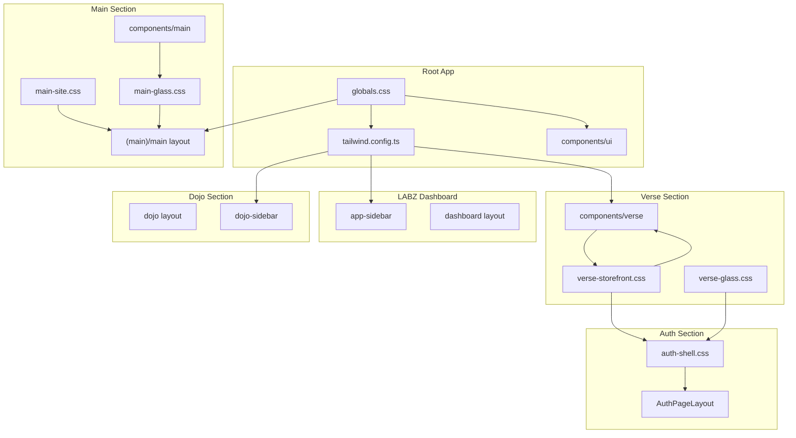

# Design System

This document describes the color palette, design tokens, and design architecture for the MOOD MNKY ecosystem: **MOOD MNKY** (main site), **MNKY LABZ** (dashboard), and **MNKY DOJO** (storefront and member hub). The canonical source in the repo is `docs/DESIGN-SYSTEM.md`.

## Architecture Overview

The app has a single root design contract and two palette themes (Main and Dojo), each with light and dark mode. All sections consume the same token names; the active theme and mode determine the values.

## Palette Themes and Mode

The app uses **two palette themes**, each with **light and dark mode**:

1. **Main** — Black/white/grayscale only, glassmorphic. Used for the main site and LABZ.
2. **Dojo** — Slate-based palette matching the MNKY DOJO storefront. Light: `#f1f5f9`, `#0f172a`, `#475569`. Dark: `#181619`, `#c8c4c4`, `#94a3b8`.

**Palette** is controlled by `data-theme` on `<html>`: `main` or `dojo`. It is set by `ThemePaletteProvider` and persisted in localStorage under `theme-palette`. Use `ThemePaletteSwitcher` or `useThemePalette()` from `@/components/theme-palette-provider`.

**Mode** (light / dark / system) is controlled by **next-themes** via the `class` attribute on `<html>` (e.g. `class="dark"`). Toggles such as `ThemeToggle`, `AnimatedThemeToggler`, and `AuthModeToggle` use `setTheme("light" | "dark" | "system")`.

All design tokens are defined in `app/globals.css` under `[data-theme="main"]`, `[data-theme="main"].dark`, `[data-theme="dojo"]`, and `[data-theme="dojo"].dark`. The same component system (shadcn, verse, main, dojo) consumes these variables; swapping palette or mode swaps the look app-wide.

## Root Tokens (globals.css)

The root design system defines one **token contract** and two **theme implementations** (Main and Dojo), each with light and dark variants. Tailwind and components reference `hsl(var(--background))`, `var(--verse-bg)`, and similar; values come from the active `data-theme` and `.dark` class on `<html>`.

### Theme: Main (grayscale)

- **Light:** White backgrounds, dark text, cool gray primary (`215 19% 35%`).
- **Dark:** Near-black backgrounds, light text, lighter gray primary (`213 24% 65%`).

### Theme: Dojo (Verse palette)

- **Light:** Slate-100 background (#f1f5f9), slate-900 text (#0f172a), slate-600 primary/muted (#475569).
- **Dark:** #181619 background, #c8c4c4 text, #94a3b8 muted/primary.

## Section Mapping

| Section | CSS / layout | Components |
|--------|---------------|------------|
| **MNKY DOJO storefront** | `verse-storefront.css`, `verse-glass.css`, `mnky-box.css` | `components/verse/` |
| **Auth** | `auth-shell.css`, verse tokens | `AuthPageLayout`, `AuthVerseShell` |
| **LABZ** | Root tokens, shadcn | `app-sidebar`, dashboard layout |
| **Dojo (member hub)** | Root tokens, `.dojo-dashboard` | `dojo-sidebar`, `dojo-sidebar-config.tsx` |
| **Main** | `main-site.css`, `main-glass.css` | `components/main/`, `(main)/main` layout |

The Dojo palette (`data-theme="dojo"`) applies to the MNKY DOJO storefront so one palette equals one product name. Verse tokens (`--verse-bg`, `--verse-text`, `--verse-text-muted`, `--verse-button`, `--verse-border`, etc.) come from the active palette and mode.

## Key Files

- **Root tokens:** `app/globals.css`
- **Tailwind:** `tailwind.config.ts`
- **UI primitives:** `components/ui` (shadcn)
- **Storefront:** `app/(storefront)/verse/verse-storefront.css`, `verse-glass.css`; `components/verse/`
- **Main:** `app/(main)/main/main-site.css`, `main-glass.css`; `components/main/`
- **Dojo:** `app/dojo/` layouts; `lib/dojo-sidebar-config.tsx`

For full token tables, Main glass tokens, MNKY BOX, Shopify theme alignment, and fonts, see the canonical **Design System** doc in the repo at `docs/DESIGN-SYSTEM.md`. For route and layout architecture, see [Systems Architecture](/technology-stack/systems-architecture) and [Navigation and MNKY DOJO](/technology-stack/navigation-and-dojo).
