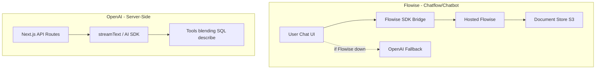

# Flowise vs OpenAI Separation

MOOD MNKY implements a clear architectural separation between chatflow/chatbot workflows (Flowise) and server-side AI processing (OpenAI).

## Architecture

## Environment Variables

### Flowise

| Variable | Purpose |
|----------|---------|
| `FLOWISE_BASE_URL` | Flowise instance root (e.g. https://flowise-dev.moodmnky.com) |
| `FLOWISE_API_KEY` | Bearer token for Flowise API |
| `NEXT_PUBLIC_FLOWISE_HOST` | Client-side (embed) |
| `NEXT_PUBLIC_FLOWISE_CHATFLOW_ID` | Default Dojo chatflow |

### Flowise S3/MinIO (hosted instance)

Set in Flowise `.env`, not in app. App proxies document store via `FLOWISE_BASE_URL`.

| Variable | Purpose |
|----------|---------|
| `STORAGE_TYPE` | `s3` |
| `S3_STORAGE_BUCKET_NAME` | Bucket name |
| `S3_STORAGE_ACCESS_KEY_ID` | MinIO/S3 access key |
| `S3_STORAGE_SECRET_ACCESS_KEY` | MinIO/S3 secret |
| `S3_STORAGE_REGION` | e.g. us-east-1 |
| `S3_ENDPOINT_URL` | e.g. https://s3-api-data.moodmnky.com |
| `S3_FORCE_PATH_STYLE` | `true` for MinIO |

### OpenAI

| Variable | Purpose |
|----------|---------|
| `OPENAI_API_KEY` | Server-side AI, fallback chat |

## Document Store

Flowise document store uses S3/MinIO for blob storage. The app proxies document store API requests to Flowise.

### LABZ Storage Control Panel

Admins can manage MinIO/S3 buckets and objects at **Platform → Storage** (`/platform/storage`). Uses the same S3 env vars. See [docs/PLATFORM-STORAGE.md](../../docs/PLATFORM-STORAGE.md) for API overview and credential behavior.

### App Proxy Routes

| App Route | Method | Purpose |
|-----------|--------|---------|
| `/api/flowise/document-store/stores` | GET | List document stores |
| `/api/flowise/document-store/stores/[id]` | GET | Get store by ID |
| `/api/flowise/document-store/upsert/[id]` | POST | Upsert documents (multipart) |
| `/api/flowise/document-store/refresh/[id]` | POST | Re-process all documents |
| `/api/flowise/document-store/vectorstore/query` | POST | Retrieval query |
| `/api/flowise/document-store/loader/[storeId]/[loaderId]` | DELETE | Delete loader |

### LABZ Document Store

| App Route | Purpose |
|-----------|---------|
| `/api/labz/document-store/stores` | List stores (LABZ context) |
| `/api/labz/document-store/upsert/[id]` | Upsert files (formula docs, knowledge base) |

## Flowise-MNKY Components

The `components/flowise-mnky/` library provides Flowise-specific UI for the Dojo and LABZ:

- **FlowiseChatflowControlPanel** — Chatflow selector, override config editor, document store upload
- **FlowiseOverrideConfigEditor** — Structured + raw JSON editor for overrideConfig (documentStoreId, supabaseMetadataFilter, topK, systemMessage)
- **FlowiseDocumentUpload** — Upload with profile_id metadata for Supabase vector store filtering
- **FlowiseStoreSelector** — Document store picker
- **FlowiseChatUI** — Wrapper around DojoFlowiseChatbot (Elements AI SDK)

See `docs/FLOWISE-MNKY-COMPONENTS.md` in the repo.

## Packages

| Package | Purpose |
|---------|---------|
| `ai` | Vercel AI SDK (streamText, useChat) |
| `@ai-sdk/react` | React hooks for chat |
| `@ai-sdk/openai` | OpenAI provider |
| `flowise-sdk` | FlowiseClient, createPrediction |
| `flowise-embed-react` | Flowise embed widget |
| `@openai/agents` | Multi-agent workflows (stub; requires Zod v4) |

## References

- `docs/AI-SEPARATION-REPORT.md` — full report (repo)
- `docs/FLOWISE-SDK-INTEGRATION-NOTES.md` — Flowise SDK notes (repo)
