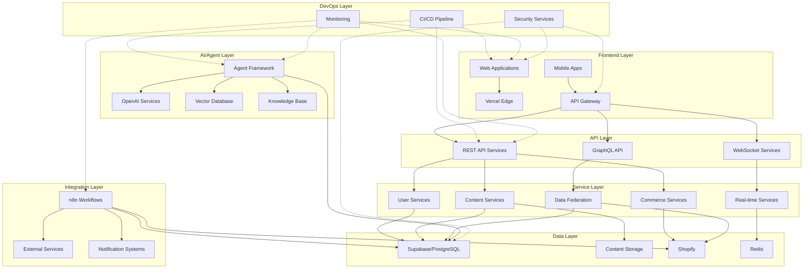
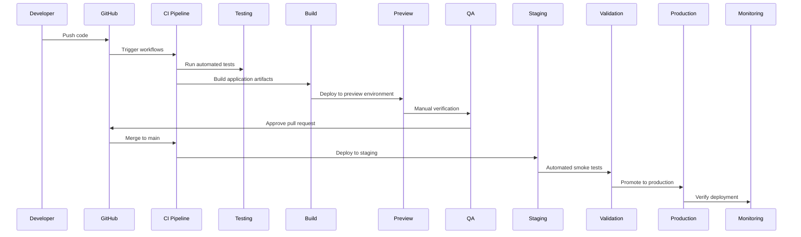
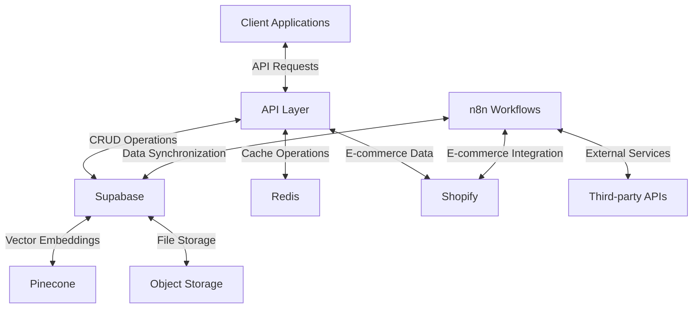
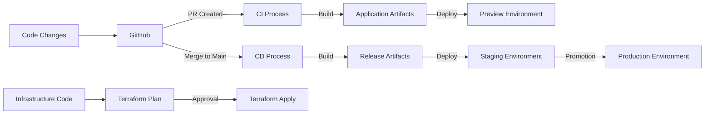
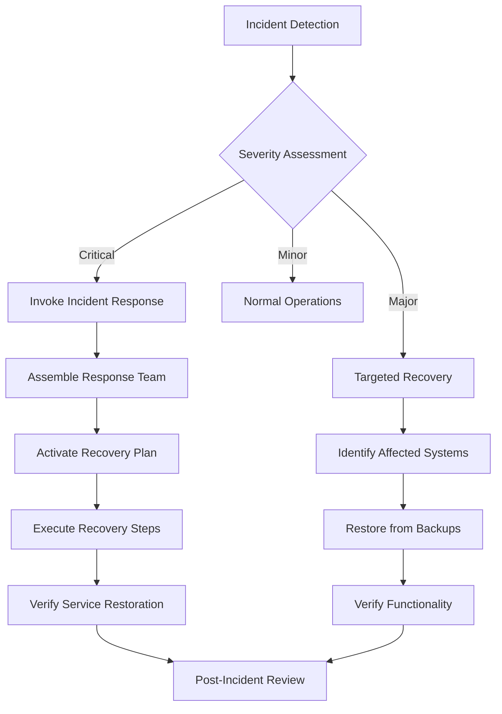

# Infrastructure Overview

<Note>
This is a starter document outlining the MOOD MNKY infrastructure architecture. Future iterations will include more detailed diagrams and implementation specifications.
</Note>

## System Architecture

The MOOD MNKY ecosystem is built on a modern, cloud-native architecture designed for scalability, reliability, and developer productivity. This document provides a high-level overview of our infrastructure components, deployment environments, and operational systems.

## Core Infrastructure Philosophy

Our infrastructure is guided by these principles:

1. **Cloud-Native Design**: Leveraging managed services and serverless architectures where appropriate
2. **Infrastructure as Code**: All infrastructure defined and version-controlled
3. **Security by Design**: Security integrated at all levels of the stack
4. **Observability First**: Comprehensive monitoring, logging, and alerting
5. **Developer Experience**: Infrastructure that enables rapid, confident development

## System Architecture Diagram



## Deployment Environments

### Environment Structure

We maintain multiple environments for development, testing, and production:

<CardGroup cols={3}>
  <Card title="Development" icon="code">
    <div className="space-y-2">
      <p>For active development work</p>
      <ul className="list-disc pl-5">
        <li>Automatic PR previews</li>
        <li>Developer-specific instances</li>
        <li>Test data population</li>
      </ul>
    </div>
  </Card>
  
  <Card title="Staging" icon="vial">
    <div className="space-y-2">
      <p>Pre-production validation</p>
      <ul className="list-disc pl-5">
        <li>Production-like configuration</li>
        <li>Integration testing</li>
        <li>Performance validation</li>
      </ul>
    </div>
  </Card>
  
  <Card title="Production" icon="server">
    <div className="space-y-2">
      <p>Live customer-facing systems</p>
      <ul className="list-disc pl-5">
        <li>High availability</li>
        <li>Auto-scaling resources</li>
        <li>Enhanced security</li>
      </ul>
    </div>
  </Card>
</CardGroup>

### Deployment Process



## Cloud Infrastructure

### Primary Providers

<CardGroup cols={2}>
  <Card title="Vercel" icon="cloud">
    <div className="space-y-2">
      <p>Frontend hosting and serverless functions</p>
      <ul className="list-disc pl-5">
        <li>Frontend applications</li>
        <li>Edge functions</li>
        <li>Preview environments</li>
        <li>CDN and caching</li>
      </ul>
    </div>
  </Card>
  
  <Card title="AWS" icon="aws">
    <div className="space-y-2">
      <p>Primary cloud infrastructure</p>
      <ul className="list-disc pl-5">
        <li>Compute resources</li>
        <li>Database hosting</li>
        <li>Storage solutions</li>
        <li>Advanced services</li>
      </ul>
    </div>
  </Card>
</CardGroup>

### Key AWS Services

- **Lambda**: Serverless computing for backend services
- **ECS/Fargate**: Container orchestration for stateful services
- **S3**: Object storage for assets and backups
- **CloudFront**: Content delivery network
- **RDS**: Managed PostgreSQL (secondary to Supabase)
- **ElastiCache**: Redis caching layer
- **SQS/SNS**: Messaging and event handling
- **CloudWatch**: Monitoring and alerting
- **IAM**: Identity and access management

## Database Infrastructure

### Primary Data Stores

<CardGroup cols={2}>
  <Card title="Supabase" icon="database">
    <div className="space-y-2">
      <p>Primary application database</p>
      <ul className="list-disc pl-5">
        <li>PostgreSQL database</li>
        <li>Authentication system</li>
        <li>Storage buckets</li>
        <li>Realtime subscriptions</li>
      </ul>
    </div>
  </Card>
  
  <Card title="Redis" icon="server">
    <div className="space-y-2">
      <p>Caching and real-time features</p>
      <ul className="list-disc pl-5">
        <li>Session management</li>
        <li>Caching layer</li>
        <li>Rate limiting</li>
        <li>Pub/sub messaging</li>
      </ul>
    </div>
  </Card>
</CardGroup>

### Data Flow Architecture



## CI/CD Pipeline

### GitHub Actions Workflows

Our CI/CD pipeline leverages GitHub Actions for automated testing, building, and deployment:

- **PR Validation**: Test and lint code on pull requests
- **Preview Deployments**: Deploy feature branches to preview environments
- **Dependency Updates**: Automated dependency management
- **Production Deployments**: Staged deployment to production
- **Infrastructure Changes**: Terraform workflow for infrastructure updates

### Deployment Automation



## Security Infrastructure

### Security Layers

<CardGroup cols={2}>
  <Card title="Network Security" icon="shield">
    <div className="space-y-2">
      <p>Protecting infrastructure boundaries</p>
      <ul className="list-disc pl-5">
        <li>Web Application Firewall</li>
        <li>DDoS protection</li>
        <li>IP restrictions</li>
        <li>Network isolation</li>
      </ul>
    </div>
  </Card>
  
  <Card title="Application Security" icon="lock">
    <div className="space-y-2">
      <p>Securing application code</p>
      <ul className="list-disc pl-5">
        <li>Dependency scanning</li>
        <li>Static code analysis</li>
        <li>Secret detection</li>
        <li>OWASP Top 10 mitigation</li>
      </ul>
    </div>
  </Card>
</CardGroup>

### Authentication Infrastructure

- **Supabase Auth**: Primary authentication provider
- **JWT tokens**: For API authorization
- **Row-Level Security**: For data access control
- **Secret Management**: AWS Secrets Manager and GitHub Secrets
- **API Keys**: For service-to-service communication

## Monitoring and Observability

### Monitoring Stack

<CardGroup cols={2}>
  <Card title="Application Monitoring" icon="chart-line">
    <div className="space-y-2">
      <p>Performance and error tracking</p>
      <ul className="list-disc pl-5">
        <li>Sentry for error tracking</li>
        <li>Datadog for APM</li>
        <li>Custom metrics collection</li>
        <li>User experience monitoring</li>
      </ul>
    </div>
  </Card>
  
  <Card title="Infrastructure Monitoring" icon="server">
    <div className="space-y-2">
      <p>System health and metrics</p>
      <ul className="list-disc pl-5">
        <li>CloudWatch for AWS resources</li>
        <li>Uptime monitoring</li>
        <li>Resource utilization</li>
        <li>Cost optimization</li>
      </ul>
    </div>
  </Card>
</CardGroup>

### Logging Strategy

- **Centralized Logging**: All logs collected in a central system
- **Structured Logging**: JSON-formatted logs with consistent fields
- **Log Levels**: Appropriate detail based on environment
- **Retention Policy**: Compliance-aligned log retention
- **Log Analysis**: Real-time parsing and alerting

## Disaster Recovery

### Backup Strategy

- **Database Backups**: Automated daily backups with point-in-time recovery
- **Code and Configuration**: Version-controlled in Git
- **Infrastructure Definition**: Terraform state and configuration
- **Asset Storage**: Redundant storage with cross-region replication

### Recovery Processes



## Infrastructure as Code

### Terraform Management

All infrastructure is defined as code using Terraform:

- **Modular Architecture**: Reusable Terraform modules
- **Environment Separation**: Dev/staging/prod environment configuration
- **State Management**: Remote state with locking
- **Change Workflow**: Plan, review, apply process
- **Integration with CI/CD**: Automated infrastructure updates

### Resource Provisioning

```hcl
# Example Terraform configuration structure
module "networking" {
  source = "./modules/networking"
  environment = var.environment
  # Additional configuration
}

module "database" {
  source = "./modules/database"
  environment = var.environment
  depends_on = [module.networking]
  # Additional configuration
}

module "application" {
  source = "./modules/application"
  environment = var.environment
  database_endpoint = module.database.endpoint
  # Additional configuration
}
```

## Scaling Strategy

### Horizontal Scaling

- **Auto-scaling Groups**: For variable workload services
- **Serverless Scaling**: Lambda and Vercel functions
- **Database Connection Pooling**: Efficient resource utilization
- **Read Replicas**: For read-heavy database workloads

### Performance Optimization

- **CDN Caching**: Edge caching for static assets
- **Application Caching**: Redis for frequent data access
- **Query Optimization**: Database indexing and query tuning
- **Asset Optimization**: Image and media processing pipelines

## Cost Management

- **Resource Tagging**: Consistent tagging for cost allocation
- **Scheduled Scaling**: Reducing resources during low-traffic periods
- **Serverless Preference**: Pay-per-use over always-on where appropriate
- **Storage Tiering**: Moving infrequently accessed data to lower-cost storage
- **Reserved Instances**: For predictable workloads
- **Cost Anomaly Detection**: Alerts for unexpected spending

## Implementation Resources

<CardGroup cols={2}>
  <Card title="Setup Guides" icon="book" href="#">
    Environment setup and configuration
  </Card>
  <Card title="Architecture Diagrams" icon="sitemap" href="#">
    Detailed architecture documentation
  </Card>
  <Card title="Security Policies" icon="shield" href="#">
    Security standards and procedures
  </Card>
  <Card title="Runbooks" icon="list-check" href="#">
    Operational procedures and troubleshooting
  </Card>
</CardGroup>