# Technology Stack Overview

MOOD MNKY combines cutting-edge technologies with robust architecture to deliver a seamless, scalable, and secure platform for personalized fragrance experiences and digital services.

## Architecture Overview

Our technology stack is built around a modern, cloud-native architecture with microservices, serverless functions, and event-driven components.

<Tabs>
  <Tab title="System Architecture">
    ```mermaid
    graph TB
      subgraph "Frontend Layer"
        Web[Web Application]
        Mobile[Mobile Apps]
        Kiosk[In-Store Kiosks]
      end
      
      subgraph "API Gateway"
        APIG[API Gateway]
      end
      
      subgraph "Service Layer"
        Auth[Authentication]
        Products[Product Service]
        Orders[Order Service]
        Fragrances[Fragrance Service]
        Users[User Service]
        Analytics[Analytics Service]
        Recommendations[Recommendation Engine]
      end
      
      subgraph "Data Layer"
        DB[(Supabase)]
        Cache[(Redis Cache)]
        Vector[(Vector Database)]
      end
      
      subgraph "AI Layer"
        LLM[Large Language Models]
        ML[Machine Learning Models]
        AgentFramework[AI Agent Framework]
      end
      
      subgraph "Integration Layer"
        Payments[Payment Processors]
        Shipping[Shipping APIs]
        CRM[Customer Relationship]
        Email[Email Service]
      end
      
      Web --> APIG
      Mobile --> APIG
      Kiosk --> APIG
      
      APIG --> Auth
      APIG --> Products
      APIG --> Orders
      APIG --> Fragrances
      APIG --> Users
      APIG --> Analytics
      APIG --> Recommendations
      
      Auth --> DB
      Products --> DB
      Orders --> DB
      Fragrances --> DB
      Users --> DB
      Analytics --> DB
      
      Recommendations --> DB
      Recommendations --> Cache
      Recommendations --> Vector
      Recommendations --> ML
      
      Fragrances --> LLM
      Analytics --> LLM
      
      Service Layer --> AgentFramework
      AgentFramework --> LLM
      
      Orders --> Payments
      Orders --> Shipping
      Users --> CRM
      Users --> Email
    ```
  </Tab>
  <Tab title="Data Flow">
    ```mermaid
    flowchart TD
      User[User] -->|Interacts| Frontend
      Frontend -->|API Requests| APIGateway[API Gateway]
      APIGateway -->|Routes| Services
      
      Services -->|Read/Write| Database
      Services -->|Cache| Redis
      Services <-->|Events| EventBus[Event Bus]
      
      Services -->|Analytics Events| DataPipeline[Data Pipeline]
      DataPipeline -->|Transforms| DataWarehouse[Data Warehouse]
      DataWarehouse -->|Feeds| Analytics
      
      Services -->|Queries| AIServices[AI Services]
      AIServices -->|Embeddings| VectorDB[Vector Database]
      AIServices -->|Prompts| LLMs[LLM Services]
      
      EventBus -->|Triggers| BackgroundJobs[Background Jobs]
      BackgroundJobs -->|Process| Queue[Job Queue]
      
      Services -->|Notifications| NotificationService[Notification Service]
      NotificationService -->|Sends| PushNotifications[Push Notifications]
      NotificationService -->|Sends| Emails[Emails]
      NotificationService -->|Sends| SMS[SMS]
    ```
  </Tab>
</Tabs>

## Technology Stack Components

### Frontend Technologies

<CardGroup cols={3}>
  <Card title="Web Application" icon="browser">
    - **Framework**: Vue.js 3 with Composition API
    - **Build Tool**: Vite
    - **State Management**: Pinia
    - **Routing**: Vue Router
    - **UI Components**: Headless UI, Element Plus
    - **Styling**: Tailwind CSS
    - **API Client**: Axios, VueUse
  </Card>
  <Card title="Mobile Applications" icon="mobile">
    - **Framework**: Flutter
    - **State Management**: Riverpod
    - **Navigation**: Go Router
    - **API Integration**: Dio
    - **Local Storage**: Hive, SharedPreferences
    - **Authentication**: Firebase Auth
  </Card>
  <Card title="In-Store Kiosks" icon="store">
    - **Framework**: Electron
    - **Rendering**: Vue.js
    - **Hardware Integration**: WebUSB, WebBluetooth
    - **Offline Support**: IndexedDB, Service Workers
    - **Sync**: Custom Replication Protocol
  </Card>
</CardGroup>

### Backend Services

<Table>
  <Thead>
    <Tr>
      <Th>Service</Th>
      <Th>Technology</Th>
      <Th>Purpose</Th>
      <Th>Key Features</Th>
    </Tr>
  </Thead>
  <Tbody>
    <Tr>
      <Td>API Gateway</Td>
      <Td>Kong, Cloudflare Workers</Td>
      <Td>Request routing, authentication, rate limiting</Td>
      <Td>JWT validation, caching, analytics</Td>
    </Tr>
    <Tr>
      <Td>Authentication Service</Td>
      <Td>Supabase Auth, NextAuth.js</Td>
      <Td>User authentication, authorization</Td>
      <Td>OAuth, MFA, role-based access control</Td>
    </Tr>
    <Tr>
      <Td>Product Service</Td>
      <Td>Node.js, Express</Td>
      <Td>Product catalog, inventory management</Td>
      <Td>Caching, search, categorization</Td>
    </Tr>
    <Tr>
      <Td>Order Service</Td>
      <Td>Node.js, NestJS</Td>
      <Td>Order processing, payment integration</Td>
      <Td>Transaction management, status tracking</Td>
    </Tr>
    <Tr>
      <Td>Fragrance Service</Td>
      <Td>FastAPI, Python</Td>
      <Td>Fragrance formulations, custom blending</Td>
      <Td>AI-powered recommendations, preference matching</Td>
    </Tr>
    <Tr>
      <Td>User Service</Td>
      <Td>Node.js, Prisma</Td>
      <Td>User profiles, preferences, history</Td>
      <Td>Personalization, activity tracking</Td>
    </Tr>
    <Tr>
      <Td>Analytics Service</Td>
      <Td>Python, Pandas, Jupyter</Td>
      <Td>Data analysis, reporting, insights</Td>
      <Td>Real-time dashboards, trend analysis</Td>
    </Tr>
    <Tr>
      <Td>Recommendation Engine</Td>
      <Td>Python, PyTorch, LangChain</Td>
      <Td>Personalized product recommendations</Td>
      <Td>Collaborative filtering, content-based filtering</Td>
    </Tr>
  </Tbody>
</Table>

### Database & Storage

<Tabs>
  <Tab title="Supabase">
    Our primary database solution, providing:
    
    - PostgreSQL database
    - Real-time subscriptions
    - Row-level security
    - Authentication services
    - Storage solutions
    - GraphQL interface
    - Vectorization capabilities
    
    For detailed Supabase implementation, see our [Supabase Integration](/technology-stack/supabase) documentation.
  </Tab>
  <Tab title="Redis">
    Used for caching and real-time operations:
    
    - Session storage
    - API response caching
    - Rate limiting
    - Job queues
    - Pub/sub messaging
    - Leaderboards and analytics
    
    Implemented with Redis Enterprise for high availability.
  </Tab>
  <Tab title="Vector Databases">
    Specialized for AI and semantic search applications:
    
    - **Pinecone**: Primary vector database for fragrance embeddings
    - **Qdrant**: Used for image similarity and visual search
    - **Supabase Vector**: Integrated vector capabilities for user preferences
    
    These enable our semantic search and recommendation systems.
  </Tab>
</Tabs>

### AI and Machine Learning

Our AI layer is comprehensive and deeply integrated into the product experience. For detailed implementation, see our [AI Integration](/technology-stack/ai-integration) documentation.

<CardGroup cols={2}>
  <Card title="Large Language Models" icon="robot">
    - **OpenAI GPT-4o**: Conversational interfaces, content generation
    - **Anthropic Claude 3.5**: Complex reasoning tasks, planning
    - **Mistral Large**: Efficient routine query processing
    - **Fine-tuned Models**: Domain-specific tasks and data analysis
  </Card>
  <Card title="Machine Learning Models" icon="brain">
    - **Recommendation Systems**: Collaborative and content-based filtering
    - **Computer Vision**: Product image analysis, visual search
    - **Time Series Analysis**: Trend forecasting, inventory optimization
    - **Clustering**: Customer segmentation, fragrance taxonomy
  </Card>
</CardGroup>

### Infrastructure & DevOps

<AccordionGroup>
  <Accordion title="Cloud Infrastructure">
    Multi-cloud architecture leveraging the strengths of different providers:
    
    - **Primary: AWS**
      - EC2 for compute
      - S3 for storage
      - RDS for managed databases
      - Lambda for serverless functions
      - CloudFront for CDN
    
    - **Secondary: Vercel**
      - Frontend hosting
      - Edge functions
      - Preview deployments
      - Analytics
    
    - **Specialized Services**
      - Supabase for database and auth
      - MongoDB Atlas for specific workloads
      - Cloudflare for security and edge compute
  </Accordion>
  
  <Accordion title="CI/CD Pipeline">
    Automated development workflow:
    
    - **GitHub Actions**: Primary CI/CD platform
    - **Testing**: Jest, Cypress, Playwright
    - **Code Quality**: ESLint, Prettier, TypeScript
    - **Deployment Strategies**:
      - Blue/Green deployments
      - Feature flags
      - Canary releases
    - **Monitoring**: Datadog, Sentry, LogRocket
  </Accordion>
  
  <Accordion title="Containerization & Orchestration">
    Container-based deployment:
    
    - **Docker**: Service containerization
    - **Kubernetes**: Container orchestration (AKS)
    - **Helm**: Package management
    - **Istio**: Service mesh
    - **ArgoCD**: GitOps deployments
  </Accordion>
</AccordionGroup>

### Security Framework

<Warning>
  Security is a core concern across our entire technology stack. We implement a defense-in-depth approach with multiple layers of security controls.
</Warning>

<Steps>
  <Step title="Authentication & Authorization">
    - Multi-factor authentication
    - Role-based access control (RBAC)
    - JWT with short expiration times
    - OAuth 2.0 and OpenID Connect
    - SSO integration
  </Step>
  <Step title="Data Protection">
    - Data encryption at rest and in transit
    - PII data isolation
    - Regular security audits
    - Compliance with GDPR, CCPA
    - Data minimization principles
  </Step>
  <Step title="Infrastructure Security">
    - WAF implementation
    - DDoS protection
    - Network segregation
    - Regular vulnerability scanning
    - Penetration testing
  </Step>
  <Step title="Application Security">
    - OWASP Top 10 mitigations
    - Input validation
    - Output encoding
    - CSRF protection
    - CSP implementation
    - Security-focused code reviews
  </Step>
</Steps>

## Development Workflow

Our development process follows a structured approach:

```mermaid
flowchart LR
    classDef planning fill:#d4f1f9,stroke:#2980b9
    classDef development fill:#d5f5e3,stroke:#27ae60
    classDef testing fill:#fcf3cf,stroke:#f1c40f
    classDef deployment fill:#f5b7b1,stroke:#e74c3c
    classDef monitoring fill:#ebdef0,stroke:#8e44ad

    A[Requirements Gathering] -->|Prioritize| B[Design & Architecture]
    B -->|Document| C[Task Breakdown]
    C -->|Assign| D[Development]
    D -->|Code Review| E[Unit Testing]
    E -->|Fix Issues| F[Integration Testing]
    F -->|Deploy| G[Staging Environment]
    G -->|QA Testing| H[Pre-production]
    H -->|Final Approval| I[Production Deployment]
    I -->|Monitor| J[Performance Analysis]
    J -->|Feedback| A

    A:::planning
    B:::planning
    C:::planning
    D:::development
    E:::testing
    F:::testing
    G:::testing
    H:::deployment
    I:::deployment
    J:::monitoring
```



### Mono Repo Structure

We use a mono repo approach for code organization. For details, see our [Mono Repo Structure](/technology-stack/mono-repo) documentation.

<CodeGroup>
```bash Repository Root Structure
mood-mnky/
├── apps/                # Application frontends and services
│   ├── web/             # Main web application
│   ├── mobile/          # Mobile applications (Flutter)
│   ├── kiosk/           # In-store kiosk application
│   └── admin/           # Admin dashboard
├── packages/            # Shared packages
│   ├── ui/              # UI component library
│   ├── api-client/      # API client libraries
│   ├── utils/           # Shared utilities
│   └── config/          # Shared configuration
├── services/            # Backend microservices
│   ├── auth/            # Authentication service
│   ├── products/        # Product catalog service
│   ├── orders/          # Order processing service
│   ├── users/           # User management service
│   ├── fragrances/      # Fragrance formulation service
│   └── recommendations/ # Recommendation engine
├── infrastructure/      # Infrastructure as code
│   ├── terraform/       # Terraform configurations
│   ├── kubernetes/      # Kubernetes manifests
│   └── ci/              # CI/CD configurations
├── docs/                # Documentation (this site)
└── tools/               # Development tools and scripts
```

```bash Frontend Application Structure
apps/web/
├── src/
│   ├── assets/          # Static assets
│   ├── components/      # Vue components
│   │   ├── common/      # Shared components
│   │   ├── layout/      # Layout components
│   │   └── features/    # Feature-specific components
│   ├── composables/     # Vue composables
│   ├── pages/           # Route components
│   ├── router/          # Vue Router configuration
│   ├── stores/          # Pinia stores
│   ├── services/        # API services
│   ├── types/           # TypeScript types
│   ├── utils/           # Utility functions
│   ├── App.vue          # Root component
│   └── main.ts          # Application entry
├── public/              # Public assets
├── tests/               # Test files
└── package.json         # Dependencies
```

```bash Backend Service Structure
services/fragrances/
├── src/
│   ├── api/             # API routes
│   ├── models/          # Data models
│   ├── services/        # Business logic
│   ├── repositories/    # Data access
│   ├── utils/           # Utilities
│   ├── config/          # Configuration
│   ├── middleware/      # Request middleware
│   ├── types/           # TypeScript types
│   └── app.ts           # Service entry
├── tests/               # Test files
├── Dockerfile           # Container definition
└── package.json         # Dependencies
```
</CodeGroup>

## Integration Points

Our platform integrates with various external services and APIs:

<Table>
  <Thead>
    <Tr>
      <Th>Category</Th>
      <Th>Integration</Th>
      <Th>Purpose</Th>
    </Tr>
  </Thead>
  <Tbody>
    <Tr>
      <Td rowSpan={3}>Payment Processing</Td>
      <Td>Stripe</Td>
      <Td>Primary payment processor for web and mobile</Td>
    </Tr>
    <Tr>
      <Td>PayPal</Td>
      <Td>Alternative payment method</Td>
    </Tr>
    <Tr>
      <Td>Square</Td>
      <Td>In-store payment processing</Td>
    </Tr>
    <Tr>
      <Td rowSpan={2}>Shipping</Td>
      <Td>ShipEngine</Td>
      <Td>Multi-carrier shipping API</Td>
    </Tr>
    <Tr>
      <Td>EasyPost</Td>
      <Td>Address verification, label generation</Td>
    </Tr>
    <Tr>
      <Td rowSpan={2}>Customer Support</Td>
      <Td>Zendesk</Td>
      <Td>Support ticket management</Td>
    </Tr>
    <Tr>
      <Td>Intercom</Td>
      <Td>In-app customer messaging</Td>
    </Tr>
    <Tr>
      <Td rowSpan={2}>Marketing</Td>
      <Td>Mailchimp</Td>
      <Td>Email marketing campaigns</Td>
    </Tr>
    <Tr>
      <Td>Segment</Td>
      <Td>Customer data platform</Td>
    </Tr>
    <Tr>
      <Td rowSpan={2}>Analytics</Td>
      <Td>Mixpanel</Td>
      <Td>Product analytics</Td>
    </Tr>
    <Tr>
      <Td>Amplitude</Td>
      <Td>User behavior analysis</Td>
    </Tr>
  </Tbody>
</Table>

## Performance Optimization

We prioritize performance across our entire stack with these strategies:

<CardGroup cols={3}>
  <Card title="Frontend Optimization" icon="bolt">
    - Efficient bundle splitting
    - Static asset optimization
    - Route-based code splitting
    - Component lazy loading
    - Image optimization pipeline
    - Critical CSS extraction
  </Card>
  <Card title="API Performance" icon="gauge-high">
    - GraphQL for efficient data fetching
    - Multi-level caching strategy
    - Connection pooling
    - Query optimization
    - Rate limiting and backoff
    - Compression middleware
  </Card>
  <Card title="Database Optimization" icon="database">
    - Indexing strategy
    - Query optimization
    - Read replicas
    - Sharding for high-volume tables
    - Database connection pooling
    - Prepared statements
  </Card>
</CardGroup>

## Monitoring & Observability

<Tabs>
  <Tab title="Metrics">
    Key metrics tracked across our platform:
    
    - **Application Performance**
      - Response time (p50, p95, p99)
      - Error rates
      - Request volume
      - CPU/Memory utilization
    
    - **Business Metrics**
      - Conversion rates
      - Active users
      - Order volume
      - Revenue
      - Product engagement
    
    - **System Metrics**
      - Database performance
      - Cache hit rates
      - Queue depths
      - Service health
  </Tab>
  <Tab title="Logging">
    Structured logging approach:
    
    - Centralized logging with OpenSearch
    - Log levels (DEBUG, INFO, WARN, ERROR)
    - Correlation IDs across services
    - Context-rich log entries
    - Log sampling for high-volume endpoints
    - Retention policies by environment
    
    ```typescript
    // Example structured logging
    logger.info('Order processed', {
      orderId: 'ord_123456',
      userId: 'usr_789012',
      items: 3,
      total: 59.99,
      processingTimeMs: 328,
      paymentMethod: 'stripe'
    });
    ```
  </Tab>
  <Tab title="Alerting">
    Proactive monitoring with:
    
    - PagerDuty integration
    - Alert thresholds by service
    - Business hours vs. off-hours policies
    - Escalation paths
    - Alert grouping
    - Incident management workflow
    - Post-mortem documentation
  </Tab>
</Tabs>

## Documentation Standards

We maintain comprehensive documentation across our technology stack:

- **API Documentation**: OpenAPI/Swagger specs for all services
- **Component Documentation**: Storybook for UI components
- **Code Documentation**: JSDoc/TSDoc with type definitions
- **Architecture Documentation**: C4 model diagrams
- **Runbooks**: Step-by-step operational procedures
- **Knowledge Base**: Internal wiki for development guidelines

## Future Technology Roadmap

<Info>
  Our technology stack continually evolves to incorporate new technologies and improve existing systems.
</Info>

<Tabs>
  <Tab title="Q3-Q4 2024">
    - Migrate to Vue 3 Composition API across all frontend applications
    - Implement GraphQL federation for API unification
    - Enhance AI recommendation engine with new models
    - Expand Supabase utilization for real-time features
    - Implement edge computing for global performance
  </Tab>
  <Tab title="Q1-Q2 2025">
    - Implement progressive web app (PWA) capabilities
    - Add multi-region database deployment
    - Integrate event-driven architecture with Kafka
    - Enhance mobile app with AR features
    - Implement advanced fraud detection with ML
  </Tab>
  <Tab title="Q3-Q4 2025">
    - Explore IoT integration for product experiences
    - Implement blockchain for supply chain transparency
    - Enhance personalization with advanced ML models
    - Expand edge computing capabilities
    - Implement enhanced offline capabilities
  </Tab>
</Tabs>

---

For more detailed information on specific components of our technology stack, explore the following documentation sections:

<CardGroup cols={3}>
  <Card title="Supabase Integration" icon="database" href="/technology-stack/supabase">
    Learn about our database architecture and Supabase implementation
  </Card>
  <Card title="AI Integration" icon="robot" href="/technology-stack/ai-integration">
    Explore our AI systems and machine learning capabilities
  </Card>
  <Card title="Mono Repo Structure" icon="code" href="/technology-stack/mono-repo">
    Understand our code organization and development workflow
  </Card>
</CardGroup> 