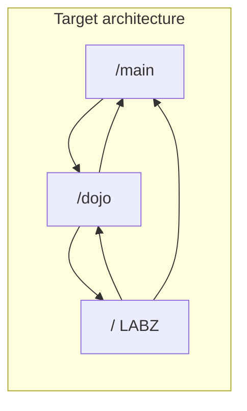
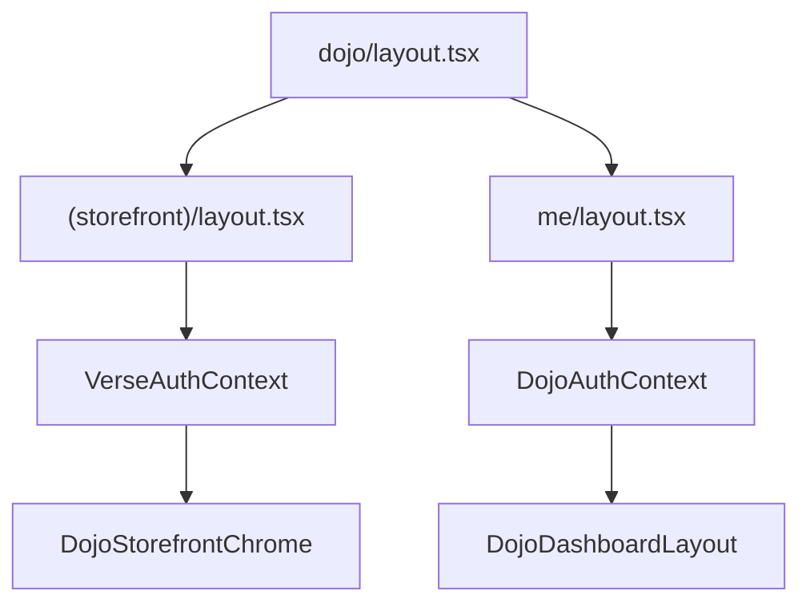

# Systems Architecture

This document describes the route map, layout hierarchy, and server versus client boundary for the MOOD MNKY app. A single Next.js application hosts **MOOD MNKY** (brand), **MNKY DOJO** (storefront and member hub), and **MNKY LABZ** (back office).

## Route Map

| Base path | Purpose | Notes |
|-----------|---------|--------|
| `/main` | Brand and marketing site | Public; Main nav, glass layout. |
| `/dojo` | MNKY DOJO storefront (public) | Shop, explore, blog, agents, rewards, quests, community. |
| `/dojo/me` | MNKY DOJO member hub (private) | Profile, chat, crafting, preferences, flowise. |
| `/` or `/platform` | MNKY LABZ dashboard | Admin back office; AppSidebar, contexts. |

Redirects (configured in `next.config.mjs`) ensure backward compatibility and a single mental model:

- `/verse` and `/verse/*` redirect to `/dojo` and `/dojo/*` (Option B consolidation).
- `/dojo/profile`, `/dojo/crafting`, `/dojo/preferences`, `/dojo/flowise` redirect to `/dojo/me/profile`, `/dojo/me/crafting`, etc., so member-only routes live under `/dojo/me`.

## Layout Architecture

Layouts are nested by route segment. The root app layout wraps everything; then each major section has its own layout(s). The Dojo section uses **route groups** and **server-only layouts** so that server-only code (e.g. `next/headers`, Supabase server client) never gets imported into the client bundle.

### Dojo root layout (pass-through)

`app/dojo/layout.tsx` is a **server component** that only renders `{children}`. It does not branch on pathname or import any auth or storefront wrappers. That keeps the client bundle free of server-only dependencies.

### Dojo storefront layout (server)

`app/dojo/(storefront)/layout.tsx` is a **server layout** that wraps all public Dojo routes (e.g. `/dojo`, `/dojo/products`, `/dojo/blog`). It:

1. Renders **VerseAuthContext** (async server component) — fetches user, profile, and Shopify link status; uses `createClient()` from `@/lib/supabase/server` and `getCustomerAccessToken()` from `@/lib/shopify/customer-account-client` (which uses `cookies()` from `next/headers`).
2. Wraps its children with **DojoStorefrontChrome** (client component) — theme, fonts, PWA install; no server imports.

So storefront pages receive auth and shell from the server; the client never imports `next/headers` or Supabase server code.

### Dojo member hub layout (server)

`app/dojo/me/layout.tsx` is a **server layout** for `/dojo/me/*`. It:

1. Renders **DojoAuthContext** (async server component) — fetches user, redirects if unauthenticated; uses `createClient()` from `@/lib/supabase/server`.
2. Wraps its children with **DojoDashboardLayout** (client component) — sidebar, nav groups, no server imports.

Member hub pages are therefore wrapped by server-side auth and a client-only chrome.

### Layout hierarchy (Dojo)

## Server vs Client Boundary

Auth and customer-account logic use **server-only** APIs:

- `next/headers` (e.g. `cookies()`)
- `@/lib/supabase/server` (`createClient()`)
- `@/lib/shopify/customer-account-client` (reads cookies, Supabase admin)

If a **client component** (e.g. a layout with `"use client"` that uses `usePathname()`) directly imports a component that uses these APIs, the bundler will pull them into the client bundle and the build fails with: *"You're importing a component that needs next/headers. That only works in a Server Component."*

The fix is to keep **VerseAuthContext** and **DojoAuthContext** in **server layouts only**. Route groups (`(storefront)` and `me`) ensure that:

- Storefront routes are wrapped by `(storefront)/layout.tsx` (server) → VerseAuthContext + DojoStorefrontChrome.
- Member routes are wrapped by `me/layout.tsx` (server) → DojoAuthContext + DojoDashboardLayout.

The root dojo layout stays a simple pass-through server component, so it never imports those contexts. All storefront and member pages are covered by their own server layouts, and the client-only chrome components (DojoStorefrontChrome, DojoDashboardLayout) do not import server code.

## Summary

- **Routes:** `/main` (brand), `/dojo` (storefront + member at `/dojo/me`), LABZ at `/` or `/platform`; `/verse` redirects to `/dojo`.
- **Layouts:** Dojo uses route-group server layouts for storefront and member hub; root dojo layout is pass-through.
- **Boundary:** Auth and cookie-dependent code live in server components (layouts); client components only handle UI and theme so the build stays valid.

For navigation surfaces and cross-links, see [Navigation and MNKY DOJO](/technology-stack/navigation-and-dojo). For design tokens and section mapping, see [Design System](/technology-stack/design-system).
