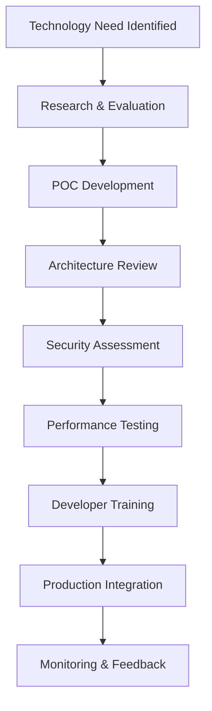

# Technology Stack Reference

<Note>
This is a starter document outlining the MOOD MNKY technology stack. Future iterations will include more detailed implementation guidelines and examples.
</Note>

## Overview

This reference document provides a comprehensive overview of the technologies, frameworks, libraries, and tools that power the MOOD MNKY digital ecosystem. It serves as a source of truth for developers, ensuring consistency across all implementation decisions.

## Core Technology Philosophy

Our technology choices are guided by these principles:

1. **Experience-Led Development**: Technologies chosen for their ability to deliver exceptional user experiences
2. **Sustainable Maintainability**: Preference for established technologies with strong community support
3. **Performance Optimization**: Focus on speed, responsiveness, and efficiency
4. **Developer Experience**: Tools that enhance productivity and collaboration
5. **Integration Capability**: Technologies that work well within our ecosystem

## Frontend Technologies

### Framework Foundation

<CardGroup cols={2}>
  <Card title="Next.js" icon="react">
    

      
Our primary React framework for web applications

      <ul className="list-disc pl-5">
        <li>Version: 14.x</li>
        <li>App Router architecture</li>
        <li>Server Components for performance</li>
        <li>Vercel deployment</li>
      </ul>
    

  </Card>
  
  <Card title="React" icon="code">
    

      
Component library for user interfaces

      <ul className="list-disc pl-5">
        <li>Version: 18.x</li>
        <li>Functional component pattern</li>
        <li>Custom hooks architecture</li>
        <li>Context for state management</li>
      </ul>
    

  </Card>
</CardGroup>

### UI Development

- **Tailwind CSS**: Utility-first CSS framework for styling
- **ShadCN/UI**: Component library built on Radix UI
- **Headless UI**: Unstyled accessible components
- **Framer Motion**: Animation library for interactive elements

### State Management

- **Zustand**: Lightweight state management
- **React Query**: Server state management and caching
- **Context API**: Component-local and theme state
- **Jotai**: Atomic state management for complex states

### Mobile Approach

- **React Native**: For native mobile applications
- **Expo**: Development framework for React Native
- **Capacitor**: Web-to-native bridge for hybrid approaches
- **Ionic Framework**: Components for responsive mobile web

## Backend Technologies

### API and Services

<CardGroup cols={2}>
  <Card title="Node.js" icon="node">
    

      
Server-side JavaScript runtime

      <ul className="list-disc pl-5">
        <li>Version: 18.x LTS</li>
        <li>Express for REST APIs</li>
        <li>Fastify for performance-critical services</li>
        <li>AWS Lambda deployments</li>
      </ul>
    

  </Card>
  
  <Card title="TypeScript" icon="code">
    

      
Type-safe JavaScript superset

      <ul className="list-disc pl-5">
        <li>Version: 5.x</li>
        <li>Strict configuration</li>
        <li>Custom type definitions</li>
        <li>Interface-first design</li>
      </ul>
    

  </Card>
</CardGroup>

### Data Storage

- **Supabase**: PostgreSQL-based backend with auth and storage
- **PostgreSQL**: Primary relational database
- **Redis**: Caching and real-time features
- **S3**: Object storage for media and assets

### Authentication and Authorization

- **Supabase Auth**: Primary authentication provider
- **Custom JWT implementation**: For service-to-service communication
- **Role-Based Access Control**: For permission management
- **Row-Level Security**: For data access control in Supabase

## AI Infrastructure

### Agent Framework

<CardGroup cols={2}>
  <Card title="OpenAI API" icon="robot">
    

      
Foundation for agent capabilities

      <ul className="list-disc pl-5">
        <li>GPT-4 Turbo for sophisticated reasoning</li>
        <li>GPT-3.5 for efficiency-focused tasks</li>
        <li>Embedding models for vector search</li>
        <li>DALL-E for image generation</li>
      </ul>
    

  </Card>
  
  <Card title="Custom Agent Framework" icon="brain">
    

      
Our proprietary agent orchestration system

      <ul className="list-disc pl-5">
        <li>Agent role definitions</li>
        <li>Context management</li>
        <li>Memory systems</li>
        <li>Capability frameworks</li>
      </ul>
    

  </Card>
</CardGroup>

### Vector Database

- **Pinecone**: Primary vector database for embeddings
- **pgvector**: Postgres extension for vector operations
- **Weaviate**: For complex semantic retrieval needs
- **LangChain**: Framework for LLM workflows

### Model Deployment

- **AWS SageMaker**: For custom model deployments
- **HuggingFace Inference API**: For specialized models
- **OpenAI Azure**: For enterprise-grade deployments
- **Local Inference**: For privacy-sensitive operations

## DevOps and Infrastructure

### Deployment Infrastructure

<CardGroup cols={2}>
  <Card title="Vercel" icon="server">
    

      
Primary frontend deployment platform

      <ul className="list-disc pl-5">
        <li>Edge functions</li>
        <li>Preview deployments</li>
        <li>Analytics integration</li>
        <li>Environment variables management</li>
      </ul>
    

  </Card>
  
  <Card title="AWS" icon="cloud">
    

      
Backend infrastructure platform

      <ul className="list-disc pl-5">
        <li>Lambda for serverless functions</li>
        <li>ECS for containerized applications</li>
        <li>S3 for storage</li>
        <li>CloudFront for CDN</li>
      </ul>
    

  </Card>
</CardGroup>

### CI/CD Pipeline

- **GitHub Actions**: Primary CI/CD automation
- **Turborepo**: Monorepo build system
- **Changesets**: Version management for packages
- **Jest**: Testing framework for unit/integration tests
- **Playwright**: End-to-end testing framework

### Monitoring and Observability

- **DataDog**: Primary monitoring and APM solution
- **Sentry**: Error tracking and performance monitoring
- **LogDNA**: Log aggregation and analysis
- **Vercel Analytics**: Frontend performance monitoring

## Development Tools

### Package Management

- **pnpm**: Primary package manager
- **Workspaces**: Monorepo management
- **Changesets**: Versioning and changelogs
- **NPM Registry**: Private registry for internal packages

### Code Quality

- **ESLint**: JavaScript/TypeScript linting
- **Prettier**: Code formatting
- **TypeScript**: Static type checking
- **Husky**: Git hooks for pre-commit validation

### Documentation

- **Mintlify**: Documentation platform
- **TSDoc**: TypeScript code documentation
- **Storybook**: Component documentation
- **Swagger/OpenAPI**: API documentation

## Integration Services

### Third-Party Services

<CardGroup cols={2}>
  <Card title="Shopify" icon="shopping-bag">
    

      
E-commerce platform integration

      <ul className="list-disc pl-5">
        <li>Storefront API</li>
        <li>Admin API</li>
        <li>Custom app extensions</li>
        <li>Webhook integrations</li>
      </ul>
    

  </Card>
  
  <Card title="n8n" icon="diagram-project">
    

      
Workflow automation platform

      <ul className="list-disc pl-5">
        <li>Cross-system integrations</li>
        <li>Scheduled tasks</li>
        <li>Event-based triggers</li>
        <li>Custom node development</li>
      </ul>
    

  </Card>
</CardGroup>

### API Integrations

- **Stripe**: Payment processing
- **SendGrid**: Email delivery
- **Twilio**: SMS and messaging
- **Algolia**: Search functionality
- **Auth0**: Enterprise authentication (secondary)

## Technology Decision Process

### Evaluation Criteria

All new technologies are evaluated against these criteria:

1. **Alignment with User Experience Goals**
2. **Performance Characteristics**
3. **Maintenance Requirements**
4. **Community Support and Longevity**
5. **Integration with Existing Systems**
6. **Security Implications**
7. **Developer Experience Impact**

### Technology Adoption Workflow

## Version Control Standards

### Branching Strategy

- **main**: Production code
- **develop**: Integration branch for features
- **feature/[name]**: Feature development
- **release/[version]**: Release preparation
- **hotfix/[issue]**: Production fixes

### Commit Conventions

We follow Conventional Commits for all repositories:

- **feat**: New features
- **fix**: Bug fixes
- **docs**: Documentation changes
- **style**: Code style changes
- **refactor**: Code restructuring
- **perf**: Performance improvements
- **test**: Test additions or updates
- **chore**: Maintenance tasks

## Technology Roadmap Highlights

### Near-term Evolution (6-12 months)

- Migration to React Server Components
- Enhanced edge computing capabilities
- Expanded AI agent capabilities
- Improved vector database integration
- Mobile app development with React Native

### Strategic Direction (1-3 years)

- Progressive rollout of specialized AI models
- Exploration of WebAssembly for performance
- Expanded IoT integration for physical products
- Advanced personalization infrastructure
- Enhanced privacy-preserving computation

## Implementation Resources

<CardGroup cols={2}>
  <Card title="Starter Templates" icon="code" href="#">
    Boilerplates and starter kits for development
  </Card>
  <Card title="Technology Documentation" icon="book" href="#">
    Detailed implementation guides and examples
  </Card>
  <Card title="Architecture Diagrams" icon="sitemap" href="#">
    System architecture and integration patterns
  </Card>
  <Card title="Code Standards" icon="list-check" href="#">
    Coding standards and best practices
  </Card>
</CardGroup>