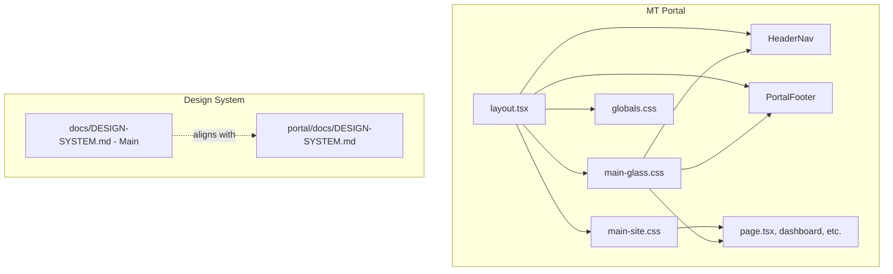

# MT Portal Design System

The MT (Multi-Tenant) Portal design system aligns with the [Main design system](../../../docs/DESIGN-SYSTEM.md) and agent apps (mood-mnky, sage-mnky, code-mnky). It uses grayscale palette, glassmorphism, Space Grotesk typography, and consistent layout tokens.

## Overview

The portal provides an organizational hub for MOOD MNKY LLC and partner tenants. Its visual language matches the Main site and agent apps: `.main-site` wrapper, `main-site.css`, `main-glass.css`, glass nav/footer, glass panel cards, Space Grotesk, and `data-theme="main"`.

---

## Palette and mode

- **Palette:** `data-theme="main"` (grayscale only)
- **Mode:** Light/dark via `next-themes` (`class="dark"` on `<html>`)
- Semantic tokens (`--background`, `--foreground`, `--primary`, etc.) come from `globals.css` and match Main

---

## Typography

- **Font:** Space Grotesk (`--font-space-grotesk`)
- **Tailwind:** `font-sans` maps to `var(--font-space-grotesk), system-ui, sans-serif`
- **Hero title:** `--main-hero-title-size` (responsive clamp)
- **Hero subtitle:** `--main-hero-subtitle-size` (1.125rem / 1.25rem on md+)

---

## Layout

| Class | Purpose |
|-------|---------|
| `.main-site` | Root wrapper; scopes layout and glass tokens |
| `.main-container` | Centered container, max-width `--main-page-width` (1600px), responsive padding |
| `.main-container-full-bleed` | Full viewport width; use for hero or full-bleed sections |

**Tokens:**
- `--main-page-width`: 1600px
- `--main-section-gap`: 7rem (vertical spacing between sections)
- `--main-section-gap-sm`: 5rem
- `--main-hero-min-height`: 60vh

---

## Glass

Glass tokens and classes provide monochromatic glassmorphism. Defined in `main-glass.css` and `globals.css`.

**Classes:**
- `.main-glass-nav` — Sticky header with glass effect
- `.main-glass-footer` — Footer bar with glass effect
- `.main-glass-panel` — Frosted glass panel (hero overlay, resource blocks)
- `.main-glass-panel-card` — Glass card for feature cards, dashboard cards, forms
- `.main-float` — Hover lift and shadow (use with glass cards)

**Button variants (use with shadcn Button):**
- `.main-btn-glass` — Glass panel style with hover lift and shadow
- `.main-btn-float` — Hover lift and shadow only

**Tokens (from globals.css):**
- `--glass-blur`, `--glass-bg-nav`, `--glass-border-nav`, `--glass-bg-solid` (light and dark)

---

## Components

| Component | Purpose |
|-----------|---------|
| `HeaderNav` | Glass header with Dashboard link, auth dropdown (Profile, Sign out), or Sign in / Get started |
| `PortalFooter` | Glass footer with Main site, Docs, Dashboard (when authenticated), copyright |
| Glass cards | `main-glass-panel-card main-float` for feature cards, dashboard org cards, tenant resource cards |
| Forms | `main-glass-panel-card` for auth (login, sign-up), onboarding, invite forms |

---

## Files

| Path | Purpose |
|-----|---------|
| `app/globals.css` | Root tokens, glass tokens (light/dark) |
| `app/main-site.css` | Layout tokens, `.main-container`, `.main-btn-glass`, `.main-btn-float` |
| `app/main-glass.css` | Glass tokens, `.main-glass-*`, `.main-float` |
| `app/layout.tsx` | Imports CSS, `data-theme="main"`, Space Grotesk, `.main-site` wrapper, `TooltipProvider` |
| `tailwind.config.ts` | `fontFamily.sans` → Space Grotesk |
| `components/header-nav.tsx` | `main-glass-nav`, `main-container` |
| `components/portal-footer.tsx` | `main-glass-footer`, `main-container` |

---

## Architecture

